# TryHackMe: Crack the Hash Level 2

- **Room Link:** [Crack the Hash Level 2](https://tryhackme.com/room/introtohashcracking)
- **Category:** Challenge Room
- **Difficulty:** Medium
- **Tools Used:** Haiti, wordlistctl, Hashcat, John the Ripper
- **Main Techniques:** Hash Identification (CLI-based), Wordlist Management, Offline Hash Cracking

---

## Attack Context

- **Kapan teknik ini dipakai?** Tahap _Credential Access_ — ketika kamu sudah mendapatkan hash password dan perlu mengembalikan plaintext-nya. Room ini berfokus pada penguatan workflow: identifikasi hash secara akurat menggunakan tool CLI, lalu mengelola wordlist dengan efisien sebelum menjalankan proses cracking.
- **Syarat yang dibutuhkan:** Hash target sudah diketahui. Pemahaman dasar tentang hash cracking dari [Crack the Hash Level 1](Crack-the-hash.md) sangat disarankan karena room ini melanjutkan konsep yang sudah dibahas di sana.
- **Tanda keberhasilan:** Kamu bisa mengidentifikasi tipe hash secara akurat, menemukan wordlist yang tepat, dan berhasil memecahkan hash menggunakan Hashcat atau John the Ripper.

---

## Overview

Room ini adalah kelanjutan dari [Crack the Hash Level 1](Crack-the-hash.md). Kalau di Level 1 identifikasi hash masih dilakukan secara manual — mengandalkan panjang karakter dan prefix — di sini kamu akan diperkenalkan dengan tool CLI yang lebih akurat: **Haiti**.

> **for your information:** **Haiti** adalah tool command-line untuk mengidentifikasi tipe hash. Kelebihannya dibanding menebak manual: Haiti langsung menampilkan kode mode Hashcat (`HC`) dan format John the Ripper (`JtR`) untuk setiap kemungkinan algoritma, sehingga kamu tidak perlu bolak-balik ke Hashcat Examples Wiki.

Selain itu, room ini juga memperkenalkan **wordlistctl** — tool untuk mencari, mengunduh, dan mengelola arsip wordlist dari berbagai sumber.

> **for your information:** **wordlistctl** adalah script dari BlackArch yang bisa mengakses lebih dari 6300 wordlist dari berbagai repository online. Fungsinya mencari wordlist berdasarkan kata kunci, mengunduhnya, dan meng-extract arsip yang terkompresi — semua dari terminal.

---

## Task 1: Introduction

Room ini mencakup tiga area utama: identifikasi hash via Haiti, manajemen wordlist via wordlistctl, dan cracking hash menggunakan Hashcat dan John the Ripper. Tidak ada pertanyaan di task ini.

---

## Task 2: Hash Identification

Di Level 1, kamu mengidentifikasi hash berdasarkan panjang karakter dan prefix — pendekatan yang cukup untuk hash-hash populer seperti MD5, SHA-1, dan SHA-256. Tapi bagaimana kalau hash-nya 80 karakter dan formatnya tidak pernah kamu lihat sebelumnya? Haiti menangani kasus seperti ini dengan lebih akurat.

### Installing Haiti

Haiti diinstal melalui RubyGems:

```bash
gem install haiti-hash
```

| Komponen | Fungsi |
| :--- | :--- |
| `gem` | Package manager untuk bahasa Ruby |
| `install` | Sub-command untuk memasang package |
| `haiti-hash` | Nama package Haiti di registry RubyGems |

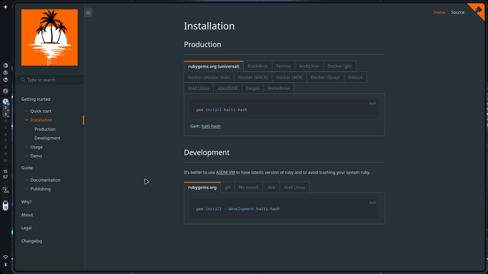

### Identifying Hash 1: RIPEMD-320

Hash pertama yang diberikan:

```
741ebf5166b9ece4cca88a3868c44871e8370707cf19af3ceaa4a6fba006f224ae03f39153492853
```

Jalankan Haiti terhadap hash ini:

```bash
haiti 741ebf5166b9ece4cca88a3868c44871e8370707cf19af3ceaa4a6fba006f224ae03f39153492853
```

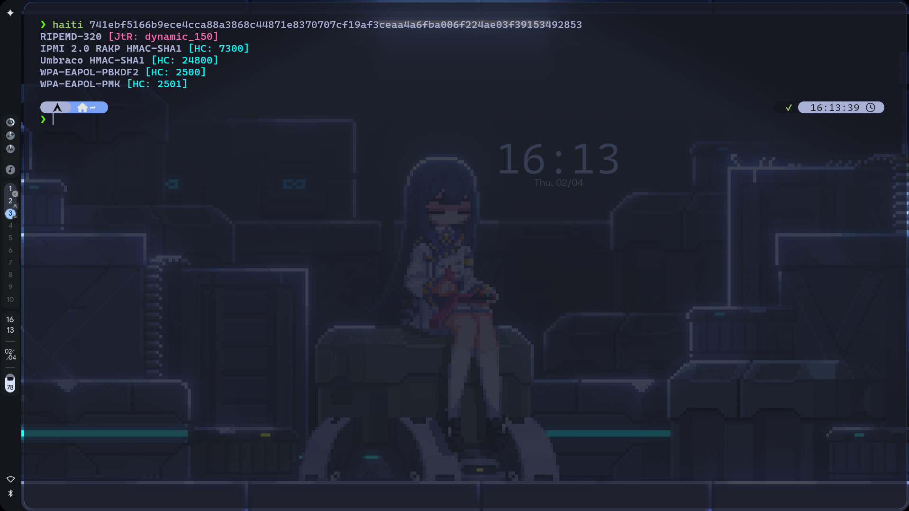

Output Haiti menampilkan beberapa kemungkinan:

| Kandidat | JtR Format | Hashcat Code |
| :--- | :--- | :--- |
| **RIPEMD-320** | `dynamic_150` | — |
| IPMI 2.0 RAKP HMAC-SHA1 | — | `7300` |
| Umbraco HMAC-SHA1 | — | `24800` |
| WPA-EAPOL-PBKDF2 | — | `2500` |
| WPA-EAPOL-PMK | — | `2501` |

Kandidat teratas yang paling masuk akal untuk hash sepanjang 80 karakter hex adalah **RIPEMD-320** (_RACE Integrity Primitives Evaluation Message Digest_ - varian 320 bit). Kolom Hashcat Code untuk RIPEMD-320 kosong karena Hashcat tidak mendukung algoritma ini secara native — cracking-nya harus menggunakan John the Ripper dengan format `dynamic_150`. Kandidat lain seperti IPMI dan WPA-EAPOL biasanya punya format khusus dengan separator, bukan hex murni seperti ini.

**Jawaban:** `RIPEMD-320`

### Identifying Hash 2: Keccak-256

Hash kedua:

```
1aec7a56aa08b25b596057e1ccbcb6d768b770eaa0f355ccbd56aee5040e02ee
```

```bash
haiti 1aec7a56aa08b25b596057e1ccbcb6d768b770eaa0f355ccbd56aee5040e02ee
```

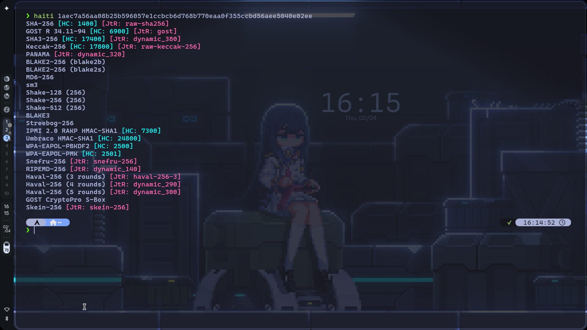

Outputnya panjang karena hash 64 karakter hex cocok dengan banyak algoritma 256-bit. Yang dicari room ini adalah **Keccak-256**:

| Informasi | Nilai |
| :--- | :--- |
| Hashcat Code | `17800` |
| John the Ripper Format | `raw-keccak-256` |

> **for your information:** **Keccak-256** adalah varian asli dari algoritma yang memenangkan kompetisi standarisasi SHA-3 oleh NIST. Versi finalnya (SHA3-256) dimodifikasi pada parameter padding, sehingga Keccak-256 dan SHA3-256 menghasilkan output berbeda untuk input yang sama — dan Hashcat memperlakukan keduanya sebagai mode yang berbeda.

Haiti langsung menyertakan kode mode Hashcat (`HC: 17800`) dan format JtR (`JtR: raw-keccak-256`) di outputnya — tidak perlu lagi membuka Hashcat Examples Wiki secara terpisah.

**Jawaban Hashcat code:** `17800`
**Jawaban JtR code:** `raw-keccak-256`

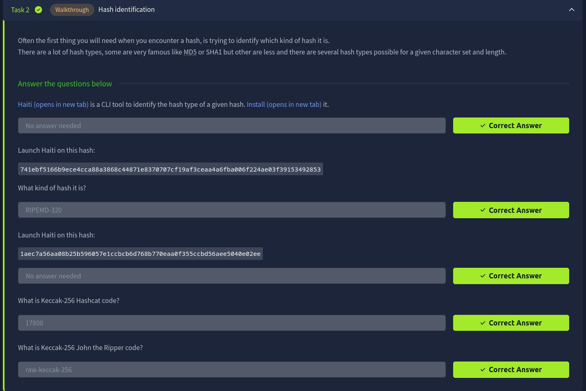

---

## Task 3: Wordlists

Punya tool cracking saja tidak cukup — kamu juga butuh kamus tebakan yang tepat. Room ini memperkenalkan tiga sumber utama wordlist dan satu tool pengelola:

- **SecLists** — Koleksi daftar yang dipakai selama security assessment: passwords, usernames, URLs, payloads, dan lainnya.
- **wordlistctl** — Script untuk mencari, mengunduh, dan mengelola arsip wordlist dari berbagai sumber online.
- **Rawsec's CyberSecurity Inventory** — Direktori tool dan resource keamanan siber. Kategori _Cracking_ di sana berguna untuk menemukan wordlist generator.

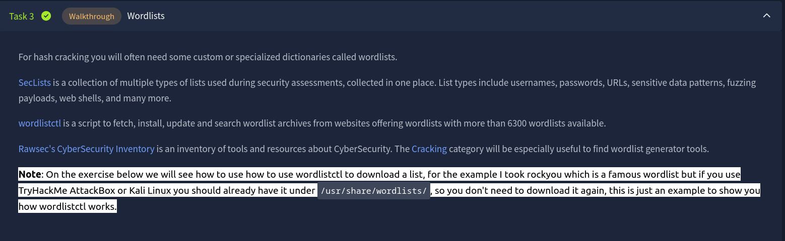

### Searching for a Wordlist

**RockYou** adalah wordlist paling terkenal yang berisi jutaan password dari kebocoran data asli, diurutkan berdasarkan frekuensi penggunaan. Untuk mencari wordlist ini melalui wordlistctl:

```bash
wordlistctl search rockyou
```

| Komponen | Fungsi |
| :--- | :--- |
| `wordlistctl` | Tool pengelola wordlist dari BlackArch |
| `search` | Sub-command untuk mencari wordlist berdasarkan kata kunci |
| `rockyou` | Kata kunci pencarian |

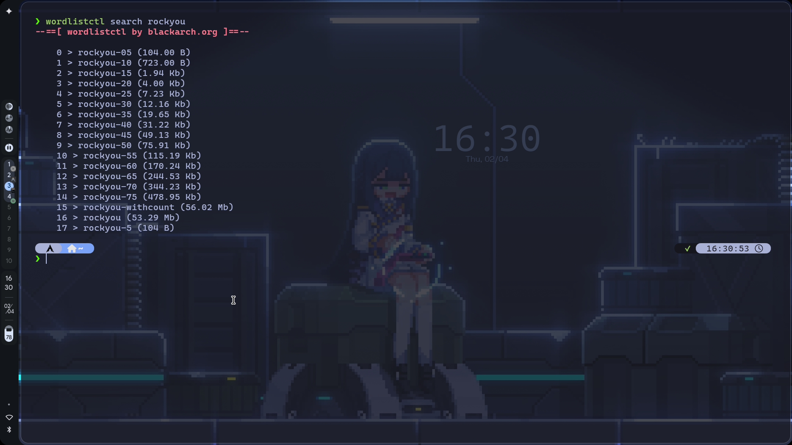

Output menampilkan 18 varian rockyou dari repository BlackArch, lengkap dengan ukuran file masing-masing — mulai dari `rockyou-05` (104 bytes) hingga `rockyou` versi penuh (53.29 MB).

### Searching Local Archives

Secara default, `wordlistctl search` mencari ke repository remote (online). Untuk mencari wordlist yang sudah terinstal di mesin lokal, tambahkan flag `-l`:

```bash
wordlistctl search -l rockyou
```

| Komponen | Fungsi |
| :--- | :--- |
| `-l` / `--local` | Mencari di arsip lokal, bukan remote |

**Jawaban:** `-l`

### Fetching and Decompressing a Wordlist

Untuk mengunduh wordlist rockyou ke mesin lokal:

```bash
sudo wordlistctl fetch rockyou
```

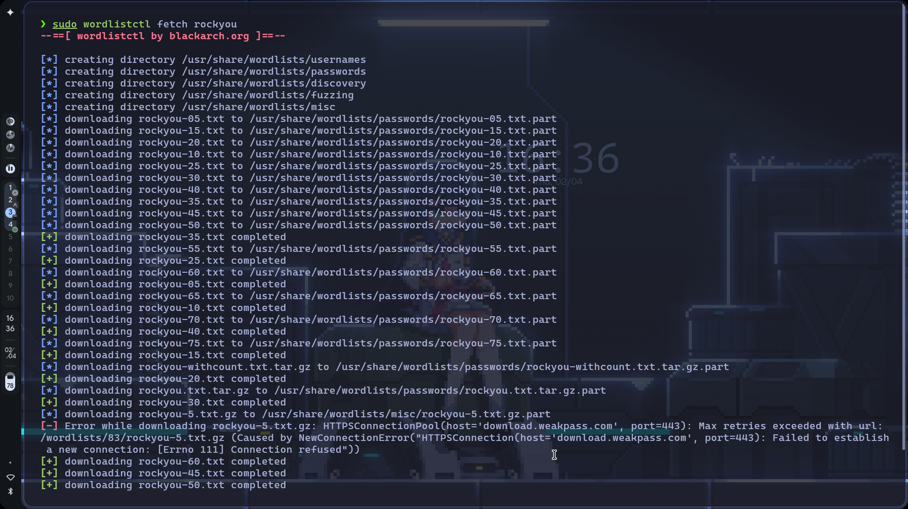

> **Common Mistake:** Gunakan `sudo` saat menjalankan `wordlistctl fetch` — tool ini menulis file ke direktori sistem `/usr/share/wordlists/` yang membutuhkan privilege root. Tanpa `sudo`, proses akan gagal dengan error _Permission denied_.

> **Common Mistake:** Saat proses fetch berjalan, kamu mungkin melihat error seperti `[-] Error while downloading rockyou-5.txt.gz: HTTPSConnectionPool ... Connection refused`. Ini terjadi karena salah satu mirror sumber sedang down atau tidak bisa dijangkau. Selama file utama `rockyou.txt` berhasil terunduh dengan status `[+] completed`, proses secara keseluruhan tetap berhasil — error pada mirror lain tidak menggagalkannya.

wordlistctl secara default menyimpan wordlist dalam format terkompresi (`.tar.gz`). Setelah fetch, lokasi file-nya:

```
/usr/share/wordlists/passwords/rockyou.txt.tar.gz
```

Untuk meng-extract arsip tersebut supaya bisa langsung dipakai oleh Hashcat:

```bash
wordlistctl fetch -l rockyou -d
```

| Komponen | Fungsi |
| :--- | :--- |
| `fetch` | Sub-command untuk mengunduh wordlist |
| `-l` | Memilih wordlist dari arsip lokal yang sudah di-fetch sebelumnya |
| `rockyou` | Nama wordlist yang akan di-fetch |
| `-d` | Decompress — extract arsip setelah download |

Setelah dekompresi, jalankan pencarian lokal lagi untuk memverifikasi path akhirnya:

```bash
wordlistctl search -l rockyou
```

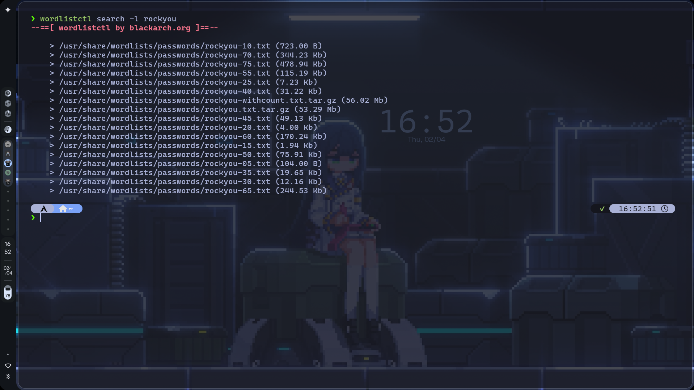

**Jawaban path:** `/usr/share/wordlists/passwords/rockyou.txt`

### Help Menu Reference

Kalau kamu tidak yakin flag apa yang tersedia, cek help menu:

```bash
wordlistctl search -h
```

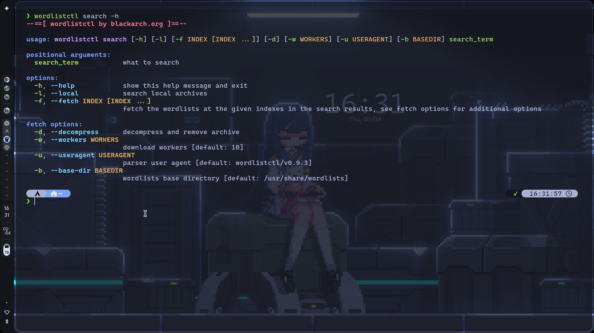

### Browsing Wordlists by Category

wordlistctl juga bisa menampilkan semua wordlist dalam kategori tertentu. Untuk melihat semua wordlist di kategori _usernames_:

```bash
wordlistctl list -g usernames
```

| Komponen | Fungsi |
| :--- | :--- |
| `list` | Sub-command untuk menampilkan daftar wordlist |
| `-g` | Filter berdasarkan group/kategori |
| `usernames` | Nama kategori yang ingin ditampilkan |

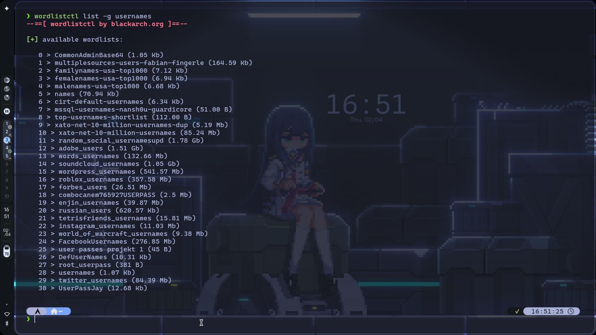

Dari output di atas, wordlist pertama di daftar adalah **CommonAdminBase64**.

**Jawaban:** `CommonAdminBase64`

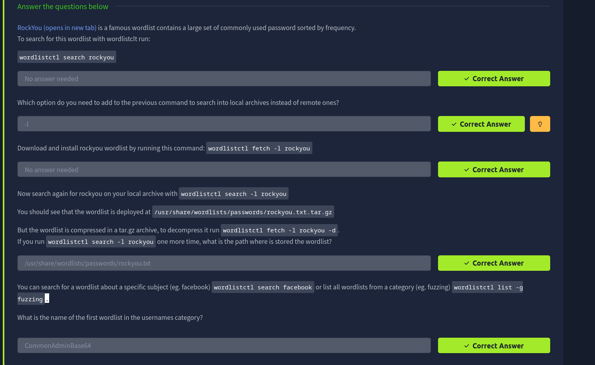

---

## Task 4: Cracking Tools, Modes & Rules

Dua tool cracking yang paling umum dipakai di room ini:

- **Hashcat** — Cracker berbasis GPU, unggul dalam kecepatan raw computation untuk hash sederhana.
- **John the Ripper** (jumbo version) — Cracker berbasis CPU, lebih fleksibel dalam hal format hash yang didukung dan fitur rule mangling.

### Cracking Modes

Ada tiga mode operasi yang tersedia:

| Mode | Cara Kerja | Kapan Dipakai |
| :--- | :--- | :--- |
| **Wordlist** | Mencoba semua kata dari sebuah file dictionary | Password kemungkinan ada di daftar password umum |
| **Incremental** | Mencoba semua kemungkinan kombinasi karakter (brute force murni) | Tidak ada petunjuk tentang password — tapi sangat lambat untuk password panjang |
| **Rule** | Mengambil wordlist lalu mengubah setiap entri dengan pola tertentu (mutasi) | Password kemungkinan adalah variasi dari kata umum — misalnya `password` → `P@ssw0rd123` |

Di Level 1, untuk cracking offline kamu hanya menggunakan Wordlist mode. Rule mode jauh lebih powerful karena mengalikan jumlah kandidat tanpa perlu menyimpan wordlist raksasa — cukup simpan beberapa wordlist inti dan kombinasikan dengan rule yang berbeda-beda.

### Mutation Rules

Rule mode bekerja dengan menerapkan transformasi (mutasi) ke setiap entri wordlist. Ada dua cara menerapkannya: membuat custom wordlist yang sudah dimutasi terlebih dahulu, atau menyuruh tool cracking menerapkan mutasi secara on-the-fly saat proses berjalan. Room ini menggunakan pendekatan kedua — lebih efisien karena tidak perlu menyimpan file berukuran gigabytes yang hanya dipakai sekali.

Jenis-jenis mutasi yang umum:

| Mutation Type | Cara Kerja | Contoh |
| :--- | :--- | :--- |
| **Border** | Menambahkan digit/simbol di awal, akhir, atau keduanya | `password` → `password99` |
| **Freak** | Mengganti huruf dengan simbol yang mirip (leet speak) | `password` → `p@$$w0rd` |
| **Case** | Mengubah variasi uppercase/lowercase | `password` → `Password`, `PASSWORD` |
| **Order** | Membalik urutan karakter | `password` → `drowssap` |
| **Repetition** | Mengulang kelompok karakter | `password` → `passpass` |
| **Vowels** | Menghilangkan atau mengkapitalisasi vokal | `password` → `psswrd` |
| **Strip** | Menghapus satu atau beberapa karakter | `password` → `pasword` |
| **Swap** | Menukar posisi karakter | `password` → `apssword` |
| **Duplicate** | Menduplikasi karakter tertentu | `password` → `ppassword` |
| **Delimiter** | Menambahkan delimiter antar karakter | `password` → `p.a.s.s.w.o.r.d` |

### Creating a Custom Rule in John the Ripper

John menyimpan rule di file konfigurasi. Daripada mengedit file konfigurasi utama, buat file lokal terpisah di direktori yang sama — `/usr/share/john/john-local.conf`:

```bash
sudo nano /usr/share/john/john-local.conf
```

Tambahkan rule berikut:

```
[List.Rules:THM01]
$[0-9]$[0-9]
```

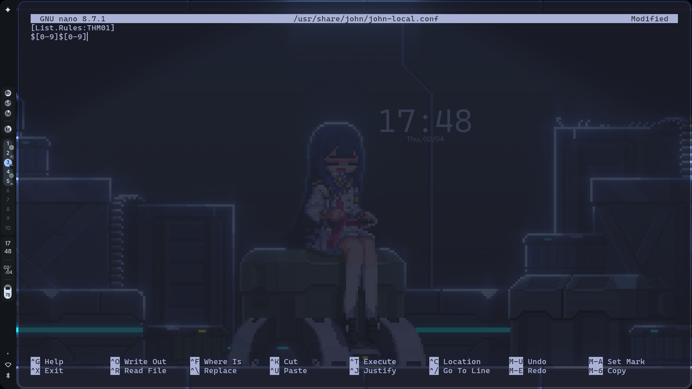

Bedah per komponen:

| Komponen | Fungsi |
| :--- | :--- |
| `[List.Rules:THM01]` | Nama rule — dipanggil nanti dengan `--rules=THM01` |
| `$[0-9]` | Menambahkan satu digit (0-9) di akhir kata |
| `$[0-9]$[0-9]` | Dua directive `$[0-9]` — menambahkan dua digit di akhir |

Rule ini menerapkan **border mutation**: setiap kata di wordlist akan menghasilkan 100 kandidat baru dengan kombinasi dua digit di belakangnya (00–99). Kata `moonligh` misalnya akan menghasilkan `moonligh00`, `moonligh01`, hingga `moonligh99`.

> **for your information:** Simbol `$` di sintaks rule John bukan karakter variabel shell — melainkan operator yang berarti "append character di akhir kata". `$[0-9]` berarti tambahkan satu karakter dari range 0–9. Ini adalah sintaks khusus John the Ripper, bukan Bash.

### Preparing the Hash File

Hash SHA-1 yang diberikan room:

```
2d5c517a4f7a14dcb38329d228a7d18a3b78ce83
```

Simpan ke file:

```bash
echo '2d5c517a4f7a14dcb38329d228a7d18a3b78ce83' > sha1-john.txt
```

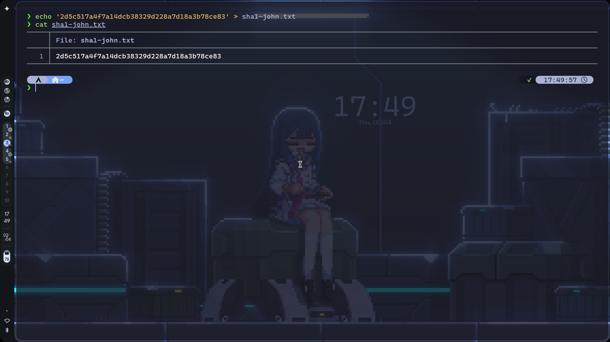

### Cracking with Rule-Based Attack

Jalankan John dengan wordlist `10k-most-common.txt` dari SecLists dan rule `THM01` yang baru saja dibuat:

```bash
john sha1-john.txt --format=raw-sha1 --wordlist=/usr/share/seclists/Passwords/Common-Credentials/10k-most-common.txt --rules=THM01
```

| Komponen | Fungsi |
| :--- | :--- |
| `john` | John the Ripper — tool cracking password |
| `sha1-john.txt` | File input berisi hash target |
| `--format=raw-sha1` | Menentukan tipe hash (SHA-1 tanpa salt) |
| `--wordlist=...` | Path ke wordlist yang digunakan |
| `--rules=THM01` | Menerapkan rule mutasi `THM01` yang sudah dibuat |

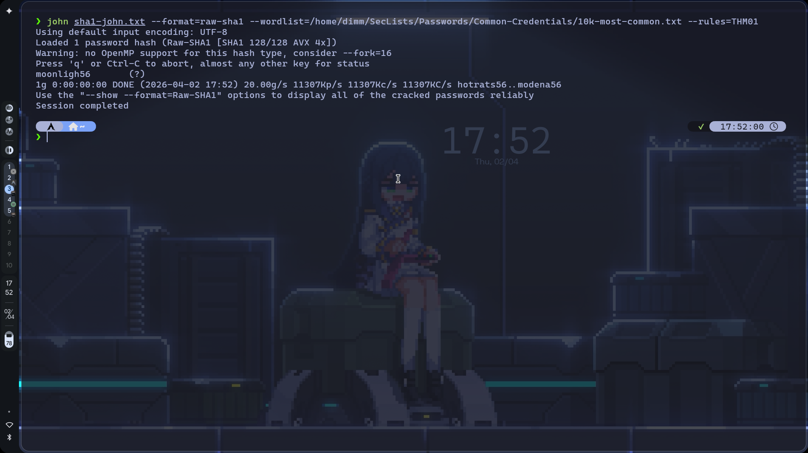

John berhasil memecahkan hash dalam waktu kurang dari 1 detik. Total kandidat yang diproses hanya 1 juta kombinasi (10.000 kata × 100 variasi dua digit) — kecil untuk ukuran GPU modern, tapi rule mode terbukti efektif menemukan password yang tidak akan pernah ada secara harfiah di wordlist manapun.

**Jawaban:** `moonligh56`

> **Common Mistake:** Path wordlist di command di atas menggunakan path SecLists di sistem room TryHackMe. Kalau SecLists kamu terinstal di lokasi yang berbeda (misalnya `/home/dimm/SecLists/...`), sesuaikan path-nya sebelum menjalankan command.

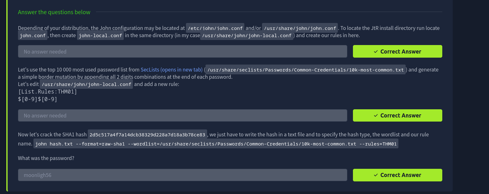

---

## Task 5: Custom Wordlist Generation

Rule mode di Task 4 menerapkan mutasi secara on-the-fly — efisien untuk wordlist yang hanya dipakai sekali. Tapi ada situasi di mana membuat custom wordlist terlebih dahulu lebih masuk akal:

- Wordlist akan dipakai berulang kali di sesi cracking berbeda — generate sekali lebih hemat dibanding menjalankan rule setiap kali.
- Kamu ingin menggunakan wordlist yang sama di beberapa tool yang berbeda.
- Tool target mendukung wordlist tapi tidak mendukung mangling rules.

Room memberikan hint bahwa password yang dicari berhubungan dengan anjing. Strateginya: unduh wordlist nama-nama ras anjing, terapkan mutasi menggunakan Mentalist, lalu crack hash-nya dengan wordlist hasil generate tersebut.

> **for your information:** **Mentalist** adalah tool berbasis GUI untuk membangun chain mutasi wordlist secara visual. Tersedia di [GitHub: sc0tfree/mentalist](https://github.com/sc0tfree/mentalist) — install sesuai instruksi di repository. Dibanding menulis sintaks rule John secara manual, Mentalist menyediakan antarmuka di mana kamu bisa menambahkan node transformasi (Case, Substitution, Append, dan lainnya) lalu langsung melihat estimasi jumlah output.

### Fetching a Themed Wordlist

Cari wordlist `dogs` melalui wordlistctl:

```bash
wordlistctl search dogs
```

Output menunjukkan satu hasil: `dogs` (2.35 KB). Langsung unduh dan extract:

```bash
sudo wordlistctl fetch dogs -d
```

| Komponen | Fungsi |
| :--- | :--- |
| `fetch` | Sub-command untuk mengunduh wordlist |
| `dogs` | Nama wordlist target |
| `-d` | Decompress — extract arsip setelah download |

File tersimpan di `/usr/share/wordlists/misc/dogs.txt` dengan total 242 entri nama ras anjing.

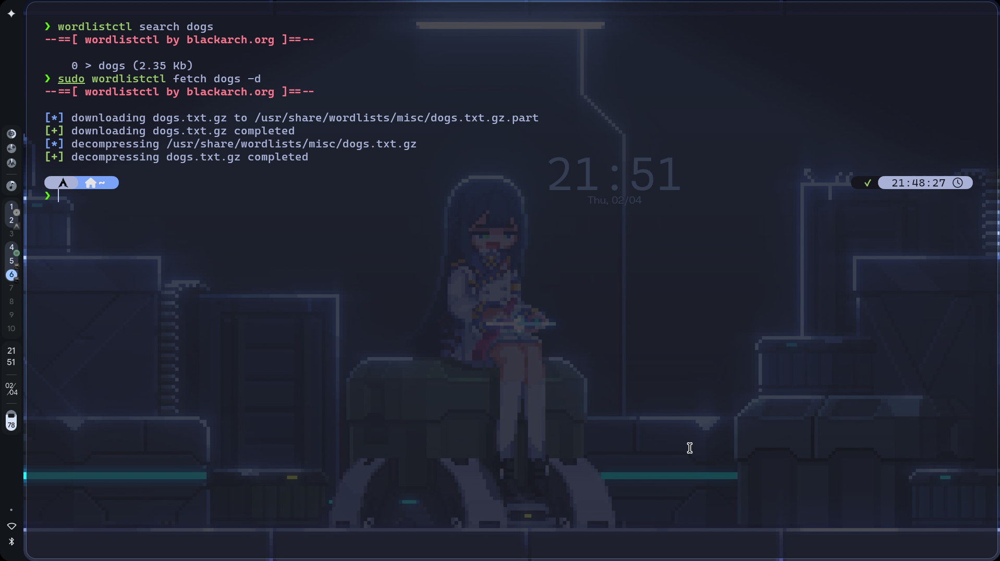

### Building Mutations with Mentalist

Buka Mentalist dan susun chain transformasi berikut:

| Node | Transformasi | Penjelasan |
| :--- | :--- | :--- |
| **1. Base Words** | File: `/usr/share/wordlists/misc/dogs.txt` | Memuat 242 nama ras anjing sebagai basis |
| **2. Case** | Toggle: 2nd | Mengubah karakter ke-2 menjadi uppercase — `molossus` → `mOlossus` |
| **3. Substitution** | Replace All: `s` → `$` (One at a time) | Mengganti semua huruf `s` dengan simbol `$` — `mOlossus` → `mOlo$$u$` |

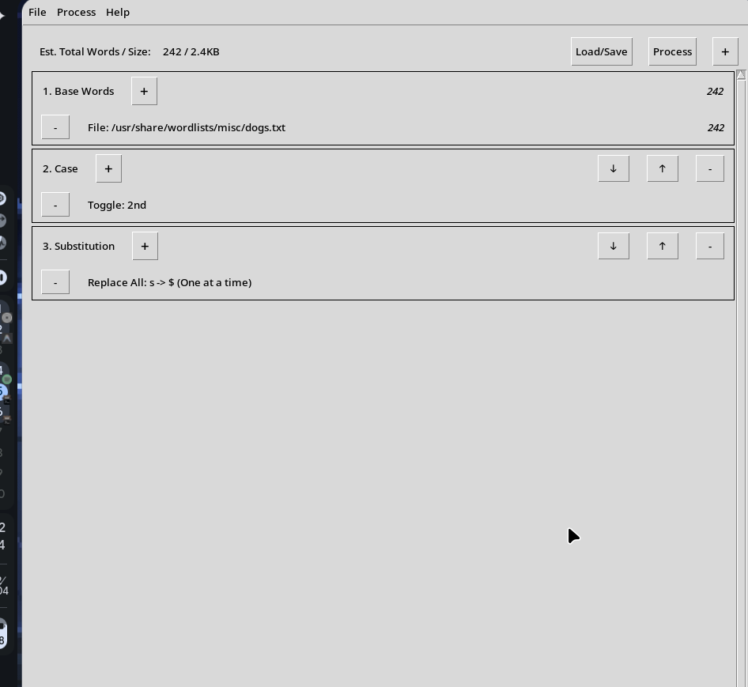

Mentalist menerapkan semua transformasi secara sequential ke setiap kata — bukan menghasilkan semua kemungkinan varian. Satu kata masuk, satu kata termutasi keluar. Itulah kenapa output-nya tetap 242 entri meskipun ada dua tahap transformasi.

Klik **Process** untuk menghasilkan wordlist. Output disimpan ke file yang kamu tentukan — dalam contoh ini `/home/dimm/wordlist-hashcat.txt`:

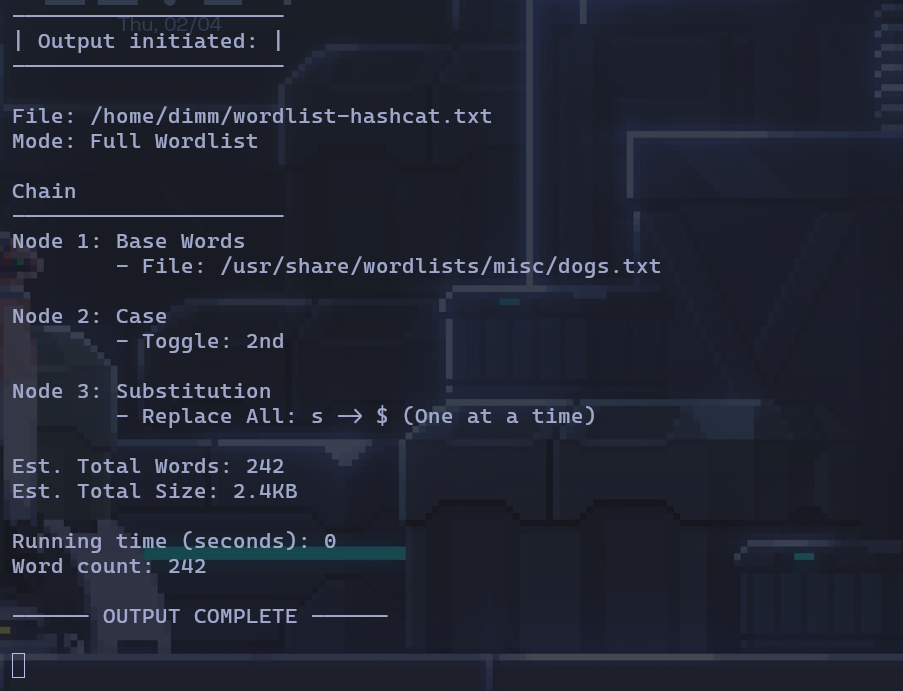

### Preparing the Hash File

Hash MD5 yang diberikan room:

```
ed91365105bba79fdab20c376d83d752
```

Simpan ke file:

```bash
echo 'ed91365105bba79fdab20c376d83d752' > MD5-hash.txt
```

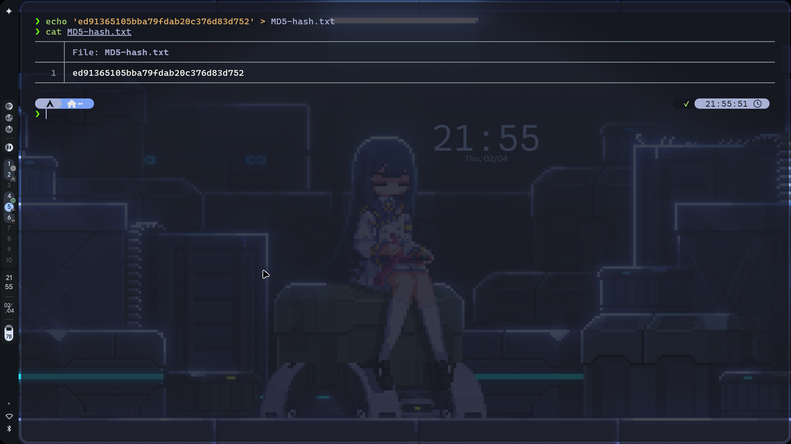

### Cracking with Hashcat

Jalankan Hashcat dengan mode MD5 dan custom wordlist yang baru dibuat:

```bash
hashcat -m 0 MD5-hash.txt wordlist-hashcat.txt
```

| Komponen | Fungsi |
| :--- | :--- |
| `hashcat` | Tool cracking password berbasis GPU |
| `-m 0` | Mode hash: MD5 |
| `MD5-hash.txt` | File berisi hash target |
| `wordlist-hashcat.txt` | Custom wordlist hasil generate dari Mentalist |

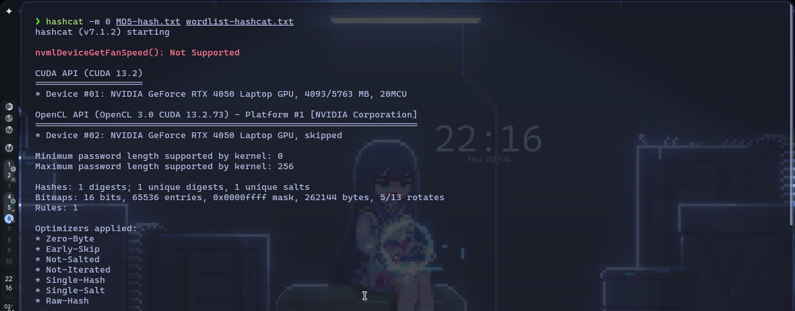

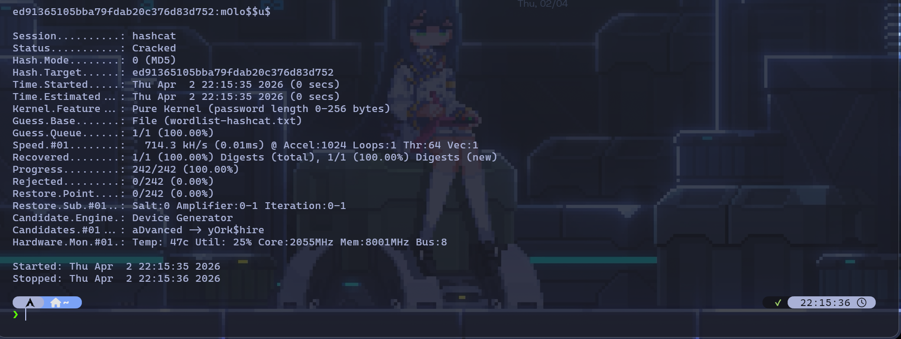

Hashcat memecahkan hash dalam waktu kurang dari 1 detik. Output menunjukkan `Progress: 242/242 (100.00%)` — seluruh 242 kandidat dicoba dan satu cocok. Password aslinya adalah `mOlo$$u$`, yang berasal dari nama ras anjing **Molossus** setelah dua tahap mutasi: toggle karakter ke-2 (`molossus` → `mOlossus`) dan substitusi semua `s` → `$` (`mOlossus` → `mOlo$$u$`).

**Jawaban:** `mOlo$$u$`

### Generating a Wordlist with TTPassGen

Mentalist bagus untuk mutasi berbasis kata, tapi bagaimana kalau password-nya bukan dari kamus sama sekali — melainkan kombinasi angka dan huruf yang di-generate dari pola tertentu? Di sinilah **TTPassGen** masuk.

> **for your information:** **TTPassGen** adalah tool command-line untuk membuat wordlist dari pola karakter yang kamu definisikan sendiri. Cocok untuk skenario di mana kamu tahu struktur password target — misalnya "4 digit angka diikuti 1-3 huruf kecil, dipisahkan dash".

Room ini meminta kamu membuat tiga wordlist terpisah lalu menggabungkannya.

**Langkah 1** — Generate semua kombinasi 4 digit PIN (0000–9999):

```bash
ttpassgen --rule '[?d]{4:4:*}' pin.txt
```

| Komponen | Fungsi |
| :--- | :--- |
| `ttpassgen` | Tool wordlist generator berbasis pola |
| `--rule` | Mendefinisikan pola karakter yang akan di-generate |
| `[?d]` | Character class digit (0-9) |
| `{4:4:*}` | Panjang minimum 4, maksimum 4, semua kombinasi |
| `pin.txt` | File output |

**Langkah 2** — Generate semua kombinasi huruf kecil panjang 1 sampai 3:

```bash
ttpassgen --rule '[?l]{1:3:*}' abc.txt
```

| Komponen | Fungsi |
| :--- | :--- |
| `[?l]` | Character class lowercase (a-z) |
| `{1:3:*}` | Panjang minimum 1, maksimum 3, semua kombinasi |
| `abc.txt` | File output |

**Langkah 3** — Gabungkan kedua wordlist dengan separator dash:

```bash
ttpassgen --dictlist 'pin.txt,abc.txt' --rule '$0[-]{1}$1' combination.txt
```

| Komponen | Fungsi |
| :--- | :--- |
| `--dictlist` | Daftar wordlist yang akan digabungkan, dipisah koma |
| `$0` | Kata dari wordlist pertama (pin.txt) |
| `[-]{1}` | Separator: satu karakter dash `-` |
| `$1` | Kata dari wordlist kedua (abc.txt) |
| `combination.txt` | File output gabungan |

Format hasil akhirnya: `[4 digit]-[1-3 huruf]`. Contoh: `1551-li`, `0000-a`, `9999-zzz`.

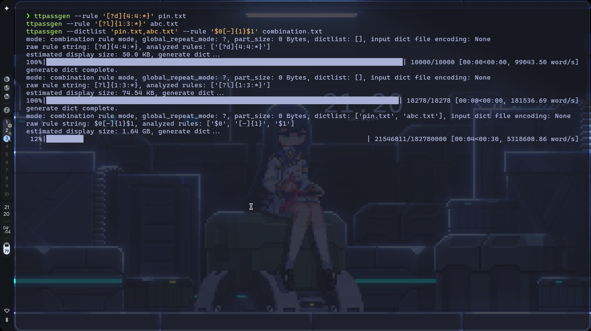

Verifikasi ukuran masing-masing file:

```bash
wc pin.txt && wc abc.txt && wc combination.txt
```

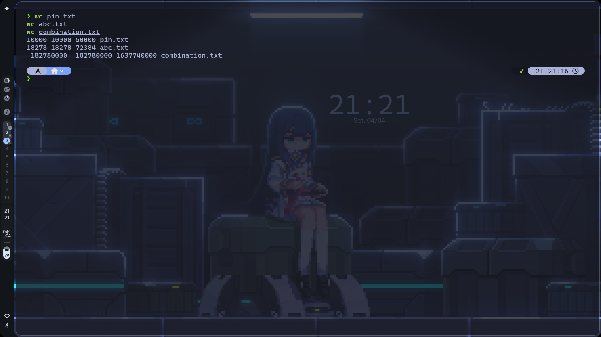

`combination.txt` berisi 182 juta baris dan ukurannya mencapai 1.64 GB — wajar kalau proses generate-nya butuh waktu beberapa menit. Ini salah satu alasan kenapa pendekatan wordlist pre-generated seperti ini hanya worth it kalau kamu yakin dengan strukturnya, bukan coba-coba.

### Cracking with combination.txt

Hash MD5 yang diberikan:

```
e5b47b7e8df2597077e703c76ee86aee
```

Simpan ke file lalu crack:

```bash
echo 'e5b47b7e8df2597077e703c76ee86aee' > hash-combination.txt
hashcat -m 0 hash-combination.txt combination.txt
```

| Komponen | Fungsi |
| :--- | :--- |
| `hashcat` | Tool cracking password berbasis GPU |
| `-m 0` | Mode hash: MD5 |
| `hash-combination.txt` | File berisi hash target |
| `combination.txt` | Wordlist gabungan hasil TTPassGen |

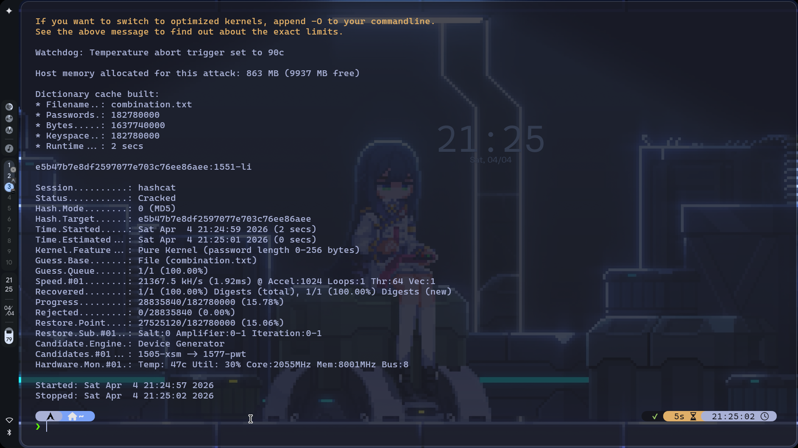

> **Common Mistake:** Kalau hashcat langsung skip dengan pesan "All hashes found as potfile", berarti hash yang sama pernah di-crack sebelumnya dan hasilnya tersimpan di potfile. Untuk melihat hasilnya: `hashcat -m 0 hash-combination.txt combination.txt --show`. Kalau mau jalankan ulang dari awal, hapus potfile dulu dengan `rm ~/.hashcat/hashcat.potfile`.

**Jawaban:** `1551-li`

### Generating a Wordlist with CeWL

Selain membuat wordlist dari scratch menggunakan TTPassGen atau Mentalist, ada cara lain yang lebih kontekstual: **scraping langsung dari website**. Idenya sederhana — kalau target menggunakan password yang berhubungan dengan topik tertentu, kata-kata di website mereka bisa jadi kandidat yang relevan.

> **for your information:** **CeWL** (_Custom Word List Generator_) adalah tool Ruby yang men-spider sebuah website dan mengumpulkan semua kata yang ditemukan sebagai wordlist. Berguna ketika kamu tahu konteks target — misalnya website perusahaan, blog pribadi, atau halaman produk.

Untuk men-download semua kata dari `example.org` dengan kedalaman crawl 2:

```bash
cewl -d 2 -w $(pwd)/example.txt https://example.org
```

| Komponen | Fungsi |
| :--- | :--- |
| `cewl` | Tool web scraper untuk generate wordlist |
| `-d 2` | Depth 2 — spider akan mengikuti link sampai 2 level dari halaman awal |
| `-w $(pwd)/example.txt` | Simpan output ke file `example.txt` di direktori aktif saat ini |
| `https://example.org` | URL target yang akan di-spider |

Angka di `-d` menentukan seberapa dalam spider mengikuti link. Depth 1 berarti hanya halaman utama, depth 2 berarti halaman utama + semua link yang ada di halaman utama, dan seterusnya.

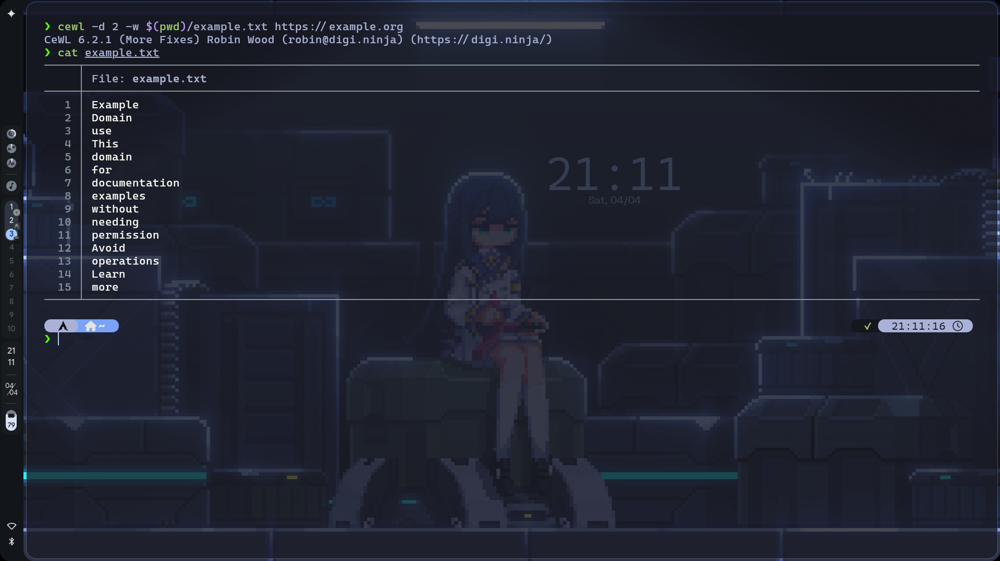

> **Common Mistake:** Hasil `cewl` sangat bergantung pada konten website saat command dijalankan. Soal ini mengharapkan kata `information` sebagai kata terakhir — tapi konten `example.org` sudah berubah sejak soal dibuat. Saat dicoba, CeWL hanya menghasilkan 15 kata dan kata terakhirnya adalah `more`, bukan `information`. Investigasi lebih lanjut menunjukkan satu-satunya link di `example.org` mengarah ke `iana.org` yang merupakan domain berbeda — sehingga CeWL tidak mengikutinya meski depth diset 2. Jawaban `information` diambil dari writeup lama yang dibuat saat konten website masih berbeda.

**Jawaban:** `information`

---

## Task 6: Cracking Challenges

Task ini adalah muara dari semua yang sudah dipelajari. Deploy machine, buka browser, akses `http://MACHINE_IP` — di sana ada website **Password Advisor** yang isinya percakapan antara user biasa dan seorang hacker. User cerita tentang kebiasaan password mereka, hacker kasih saran tipe mutasi. Dari dua informasi itu — base word dan tipe mutasi — kamu tentukan strategi cracking untuk masing-masing hash.

### Advice 1: Border Mutation — Male Name

**Clue dari Password Advisor:**

- **John Neige @john:** _"Hi, my name is John. I'm looking for a good advice to get a strong password. Usually I use the name of my son but I fear it's not secure enough."_
- **Hacker @h4ck:** _"You can use border mutation. It's commonly used, add a combination of digits and special symbols at the end or at the beginning, or both."_

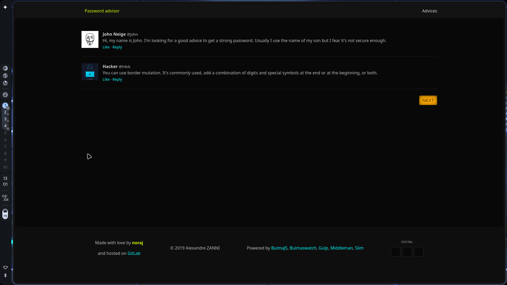

Jelas sudah — password-nya adalah **nama anak John** (nama laki-laki), dan hacker sendiri yang bilang mutasinya adalah **border mutation**: tambahkan kombinasi digit dan simbol di awal, akhir, atau keduanya.

#### Choosing the Wordlist

Clue mengarah ke nama laki-laki. SecLists punya file `malenames-usa-top1000.txt` di kategori Usernames/Names — berisi 1000 nama laki-laki paling umum di Amerika Serikat, semua dalam format uppercase.

Sebelum cracking, kamu bisa verifikasi dulu apakah wordlist memuat nama dengan panjang yang relevan. Answer format soal ini 14 karakter, dan border mutation-nya 5 karakter, jadi nama dasarnya kemungkinan 9 huruf:

```bash
awk 'length==9' /home/dimm/SecLists/Usernames/Names/malenames-usa-top1000.txt
```

| Komponen | Fungsi |
| :--- | :--- |
| `awk` | Text processing tool |
| `'length==9'` | Kondisi: hanya tampilkan baris yang panjangnya tepat 9 karakter |
| `malenames-usa-top1000.txt` | Wordlist nama laki-laki dari SecLists |

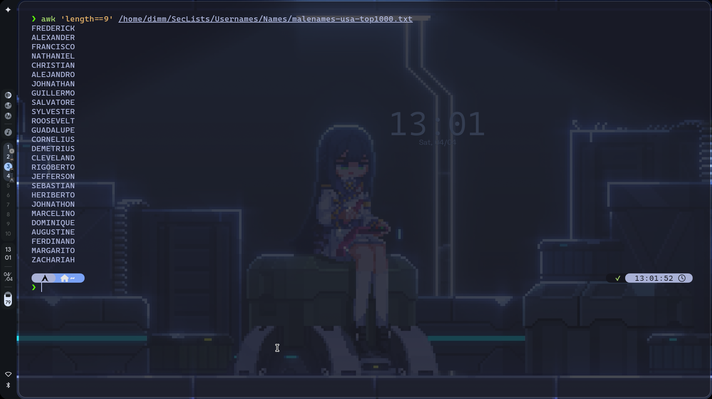

Output menampilkan nama-nama seperti FREDERICK, ALEXANDER, NATHANIEL, ZACHARIAH, dan lainnya. Ini hanya verifikasi — saat cracking nanti, John akan memproses seluruh isi wordlist (1000 nama), bukan hanya yang 9 huruf.

> **Common Mistake:** Path SecLists di atas menggunakan lokasi lokal `/home/dimm/SecLists/...`. Di machine TryHackMe, path-nya biasanya `/usr/share/seclists/...`. Sesuaikan dengan environment kamu.

#### Writing the Custom Rule

Saran hacker mengatakan **border mutation** — menambahkan kombinasi digit dan simbol di akhir. Kamu perlu membuat rule John the Ripper yang menambahkan 5 karakter dari set digit (0-9) dan simbol umum (`!@#$%^&*`) di akhir setiap kata.

Buka file konfigurasi John dan tambahkan rule baru di bagian paling bawah file:

```bash
sudo nano /usr/share/john/john.conf
```

Tambahkan di baris paling bawah:

```
[List.Rules:Border5]
cAz"[0-9!@#$%^&*][0-9!@#$%^&*][0-9!@#$%^&*][0-9!@#$%^&*][0-9!@#$%^&*]"
```

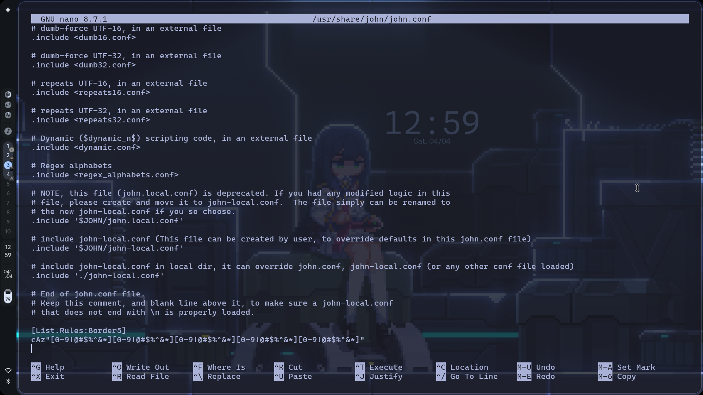

Bedah per komponen:

| Komponen | Fungsi |
| :--- | :--- |
| `[List.Rules:Border5]` | Nama rule — dipanggil dengan `--rules=Border5` |
| `c` | Capitalize: ubah huruf pertama menjadi uppercase, sisanya lowercase |
| `Az"..."` | Append string di akhir kata — `A` = command insert, `z` = posisi akhir |
| `[0-9!@#$%^&*]` | Character class berisi 18 karakter: digit 0-9 dan simbol `!@#$%^&*` |
| (5 class dalam 1 string) | String 5 karakter, setiap posisi di-expand → 18^5 = 1,889,568 kombinasi |

Cara kerjanya: rule ini adalah satu command `cAz"XXXXX"` — capitalize kata, lalu append string 5 karakter di akhir. Karena setiap posisi ditulis sebagai character class `[0-9!@#$%^&*]`, **preprocessor** John meng-expand baris ini menjadi 1,889,568 baris rule individual sebelum cracking dimulai. Dengan wordlist 1000 nama, total kandidat yang dihasilkan adalah 1000 × 1,889,568 ≈ **1.89 miliar** kombinasi.

> **for your information:** Preprocessor John the Ripper bekerja mirip macro expansion. Notasi `[0-9!@#$%^&*]` di dalam definisi rule bukan berarti "pilih salah satu saat runtime" — melainkan "generate satu baris rule terpisah untuk setiap karakter di set ini sebelum eksekusi dimulai". Ini yang membedakannya dari operator `$` biasa: `$[0-9]` menghasilkan 10 rule (satu per digit), sedangkan `Az` dengan string multi-karakter bisa menghasilkan jutaan rule sekaligus.

> **Common Mistake:** Pastikan `[List.Rules:Border5]` ditambahkan di **paling bawah** file `john.conf`, bukan di tengah section `[List.Rules:Wordlist]` yang sudah ada. Kalau tercampur, John tidak akan bisa mengenali rule `Border5` sebagai section terpisah dan akan error "No Border5 mode rules found".

#### Cracking with John the Ripper

Simpan hash MD5 target ke file terlebih dahulu:

```bash
echo 'b16f211a8ad7f97778e5006c7cecdf31' > john-advice1.txt
```

Lalu jalankan John:

```bash
john john-advice1.txt --format=raw-md5 --wordlist=/home/dimm/SecLists/Usernames/Names/malenames-usa-top1000.txt --rules=Border5
```

| Komponen | Fungsi |
| :--- | :--- |
| `john` | John the Ripper — tool cracking password |
| `john-advice1.txt` | File berisi hash MD5 target |
| `--format=raw-md5` | Tipe hash: MD5 tanpa salt |
| `--wordlist=...` | Path ke wordlist nama laki-laki |
| `--rules=Border5` | Menerapkan rule border mutation yang baru dibuat |

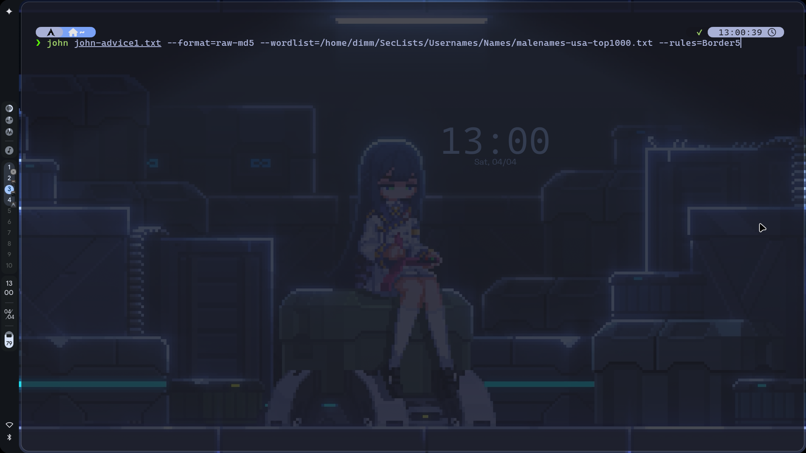

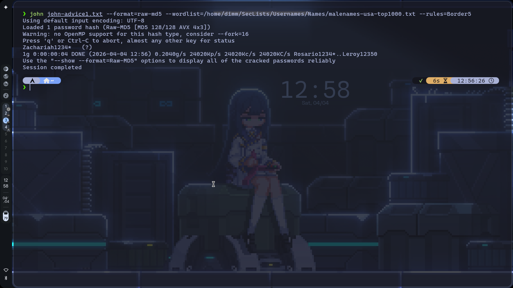

John berhasil memecahkan hash dalam waktu 4 detik. Output menunjukkan password `Zachariah1234*` — nama `ZACHARIAH` dari wordlist yang dinormalisasi menjadi `Zachariah` oleh operator `c`, lalu ditambahkan `1234*` di akhir sebagai 5 karakter border mutation. Dengan kecepatan 24020Kp/s (24 juta kandidat per detik), sekitar 96 juta kandidat sudah diproses sebelum match ditemukan.

**Jawaban:** `Zachariah1234*`
