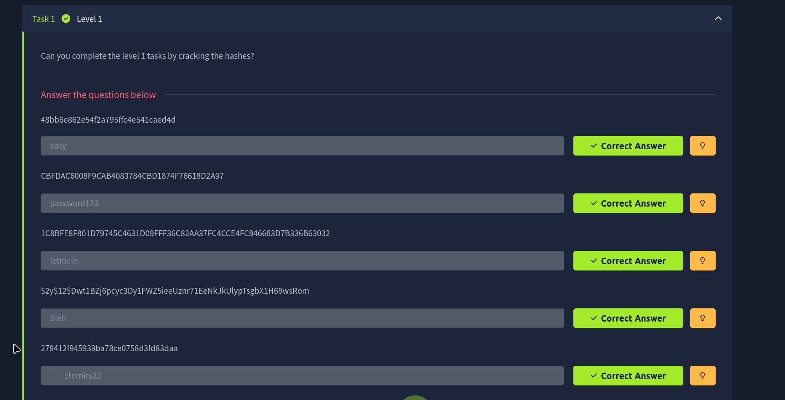
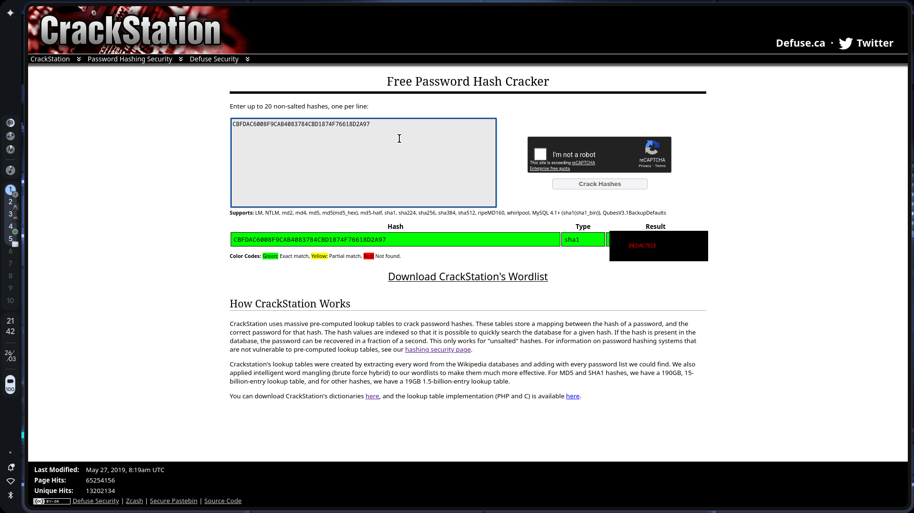
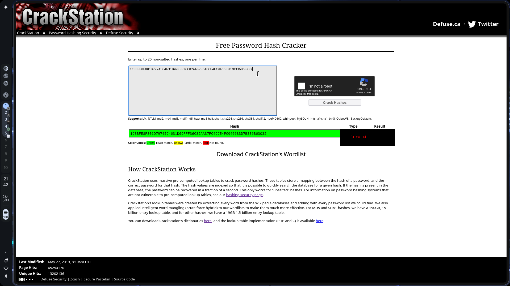
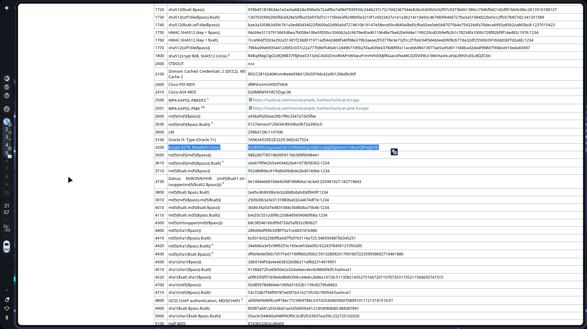
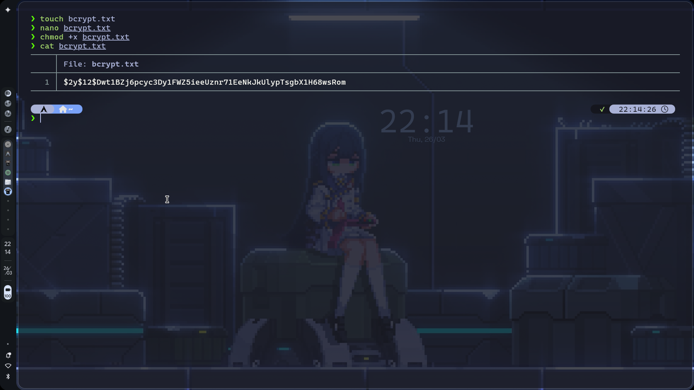
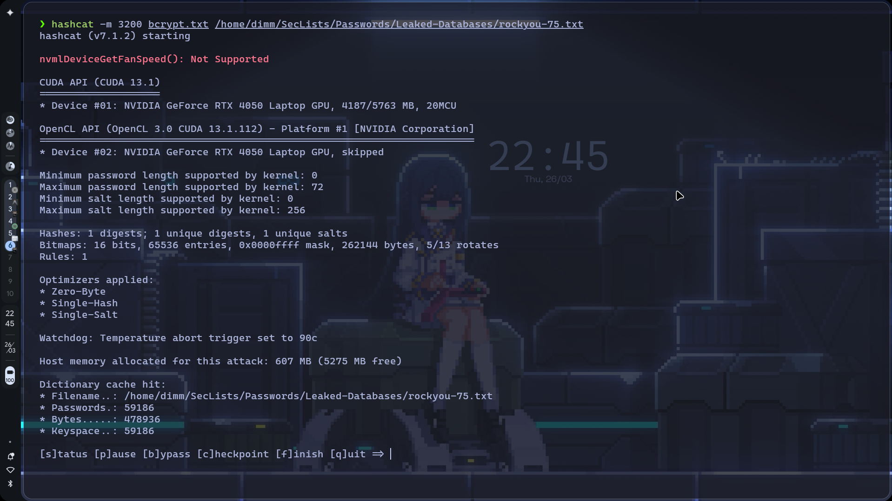
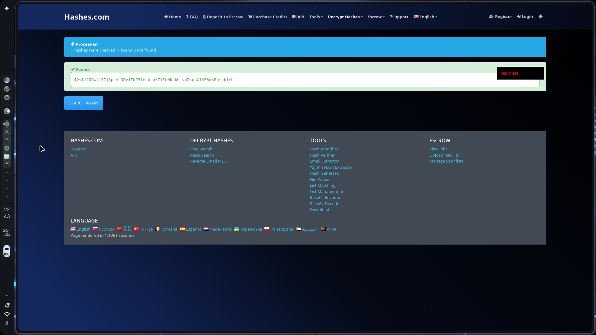

# TryHackMe: Crack the Hash

- **Room Link:** [Crack the hash](https://tryhackme.com/room/crackthehash)
- **Category:** Challenge Room
- **Difficulty:** Easy
- **Tools Used:** Hashcat Examples List, CrackStation, Hashcat, Hashes.com
- **Main Techniques:** Hash Identification, Online Hash Cracking, Offline Hash Cracking, Brute Force

---

## Attack Context

- **Kapan teknik ini dipakai?** Tahap *Credential Access* — ketika kamu sudah mendapatkan hash password dari database, file konfigurasi, atau hasil dump memori, dan perlu memulihkan password aslinya.
- **Syarat yang dibutuhkan:** Hash target sudah di tangan. Untuk offline cracking, dibutuhkan wordlist dan tool seperti Hashcat. Untuk online lookup, cukup koneksi internet.
- **Tanda keberhasilan:** Tool atau layanan online berhasil mengembalikan plaintext password dari hash yang diberikan.

---

## Overview

Room ini melatih skill dasar kriptografi ofensif, yaitu **Password Cracking**. Di Task 1 (Level 1), kita diberikan 5 hash berbeda dan diminta untuk memecahkannya. Tantangan di room ini bukan sekadar menjalankan tool — yang lebih penting adalah _bagaimana cara mengidentifikasi jenis hash tersebut_ sebelum mencoba memecahkannya.

Kita akan menggunakan kombinasi tool online (_CrackStation_, _Hashes.com_) dan tool offline (_Hashcat_) untuk melihat pendekatan mana yang paling efisien tergantung jenis hash-nya.



---

## Hash Identification 101

Sebelum masuk ke pemecahan, kamu harus tahu dulu jenis hash apa yang sedang digunakan. Memilih algoritma yang salah di tool cracker akan langsung membuat seluruh proses gagal.

Ada dua cara utama untuk mengidentifikasi hash:

1. **Dilihat dari panjang karakternya (Length)**
   - 32 karakter (Hex) = MD5, MD4, atau NTLM
   - 40 karakter (Hex) = SHA-1
   - 64 karakter (Hex) = SHA-256

2. **Dilihat dari prefix-nya (Signature)**
   - Hash yang diawali tanda `$` seperti `$2y$`, `$1$`, atau `$6$` menggunakan format **Modular Crypt Format (MCF)**
   - Contoh: prefix `$2y$` adalah penanda khas untuk **bcrypt** (Blowfish)

> **for your information:** **Hashcat Examples Wiki** adalah halaman referensi resmi Hashcat yang memuat daftar lengkap pola hash beserta mode (kode angka) yang harus dipakai saat menjalankan Hashcat. Jadikan ini referensi pertama saat menemukan hash yang tidak familiar.

---

## Task 1: Level 1 (Cracking The Hashes)

Dari 5 hash yang diberikan, 4 di antaranya adalah hash standar tanpa _salt_. Hash tipe ini paling cepat dipecahkan menggunakan database pre-computed online seperti **CrackStation**.

> **for your information:** **CrackStation** adalah layanan online yang menyimpan miliaran hash dari berbagai wordlist (Wikipedia, daftar password bocor, dll). Kalau hash target termasuk yang umum, CrackStation bisa menemukannya dalam hitungan detik — jauh lebih cepat dibanding menjalankan Hashcat sendiri.

### Hash 1: `48bb6e862e54f2a795ffc4e541caed4d`

- **Panjang:** 32 karakter (Hex)
- **Kemungkinan:** MD5
- **Metode:** Masukkan ke CrackStation
- **Hasil:** Teridentifikasi sebagai **md5** — Password: `[REDACTED]`


### Hash 2: `CBFDAC6008F9CAB4083784CBD1874F76618D2A97`

- **Panjang:** 40 karakter (Hex)
- **Kemungkinan:** SHA-1
- **Metode:** Masukkan ke CrackStation
- **Hasil:** Teridentifikasi sebagai **sha1** — Password: `[REDACTED]`



### Hash 3: `1C8BFE8F801D79745C4631D09FFF36C82AA37FC4CCE4FC946683D7B336B63032`

- **Panjang:** 64 karakter (Hex)
- **Kemungkinan:** SHA-256
- **Metode:** Masukkan ke CrackStation
- **Hasil:** Teridentifikasi sebagai **sha256** — Password: `[REDACTED]`



### Hash 4: `279412f945939ba78ce0758d3fd83daa`

- **Panjang:** 32 karakter (Hex)
- **Kemungkinan:** MD4 atau MD5
- **Metode:** Masukkan ke CrackStation
- **Hasil:** Teridentifikasi sebagai **md4** — Password: `[REDACTED]`


---

## Task 1: The Bcrypt Anomaly (Hash 5)

Hash ke-5 formatnya sama sekali berbeda dari keempat hash sebelumnya:

`$2y$12$Dwt1BZj6pcyc3Dy1FWZ5ieeUznr71EeNkJkUlypTsgbX1H68wsRom`

### Identifikasi Hash

Prefix `$2y$` langsung bisa dicocokkan ke Hashcat Examples Wiki.



Sesuai tabel referensi Hashcat, pola `$2a$`, `$2b$`, `$2x$`, dan `$2y$` adalah **bcrypt** (Blowfish berbasis Unix). Mode Hashcat untuk bcrypt adalah `3200`.

Bcrypt didesain secara sengaja untuk menjadi lambat melalui mekanisme _key stretching_ — setiap percobaan password membutuhkan komputasi yang jauh lebih besar dibanding algoritma standar seperti MD5 atau SHA-1. Ini yang membuat bcrypt sangat tangguh terhadap serangan brute-force.

### Approach 1: Offline Cracking dengan Hashcat

Buat file teks berisi hash target, lalu jalankan Hashcat dengan wordlist.

```bash
touch bcrypt.txt
nano bcrypt.txt
# Paste hash ke dalam file lalu simpan
```



```bash
hashcat -m 3200 bcrypt.txt /home/dimm/SecLists/Passwords/Leaked-Databases/rockyou-75.txt
```

| Komponen | Fungsi |
| :--- | :--- |
| `hashcat` | Tool password recovery berbasis GPU/CPU |
| `-m 3200` | Menentukan jenis hash target (3200 = bcrypt) |
| `bcrypt.txt` | File input yang berisi hash target |
| `rockyou-75.txt` | Wordlist yang dipakai untuk dictionary attack |

**Hasil:** Proses cracking gagal sebelum selesai.



> **Common Mistake:** Di output Hashcat tertulis *Watchdog: Temperature abort trigger set to 90c*. Hashcat menguras penuh kapasitas GPU/CPU, sehingga suhu hardware naik drastis. Bcrypt membutuhkan komputasi yang sangat berat per percobaan — menjalankannya di laptop dengan wordlist besar sangat rawan memicu *thermal throttling* hingga proses dibatalkan otomatis oleh Hashcat demi keamanan hardware.

### Approach 2: Online Hash Lookup dengan Hashes.com

Karena cracking offline menggunakan **Hashcat** tidak berhasil, langkah berikutnya adalah mengecek apakah hash ini sudah pernah dipecahkan sebelumnya. **Hashes.com** menyimpan hasil crack dari berbagai hash yang sudah pernah diproses orang lain — termasuk hash-hash bcrypt yang berat sekalipun.

Buka Hashes.com di browser, lalu paste hash ke kolom pencarian yang tersedia.



**Hasil:** Hash ditemukan di database Hashes.com — Password: `[REDACTED]`

> **for your information:** Untuk hash yang berat seperti bcrypt, selalu cek layanan online lookup terlebih dahulu sebelum menjalankan Hashcat. Kalau hash tersebut sudah ada di database publik, kamu menghemat waktu komputasi yang bisa memakan berjam-jam bahkan berhari-hari.

---

## Review

- **Identifikasi dulu, crack kemudian.** Panjang karakter dan prefix hash sudah cukup untuk menentukan algoritmanya sebelum memilih tool atau mode yang tepat.
- **CrackStation untuk hash standar.** MD5, SHA-1, SHA-256 tanpa salt — langsung cek ke CrackStation sebelum repot menjalankan tool offline.
- **Bcrypt bukan hash biasa.** Mekanisme key stretching-nya membuat setiap percobaan jauh lebih lambat. Brute-force bcrypt di laptop biasa bukan pilihan realistis.
- **Online lookup adalah langkah pertama, bukan cadangan.** Kalau hash sudah ada di database publik, tidak perlu menghabiskan resource komputasi sama sekali.
