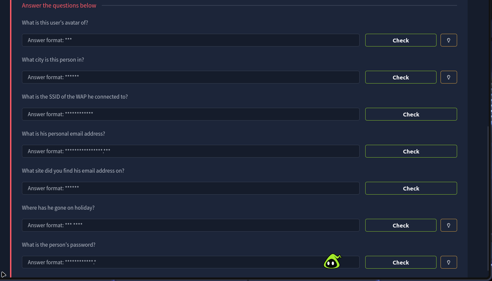
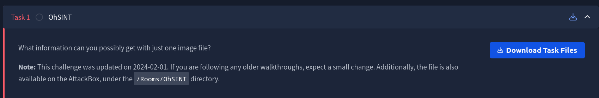
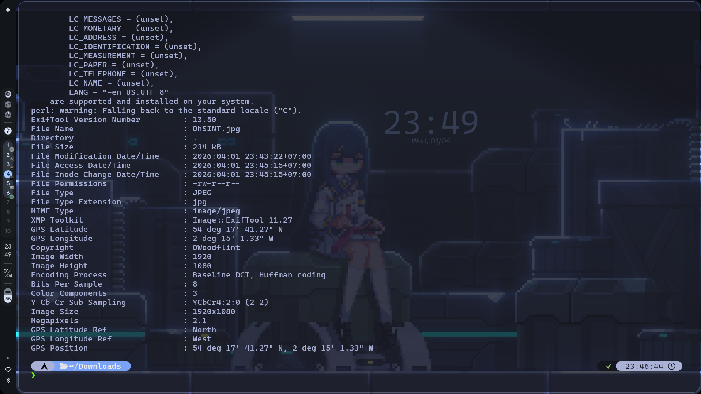
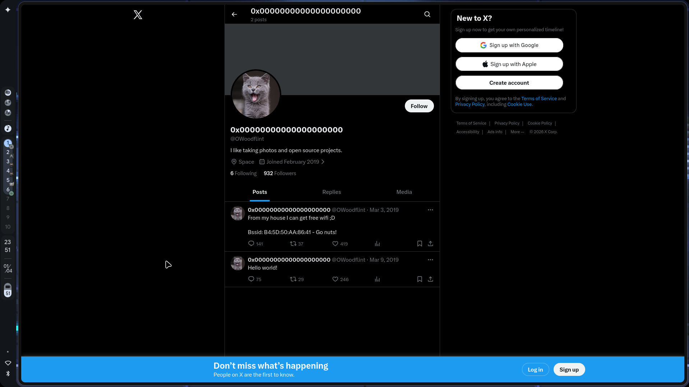
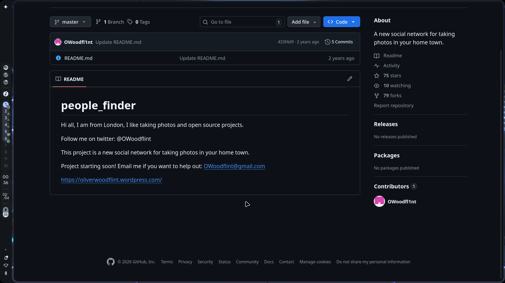
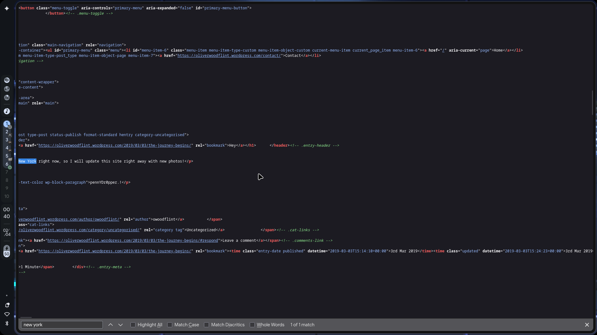
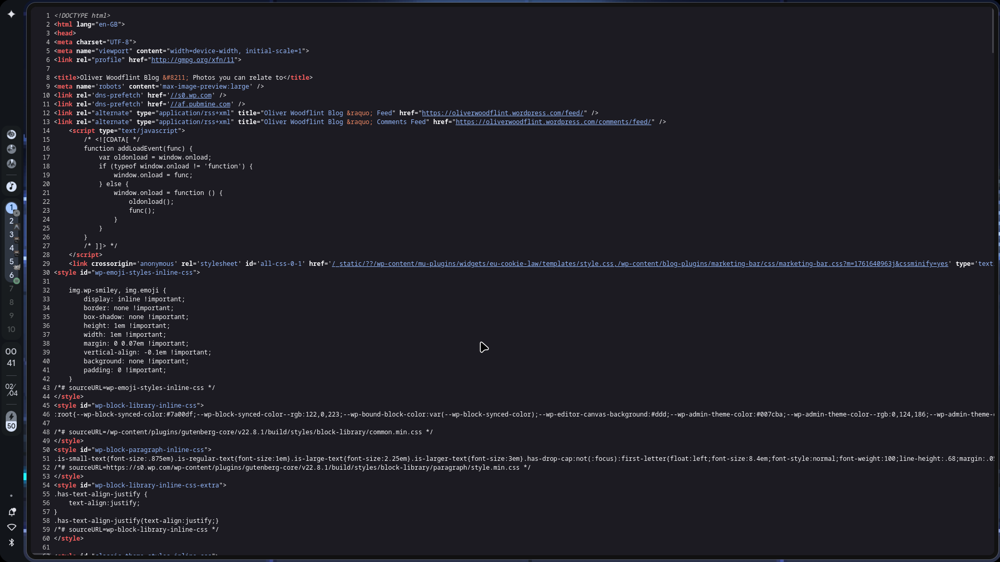
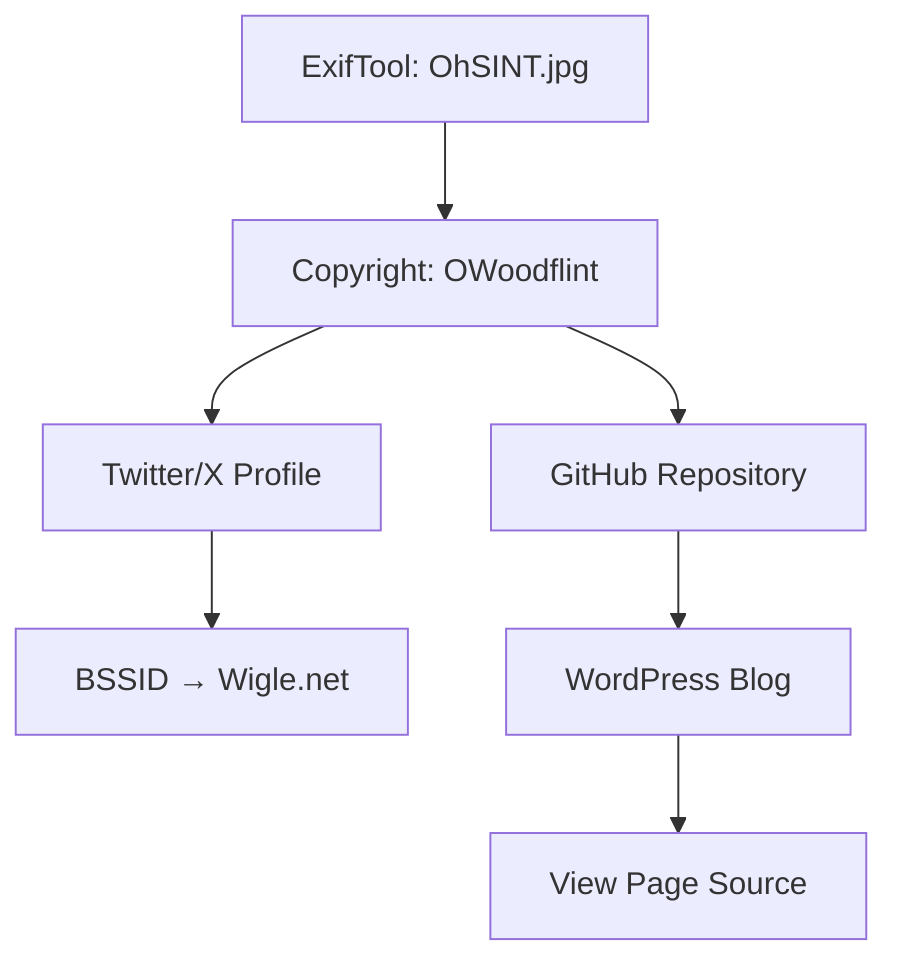
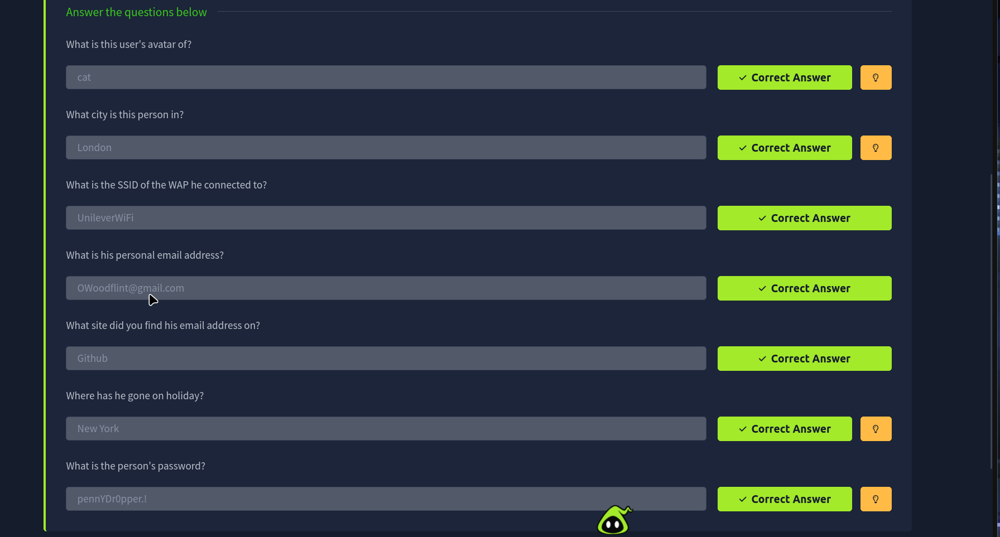

# TryHackMe: OhSINT

- **Room Link:** [OhSINT](https://tryhackme.com/room/ohsint)
- **Category:** Challenge Room
- **Difficulty:** Easy
- **Tools Used:** ExifTool, Wigle.net, Browser (View Page Source)
- **Main Techniques:** OSINT (Open Source Intelligence), EXIF Metadata Extraction, BSSID Lookup, Social Media Profiling

---

## Attack Context

- **Kapan teknik ini dipakai?** Tahap _Reconnaissance_ — sebelum menyentuh target secara teknis, kamu mengumpulkan informasi publik untuk memetakan identitas, lokasi, dan kebiasaan target.
- **Syarat yang dibutuhkan:** Satu titik awal (_seed data_), dalam kasus ini sebuah file gambar. Dari satu titik itu, kamu menelusuri jejak digital target melalui platform publik.
- **Tanda keberhasilan:** Berhasil memetakan identitas target secara komprehensif — avatar, lokasi, email, SSID WiFi, destinasi liburan, dan password — hanya dari satu file gambar.

---

## Overview

> **for your information:** **OSINT (Open Source Intelligence)** adalah proses pengumpulan dan analisis informasi dari sumber-sumber yang tersedia secara publik — media sosial, registri domain, metadata file, forum, dan lain-lain. Teknik ini tidak membutuhkan akses ilegal ke sistem target.

Room ini memberikan satu file gambar (`OhSINT.jpg`) dan meminta kamu menggali sebanyak mungkin informasi tentang pemiliknya. Tidak ada server yang perlu di-hack, tidak ada exploit yang perlu dijalankan — semuanya dilakukan melalui penelusuran informasi publik.

Pertanyaan yang harus dijawab:



---

## Step 1: EXIF Metadata Extraction

### Extracting Metadata from the Image

> **for your information:** **EXIF (Exchangeable Image File Format)** adalah standar metadata yang tertanam di dalam file gambar. Data ini bisa mencakup model kamera, tanggal pengambilan foto, koordinat GPS, dan bahkan informasi pemilik — semuanya tersimpan otomatis tanpa disadari oleh sebagian besar pengguna.

Room menyediakan file `OhSINT.jpg` melalui tombol **Download Task Files**.



Jalankan **ExifTool** untuk mengekstrak seluruh metadata yang tertanam di dalam gambar:

```bash
exiftool OhSINT.jpg
```

| Komponen | Fungsi |
| :--- | :--- |
| `exiftool` | Tool CLI untuk membaca, menulis, dan mengedit metadata file (gambar, video, PDF, dll) |
| `OhSINT.jpg` | File gambar target yang diunduh dari room |



Dari output ExifTool, tiga field yang langsung relevan:

| Field | Value | Signifikansi |
| :--- | :--- | :--- |
| **Copyright** | `OWoodflint` | Username / identitas pemilik gambar |
| **GPS Latitude** | `54 deg 17' 41.27" N` | Koordinat lokasi pengambilan foto |
| **GPS Longitude** | `2 deg 15' 1.33" W` | Koordinat lokasi pengambilan foto |

Dari sini kita punya **seed data**: username `OWoodflint`. Ini titik awal untuk menelusuri seluruh jejak digital target di platform publik.

> **Common Mistake:** Jangan langsung fokus ke GPS coordinates saja. Informasi paling berharga dari output ExifTool di room ini justru field **Copyright** — username itulah yang membuka pintu ke semua platform sosial target.

---

## Step 2: Social Media Profiling (Twitter/X)

Nama `OWoodflint` langsung bisa dicari di berbagai platform. Mulai dari **Twitter/X** — cari `@OWoodflint`:



Dari profil Twitter target, informasi yang bisa diekstrak:

| Data | Value | Menjawab Pertanyaan |
| :--- | :--- | :--- |
| **Avatar** | Foto kucing (_cat_) | *"What is this user's avatar of?"* |
| **Bio** | *"I like taking photos and open source projects."* | — |
| **Tweet** | *"From my house I can get free wifi ;D"* | — |
| **BSSID** | `B4:5D:50:AA:86:41` | Kunci untuk menemukan SSID WiFi |

> **for your information:** **BSSID (Basic Service Set Identifier)** adalah alamat MAC unik dari sebuah access point WiFi. Berbeda dengan SSID (nama jaringan yang kamu lihat saat mencari WiFi), BSSID bersifat unik per perangkat fisik. Database publik seperti **Wigle.net** mengumpulkan data BSSID dari wardriving — sehingga kamu bisa mengetahui nama jaringan dan lokasi fisik access point hanya dari BSSID-nya.

### BSSID Lookup via Wigle.net

Buka [wigle.net](https://wigle.net), login, lalu cari BSSID `B4:5D:50:AA:86:41` di fitur pencarian.

Hasilnya menunjukkan:

| Data | Value | Menjawab Pertanyaan |
| :--- | :--- | :--- |
| **SSID** | `UnileverWiFi` | *"What is the SSID of the WAP he connected to?"* |

---

## Step 3: GitHub Repository

Username `OWoodflint` juga ditemukan di **GitHub** sebagai `OWoodfl1nt` (perhatikan angka `1` menggantikan huruf `i`). Repositorinya bernama `people_finder`:



Dari README repository ini:

| Data | Value | Menjawab Pertanyaan |
| :--- | :--- | :--- |
| **Lokasi** | *"I am from London"* | *"What city is this person in?"* |
| **Email** | `OWoodflint@gmail.com` | *"What is his personal email address?"* |
| **Platform** | GitHub | *"What site did you find his email address on?"* |

README juga menyertakan link ke blog WordPress: `https://oliverwoodflint.wordpress.com/`

---

## Step 4: WordPress Blog (Source Code Inspection)

Buka blog WordPress target. Secara visual, halaman blog hanya menampilkan satu post singkat. Tapi informasi kritis tersembunyi di balik layar — di **source code** halaman.

Klik kanan pada halaman → **View Page Source** (atau tekan `Ctrl+U`):



Di dalam source code HTML, dua informasi ditemukan:

**1. Lokasi liburan** — teks dalam tag `<p>`:

```html
<p>New York right now, so I will update this site right away with new photos!</p>
```

**2. Password** — tersembunyi di paragraf dengan style `color` yang sama dengan background (teks tidak terlihat secara visual di halaman):

```html
<p class="wp-block-paragraph" style="...">pennYDr0pper.!</p>
```



| Data | Value | Menjawab Pertanyaan |
| :--- | :--- | :--- |
| **Holiday** | New York | *"Where has he gone on holiday?"* |
| **Password** | `pennYDr0pper.!` | *"What is the person's password?"* |

> **Common Mistake:** Password ini **tidak terlihat** di halaman web secara visual karena warna teksnya disetel menyatu dengan background. Kamu harus membaca source code untuk menemukannya. Biasakan selalu inspect source code halaman saat melakukan OSINT pada website pribadi target — informasi sensitif sering tersembunyi di sana.

---

## OSINT Investigation Flow



---

## Answers Summary



| Question | Answer | Source |
| :--- | :--- | :--- |
| What is this user's avatar of? | `cat` | Twitter/X profile picture |
| What city is this person in? | `London` | GitHub README |
| What is the SSID of the WAP? | `UnileverWiFi` | Wigle.net (BSSID lookup) |
| What is his personal email? | `OWoodflint@gmail.com` | GitHub README |
| What site did you find his email on? | `Github` | GitHub repository page |
| Where has he gone on holiday? | `New York` | WordPress blog source code |
| What is the person's password? | `pennYDr0pper.!` | WordPress blog source code (hidden text) |

---

## Review

- **Satu file bisa membuka segalanya.** Metadata gambar (`Copyright`) menjadi seed data yang menghubungkan ke seluruh jejak digital target di Twitter, GitHub, dan WordPress.
- **BSSID bersifat publik.** Database wardriving seperti Wigle.net menyimpan jutaan BSSID beserta lokasi dan SSID-nya — informasi yang di-post target di Twitter langsung bisa dipetakan ke jaringan WiFi fisik.
- **View Page Source adalah kebiasaan wajib.** Password target tersembunyi di HTML dengan teks transparan. Inspeksi source code harus menjadi refleks saat melakukan OSINT pada website pribadi.
- **OSINT bukan hacking, tapi sama berbahayanya.** Seluruh informasi di room ini dikumpulkan tanpa menyentuh sistem target — murni dari sumber publik. Di dunia nyata, data seperti ini cukup untuk membangun serangan social engineering atau credential stuffing.
