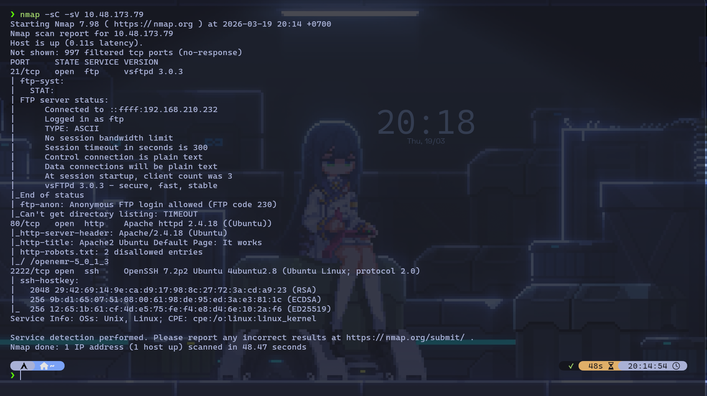
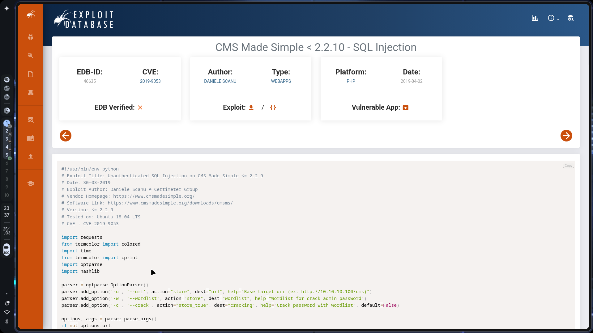
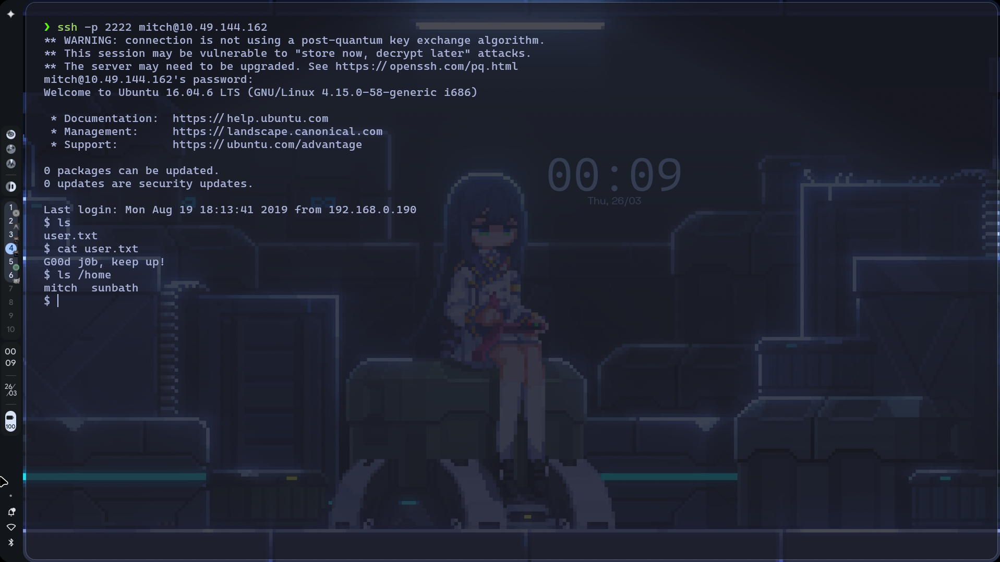
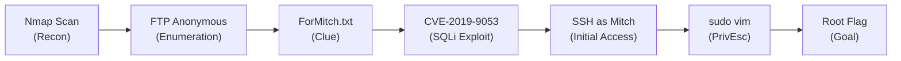

# TryHackMe: Simple CTF Challenge

- **Room Link:** [Simple CTF Challenge](https://tryhackme.com/room/simplectfchallenge)
- **Category:** Challenge Room
- **Difficulty:** Easy
- **Tools Used:** Nmap, FTP client, CVE-2019-9053 exploit (Python), SSH, Vim
- **Main Techniques:** Port scanning, anonymous FTP enumeration, SQL injection (CMS Made Simple), SSH brute force / credential reuse, privilege escalation via sudo vim

---

## Attack Context

- **Kapan teknik ini dipakai?** Tahap _Recon_ sampai _Privilege Escalation_ — room ini mencakup seluruh attack chain dari awal hingga root.
- **Syarat yang dibutuhkan:** Koneksi ke jaringan TryHackMe (VPN atau AttackBox) dan IP target.
- **Tanda keberhasilan:** Mendapatkan _user flag_ (`user.txt`) dan _root flag_ (`root.txt`).

---

## Reconnaissance

### Nmap Scan

Langkah pertama di setiap CTF: identifikasi service yang berjalan di target.

```
nmap -sC -sV MACHINE_IP
```

| Komponen | Fungsi |
| :--- | :--- |
| `nmap` | Tool scanner jaringan |
| `-sC` | Menjalankan _default scripts_ (NSE) untuk menggali info tambahan dari tiap service |
| `-sV` | Mendeteksi versi service yang berjalan |



Hasilnya menunjukkan tiga port terbuka:

| Port | Service | Version | Catatan |
| :--- | :--- | :--- | :--- |
| 21/tcp | FTP | vsftpd 3.0.3 | **Anonymous login allowed** |
| 80/tcp | HTTP | Apache 2.4.18 (Ubuntu) | `robots.txt` memiliki 2 entri, termasuk `/openemr-5_0_1_3` |
| 2222/tcp | SSH | OpenSSH 7.2p2 | Port non-standar (biasanya SSH di port 22) |

Tiga hal itu memberikan petunjuk:
- **FTP mengizinkan anonymous login** — siapa saja bisa masuk tanpa password. Ini harus dieksplorasi pertama.
- **`robots.txt`** menyebutkan path `/openemr-5_0_1_3` — ini petunjuk bahwa ada aplikasi web yang terinstall.
- **SSH di port 2222**, bukan port default 22. Ini penting untuk diingat saat nanti login via SSH.

> **Common Mistake:** Banyak pemula hanya fokus ke port 80 (HTTP) dan mengabaikan FTP. Padahal anonymous FTP seringkali menyimpan file sensitif yang jadi kunci untuk lanjut ke tahap berikutnya.

---

## Enumeration

### FTP Anonymous Login

Nmap sudah mengonfirmasi FTP mengizinkan _anonymous login_. Langsung masuk:

```
ftp MACHINE_IP
```

Saat diminta username, ketik `anonymous` dan tekan Enter (password kosong atau ketik apapun).


Setelah masuk, eksplorasi isi server:

```
ftp> ls
ftp> cd pub
ftp> ls
ftp> get ForMitch.txt
ftp> quit
```

| Command | Fungsi |
| :--- | :--- |
| `ls` | Melihat isi direktori di FTP server |
| `cd pub` | Masuk ke folder `pub` |
| `get ForMitch.txt` | Mengunduh file `ForMitch.txt` ke mesin lokal |
| `quit` | Menutup koneksi FTP |

Di dalam folder `pub/` hanya ada satu file: `ForMitch.txt`. Setelah diunduh dan dibaca:

```
cat ForMitch.txt
```


Isinya:

> _"Dammit man... you're the worst dev i've seen. You set the same pass for the system user, and the password is so weak... i cracked it in seconds. Gosh... what a mess!"_

Informasi berharga dari pesan ini:
- Ada user bernama **Mitch** (file ditujukan untuk dia).
- Password system user-nya **sama dengan password di tempat lain** (_credential reuse_).
- Password-nya **sangat lemah**, bisa di-crack dalam hitungan detik.

### Web Application — CMS Made Simple

Sekarang pindah ke port 80. Buka `http://MACHINE_IP` di browser, yang muncul hanyalah halaman default Apache ("It works"). Tapi ingat hasil Nmap tadi: `robots.txt` menyebutkan path `/openemr-5_0_1_3`. Coba akses path tersebut dan eksplorasi direktori web lainnya.

Setelah menelusuri, ternyata server ini menjalankan **CMS Made Simple** — sebuah _Content Management System_ berbasis PHP. Versi CMS biasanya terlihat di footer halaman login atau di source HTML. Ini informasi krusial, karena CMS Made Simple versi lama punya kerentanan SQL Injection yang sudah terdokumentasi publik.

---

## Exploitation

### CVE-2019-9053: SQL Injection on CMS Made Simple

Kerentanan **CVE-2019-9053** mempengaruhi CMS Made Simple versi di bawah 2.2.10. Exploit ini memungkinkan _Unauthenticated SQL Injection_ — artinya penyerang bisa mengekstrak data dari database **tanpa perlu login** ke aplikasi.



> **for your information:** **SQL Injection** (_SQLi_) adalah kerentanan di mana input dari user diproses langsung sebagai bagian dari query database tanpa sanitasi yang benar. Penyerang bisa menyisipkan perintah SQL tambahan untuk membaca, mengubah, atau menghapus data di database.

Detail exploit:

| Item | Detail |
| :--- | :--- |
| **CVE** | CVE-2019-9053 |
| **EDB-ID** | 46635 |
| **Tipe** | Unauthenticated SQL Injection |
| **Platform** | PHP (Web Application) |
| **Versi Rentan** | CMS Made Simple < 2.2.10 |

Exploit Python ini (dari Exploit Database) bekerja dengan cara mengirim request berulang ke endpoint yang rentan, mengekstrak data karakter per karakter (_blind SQLi_ / _time-based SQLi_). Outputnya menghasilkan:
- **Username** CMS
- **Email**
- **Password hash** (salt + hash)

Password hash yang didapat kemudian di-_crack_ — dan sesuai petunjuk dari `ForMitch.txt`, password-nya memang sangat lemah sehingga bisa dipecahkan dalam hitungan detik.

---

## Initial Access

### SSH Login as Mitch

Dari `ForMitch.txt`, kamu sudah tahu bahwa password system user **sama** dengan password CMS. Karena username-nya `mitch` dan password sudah di-crack dari SQLi, login via SSH di port 2222:

```
ssh -p 2222 mitch@MACHINE_IP
```

| Komponen | Fungsi |
| :--- | :--- |
| `ssh` | Memulai koneksi SSH |
| `-p 2222` | Menentukan port SSH (non-standar, bukan port 22) |
| `mitch` | Username target |
| `@MACHINE_IP` | IP mesin target |



Login berhasil. Langsung ambil _user flag_:

```
$ ls
user.txt
$ cat user.txt
G00d j0b, keep up!
```

Untuk menjawab pertanyaan room tentang user lain di home directory:

```
$ ls /home
mitch  sunbath
```

Ada satu user lain: **sunbath**.

---

## Privilege Escalation

### Sudo Vim to Root Shell

Sebelum mencoba apapun, selalu cek dulu hak `sudo` yang dimiliki user saat ini:

```
sudo -l
```

| Komponen | Fungsi |
| :--- | :--- |
| `sudo` | Menjalankan command dengan hak akses lebih tinggi |
| `-l` | Menampilkan daftar command yang boleh dijalankan user ini via `sudo` |

Output-nya menunjukkan bahwa `mitch` boleh menjalankan `/usr/bin/vim` sebagai root **tanpa password** (`NOPASSWD`). Ini artinya vim jadi vektor privilege escalation yang valid.

> **for your information:** **Vim** adalah text editor di terminal Linux. Tapi vim punya fitur yang bisa dimanfaatkan untuk escalation: dari dalam vim, kamu bisa menjalankan command sistem dengan `:!command`. Jika vim dijalankan dengan `sudo`, command yang dieksekusi juga berjalan sebagai root. Teknik ini terdokumentasi di [GTFOBins - vim](https://gtfobins.github.io/gtfobins/vim/).

Jalankan vim dengan sudo:

```
sudo vim
```

Kemudian dari dalam vim, spawn shell root:

```
:!bash
```

Atau alternatif yang lebih singkat:

```
sudo vim -c ':!bash'
```

| Komponen | Fungsi |
| :--- | :--- |
| `sudo` | Menjalankan command sebagai root |
| `vim` | Membuka text editor vim |
| `-c ':!bash'` | Menjalankan command vim `:!bash` langsung saat startup |
| `:!bash` | Perintah vim untuk menjalankan `/bin/bash` sebagai subprocess |


Setelah mendapat root shell, ambil root flag:

```
root@Machine:~# cat /root/root.txt
```

> **Common Mistake:** Perhatikan di screenshot bahwa proses menuju `cat /root/root.txt` tidak selalu lancar, ada beberapa percobaan `cat /r` (tab completion), `cat /root` (mengembalikan "Is a directory") sebelum akhirnya `cat /root/root.txt` berhasil membaca flag. Ini normal saat bekerja di terminal, jangan panik kalau salah ketik.

---

## Attack Flow Summary



---

## Review

- **Anonymous FTP** jadi entry point utama — file `ForMitch.txt` membocorkan informasi soal _credential reuse_ dan _weak password_. Selalu periksa service FTP yang mengizinkan login tanpa autentikasi.
- **CMS Made Simple < 2.2.10** rentan terhadap _Unauthenticated SQL Injection_ (CVE-2019-9053), memungkinkan ekstraksi username dan password hash tanpa login.
- **Credential reuse** — password CMS yang di-crack ternyata juga password SSH user `mitch`. Ini kesalahan keamanan yang sangat umum di dunia nyata.
- **Vim sebagai vektor privilege escalation** — jika user punya hak `sudo` untuk vim, penyerang bisa spawn root shell lewat `:!bash`. Referensi lengkap: [GTFOBins - vim](https://gtfobins.github.io/gtfobins/vim/).
