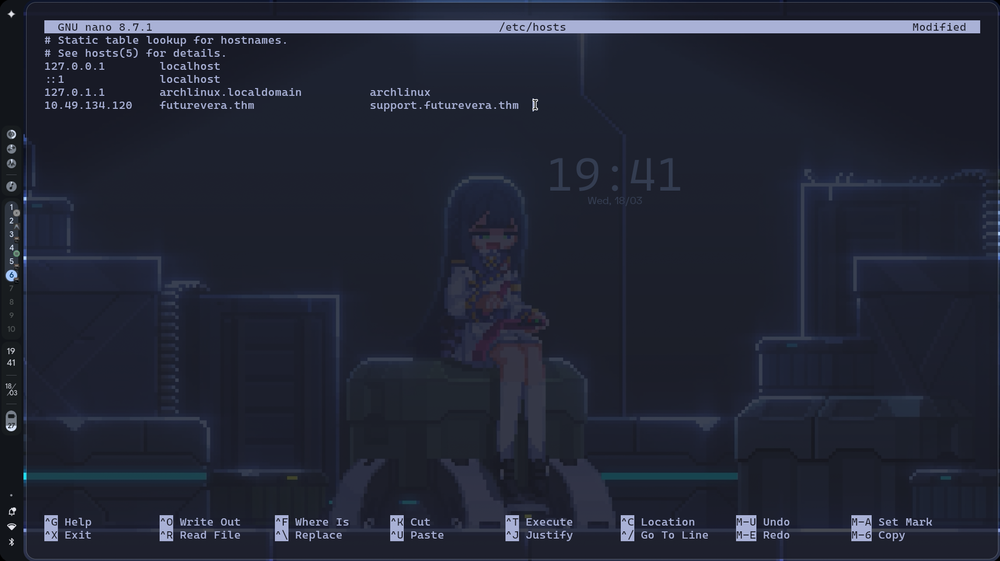
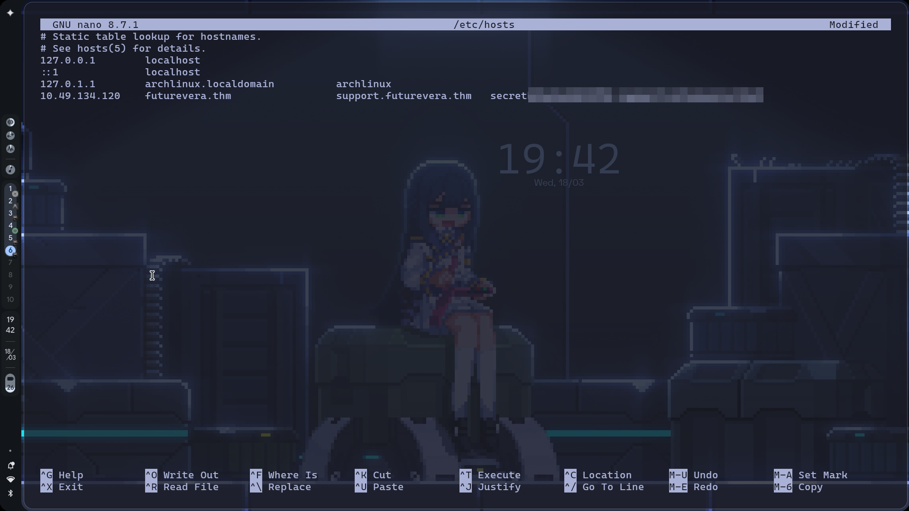

# TryHackMe: TakeOver Challenge

- **Room Link:** [TakeOver](https://tryhackme.com/room/takeover)
- **Category:** Challenge Room
- **Difficulty:** Easy
- **Tools Used:** Nmap, FFuF, Zen Browser
- **Teknik Utama:** Subdomain Enumeration, SSL Certificate Inspection, Subdomain Takeover

---

## Overview

Room ini melatih kemampuan subdomain enumeration dan pemahaman tentang bagaimana SSL/TLS certificate bisa membocorkan informasi subdomain tersembunyi. Selain itu, room ini juga mengajarkan konsep **Subdomain Takeover** — kondisi di mana DNS record sebuah subdomain masih aktif tapi mengarah ke layanan pihak ketiga yang sudah tidak dikonfigurasi, sehingga berpotensi diambil alih oleh penyerang.

---

## Reconnaissance

### Port Scanning

Langkah pertama adalah melakukan pemindaian terhadap domain `futurevera.thm` untuk mengetahui port apa saja yang terbuka.

```bash
nmap futurevera.thm
```


**Output:**

```
Starting Nmap 7.98 at 2026-03-18 19:10 +0700
Nmap scan report for futurevera.thm (10.49.134.120)
Host is up (0.095s latency).
Not shown: 997 closed tcp ports (conn-refused)
PORT    STATE SERVICE
22/tcp  open  ssh
80/tcp  open  http
443/tcp open  https
```

Ditemukan 3 port terbuka:

| Port | Service | Keterangan |
| :--- | :--- | :--- |
| 22 | SSH | Remote access |
| 80 | HTTP | Web server |
| 443 | HTTPS | Web server dengan SSL |

Tidak perlu flag tambahan seperti `-sC` atau `-sV` karena tujuan kita hanya mengidentifikasi port webserver yang aktif.

> **Catatan:** Jika host terdeteksi sebagai "down", tambahkan flag `-Pn` untuk skip ping probe: `nmap -Pn futurevera.thm`

---

## Enumeration

### Percobaan VHost Fuzzing (Dead End)

Karena ini challenge subdomain enumeration, saya mencoba brute force subdomain menggunakan **FFuF** dengan teknik *VHost Fuzzing*:

```bash
ffuf -w /usr/share/seclists/Discovery/DNS/subdomains-top1million-5000.txt \
  -H "Host: FUZZ.futurevera.thm" \
  -u https://futurevera.thm \
  -k -mc 200,301,302 \
  -fs 4605
```

Penjelasan flag yang digunakan:

| Komponen | Fungsi |
| :--- | :--- |
| `-w` | Path ke wordlist subdomain |
| `-H` | Custom Host header untuk VHost fuzzing |
| `-u` | Target URL |
| `-k` | Ignore SSL certificate error |
| `-mc 200,301,302` | Hanya tampilkan response dengan status code tersebut |
| `-fs 4605` | Filter (sembunyikan) response dengan size 4605 bytes |

**Hasilnya kosong.** Server mengembalikan response size yang sama (4605 bytes) untuk semua subdomain, sehingga setelah difilter tidak ada yang tersisa.


Saya juga mencoba wordlist yang lebih besar (`subdomains-top1million-20000.txt` dan `subdomains-top1million-110000.txt`) dengan hasil yang sama. Setelah 110.000 subdomain dicoba dan semuanya kosong, saya mulai sadar — mungkin jawabannya bukan di tools. Saya kembali membaca deskripsi room dari awal, dan di situlah saya menemukan kata yang seharusnya sudah saya perhatikan sejak tadi: **"support"**.

### Manual Enumeration: Membaca petunjuk dari Deskripsi Room

Dari deskripsi room disebutkan bahwa perusahaan sedang *"rebuilding their **support**"* — ini adalah petunjuk bahwa kemungkinan ada subdomain bernama `support`.

Tambahkan subdomain tersebut ke `/etc/hosts` agar bisa diakses secara lokal:

```bash
echo "10.49.134.120 support.futurevera.thm" >> /etc/hosts
```

Atau edit manual:



### Inspeksi SSL Certificate — Menemukan Subdomain Tersembunyi

Akses `https://support.futurevera.thm` di browser, lalu:

1. Klik ikon **gembok** di address bar
2. Pilih **Show Certificate** / **Certificate is valid**
3. Cari bagian **Subject Alternative Names (SAN)**

Dan di sinilah momen yang tidak saya duga sama sekali, ternyata tersembunyi di dalam certificate yang bersifat publik dan bisa dibaca siapa saja, ada sebuah subdomain yang tidak terdaftar di DNS publik manapun:

```
secretxxxxxxx.support.futurevera.thm
```

Selama ini saya sibuk brute force subdomain dengan wordlist yang berbeda-beda, padahal jawabannya sudah ada di SSL certificate sejak awal. Ini adalah pelajaran yang tidak akan saya lupakan.

> **Kenapa bisa ada di sini?** SAN (Subject Alternative Names) adalah field dalam SSL certificate yang mencantumkan semua domain/subdomain yang dicakup oleh certificate tersebut. Developer sering lupa bahwa informasi ini bersifat publik dan bisa dibaca siapa saja.

Tambahkan subdomain ini ke `/etc/hosts`:



---

## Exploitation

### Vulnerability: Subdomain Takeover

Celah utamanya adalah **Subdomain Takeover**. DNS record dari subdomain `secretxxxxxxx.support.futurevera.thm` masih aktif dan mengarah ke layanan **AWS S3** yang sudah tidak dikonfigurasi (bucket tidak ada atau sudah dihapus). Kondisi ini memungkinkan penyerang untuk:

1. Mendaftarkan bucket S3 dengan nama yang sama
2. Mengontrol konten yang ditampilkan di subdomain tersebut
3. Menyebarkan konten berbahaya (phishing, malware, dll) atas nama domain yang sah

### Menemukan Flag

Akses subdomain tersebut via **HTTP** (bukan HTTPS, karena akan diredirect ke AWS):

```
http://secretxxxxxxx.support.futurevera.thm
```


Browser akan diredirect ke URL AWS S3 — **flag terlihat langsung di URL redirect tersebut** dalam format `flag{...}.s3-website-us-west-3.amazonaws.com`.

---

## Flags

| Flag | Lokasi |
| :--- | :--- |
| Flag | URL redirect AWS setelah mengakses subdomain secret via HTTP |


---

## Lessons Learned

- **Baca deskripsi target dengan teliti** — petunjuk sering tersembunyi di deskripsi room atau scope pentest. Brute force bukan selalu solusi pertama.
- **SSL Certificate SAN bisa membocorkan subdomain tersembunyi** — selalu cek bagian Subject Alternative Names saat melakukan pentest terhadap HTTPS service.
- **Brute force bukan satu-satunya cara** — kombinasi manual enumeration dan tool jauh lebih efektif daripada bergantung pada wordlist saja.
- **Abandoned subdomains** — DNS record yang tidak diurus tapi masih aktif merupakan target mudah untuk subdomain takeover di dunia nyata.

---

## Referensi

- [HackTricks - Subdomain Takeover](https://book.hacktricks.xyz/pentesting-web/domain-subdomain-takeover)
- [HackerOne - Guide to Subdomain Takeovers](https://www.hackerone.com/application-security/guide-subdomain-takeovers)
- [MDN - Subdomain Takeovers](https://developer.mozilla.org/en-US/docs/Web/Security/Subdomain_takeovers)
