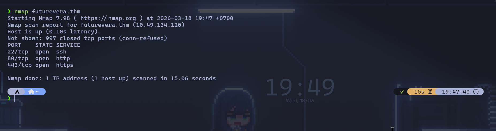
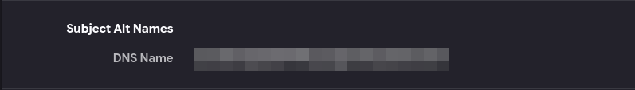
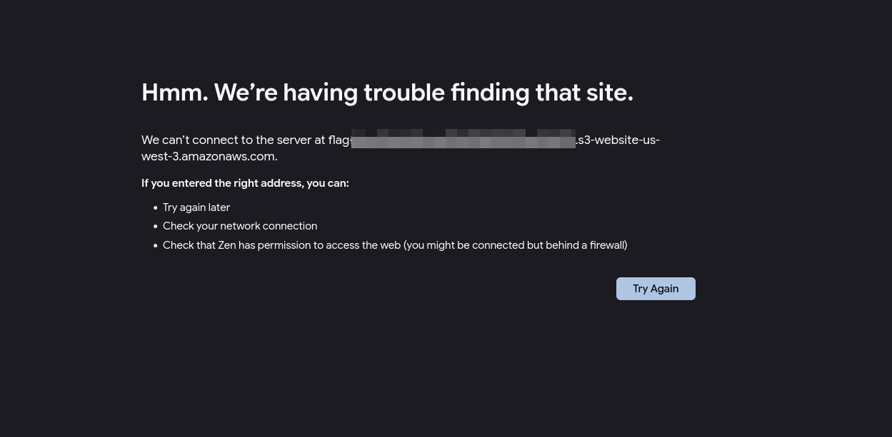
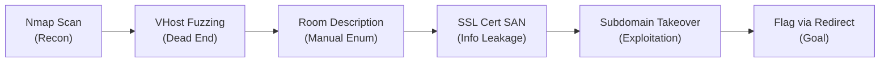

# TryHackMe: TakeOver Challenge

- **Room Link:** [TakeOver](https://tryhackme.com/room/takeover)
- **Category:** Challenge Room
- **Difficulty:** Easy
- **Tools Used:** Nmap, FFuF, Zen Browser
- **Main Techniques:** Subdomain Enumeration, SSL Certificate Inspection, Subdomain Takeover

---

## Overview

Room ini melatih kemampuan subdomain enumeration dan pemahaman tentang bagaimana SSL/TLS certificate bisa membocorkan informasi subdomain tersembunyi. Selain itu, room ini juga mengajarkan konsep **Subdomain Takeover**, kondisi di mana DNS record sebuah subdomain masih aktif tapi mengarah ke layanan pihak ketiga yang sudah tidak dikonfigurasi, sehingga berpotensi diambil alih oleh penyerang.

## Attack Context

- **Kapan teknik ini dipakai?** Tahap _Recon_ dan _Initial Access_ — subdomain enumeration adalah langkah awal saat mengaudit infrastruktur web, dan subdomain takeover terjadi di fase eksploitasi.
- **Syarat yang dibutuhkan:** Koneksi ke jaringan TryHackMe, akses ke browser, dan kemampuan mengedit `/etc/hosts` di mesin lokal.
- **Tanda keberhasilan:** Menemukan subdomain tersembunyi via SSL certificate dan mendapatkan flag dari redirect AWS S3.

---

## Reconnaissance

### Port Scanning

Langkah pertama adalah memindai domain `futurevera.thm` untuk mengetahui port apa saja yang terbuka.

```bash
nmap futurevera.thm
```

| Komponen | Fungsi |
| :--- | :--- |
| `nmap` | Tool scanner jaringan untuk mendeteksi port dan service |
| `futurevera.thm` | Domain target (sudah ditambahkan ke `/etc/hosts`) |



Hasilnya:

```
PORT    STATE SERVICE
22/tcp  open  ssh
80/tcp  open  http
443/tcp open  https
```

| Port | Service | Keterangan |
| :--- | :--- | :--- |
| 22 | SSH | Remote access |
| 80 | HTTP | Web server |
| 443 | HTTPS | Web server dengan SSL/TLS |

Tidak perlu flag tambahan seperti `-sC` atau `-sV` karena tujuannya hanya mengidentifikasi port webserver yang aktif. Yang penting: ada port 443 (HTTPS) — ini berarti ada SSL certificate yang bisa diinspeksi.

> **Common Mistake:** Jika host terdeteksi sebagai "down", tambahkan flag `-Pn` untuk melewati ping probe: `nmap -Pn futurevera.thm`. TryHackMe machines kadang memblokir ICMP ping.

---

## Enumeration

### Percobaan VHost Fuzzing (Dead End)

> **for your information:** **VHost Fuzzing** adalah teknik brute force untuk menemukan subdomain dengan cara mengirim HTTP request dengan _Host header_ yang berbeda-beda. Server yang menghosting banyak subdomain akan memberikan response berbeda tergantung Host header yang dikirim.

Karena ini challenge subdomain enumeration, langkah pertama yang terpikirkan adalah brute force subdomain menggunakan **FFuF**:

```bash
ffuf -w /usr/share/seclists/Discovery/DNS/subdomains-top1million-5000.txt \
  -H "Host: FUZZ.futurevera.thm" \
  -u https://futurevera.thm \
  -k -mc 200,301,302 \
  -fs 4605
```

| Komponen | Fungsi |
| :--- | :--- |
| `-w` | Path ke wordlist subdomain |
| `-H` | Custom Host header — `FUZZ` diganti dengan setiap kata dari wordlist |
| `-u` | Target URL |
| `-k` | Mengabaikan error SSL certificate |
| `-mc 200,301,302` | Hanya tampilkan response dengan status code tersebut |
| `-fs 4605` | Filter (sembunyikan) response dengan size 4605 bytes (default page) |

**Hasilnya kosong.** Server mengembalikan response size yang sama (4605 bytes) untuk semua subdomain, sehingga setelah difilter tidak ada yang tersisa.


Wordlist yang lebih besar (`subdomains-top1million-20000.txt` dan `subdomains-top1million-110000.txt`) juga memberikan hasil kosong. Setelah beberapa percobaan, mungkin petunjuknya bukan di tools ini.

> **Common Mistake:** Jangan langsung terjebak di rabbit hole brute force. Kalau wordlist besar pun tidak menghasilkan apa-apa, mundur selangkah dan cari petunjuk dari sumber lain, deskripsi room, source code, atau certificate.

### Manual Enumeration via Room Description

Dari deskripsi room disebutkan bahwa perusahaan sedang *"rebuilding their **support**"* — ini petunjuk bahwa kemungkinan ada subdomain bernama `support`.

Tambahkan subdomain tersebut ke `/etc/hosts`:

```bash
echo "MACHINE_IP support.futurevera.thm" >> /etc/hosts
```

| Komponen | Fungsi |
| :--- | :--- |
| `echo` | Menuliskan teks ke output |
| `>>` | Menambahkan (append) ke akhir file, bukan menimpa |
| `/etc/hosts` | File mapping lokal antara hostname dan IP address |

Atau edit manual menggunakan text editor:


### SSL Certificate Inspection

Akses `https://support.futurevera.thm` di browser, lalu:

1. Klik ikon **gembok** di address bar
2. Pilih **Show Certificate** / **Certificate is valid**
3. Cari bagian **Subject Alternative Names (SAN)**

> **for your information:** **SAN** (_Subject Alternative Names_) adalah field dalam SSL certificate yang mencantumkan semua domain dan subdomain yang dicakup oleh certificate tersebut. Informasi ini bersifat publik — siapa saja yang mengakses HTTPS bisa membacanya. Developer sering lupa bahwa ini menjadi sumber _information leakage_.

Di dalam SAN, tersembunyi sebuah subdomain yang tidak terdaftar di DNS publik manapun:

```
secretxxxxxxx.support.futurevera.thm
```

Selama ini fokusnya ke brute force dengan wordlist yang berbeda-beda, padahal jawabannya sudah ada di SSL certificate sejak awal.

Tambahkan subdomain ini ke `/etc/hosts`:


---

## Exploitation

### Vulnerability: Subdomain Takeover

> **for your information:** **Subdomain Takeover** terjadi ketika sebuah DNS record (misalnya CNAME) masih mengarah ke layanan pihak ketiga (seperti AWS S3, Heroku, atau GitHub Pages), tapi layanan tersebut sudah tidak dikonfigurasi atau bucket-nya sudah dihapus. Penyerang bisa mendaftarkan layanan baru dengan nama yang sama dan mengontrol konten yang ditampilkan di subdomain tersebut.

DNS record dari subdomain `secretxxxxxxx.support.futurevera.thm` masih aktif dan mengarah ke layanan **AWS S3** yang sudah tidak dikonfigurasi. Kondisi ini memungkinkan penyerang untuk:

1. Mendaftarkan bucket S3 dengan nama yang sama
2. Mengontrol konten yang ditampilkan di subdomain tersebut
3. Menyebarkan konten berbahaya (phishing, malware) atas nama domain yang sah

### Getting the Flag

Akses subdomain tersebut via **HTTP** (bukan HTTPS):

```
http://secretxxxxxxx.support.futurevera.thm
```

> **Common Mistake:** Pastikan kamu mengakses lewat **HTTP**, bukan HTTPS. Kalau pakai HTTPS, browser akan mencoba validasi certificate dan request tidak sampai ke AWS redirect. Gunakan HTTP biasa untuk melihat redirect-nya.



Browser akan di-redirect ke URL AWS S3 — **flag terlihat langsung di URL redirect tersebut** dalam format `flag{...}.s3-website-us-west-3.amazonaws.com`.

---

## Flags

| Flag | Lokasi |
| :--- | :--- |
| Flag | URL redirect AWS setelah mengakses subdomain secret via HTTP |



---

## Attack Flow Summary



---

## Lessons Learned

- **Baca deskripsi target dengan teliti**, petunjuk sering tersembunyi di deskripsi room atau scope pentest. Brute force bukan selalu solusi pertama.
- **SSL Certificate SAN bisa membocorkan subdomain tersembunyi**, selalu cek bagian Subject Alternative Names saat melakukan pentest terhadap HTTPS service.
- **Brute force bukan satu-satunya cara**, kombinasi manual enumeration dan tool jauh lebih efektif daripada bergantung pada wordlist saja.
- **Abandoned subdomains**, DNS record yang tidak diurus tapi masih aktif merupakan target mudah untuk subdomain takeover di dunia nyata.

---

## Referensi

- [HackTricks - Subdomain Takeover](https://book.hacktricks.xyz/pentesting-web/domain-subdomain-takeover)
- [HackerOne - Guide to Subdomain Takeovers](https://www.hackerone.com/application-security/guide-subdomain-takeovers)
- [MDN - Subdomain Takeovers](https://developer.mozilla.org/en-US/docs/Web/Security/Subdomain_takeovers)
