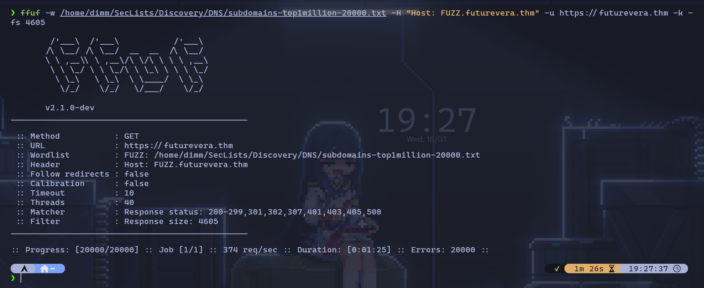
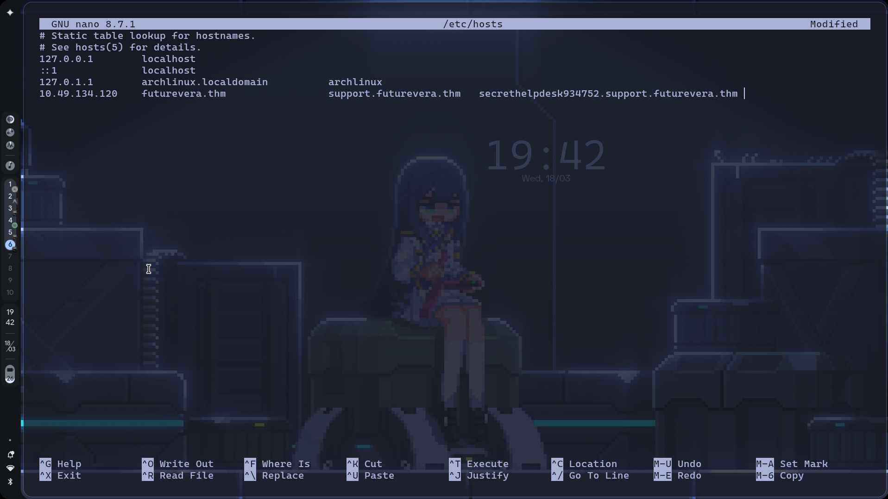
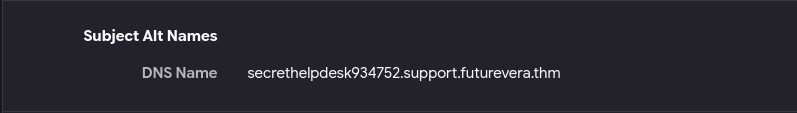

# TryHackMe: TakeOver Challenge

- **Room Link:** [TakeOver Challenge](https://tryhackme.com/room/takeoverchallenge)
- **Category:** Challenge Room
- **Difficulty:** Easy
- **Tools Used:** [Nmap, FFuF, Zen browser]

---

## Overview

[Room ini melatih seberapa jauh kemampuan kamu dalam melakukan subdomain enumeration dan memahami bagaimana konfigurasi DNS/Virtual Hosts yang salah bisa menyebabkan kebocoran informasi atau takeover.]

---

## Reconnaissance

### Port Scanning
Langkah pertama tentu saja melakukan pemindaian port untuk melihat pintu mana saja yang terbuka di server target.

```bash
nmap 
```


| Komponen | Fungsi |
| :--- | :--- |
| `nmap` | Tool scanner utama |
| `-sV` | Mendeteksi versi service |
| `-sC` | Menjalankan script nmap default |
| `-T4` | Mengatur kecepatan scan (lebih cepat) |

### Enumeration
Karena ini tantangan **subdomain enumeration**, saya menggunakan **FFuF** untuk mencari subdomain yang tersembunyi dengan teknik *VHost Fuzzing*.

```bash
ffuf -u http://takeover.thm -H "Host: FUZZ.takeover.thm" -w /usr/share/wordlists/amass/subdomains-top1mil-5000.txt -fs 0
```

| Komponen | Fungsi |
| :--- | :--- |
| `ffuf` | Tool fuzzing cepat |
| `-u` | Target URL |
| `-H` | Menambahkan custom header (Host header untuk fuzzing vhost) |
| `-w` | Path ke wordlist subdomain |
| `-fs 0` | Filter respons dengan size 0 (mengabaikan respons kosong) |

Berdasarkan hasil fuzzing, sempat ditemukan subdomain yang terlihat valid, tapi ternyata itu adalah *dead end*. Saat diakses, halaman tersebut tidak memberikan hasil apa pun atau menunjukkan konfigurasi yang salah (seperti "NoSuchBucket"):



Setelah di cek lebih lanjut lewat **Zen browser**, akhirnya ditemukan domain rahasia yang mengarah ke informasi sensitif:



---

## Exploitation

### Vulnerability Identified
Celah utamanya adalah **Subdomain Takeover**. Developer membiarkan DNS record mengarah ke layanan pihak ketiga yang sudah tidak aktif atau tidak dikonfigurasi dengan benar, sehingga penyerang bisa "mengambil alih" subdomain tersebut.

### Gaining Access
Setelah mengakses domain rahasia tersebut, saya menemukan sebuah halaman yang berisi sertifikat atau kunci rahasia:



---

## Flags

Di sinilah flag terakhir ditemukan setelah berhasil mengeksploitasi subdomain tersebut.

---

## Lessons Learned

- **Enumeration:** Jangan berhenti di satu tool. Kombinasi `ffuf` dan pengecekan manual via browser sangat penting.
- **SSL/TLS Certificate:** Selalu cek *Subject Alternative Names* (SAN) pada sertifikat SSL, seringkali ada subdomain yang tidak terdaftar di DNS publik tapi ada di sana.
- **Bahaya Abandoned Subdomains:** Subdomain yang tidak terurus tapi DNS-nya masih aktif adalah target mudah untuk di takeover.
