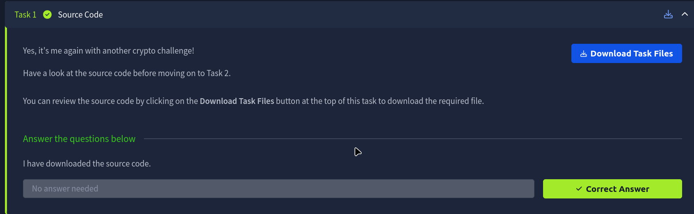
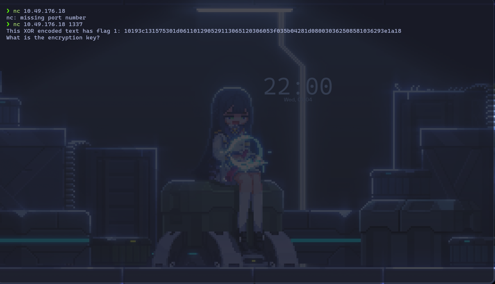
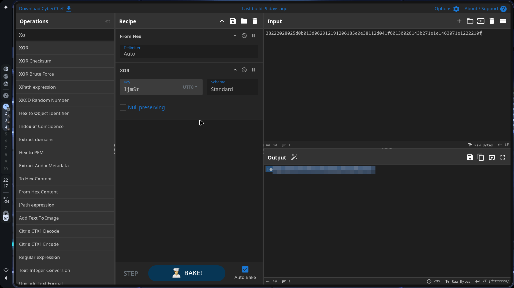
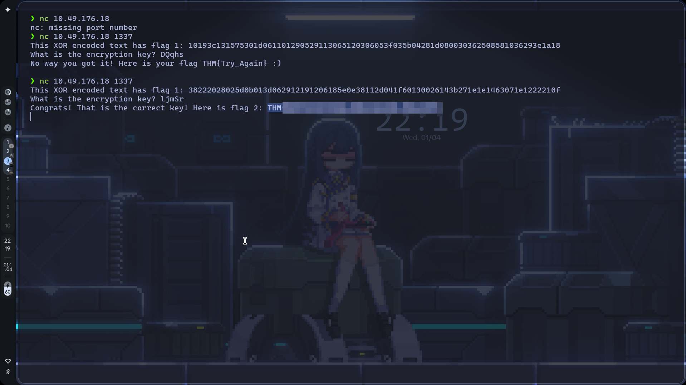
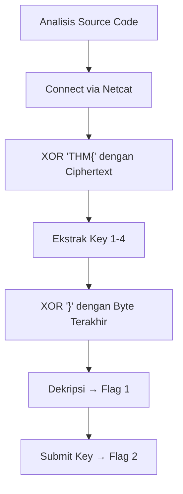

# TryHackMe: W1seGuy

- **Room Link:** [W1seGuy](https://tryhackme.com/room/w1seguy)
- **Category:** Challenge Room
- **Difficulty:** Easy
- **Tools Used:** Netcat (nc), CyberChef
- **Main Techniques:** Cryptanalysis, XOR Decryption, Known-Plaintext Attack (KPA)

---

## Attack Context

- **Kapan teknik ini dipakai?** Tahap *Credential Access* atau *Data Exfiltration* — ketika kamu menemukan data yang dienkripsi menggunakan XOR dengan key yang berulang secara statis.
- **Syarat yang dibutuhkan:** Akses ke endpoint yang menghasilkan ciphertext (misalnya via Netcat), dan sebagian plaintext yang sudah diketahui bentuk aslinya.
- **Tanda keberhasilan:** Key enkripsi berhasil diekstrak dan ciphertext berhasil didekripsi menjadi flag yang valid.

---

## Overview

Room **W1seGuy** adalah crypto challenge berbasis jaringan. Server di port tertentu mengirimkan string heksadesimal hasil enkripsi **XOR** — tapi key-nya di-generate secara acak setiap kali koneksi baru dibuka.

Karena key-nya acak, tidak ada wordlist atau database yang bisa membantu. Satu-satunya jalan adalah mengeksploitasi kelemahan mendasar algoritma XOR menggunakan teknik **Known-Plaintext Attack (KPA)**.

---

## Core Concept: Known-Plaintext Attack (KPA)

### The XOR Property

> **for your information:** **XOR (Exclusive OR)** adalah operasi logika biner yang bekerja dengan aturan: jika `A XOR B = C`, maka `C XOR A = B`. Sifat ini membuat XOR sepenuhnya reversibel — dan itulah kelemahannya.

Dalam enkripsi XOR, rumus dasarnya adalah:

```
Plaintext XOR Key = Ciphertext
```

Karena XOR bersifat reversibel, rumus ini bisa dibalik:

```
Ciphertext XOR Plaintext = Key
```

Artinya, kalau kamu sudah punya ciphertext dari server **dan** tahu sebagian isi plaintext-nya, kamu bisa menghitung key-nya secara langsung tanpa perlu brute-force seluruh kemungkinan.

### Applying KPA to This Challenge

Setiap flag TryHackMe selalu diawali dengan format `THM{` dan diakhiri dengan `}`. Dua informasi ini — **awal dan akhir plaintext** — sudah cukup untuk mengekstrak seluruh key, selama kamu tahu panjang key dan panjang ciphertext.

---

## Enumeration

### Reading the Source Code

Room ini menyediakan source code Python yang dijalankan server (via tombol **Download Task Files** di Task 1).



Bagian inti dari source code tersebut — logika enkripsi dan key generation:

```python
key = ''.join(random.choices(string.ascii_letters + string.digits, k=5))

def setup(server, key):
    flag = open("flag.txt", "r").readline()
    xored = ""

    for i in range(0, len(flag)):
        xored += chr(ord(flag[i]) ^ ord(key[i % len(key)]))

    hex_encoded = xored.encode().hex()
    server.send(hex_encoded.encode())
```

| Komponen | Fungsi |
| :--- | :--- |
| `random.choices(..., k=5)` | Mengenerate key acak sepanjang **5 karakter** dari huruf (a-z, A-Z) dan angka (0-9) |
| `flag[i]` | Karakter ke-`i` dari plaintext (flag asli) |
| `key[i % len(key)]` | Karakter key di posisi `i mod panjang_key` — operator `%` membuat key berulang dari awal jika plaintext lebih panjang dari key |
| `ord()` / `chr()` | Konversi karakter ↔ integer (ASCII) untuk operasi XOR |
| `.encode().hex()` | Mengubah hasil XOR menjadi representasi heksadesimal yang dikirim ke client |

> **for your information:** **Repeating key XOR** adalah teknik enkripsi di mana key yang lebih pendek dari plaintext diulang terus-menerus sampai seluruh plaintext tertutup. Misalnya key `ABC` mengenkripsi teks `HELLO` menjadi: `H^A`, `E^B`, `L^C`, `L^A`, `O^B`. Operator `i % len(key)` di kode inilah yang mengatur pengulangan tersebut.

Dua fakta kritis dari source code ini:

- **Panjang key = 5 karakter** (parameter `k=5`).
- Key bersifat **random per sesi** — setiap koneksi baru menghasilkan key berbeda.

### Connecting to the Server

Buka koneksi ke server target:

```bash
nc 10.49.176.18 1337
```

| Komponen | Fungsi |
| :--- | :--- |
| `nc` | Netcat, tool untuk membaca dan mengirim data melalui koneksi TCP/UDP |
| `10.49.176.18` | Alamat IP mesin target |
| `1337` | Port yang menjalankan layanan enkripsi XOR |



Server merespons dengan ciphertext hex, lalu langsung bertanya `What is the encryption key?`. Karena key digenerate ulang per sesi, ciphertext yang kamu terima **pasti berbeda** dari contoh di catatan ini, itu normal.

> **Common Mistake:** Jangan tutup koneksi Netcat ini setelah mendapat ciphertext-nya. Key digenerate ulang setiap kali koneksi baru dibuka, ciphertext dari sesi lama tidak bisa didekripsi dengan key dari sesi baru. Biarkan koneksi ini tetap terbuka di terminal, lalu kerjakan dekripsi di tab terminal yang berbeda.

---

## Exploitation

### Step 1: Extract 4 Karakter Pertama Key

Ambil 4 byte pertama (8 karakter hex) dari ciphertext yang dikirim server. Contoh dari salah satu sesi:

`38 22 20 28 ...`

Konversi 4 karakter pertama plaintext `THM{` ke nilai heksadesimal:

| Karakter | Hex |
| :--- | :--- |
| `T` | `54` |
| `H` | `48` |
| `M` | `4D` |
| `{` | `7B` |

Lakukan operasi XOR antara plaintext dan ciphertext untuk mendapatkan key (`Plaintext XOR Ciphertext = Key`):

| Plaintext (hex) | XOR | Ciphertext (hex) | Key (hex) | Key (ASCII) |
| :--- | :--- | :--- | :--- | :--- |
| `54` | XOR | `38` | `6C` | `l` |
| `48` | XOR | `22` | `6A` | `j` |
| `4D` | XOR | `20` | `6D` | `m` |
| `7B` | XOR | `28` | `53` | `S` |

Empat karakter pertama key berhasil diekstrak: `ljmS`. Karena dari source code diketahui panjang key adalah 5 karakter, satu karakter terakhir masih perlu dicari.

### Step 2: Extract Karakter Ke-5 via Closing Brace

Kita tahu flag diakhiri dengan karakter `}`. Prinsipnya sama persis dengan Step 1 — XOR byte terakhir ciphertext dengan `}` untuk mendapatkan karakter key di posisi tersebut.

Langkah-langkahnya:

1. Hitung panjang ciphertext dalam byte (jumlah karakter hex dibagi 2). Misalnya ciphertext punya panjang **40 byte**, berarti flag aslinya juga 40 karakter.
2. Tentukan posisi key yang dipakai untuk mengenkripsi karakter terakhir: `(panjang_flag - 1) % 5`. Untuk flag 40 karakter: `39 % 5 = 4` — ini adalah **index ke-4**, yaitu karakter ke-5 key. Tepat karakter yang kita cari.
3. Ambil byte terakhir dari ciphertext (misalnya `0F`), lalu XOR dengan `}` (`7D`):

```
0F XOR 7D = 72 → ASCII: 'r'
```

Karakter ke-5 key adalah `r`. Key lengkap: **`ljmSr`**.

> **Common Mistake:** Pendekatan ini gagal jika `(panjang_flag - 1) % 5` bukan `4` — artinya byte terakhir ciphertext di-XOR dengan karakter key yang sudah kamu ketahui dari Step 1, bukan karakter ke-5 yang masih dicari. Kalau itu terjadi, gunakan CyberChef: masukkan ciphertext, terapkan **From Hex** → **XOR** dengan key `ljmSa`, ganti karakter terakhir satu per satu (a-z, A-Z, 0-9) sampai output menghasilkan flag yang valid dan diakhiri `}`.

### Step 3: Decrypt the Full Ciphertext

Dengan key `ljmSr` yang sudah lengkap, dekripsi seluruh ciphertext di **CyberChef**:

1. **From Hex** — konversi input hex ke bytes
2. **XOR** — key: `ljmSr`, Scheme: `Standard`



Output menampilkan Flag 1 dalam format `THM{...}`.

### Step 4: Submit the Key to the Server

Kembali ke terminal yang masih terhubung ke server via Netcat. Ketik key `ljmSr` saat server meminta `What is the encryption key?`.



Server merespons dengan Flag 2: `THM{xxxxxxxxxxxx}`

---

## Attack Flow Summary



---

## Flags

| Flag | Value |
| :--- | :--- |
| Flag 1 | `[REDACTED]` (hasil dekripsi ciphertext via CyberChef) |
| Flag 2 | `THM{xxxxxxxxxxxx}` |

---

## Review

- **XOR bersifat reversibel** — `Ciphertext XOR Plaintext = Key`. Kalau sebagian plaintext diketahui, key bisa dihitung langsung tanpa brute-force penuh.
- **Format flag adalah known-plaintext.** Prefix `THM{` dan suffix `}` sudah cukup untuk mengekstrak seluruh 5 karakter key — selama posisi byte terakhir jatuh di index key yang belum diketahui.
- **Baca source code dulu.** Informasi kritis seperti panjang key dan mekanisme repeating XOR ada di kode — tanpa membacanya, kamu hanya menebak.
- **Jaga koneksi Netcat tetap terbuka.** Key di-generate per sesi — menutup koneksi berarti seluruh proses harus diulang dari awal dengan ciphertext baru.
