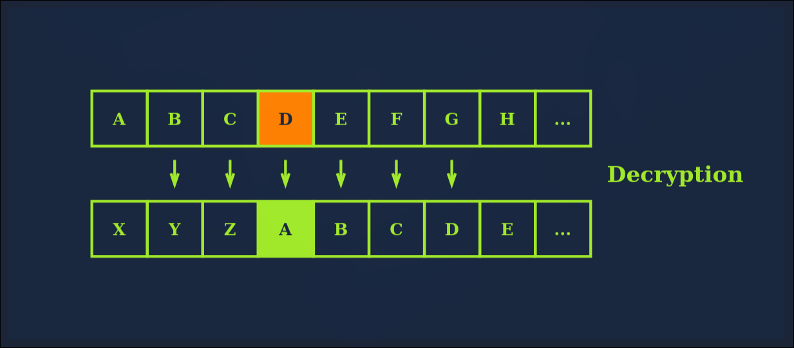

# TryHackMe: Cryptography Basic

**Room Link:** [TryHackMe](https://tryhackme.com/room/cryptographybasics)
**Category:** Cryptography / Security
**Difficulty:** Easy

## Task 1: Introduction

Room ini adalah yang pertama dari tiga room pengantar tentang cryptography, Di sini kita bakal belajar dasar-dasar yang krusial sebelum masuk ke penjelasan yang lebih kompleks

**Materi yang akana dipelajari:**

- Istilah-istilah penting dalam cryptography
- Pentingnya cryptography dalam dunia digital
- Mengenal Caesar Cipher dan algoritma historic lainnya
- Standar cipher simetris (AES, DES, 3DES)
- Cipher asimetris umum
- Matematika dasar yang sering dipake di kriptografi (XOR & Modulo)

## Task 2: Importance of Cryptography

Cryptography didefinisikan sebagai praktek dan studi tentang teknik komunikasi yang aman dan perlindungan data di mana terdapat pihak ketiga (lawan), Intinya, lawan tidak boleh sampai melihat (disclose) atau mengubah (alter) isi pesan tersebut

Kriptografi jadi vital di era digital karena menjamin tiga hal utama:

1. **Confidentiality (Kerahasiaan):** Cuma orang yang berhak yang bisa baca datanya
2. **Integrity (Integritas):** Memastikan data nggak berubah pas lagi dikirim
3. **Authenticity (Keaslian):** Memastikan kalau pengirim data emang beneran orang yang dia klaim

Selain itu, kriptografi juga dipake buat memenuhi standar regulasi internasional

**Answer the questions below:**

- **Question:** What is the standard required for handling credit card information?
- **Answer:** PCI DSS
  _(Penjelasan: PCI DSS atau Payment Card Industry Data Security Standard adalah standar keamanan wajib bagi siapa pun yang menyimpan atau memproses data kartu kredit)_

## Task 3: Plaintext to Ciphertext

Di room ini, kita belajar gimana data berubah bentuk dari yang bisa dibaca manusia "plaintext" menjadi sebuah kode rahasia "ciphertext"

**Key Value:**

- **Plaintext:** Data asli atau pesan sebelum dienkripsi. Pesan ini masih bisa dibaca oleh siapa saja (readable) misalnya teks "hello", foto pribadi, informasi penting, dll
- **Ciphertext:** Hasil dari proses enkripsi. Pesan ini kelihatan berantakan dan nggak punya arti bagi siapa pun yang nggak punya kuncinya (unreadable)
- **Encryption (Enkripsi):** Proses mengubah **Plaintext** menjadi **Ciphertext** menggunakan algoritma dan kunci tertentu
- **Decryption (Dekripsi):** Proses kebalikannya, yaitu mengubah **Ciphertext** kembali menjadi **Plaintext** agar bisa dibaca lagi
- **Key (Kunci):** Informasi yang digunakan oleh algoritma kriptografi untuk membuat proses enkripsi/dekripsi menjadi unik

**Answer the questions below:**

- **Question:** What do you call the encrypted plaintext?
- **Answer:** ???

- **Question:** What is the process of turning plaintext into ciphertext called?
- **Answer:** ???

## Task 4: Historical Cipher

Room ini membahas metode enkripsi kuno yang menjadi dasar bagi kriptografi modern. Meskipun sekarang dianggap lemah, memahami logika di baliknya sangat penting

### 1. Caesar Cipher

Ini adalah salah satu teknik paling tua dan paling simpel

- **Cara Kerja:** Melakukan pergeseran (shift) setiap huruf dalam alfabet dengan jumlah tertentu.
- **Contoh:** Dengan pergeseran 3 (Shift 3), huruf 'A' akan menjadi 'D', 'B' menjadi 'E', dan seterusnya.
- **ROT13:** Varian populer dari Caesar Cipher yang menggeser huruf sebanyak 13 posisi. Karena alfabet ada 26 huruf, menjalankan ROT13 dua kali pada pesan yang sama akan mengembalikannya ke teks asli

### 2. Vigenère Cipher

Metode ini sedikit lebih canggih karena menggunakan kata kunci (keyword) untuk menentukan jumlah pergeseran.

- **Cara Kerja:** Disebut sebagai polyalphabetic substitution karena setiap huruf dalam plaintext bisa digeser dengan jumlah yang berbeda-beda tergantung pada huruf yang sesuai pada keyword-nya.
- **Keunggulan:** Lebih sulit dipecahkan daripada Caesar Cipher karena frekuensi kemunculan hurufnya tidak berpola tetap.

### 3. Enigma Machine

Sebuah mesin enkripsi yang digunakan oleh tentara Jerman selama Perang Dunia II.

- **Cara Kerja:** Menggunakan sistem rotor yang terus berputar setiap kali tombol ditekan, sehingga satu huruf yang sama bisa berubah menjadi huruf yang berbeda berkali-kali.
- **Sejarah:** Enigma dianggap mustahil dipecahkan sampai akhirnya tim yang dipimpin oleh Alan Turing berhasil memecahkannya, yang kemudian menjadi cikal bakal komputer modern

**Answer the questions below:**

- **Question:** What is the name of the popular Caesar cipher variant used for obscuring text online?
- **Answer:** ROT13

- **Question:** Which cipher uses a keyword to decide the alphabet shift?
- **Answer:** ???

- **Question:** What was the name of the machine the Germans used in World War 2 to encrypt messages?
- **Answer:** ???

- **Question:** Knowing that XRPCTCRGNEI was encrypted using Caesar Cipher, what is the original plaintext?
- **Answer:** ???
  _(Penjelasan: bisa pake tool online buat nge-crack ini tanpa perlu ngitung manual, Coba pake [Cryptii](https://cryptii.com/pipes/caesar-cipher) atau [dCode](https://www.dcode.fr/caesar-cipher). Masukin ciphertext `XRPCTCRGNEI` dan cari pergeseran (shift) yang menghasilkan kata bermakna (dalam kasus ini, **Shift 15** ke kiri atau **Shift 11** ke kanan).)_
