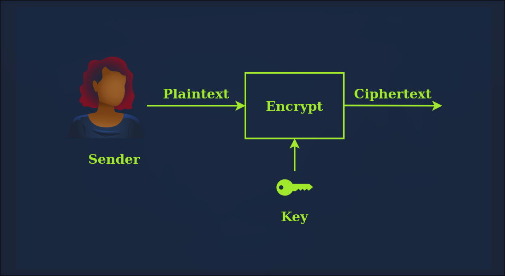
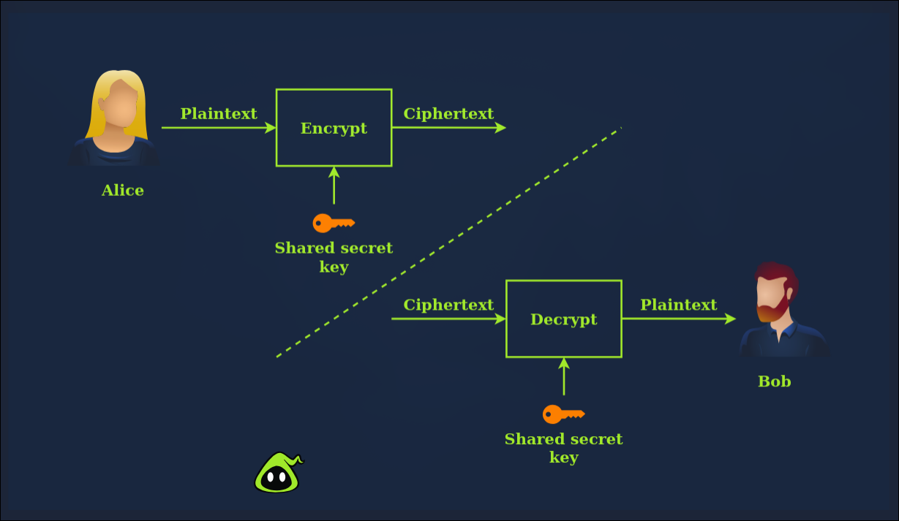
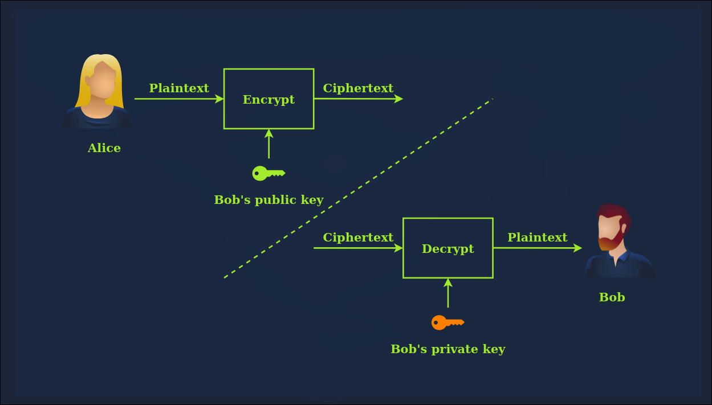

# TryHackMe: Cryptography Basic

---

- **Room Link:** [TryHackMe](https://tryhackme.com/room/cryptographybasics)
- **Category:** Cryptography / Security
- **Difficulty:** Easy

---

## Task 1: Introduction

Room ini adalah yang pertama dari tiga room pengantar tentang cryptography, Di sini kita bakal belajar dasar-dasar yang krusial sebelum masuk ke penjelasan yang lebih kompleks

**Materi yang akana dipelajari:**

- Istilah-istilah penting dalam cryptography
- Pentingnya cryptography dalam dunia digital
- Mengenal Caesar Cipher dan algoritma historic lainnya
- Standar cipher simetris (AES, DES, 3DES)
- Cipher asimetris umum
- Matematika dasar yang sering dipake di kriptografi (XOR & Modulo)

## Task 2: Importance of Cryptography

Cryptography didefinisikan sebagai praktek dan studi tentang teknik komunikasi yang aman dan perlindungan data di mana terdapat pihak ketiga (lawan), Intinya, lawan tidak boleh sampai melihat (disclose) atau mengubah (alter) isi pesan tersebut

Kriptografi jadi vital di era digital karena menjamin tiga hal utama:

1. **Confidentiality (Kerahasiaan):** Cuma orang yang berhak yang bisa baca datanya
2. **Integrity (Integritas):** Memastikan data nggak berubah pas lagi dikirim
3. **Authenticity (Keaslian):** Memastikan kalau pengirim data emang beneran orang yang dia klaim

Selain itu, kriptografi juga dipake buat memenuhi standar regulasi internasional

**Answer the questions below:**

- **Question:** What is the standard required for handling credit card information?
- **Answer:** ???

## Task 3: Plaintext to Ciphertext

Di room ini, kita belajar gimana data berubah bentuk dari yang bisa dibaca manusia "plaintext" menjadi sebuah kode rahasia "ciphertext"

**Key Value:**

- **Plaintext:** Data asli atau pesan sebelum dienkripsi. Pesan ini masih bisa dibaca oleh siapa saja (readable) misalnya teks "hello", foto pribadi, informasi penting, dll
- **Ciphertext:** Hasil dari proses enkripsi. Pesan ini kelihatan berantakan dan nggak punya arti bagi siapa pun yang nggak punya kuncinya (unreadable)
- **Encryption (Enkripsi):** Proses mengubah **Plaintext** menjadi **Ciphertext** menggunakan algoritma dan kunci tertentu
- **Decryption (Dekripsi):** Proses kebalikannya, yaitu mengubah **Ciphertext** kembali menjadi **Plaintext** agar bisa dibaca lagi
- **Key (Kunci):** Informasi yang digunakan oleh algoritma kriptografi untuk membuat proses enkripsi/dekripsi menjadi unik

**Answer the questions below:**

- **Question:** What do you call the encrypted plaintext?
- **Answer:** ???

- **Question:** What is the process of turning plaintext into ciphertext called?
- **Answer:** ???

- **Question:** What do you call the process that returns the plaintext?
- **Answer:** ???

## Task 4: Historical Cipher

Room ini membahas metode enkripsi kuno yang menjadi dasar bagi kriptografi modern. Meskipun sekarang dianggap lemah, memahami logika di baliknya sangat penting

### 1. Caesar Cipher

Ini adalah salah satu teknik paling tua dan paling simpel

- **Cara Kerja:** Melakukan pergeseran (shift) setiap huruf dalam alfabet dengan jumlah tertentu.
- **Contoh:** Dengan pergeseran 3 (Shift 3), huruf 'A' akan menjadi 'D', 'B' menjadi 'E', dan seterusnya.
- **ROT13:** Varian populer dari Caesar Cipher yang menggeser huruf sebanyak 13 posisi. Karena alfabet ada 26 huruf, menjalankan ROT13 dua kali pada pesan yang sama akan mengembalikannya ke teks asli

  
  

### 2. Vigenère Cipher

Metode ini sedikit lebih canggih karena menggunakan kata kunci (keyword) untuk menentukan jumlah pergeseran.

- **Cara Kerja:** Disebut sebagai polyalphabetic substitution karena setiap huruf dalam plaintext bisa digeser dengan jumlah yang berbeda-beda tergantung pada huruf yang sesuai pada keyword-nya.
- **Keunggulan:** Lebih sulit dipecahkan daripada Caesar Cipher karena frekuensi kemunculan hurufnya tidak berpola tetap.

### 3. Enigma Machine

Sebuah mesin enkripsi yang digunakan oleh tentara Jerman selama Perang Dunia II.

- **Cara Kerja:** Menggunakan sistem rotor yang terus berputar setiap kali tombol ditekan, sehingga satu huruf yang sama bisa berubah menjadi huruf yang berbeda berkali-kali.
- **Sejarah:** Enigma dianggap mustahil dipecahkan sampai akhirnya tim yang dipimpin oleh Alan Turing berhasil memecahkannya, yang kemudian menjadi cikal bakal komputer modern

**Answer the questions below:**

- **Question:** What is the name of the popular Caesar cipher variant used for obscuring text online?
- **Answer:** ???

- **Question:** Which cipher uses a keyword to decide the alphabet shift?
- **Answer:** ???

- **Question:** What was the name of the machine the Germans used in World War 2 to encrypt messages?
- **Answer:** ???

- **Question:** Knowing that `Xld Hzhz Apntyel dlhte` was encrypted using Caesar Cipher, what is the original plaintext?
- **Answer:** ???
  > (Penjelasan: Bisa pake tool online seperti [Cryptii](https://cryptii.com/pipes/caesar-cipher). Masukkan ciphertext `Xld Hzhz Apntyel dlhte` dan gunakan **Shift 11** ke arah kanan untuk mendapatkan teks aslinya)\_

## Task 5: Types of Encryption

Dalam cryptografi modern, terdapat dua kategori utama enkripsi: **Symmetric** (Simetris) dan **Asymmetric** (Asimetris).

### 1. Symmetric Encryption

Menggunakan **kunci yang sama** untuk proses enkripsi dan dekripsi (disebut juga _private key cryptography_).

- **Kelemahan:** Tantangan dalam mendistribusikan kunci secara aman kepada penerima.
- **Algoritma Utama:**
  - **DES (Data Encryption Standard):** Diadopsi tahun 1977, menggunakan kunci 56-bit. Sudah berhasil di-crack tahun 1999 dalam waktu kurang dari 24 jam.
  - **3DES (Triple DES):** Menjalankan DES tiga kali. Kunci 168-bit (efektivitas 112-bit). Sudah mulai ditinggalkan sejak 2019.
  - **AES (Advanced Encryption Standard):** Standar global saat ini (diadopsi tahun **2001**). Menggunakan kunci 128, 192, atau 256 bit. Sangat aman dan efisien.

### 2. Asymmetric Encryption

Menggunakan **sepasang kunci**: _Public Key_ (untuk mengenkripsi/mengunci) dan _Private Key_ (untuk mendekripsi/membuka).

- **Konsep:** Hanya pemilik _Private Key_ yang bisa membuka data yang dikunci dengan _Public Key_-nya.
- **Algoritma Utama:**
  - **RSA:** Menggunakan problem matematika faktorisasi bilangan prima besar. Rekomendasi kunci minimal 2048-bit.
  - **Diffie-Hellman:** Digunakan untuk pertukaran kunci secara aman.
  - **ECC (Elliptic Curve Cryptography):** Lebih efisien; kunci 256-bit ECC setara kekuatannya dengan RSA 3072-bit.

---

**Answer the questions below:**

- **Question:** Should you trust DES? (Yea/Nay)
- **Answer:** ?

  > (Penjelasan: Karena panjang kuncinya yang hanya 56-bit, DES sudah tidak lagi aman terhadap serangan brute force dengan komputasi modern.)\_

- **Question:** When was AES adopted as an encryption standard?
- **Answer:** ???

- **Question:** What is the name of the cipher that uses 3 keys and 3 execution stages?
- **Answer:** ???

- **Question:** Which encryption standard uses the same key to encrypt and decrypt?
- **Answer:** ???
## Task 6: Basic Math

Modern kriptografi dibangun di atas fondasi matematika. Task ini membahas dua operasi logika dan aritmatika yang paling sering muncul dalam algoritma keamanan.

### 1. XOR Operation (Exclusive OR)

XOR adalah operasi logika biner yang membandingkan dua bit.

- **Aturan Main:** Menghasilkan **1** jika kedua bit berbeda, dan **0** jika kedua bit sama.
- **Simbol:** $\oplus$ atau `^`.

**Truth Table XOR:**
| A | B | A $\oplus$ B |
| :--- | :--- | :--- |
| 0 | 0 | 0 |
| 0 | 1 | 1 |
| 1 | 0 | 1 |
| 1 | 1 | 0 |

- **Kegunaan di Kriptografi:** XOR sering digunakan sebagai algoritma enkripsi simetris sederhana. Jika kita punya Plaintext ($P$) dan Secret Key ($K$), maka Ciphertext ($C$) adalah $P \oplus K = C$. Untuk mendapatkan kembali Plaintext, cukup lakukan $C \oplus K = P$.

### 2. Modulo Operation (%)

Modulo adalah operasi untuk mencari **sisa bagi** dari sebuah pembagian.

- **Contoh:** $23 \pmod 6 = 5$ (karena 23 dibagi 6 adalah 3 dengan sisa 5).
- **Sifat Penting:** Modulo tidak dapat dibalik (_not reversible_). Jika $x \pmod 5 = 4$, nilai $x$ bisa berupa 4, 9, 14, dan seterusnya hingga tak terhingga.

---

**Answer the questions below:**

- **Question:** What's 1001 $\oplus$ 1010?
- **Answer:** ?
  _(Cara Hitung: 1$\oplus$1=0, 0$\oplus$0=0, 0$\oplus$1=1, 1$\oplus$0=1)_

- **Question:** What's 118613842 % 9091?
- **Answer:** ?
  _(Cara Hitung: Lu bisa pake Python di terminal Kitty lu: `python3 -c "print(118613842 % 9091)"`)_

- **Question:** What's 60 % 12?
- **Answer:** ?
  _(Cara Hitung: 60 habis dibagi 12, jadi sisanya adalah 0)_
