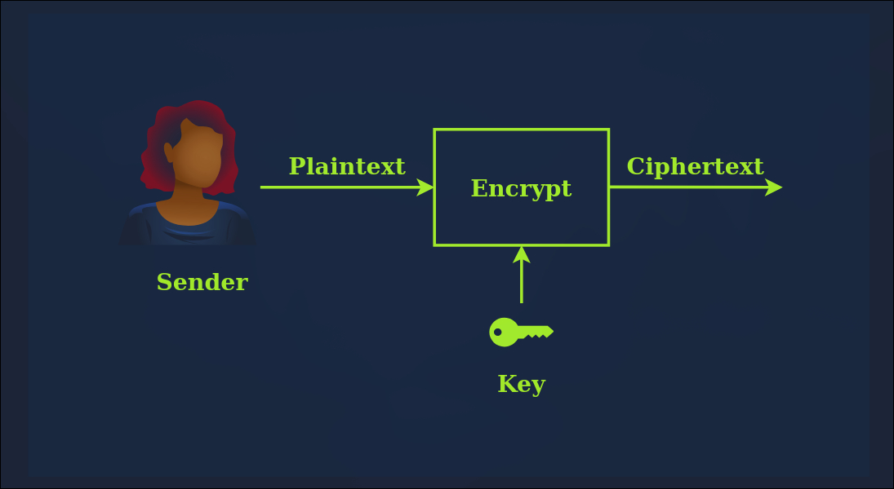
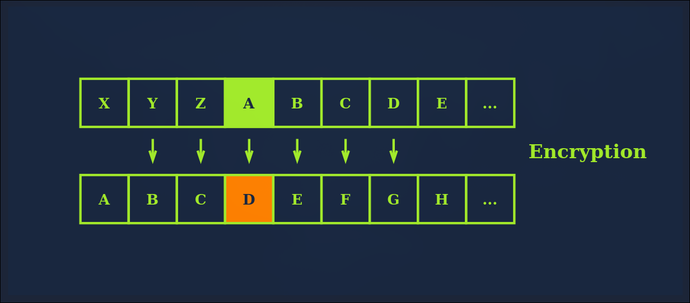
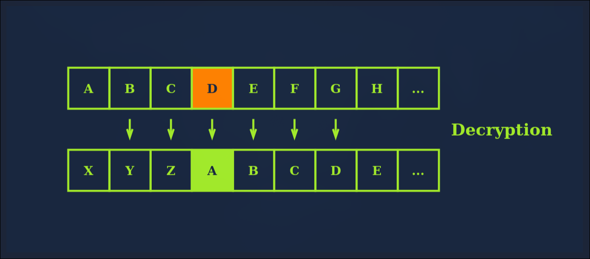
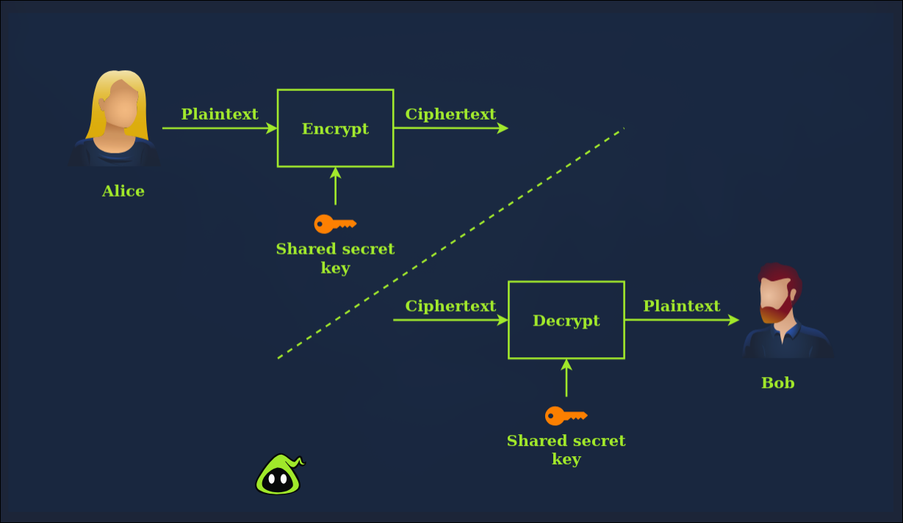
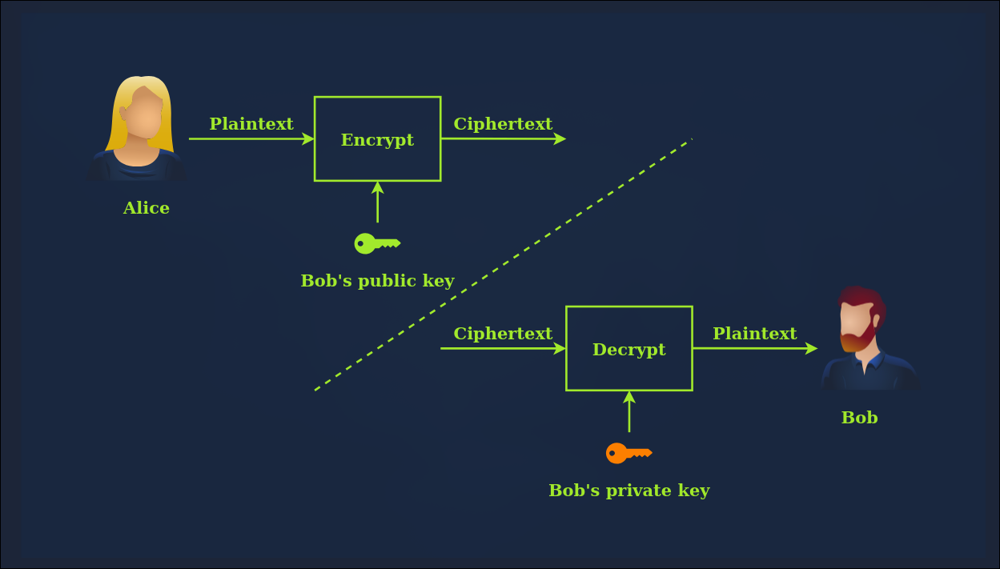

# TryHackMe: Cryptography Basic

---

* **Room Link:** [TryHackMe](https://tryhackme.com/room/cryptographybasics)
* **Category:** Cryptography / Security
* **Difficulty:** Easy

---

## Introduction

Room ini yang pertama dari tiga room pengantar tentang cryptography. Di sini kita belajar dasar-dasar yang penting sebelum masuk ke penjelasan lebih kompleks.

(Untuk pembahasan lanjutan, cek catatan [Hashing Basic](file:///home/dimm/CyberSec-Learning-Notes/THM-Notes/Cyber-Security-101/Cryptography/Hashing-basic.md) dan [Public Key Cryptography](file:///home/dimm/CyberSec-Learning-Notes/THM-Notes/Cyber-Security-101/Cryptography/Public-Key-Cryptography.md))

*(Room lanjutannya: [Hashing Basic](./Hashing-basic.md) dan [Public Key Cryptography](./Public-Key-Cryptography.md))*

---

### Importance of Cryptography

Cryptography adalah ilmu dan praktik tentang teknik komunikasi yang aman, terutama di hadapan pihak yang tidak dipercaya. Di era digital, cryptography menjadi vital karena menjamin tiga hal utama:

| Pilar | Fungsi |
| ----- | ------ |
| **Confidentiality** (Kerahasiaan) | Cuma orang yang berhak yang bisa baca datanya |
| **Integrity** (Integritas) | Memastikan data tidak berubah saat dikirim |
| **Authenticity** (Keaslian) | Memastikan pengirim data benar-benar orang yang dia klaim |

**Answer the questions below:**

* **Question:** What is the standard required for handling credit card information?
* **Answer:** **PCI-DSS** (_Payment Card Industry Data Security Standard_)

### Plaintext to Ciphertext

Data berubah bentuk dari yang bisa dibaca manusia (plaintext) jadi kode rahasia (ciphertext):

| Istilah | Definisi |
| ------- | -------- |
| **Plaintext** | Data asli sebelum dienkripsi — bisa dibaca siapa saja (teks, foto, informasi sensitif) |
| **Ciphertext** | Hasil enkripsi — terlihat berantakan dan tidak punya arti tanpa kunci |
| **Encryption** | Proses mengubah Plaintext → Ciphertext pakai algoritma dan kunci |
| **Decryption** | Proses kebalikannya: Ciphertext → Plaintext |
| **Key** | Informasi yang dipakai algoritma buat membuat enkripsi/dekripsi jadi unik |

**Answer the questions below:**

* **Question:** What do you call the encrypted plaintext?
* **Answer:** **Ciphertext**

* **Question:** What is the process of turning plaintext into ciphertext called?
* **Answer:** **Encryption**

* **Question:** What do you call the process that returns the plaintext?
* **Answer:** **Decryption**

### Historical Cipher

Metode enkripsi kuno yang menjadi dasar cryptography modern. Meskipun sekarang dianggap lemah, memahami logikanya tetap penting:

| Cipher | Cara Kerja | Kekuatan |
| ------ | ---------- | -------- |
| **Caesar Cipher** | Geser setiap huruf sejumlah posisi tetap (contoh: Shift 3 → A jadi D) | Sangat lemah — cuma 25 kemungkinan |
| **ROT13** | Varian Caesar dengan shift 13 — jalankan dua kali kembali ke teks asli | Sama lemahnya, tapi populer buat obscuring |
| **Vigenère Cipher** | Polyalphabetic substitution — setiap huruf digeser berbeda berdasarkan keyword | Lebih kuat — frekuensi huruf tidak berpola tetap |
| **Enigma Machine** | Rotor berputar setiap kali tombol ditekan — satu huruf bisa jadi huruf berbeda | Dipecahkan Alan Turing → cikal akan komputer modern |

**Answer the questions below:**

* **Question:** What is the name of the popular Caesar cipher variant used for obscuring text online?
* **Answer:** **ROT13**

* **Question:** Which cipher uses a keyword to decide the alphabet shift?
* **Answer:** **Vigenère Cipher**

* **Question:** What was the name of the machine the Germans used in World War 2 to encrypt messages?
* **Answer:** **Enigma Machine**

* **Question:** Knowing that `Xld Hzhz Apntyel dlhte` was encrypted using Caesar Cipher, what is the original plaintext?
* **Answer:** **Met Busy October ahead**
  > (Penjelasan: Bisa pakai tool online seperti [Cryptii](https://cryptii.com/pipes/caesar-cipher). Memasukkan ciphertext `Xld Hzhz Apntyel dlhte` dan pakai **Shift 11** ke arah kanan buat mendapatkan teks aslinya)\_

### Types of Encryption

Dalam kriptografi modern, ada dua kategori utama enkripsi:

#### 1. Symmetric Encryption

Menggunakan **kunci yang sama** untuk enkripsi dan dekripsi. Kelemahan utamanya: bagaimana caranya mendistribusikan kunci secara aman ke penerima.

| Algoritma | Tahun | Ukuran Kunci | Status |
| --------- | :---: | ------------ | ------ |
| **DES** | 1977 | 56-bit | Di-crack 1999 dalam <24 jam — **tidak aman** |
| **3DES** | — | 168-bit (efektif 112-bit) | Ditinggalkan sejak 2019 |
| **AES** | 2001 | 128 / 192 / 256-bit | **Standar global saat ini** — aman dan efisien |

#### 2. Asymmetric Encryption

Menggunakan **sepasang kunci**: _Public Key_ (untuk mengenkripsi) dan _Private Key_ (untuk mendekripsi). Hanya pemilik Private Key yang bisa membuka data.

*(Penjelasan lebih dalam ada di catatan [Public Key Cryptography](./Public-Key-Cryptography.md))*

| Algoritma | Basis Matematika | Rekomendasi Kunci |
| --------- | ---------------- | ----------------- |
| **RSA** | Faktorisasi bilangan prima besar | Minimal 2048-bit |
| **Diffie-Hellman** | Discrete logarithm | Buat pertukaran kunci secara aman |
| **ECC** | Elliptic curve | 256-bit ECC ≈ RSA 3072-bit (lebih efisien) |

---

**Answer the questions below:**

* **Question:** Should you trust DES? (Yea/Nay)
* **Answer:** **Nay**

  > (Penjelasan: Karena panjang kuncinya cuma 56-bit, DES sudah tidak aman lagi terhadap serangan brute force pakai komputasi modern.)\_

* **Question:** When was AES adopted as an encryption standard?
* **Answer:** **2001**

* **Question:** What is the name of the cipher that uses 3 keys and 3 execution stages?
* **Answer:** **3DES** (_Triple DES_)

* **Question:** Which encryption standard uses the same key to encrypt and decrypt?
* **Answer:** **Symmetric Encryption**
## Basic Math

Kriptografi modern dibangun di atas fondasi matematika. Task ini membahas dua operasi logika dan aritmatika yang paling sering muncul dalam algoritma keamanan.

### 1. XOR Operation (Exclusive OR)

XOR adalah operasi logika biner yang membandingkan dua bit.

* **Aturan:** Menghasilkan **1** kalau kedua bit berbeda, dan **0** kalau kedua bit sama.
* **Simbol:** $\oplus$ atau `^`.

**Truth Table XOR:**
| A | B | A $\oplus$ B |
| :--- | :--- | :--- |
| 0 | 0 | 0 |
| 0 | 1 | 1 |
| 1 | 0 | 1 |
| 1 | 1 | 0 |

* **Kegunaan di Kriptografi:** XOR sering dipakai sebagai algoritma enkripsi simetris sederhana. Kalau kamu punya Plaintext ($P$) dan Secret Key ($K$), maka Ciphertext ($C$) = $P \oplus K$. Untuk mendapatkan kembali Plaintext, tinggal hitung $C \oplus K = P$.

### 2. Modulo Operation (%)

Modulo adalah operasi untuk mencari **sisa bagi** dari sebuah pembagian.

* **Contoh:** $23 \pmod 6 = 5$ (karena 23 dibagi 6 itu 3 dengan sisa 5).
* **Sifat Penting:** Modulo tidak bisa dibalik (_not reversible_). Kalau $x \pmod 5 = 4$, nilai $x$ bisa berupa 4, 9, 14, dan seterusnya sampai tidak terhingga.

---

**Answer the questions below:**

* **Question:** What's 1001 $\oplus$ 1010?
* **Answer:** **0011**
  _(Cara Hitung: 1$\oplus$1=0, 0$\oplus$0=0, 0$\oplus$1=1, 1$\oplus$0=1)_

* **Question:** What's 118613842 % 9091?
* **Answer:** **3565**
  _(Cara Hitung: Kamu bisa pakai Python di terminal Kitty kamu: `python3 -c "print(118613842 % 9091)"`)_

* **Question:** What's 60 % 12?
* **Answer:** **0**
  _(Cara Hitung: 60 habis dibagi 12, jadi sisanya adalah 0)_
