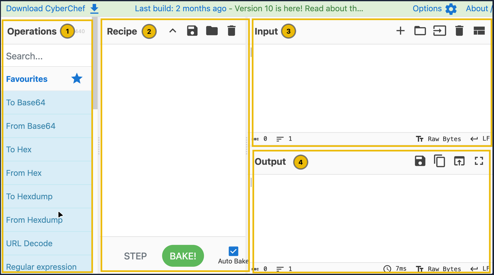

# TryHackMe: CyberChef The Basics

- **Room Link:** [CyberChef The Basics](https://tryhackme.com/room/cyberchefthebasics)
- **Category:** Defensive Security Tooling
- **Difficulty:** Easy

## Introduction

### What is CyberChef?

Bayangkan kamu punya **pisau Swiss Army** — satu alat yang punya puluhan fungsi berbeda dalam satu genggaman. Itulah CyberChef: sebuah aplikasi web yang ringan dan intuitif, dirancang khusus untuk berbagai cyber operations langsung dari browser tanpa perlu install apapun.

CyberChef bekerja dengan konsep **Recipe** — yaitu serangkaian operasi yang dijalankan secara berurutan terhadap sebuah data. cukup susun operasi-operasi yang kamu butuhkan, lalu CyberChef akan memprosesnya satu per satu secara otomatis.

Contoh operasi yang bisa dilakukan:

| Kategori | Contoh Operasi |
| -------- | -------------- |
| **Encoding sederhana** | XOR, Base64, Base85, Morse Code |
| **Kriptografi lanjutan** | AES Encryption, RSA Decryption |
| **Analisis data** | Extract IP Address, parsing teks, regex |

### Learning Objectives

kita akan mempelajari:
- Apa itu CyberChef dan bagaimana cara kerjanya.
- Cara navigasi antarmuka CyberChef.
- Operasi-operasi umum yang sering dipakai.
- Cara membuat _recipe_ dan memproses data.

---

## Accessing the Tool

Ada dua cara untuk mengakses dan menjalankan CyberChef:

### Online Access

Cara paling mudah — cukup punya **browser** dan **koneksi internet**. Langsung buka lewat link resminya:
[https://gchq.github.io/CyberChef/](https://gchq.github.io/CyberChef/)

Tidak perlu install apapun.

### Offline / Local Copy

Kalau kamu mau pakai CyberChef tanpa internet (misalnya di lab yang environtmenya terisolasi), kamu bisa download file rilis-nya dari [GitHub repository CyberChef](https://github.com/gchq/CyberChef/releases). Kompatibel dengan **Windows** dan **Linux**.

| Metode | Kebutuhan | Kapan Dipakai |
| ------ | --------- | ------------- |
| **Online** | Browser + internet | Penggunaan sehari-hari, cepat dan mudah |
| **Offline** | Download file rilis | Lab terisolasi, tanpa internet, audit yang ketat |

---

## Navigating the Interface

CyberChef terdiri dari 4 area masing-masing dengan fungsi berbeda:

1. Operations
2. Recipe
3. Input
4. Output

  

### Operations Area

**Operations Area** adalah perpustakaan lengkap semua operasi yang bisa dilakukan CyberChef. Semua operasi dikategorikan dengan rapi, dan ada fitur **search** untuk menemukan operasi tertentu dengan cepat — sangat berguna ketika kamu tahu nama operasinya tapi tidak tahu ada di kategori mana.

Berikut beberapa operasi yang sering dipakai dalam perjalanan belajar cyber security:

| Operasi | Fungsi | Contoh |
| ------- | ------ | ------ |
| **From Morse Code** | Mengubah kode Morse menjadi karakter alfanumerik (huruf kapital) | `- ... .-. . - . ...` → `THREATS` |
| **URL Encode** | Mengubah karakter URL yang punya makna khusus ke format _percent-encoding_ (format URL/URI) | `https://tryhackme.com/r/room/cyberchefbasics` → `https%3A%2F%2Ftryhackme...` |
| **To Base64** | Meng-encode data mentah ke format ASCII Base64 | `This is fun!` → `VGhpcyBpcyBmdW4h` |
| **To Hex** | Mengubah string menjadi representasi heksadesimal | `This Hex conversion is awesome!` → `54 68 69 73 20 48 65 78...` |
| **To Decimal** | Mengubah data menjadi array bilangan bulat desimal | `This Decimal conversion is awesome!` → `84 104 105 115 32...` |
| **ROT13** | Caesar cipher sederhana yang menggeser karakter alfabet sebesar 13 posisi | `Digital Forensics and Incident Response` → `Qvtvgny Sberafvpf naq Vapvqrag Erfcbafr` |

---
