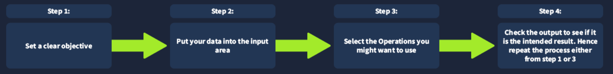

# TryHackMe: CyberChef The Basics

- **Room Link:** [CyberChef The Basics](https://tryhackme.com/room/cyberchefthebasics)
- **Category:** Defensive Security Tooling
- **Difficulty:** Easy

## Introduction

### What is CyberChef?

Bayangkan kamu punya **pisau Swiss Army** — satu alat yang punya puluhan fungsi berbeda dalam satu genggaman. Itulah CyberChef: sebuah aplikasi web yang ringan dan intuitif, dirancang khusus untuk berbagai cyber operations langsung dari browser tanpa perlu install apapun.

CyberChef bekerja dengan konsep **Recipe** — yaitu serangkaian operasi yang dijalankan secara berurutan terhadap sebuah data. cukup susun operasi-operasi yang kamu butuhkan, lalu CyberChef akan memprosesnya satu per satu secara otomatis.

Contoh operasi yang bisa dilakukan:

| Kategori | Contoh Operasi |
| -------- | -------------- |
| **Encoding sederhana** | XOR, Base64, Base85, Morse Code |
| **Kriptografi lanjutan** | AES Encryption, RSA Decryption |
| **Analisis data** | Extract IP Address, parsing teks, regex |

### Learning Objectives

kita akan mempelajari:
- Apa itu CyberChef dan bagaimana cara kerjanya.
- Cara navigasi antarmuka CyberChef.
- Operasi-operasi umum yang sering dipakai.
- Cara membuat _recipe_ dan memproses data.

---

## Accessing the Tool

Ada dua cara untuk mengakses dan menjalankan CyberChef:

### Online Access

Cara paling mudah — cukup punya **browser** dan **koneksi internet**. Langsung buka lewat link resminya:
[https://gchq.github.io/CyberChef/](https://gchq.github.io/CyberChef/)

Tidak perlu install apapun.

### Offline / Local Copy

Kalau kamu mau pakai CyberChef tanpa internet (misalnya di lab yang environtmenya terisolasi), kamu bisa download file rilis-nya dari [GitHub repository CyberChef](https://github.com/gchq/CyberChef/releases). Kompatibel dengan **Windows** dan **Linux**.

| Metode | Kebutuhan | Kapan Dipakai |
| ------ | --------- | ------------- |
| **Online** | Browser + internet | Penggunaan sehari-hari, cepat dan mudah |
| **Offline** | Download file rilis | Lab terisolasi, tanpa internet, audit yang ketat |

---

## Navigating the Interface

CyberChef terdiri dari 4 area masing-masing dengan fungsi berbeda:

1. Operations
2. Recipe
3. Input
4. Output

  

### Operations Area

**Operations Area** adalah perpustakaan lengkap semua operasi yang bisa dilakukan CyberChef. Semua operasi dikategorikan dengan rapi, dan ada fitur **search** untuk menemukan operasi tertentu dengan cepat — sangat berguna ketika kamu tahu nama operasinya tapi tidak tahu ada di kategori mana.

Berikut beberapa operasi yang sering dipakai dalam perjalanan belajar cyber security:

| Operasi | Fungsi | Contoh |
| ------- | ------ | ------ |
| **From Morse Code** | Mengubah kode Morse menjadi karakter alfanumerik (huruf kapital) | `- ... .-. . - . ...` → `THREATS` |
| **URL Encode** | Mengubah karakter URL yang punya makna khusus ke format _percent-encoding_ (format URL/URI) | `https://tryhackme.com/r/room/cyberchefbasics` → `https%3A%2F%2Ftryhackme...` |
| **To Base64** | Meng-encode data mentah ke format ASCII Base64 | `This is fun!` → `VGhpcyBpcyBmdW4h` |
| **To Hex** | Mengubah string menjadi representasi heksadesimal | `This Hex conversion is awesome!` → `54 68 69 73 20 48 65 78...` |
| **To Decimal** | Mengubah data menjadi array bilangan bulat desimal | `This Decimal conversion is awesome!` → `84 104 105 115 32...` |
| **ROT13** | Caesar cipher sederhana yang menggeser karakter alfabet sebesar 13 posisi | `Digital Forensics and Incident Response` → `Qvtvgny Sberafvpf naq Vapvqrag Erfcbafr` |

---

Jika kita mengarahkan kursor ke operasi tertentu, akan muncul tooltip yang memberikan informasi lebih detail tentang operasi tersebut.

### Recipe Area

**Recipe Area** adalah **jantung dari CyberChef**. Di sinilah kamu:
- Memilih dan menyusun operasi-operasi yang ingin dijalankan
- Mengatur urutan eksekusinya (operasi dijalankan dari atas ke bawah)
- Menyetel argumen dan opsi tiap operasi

Juga bisa **drag & drop** operasi dari Operations Area langsung ke Recipe Area.

Fitur-fitur yang tersedia di Recipe Area:

| Tombol | Fungsi |
| ------ | ------ |
| `Save recipe` | Menyimpan susunan operasi yang sudah dibuat |
| `Load recipe` | Memuat recipe yang pernah disimpan sebelumnya |
| `Clear Recipe` | Menghapus semua operasi dari recipe saat ini |

Di bagian bawah Recipe Area terdapat dua kontrol penting:
- **`BAKE!`** — Tombol untuk memproses data dengan recipe yang sudah disusun.
- **`Auto Bake`** _(checkbox)_ — Kalau dicentang, CyberChef akan otomatis memproses ulang setiap kali ada perubahan tanpa perlu klik `BAKE!` setiap saat.

---

### Input Area

**Input Area** adalah tempat kamu memasukkan data yang ingin diproses — bisa dengan cara:
- **Mengetik** langsung
- **Paste** dari clipboard
- **Drag & drop** file ke area ini

Fitur-fitur tambahan di Input Area:

| Fitur | Fungsi |
| ----- | ------ |
| `Add a new input tab` | Membuat tab input baru untuk menggunakan nilai yang berbeda dari tab sebelumnya |
| `Open folder as input` | Upload seluruh folder sebagai input sekaligus |
| `Open file as input` | Upload satu file sebagai input |
| `Clear input and output` | Menghapus semua nilai input dan output yang ada |
| `Reset pane layout` | Mengembalikan tampilan antarmuka ke ukuran _default_ |

### Output Area

**Output Area** adalah tempat CyberChef menampilkan **hasil pemrosesan** data kamu setelah di-_bake_. Hasilnya ditampilkan secara jelas dan mudah dibaca.

Fitur-fitur yang tersedia:

| Fitur | Fungsi |
| ----- | ------ |
| `Save output to file` | Menyimpan hasil output ke file `.dat` |
| `Copy raw output to the clipboard` | Menyalin output mentah langsung ke clipboard untuk dipakai di aplikasi atau dokumen lain |
| `Replace input with output` | Menimpa nilai input dengan hasil output saat ini (berguna untuk chaining operasi secara manual) |
| `Maximise output pane` | Memperbesar panel output ke ukuran _default_ |

---

## Before Anything Else

Sebelum memakai CyberChef, penting untuk punya **mental model** yang jelas. Ada 4 langkah berpikir yang harus diikuti setiap kali menggunakan CyberChef:

  

### Penjelasan Tiap Langkah

**Step 1 — Tentukan tujuan yang jelas:**
Sebelum melakukan apapun, jawab dulu pertanyaan: **"Apa yang ingin aku capai?"**
Tujuan yang spesifik memberi arah dan fokus. Contoh: _"Saat investigasi keamanan, aku menemukan string aneh — aku ingin tahu pesan tersembunyi di baliknya, kalau ada."_

**Step 2 — Masukkan data ke Input Area:**
Paste atau upload data yang ingin diproses. Di contoh di atas, paste atau upload string aneh yang kamu temukan.

**Step 3 — Pilih operasi yang relevan:**
Ini bagian yang membutuhkan sedikit riset jika kamu belum familiar. Dari contoh di atas, setelah diteliti, string tersebut kemungkinan menggunakan enkripsi/encoding. Maka coba operasi-operasi dari kategori **Encryption/Encoding** seperti `ROT13`, `Base64`, `Base85`, atau `ROT47`.

**Step 4 — Cek output:**
Tanyakan: **"Apakah hasilnya sesuai tujuan?"**
- **Ya** → Selesai
- **Tidak** → Ulangi dari Step 1 (redefinisi tujuan) atau Step 3 (coba operasi lain)

### Contoh Nyata

| Step | Aksi |
| ---- | ---- |
| 1 | Menemukan string aneh saat investigasi → ingin tahu isinya |
| 2 | Paste string aneh ke Input Area |
| 3 | Coba operasi `ROT13`, `Base64`, `Base85`, `ROT47` |
| 4 | Cek output — apakah muncul pesan yang masuk akal? |

---
