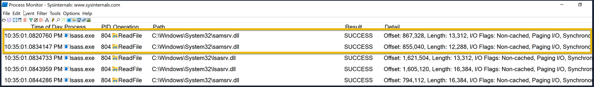
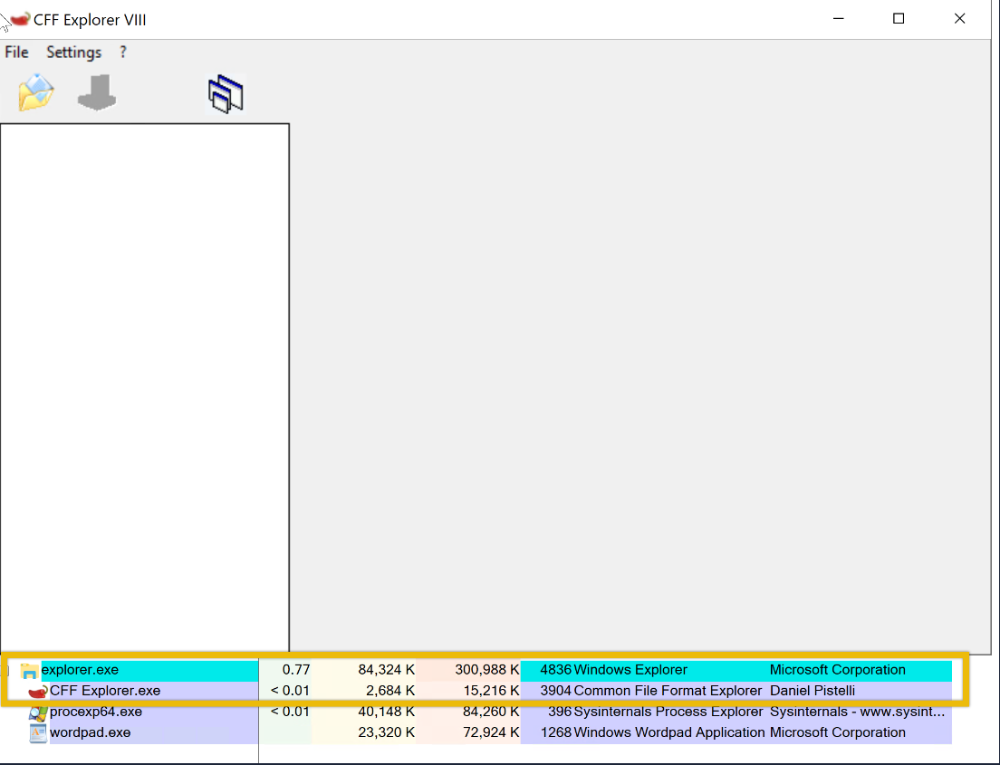
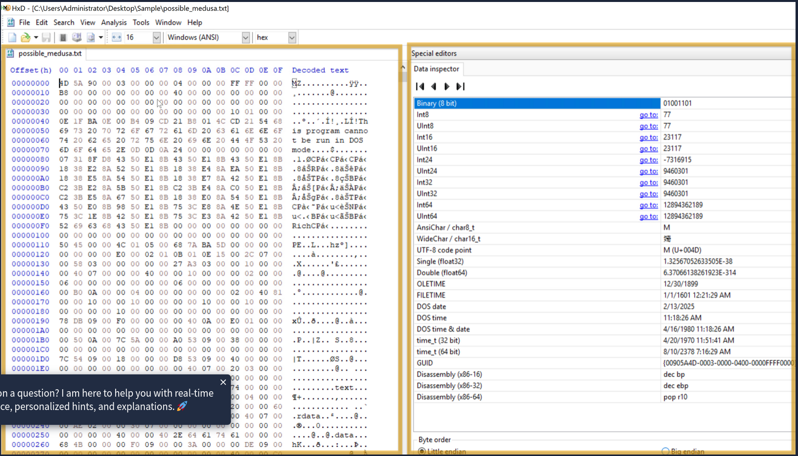
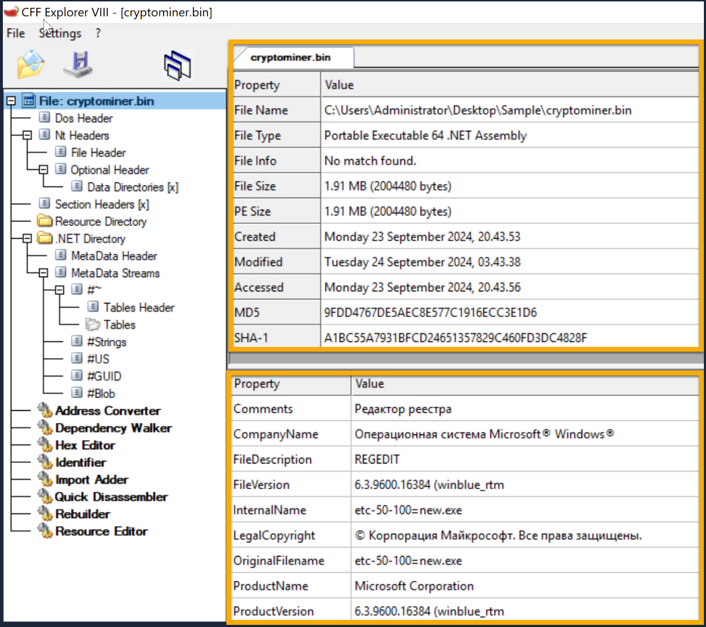
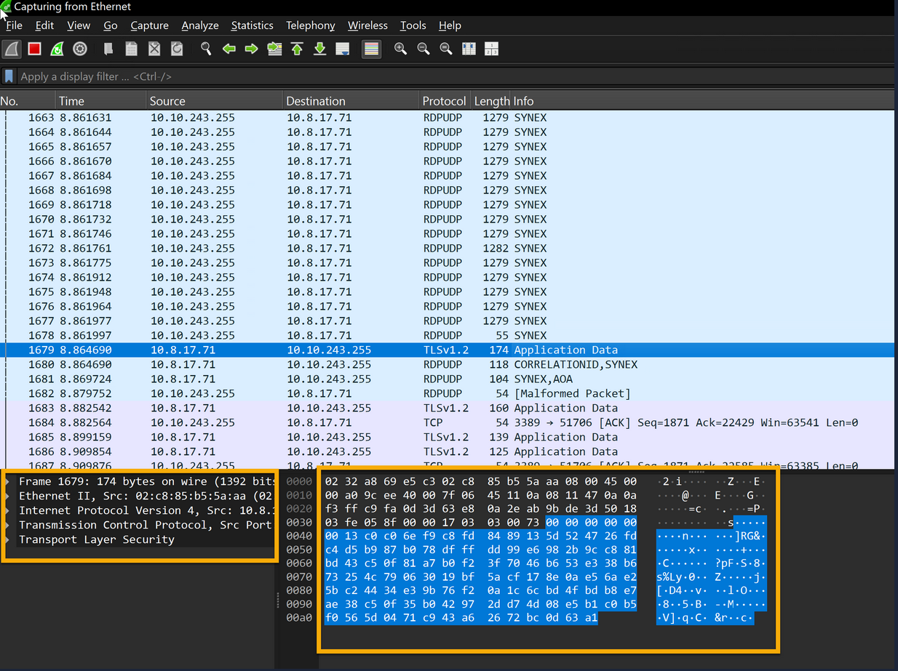
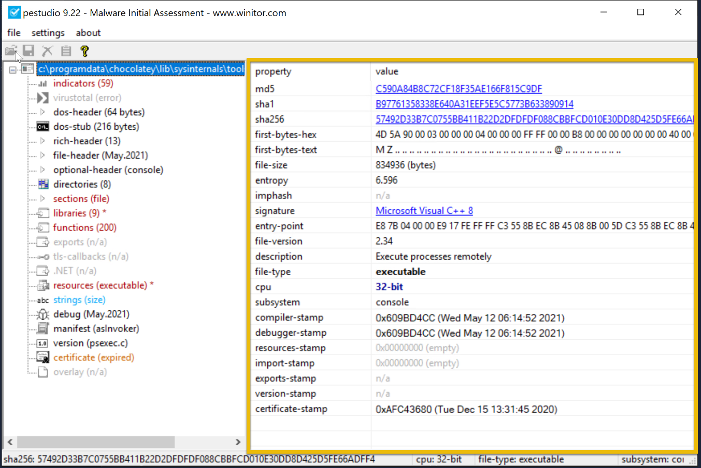

# TryHackMe: FlareVM Arsenal of Tools

* **Room Link:** [FlareVM Arsenal of Tools](https://tryhackme.com/room/flarevmarsenaloftools)
* **Category:** Defensive Security Tooling
* **Difficulty:** Easy

## Introduction

Kalau di materi sebelumnya kita sudah bahas **REMnux** sebagai meja operasi *malware* berbasis Linux, sekarang saatnya kita kenalan sama saudara kandungnya di dunia Windows: **FlareVM**.

**FlareVM** (singkatan dari *Forensics, Logic Analysis, and Reverse Engineering*) adalah seperangkat kotak perkakas khusus rakitan tim FLARE dari **FireEye**. Isinya sudah dipenuhi ratusan program spesialis yang murni diciptakan untuk membantu _reverse engineers_, analis _malware_, dan investigator forensik. Ibaratnya, kalau kamu mau menguliti sistem Windows atau membongkar wujud asli (_reverse engineer_) dari sebuah virus `.exe`, ini VM andalan.

### Learning Objectives

* Mengenal dan mengeksplorasi isi kotak perkakas di dalam FlareVM.
* Praktik langsung pakai berbagai *tools* bawaannya untuk menganalisis proses/*process* mencurigakan di memori.
* Familiar sama *tools* yang biasa dipakai buat investigasi statis (*static analysis*) dokumen jahat atau *file* biner (*binaries*).

---

## Arsenal of Tools (Persenjataan FlareVM)

Di dalam FlareVM, _tools_-nya dikelompokkan berdasarkan fungsinya agar kamu lebih mudah mencarinya saat menangani kasus.

### 1. Reverse Engineering & Debugging
*Reverse engineering* itu ibarat kamu membongkar sebuah mesin atau barang elektronik (seperti jam mekanik atau radio) yang sudah jadi pabrikan. Tujuannya murni untuk mencari tahu komponen apa saja yang ada di dalamnya dan bagaimana cara alat itu bekerja. Sedangkan *debugging* adalah proses saat alat itu rusak, lalu kamu menganalisis bagian mana yang macet dan mencoba memperbaikinya.

Senjata andalan di kategori ini:
* **Ghidra**: *Software reverse engineering* high class yang dirilis gratis oleh NSA (Badan Intelijen Amerika).
* **x64dbg**: *Debugger* *open-source* favorit untuk membedah *file binaries* format 32-bit maupun 64-bit.
* **OllyDbg**: *Debugger* klasik yang sangat handal membedah instruksi program sampai ke level bahasa *Assembly* (bahasa mesin tingkat rendah).
* **Radare2**: *Platform reverse engineering open-source* berbasis teks yang sangat ringan dan bertenaga.
* **Binary Ninja**: *Tool* visual yang rapi untuk membantu membedah (*disassembling*) dan menyusun ulang (*decompiling*) kode biner.
* **PEiD**: Alat pendeteksi untuk mencari tahu apakah sebuah program itu dibungkus pakai pelindung kode (*packer*, *cryptor*) atau dicetak pakai perangkat lunak pembuat aplikasi (*compiler*) jenis apa.

### 2. Disassemblers & Decompilers
Dua jenis *tools* ini sangat penting dalam analisis *malware*. Tugas utamanya ibarat **Penerjemah Bahasa**, komputer berkomunikasi menggunakan angka dan bahasa mesin yang tidak bisa dibaca manusia biasa. Alat ini bertugas menerjemahkan surat rahasia tersebut ke dalam format logika (seperti kode *C++* atau *Assembly*) yang lebih mudah dipahami oleh analis.

Alat yang sering dipakai:
* **CFF Explorer**: Editor khusus (*PE editor*) untuk menganalisis dan membongkar struktur *file* berformat *Portable Executable* (khas Windows seperti `.exe` atau `.dll`).
* **Hopper Disassembler**: Paket komplit yang bisa merangkap jadi *debugger*, *disassembler*, sekaligus *decompiler*.
* **RetDec**: *Decompiler open-source* tangguh buat menerjemahkan kembali bahasa mesin agar lebih gampang dibaca.

### 3. Static & Dynamic Analysis
Ada dua metode utama dalam menginvestigasi sebuah *malware*. Ibarat pos satpam yang sedang memeriksa paket kotak mencurigakan:
> : **Static Analysis:** Membedah wujud fisik, tulisan pengirim, dan isi kotak tersebut menggunakan alat *X-Ray* **tanpa** membuka kotaknya secara langsung (metode aman).
> : **Dynamic Analysis:** Mengambil paket tersebut, memasukkannya ke dalam ruangan isolasi tebal (*sandbox*), lalu sengaja **membuka dan memicunya** untuk melihat efek apa yang terjadi pada ruangan tersebut (metode tes langsung).

Alat pemantau andalannya:
* **Process Hacker**: Versi Task Manager yang super canggih. Sangat informatif untuk memantau program apa saja yang sedang berjalan (*process watcher*) dan melihat penggunaan memori sistem.
* **PEview**: Alat ringan untuk mengintip isi dari komponen pembangun *file* `.exe` (berjenis PE).
* **Dependency Walker**: Alat yang digunakan untuk melihat daftar *file library* pendukung (DLL bawaan Windows) apa saja yang diam-diam "dipanggil" dan dibutuhkan oleh suatu aplikasi.
* **DIE (Detect It Easy)**: Alat serbaguna untuk mendeteksi apakah suatu *file* dilindungi oleh pengunci (*packer*, *cryptor*) dan alat pembuat (*compiler*) tertentu.

### 4. Forensics & Incident Response
Kategori ini ibarat tim forensik polisi (*CSI*) yang turun ke tempat kejadian perkara (TKP). *Digital Forensics* bertugas mengumpulkan, menganalisis, dan mengamankan barang bukti (dari *harddisk*, jaringan, sampai rekaman RAM memori). Sementara *Incident Response* fokus pada pertolongan pertama: mendeteksi, mengisolasi, membasmi ancaman pencuri (*hacker/malware*), dan memulihkan sistem yang rusak.

Alat spesialis forensik:
* **Volatility**: *Framework* wajib untuk menganalisis dan membongkar barang bukti berupa rekaman memori (*RAM dump*).
* **Rekall**: *Framework* alternatif untuk forensik memori, biasanya sangat berguna saat tim sedang melakukan respon insiden.
* **FTK Imager**: Alat standar industri forensik untuk mengkloning (membuat *image*) isi *harddisk* mentah-mentah secara aman untuk dianalisis.

### 5. Network Analysis
Ini dia alat penyadap jaringannya analis cyber. Ibarat memasang CCTV dan alat penyadap telepon di seluruh rumah, alat-alat ini membantu kamu memeriksa aliran pola data yang keluar-masuk di kabel jaringan.

Alat pemantau jaringan:
* **Wireshark**: Mikroskop jaringan paling populer di dunia. Bisa merekam dan membedah percakapan data (protokol) antar komputer secara *live*.
* **Nmap**: Pemindai jaringan legendaris pemetaan komputer dan mencari tahu pintu (*port*) mana saja yang terbuka dan rentan diserang.
* **Netcat**: Tool Swiss Army Knife dunia jaringan. Bisa dipakai untuk membaca dan menulis data kosong ke dalam koneksi jaringan, sangat berguna untuk tes sederhana.

### 6. File Analysis
Ibarat meneliti sidik jari dan komposisi kimiawi darah di lab, teknik ini murni digunakan untuk meneliti susunan komponen sebuah *file* dari dasar untuk mencari bibit ancaman keamanan di dalamnya.

Alat bedah *file*:
* **FileInsight**: Program spesialis untuk membaca dan mengedit *file* biner (kumpulan angka bahasa komputer).
* **Hex Fiend**: *Hex editor* (editor yang menampilkan angka dasar heksadesimal komputer) yang sangat ringan dan cepat.
* **HxD**: *Hex editor* andalan sejuta umat untuk melihat dan mengedit bahasa mentah biner dari sebuah *file*.

### 7. Scripting & Automation
Analisis manual itu capek dan rentan salah (karena *human error*). Kategori ini ibarat kamu membuat lengan robot pabrik untuk menjalankan tugas-tugas receh dan berulang secara otomatis, sehingga kinerja analis jadi jauh lebih cepat.

Alat otomasi andalan:
* **Python**: Bahasa pemrograman favorit analis keamanan. Fokus utamanya dipakai untuk menjalankan modul dan tools otomatis.
* **PowerShell Empire**: Kerangka kerja (*framework*) berbasis PowerShell yang biasa dipakai *hacker*/*tester* untuk aktivitas setelah penyusupan (mempertahankan akses ke komputer korban).

### 8. Sysinternals Suite
Ini adalah kumpulan perkakas khusus sistem operasi Windows. Alat-alat ini dirancang spesifik untuk membantu tenaga profesional IT dan developer mengelola, memperbaiki masalah (_troubleshoot_), dan mendiagnosa masalah di dalam Windows.

Tiga serangkai utamanya:
* **Autoruns**: Alat intelijen untuk mencari tahu program _executables_ apa saja yang diam-diam dijalankan secara otomatis ketika komputer pertama kali menyala (_boot-up_). Sangat vital untuk mencari _malware_ yang bersarang di sistem.
* **Process Explorer**: _Task Manager_ yang super detail menyangkut proses-proses yang sedang berjalan di komputermu.
* **Process Monitor**: Kamera pengawas _real-time_ — mencatat setiap pergerakan dari seluruh proses dan _thread_ yang aktif di sistem tanpa ada yang lolos.

---

> **Bingung melihat daftarnya?**  
> Santai saja. Kamu **tidak perlu** menghafal dan menguasai semua alat ini dalam semalam. Tujuannya di sini hanya untuk mengenalkan bahwa: _"Ada satu kotak berisi lengkap perkakas, jadi kamu tahu alat mana yang pas saat membutuhkan tugas spesifik nanti."_

## Commonly Used Tools for Investigation: Overview

Dari sekian banyak *tools* yang dibahas sebelumnya, cuma segelintir saja yang akan sering banget kamu pakai untuk investigasi tahap awal. Anggap ini adalah paket "P3K Utama" atau *starter pack* seorang analis.

Berikut beberapa tools yang sering digunakan untuk investigasi beserta fungsinya:

| Nama Tool | Nilai Investigasi (*Investigative Value*) |
| :--- | :--- |
| **Procmon** (*Process Monitor*) | Ahlinya melacak seluruh aktivitas sistem secara detail. Sangat handal untuk riset _malware_, _troubleshooting_ PC yang rusak, sampai mencari barang bukti digital (_forensic investigations_). |
| **Process Explorer** | Alat untuk melihat silsilah keluarga sebuah program (*Parent-child relationship*). Jadi ketahuan program mana yang melahirkan proses jahat tersebut, lengkap dengan lokasi *file library* (DLL) yang dimuat. |
| **HxD** | *Hex editor* andalan untuk memeriksa sampai mengedit struktur dasar sebuah *file* dari balik layar (level bahasa biner/heksadesimal). |
| **Wireshark** | Bertugas mengobservasi pergerakan data di kabel jaringan untuk mencari aktivitas komunikasi yang mencurigakan (_unusual activity_). |
| **CFF Explorer** | Sering dipakai untuk mengekstrak sidik jari digital (*file hashes*) demi mengecek integritas file, serta memastikan apakah sebuah file bawaan sistem itu asli atau sudah disusupi. |
| **PEStudio** | *Tool* spesialis untuk urusan *Static Analysis*. Kamu bisa menguliti properti dan sifat-sifat mencurigakan dari sebuah aplikasi **tanpa harus** menjalankannya sama sekali (main aman). |
| **FLOSS** | Ahli pemeras teks. Dia bertugas mengekstrak dan memperjelas teks/kata-kata rahasia (*strings*) yang sengaja disamarkan (*obfuscated*) di dalam program jahat menggunakan teknik *static analysis* tingkat lanjut. |

> Tips: Kamu bisa membuka _tools_-nya satu-satu di dalam **FlareVM** agar terbiasa dengan _interface_ aslinya saat kita bahas cara kerjanya lebih dalam nanti.

### 1. Process Monitor (Procmon)

**Procmon** adalah alat super canggih bawaan Windows. Bayangkan **Procmon** sebagai **Dashcam Kamera Pelacak** beresolusi tinggi yang terpasang langsung pada sistem operasi komputer kamu.

Tugas utamanya adalah membiarkan kamu **melihat, merekam, dan melacak** semua aktivitas *file* Windows secara *real-time*. Dia terus-menerus memantau dan mencatat tiga area vital:
1. Pergerakan *File System* (buka/tutup/edit *file*).
2. Perubahan *Registry* (buku catatan inti Windows).
3. Aktivitas *Thread/Process* (naik-turunnya program yang hidup).

Karena kemampuannya yang sangat detail, *tool* ini menjadi andalan untuk riset *malware*, *troubleshooting* aplikasi, hingga investigasi forensik digital.

**Contoh Investigasi Menggunakan Procmon:**

Mari kita lihat gambar layar dari hasil rekaman Procmon di bawah ini:



Berdasarkan baris rekaman tersebut, terlihat bahwa ada proses bernama `lsass.exe` yang sukses membaca *file* penting bernama `samsrv.dll` secara berulang kali.

**Apa itu LSASS?**
**LSASS** (*Local Security Authority Subsystem Service*) adalah pos satpam utama di Windows yang mengurus urusan autentikasi (pemeriksaan identitas dan *password* pengguna saat *login*). Karena dia memegang kunci, aplikasi wajar ini akan sering berkomunikasi dengan *file* sistem krusial lainnya (seperti `lsasrv.dll`).

**Lalu, di mana letak bahayanya?**
Meski `lsass.exe` adalah aplikasi resmi bawaan Windows, dia sering **dijadikan target vulnerability**. *Hacker* sangat suka menggunakan *tool* jahat seperti **Mimikatz** untuk menyerang dan menyedot memori LSASS demi mencuri *password* yang ada di sana (teknik ini disebut *Credential Dumping*).

**Mental Model Analis:**
Jadi, saat kamu melihat layar Procmon, insting utamamu adalah mencari **anomali (keganjilan)**. Jika kamu melihat aktivitas yang mencurigakan di sekitar proses LSASS misalnya ada program asing yang tiba-tiba membaca atau mencoba menulis data ke dalam memori `lsass.exe` itu adalah sinyal bahaya (bendera merah) yang harus segera kamu investigasi lebih dalam

*(Tenang saja, contoh gambar di atas hanyalah aktivitas sistem normal, tidak ada tanda-tanda infeksi malware).*

### 2. Process Explorer (Procexp)

**Process Explorer** adalah jenis alat yang memberikan analisis mendalam tentang semua program yang sedang aktif di komputermu. Kalau Procmon tadi adalah CCTV yang merekam aktivitas gerakan, maka **Process Explorer** adalah **Buku Induk Kependudukan** dan **Pohon Silsilah Keluarga** dari proses komputer.

Alat ini memungkinkanmu untuk:
* Melihat daftar lengkap program yang aktif beserta akun pengguna (*user accounts*) yang menjalankannya.
* Mencari tahu program mana yang saat ini sedang mengakses, membuka, atau mengunci sebuah *file* atau folder tertentu.
* Memeriksa asal-usul atau silsilah keluarga dari sebuah program (hubungan *parent-child*).

**Contoh Investigasi Menggunakan Process Explorer:**

Perhatikan gambar di bawah ini saat kita membuka aplikasi CFF Explorer:



Dari gambar di bawah ini, kamu bisa melihat **Silsilah Keluarga** (*Parent-child relationship*) dari prosesnya:
* `explorer.exe` (Wujud antarmuka layar *desktop* Windows) bertindak sebagai aplikasi **Induk** (*Parent*).
* Induk ini berada di tingkat atas, dan di bawahnya muncul sebuah cabang baru berisikan `CFF Explorer.exe` yang bertindak sebagai aplikasi **Anak** (*Child*).

Ini membuktikan bahwa aplikasi CFF Explorer tadi secara sah dibuka melalui layar *desktop* biasa oleh sang pengguna.

**Lalu, kenapa Silsilah Keluarga (*Parent-Process*) ini penting?**
Teknik ini sangat berguna untuk memantau apakah ada proses aneh yang mendadak dimunculkan **(spawned)** dari aplikasi yang tidak seharusnya. Pelaku kejahatan cyber (*threat actors*) sangat sering menyalahgunakan dokumen kantoran (seperti Word Document, *file* LNK, atau ISO) untuk menyebarkan ancaman.

**Mental Model Analis:**
Ketika kamu curiga, lihat *parent process*-nya Sebagai contoh, sangatlah wajar jika aplikasi *Microsoft Word* (*Parent*) membuka dokumen teks (*Child*). Tapi akan menjadi **sangat tidak wajar dan berbahaya** jika *Microsoft Word* (*Parent*) tiba-tiba secara diam-diam membuka aplikasi *Command Prompt* atau *PowerShell* (*Child*) di belakang layar. Itulah fungsi utama Process Explorer: melacak asal-usul lahirnya sebuah program jahat

### 3. HxD (Hex Editor)

Kalau *Process Explorer* tadi mengurus program yang lagi hidup, **HxD** adalah spesialis operasi bedah untuk *file* yang mati. Alat ini disebut *Hex Editor*, yang fungsinya ibarat **Mikroskop DNA**. Ia sanggup membedah struktur paling dasar penyusun sebuah *file* hingga ke level bongkahan angka primitif (*hexadecimal*). 

Dengan HxD, kamu bisa membaca, mencari, memulihkan, hingga memodifikasi data mentah biner secara sangat presisi.

**Contoh Investigasi Menggunakan HxD:**

Anggap saja analis kita menemukan *file* teks mencurigakan bernama `possible_medusa.txt`. Pas dibuka pakai *Notepad* biasa, bentuknya pasti cuma deretan huruf acak yang tidak bisa dibaca. Nah, lewat HxD, wujud aslinya akan ketahuan.



Cara membaca *interface* HxD di atas:
* Ruangan sebelah **Kiri** menampilkan susunan kode DNA mentah dari *file* (kumpulan angka/huruf *Hexadecimal*).
* Ruangan sebelah **Tengah** mencoba menerjemahkan angka-angka DNA tadi menjadi bentuk teks *ASCII* (tulisan manusia) sebisanya.
* Ruangan sebelah **Kanan** adalah panel **Data Inspector**. Panel ini sangat krusial karena bertugas sebagai penerjemah data biner ke berbagai wujud tipe data yang bisa dibaca manusia (apakah itu angka biasa, tanggal, atau nilai spesifik lainnya).

**Mental Model Analis : Number "4D 5A":**
Satu insting terpenting analis saat membuka sebuah *file* asing pakai Hex Editor adalah melihat dua pasang angka pertama di pojok kiri atas (*Header*). Pada gambar di atas, tertulis angka **`4D 5A`** (atau huruf "MZ" di sisi ASCII).

Ini adalah **Bendera Merah**, Angka `4D 5A` adalah kode sandi universal bawaan Microsoft Windows untuk menandakan bahwa *file* ini adalah **Aplikasi yang Bisa Dijalankan (*Executable* / `.exe`)**, terlepas dari apapun nama dan ekstensinya  

Jadi, walaupun *hacker*-nya pintar menyamarkan nama *file* menjadi `possible_medusa.txt` biar dikira tulisan *memo* biasa, HxD berhasil membongkar kedoknya bahwa *file* itu sejatinya siap dieksekusi sebagai virus. Jangan pernah ketipu sama tampilan luar nya ya

### 4. CFF Explorer

Kalau *HxD* membelah struktur sampai ke tingkat DNA, **CFF Explorer** bekerja layaknya alat **Pengecek KTP Digital** dan **Pemindai Sidik Jari** di pos imigrasi.

Aplikasi ini menyajikan informasi *file* yang sangat terperinci. Tugas utamanya adalah membongkar kartu identitas (*properties*) sebuah sistem untuk:
* Menghasilkan dan memeriksa sidik jari digital (*file hashes*) demi verifikasi integritas.
* Memastikan darimana asal muasal sebuah *file* (apakah asli dari Microsoft atau susupan).
* Mencari kejanggalan atau modifikasi (*alterations*) aneh pada kolom informasi yang bisa jadi disembunyikan oleh *hacker*.

**Contoh Investigasi Menggunakan CFF Explorer:**

Dalam gambar di bawah, analis sedang memeriksa *file* mencurigakan bernama `cryptominer.bin`.



Lewat panel antarmukanya, CFF Explorer langsung menelanjangi semua profil *file* tersebut:
1. **Informasi Dasar:** Kelihatan kalau `cryptominer.bin` ini sebenarnya adalah aplikasi biner berformat *Portable Executable 64 .NET Assembly* yang ukurannya `1.91 MB`. Tersaji juga secara runtut tanggal *file* ini dibuat, dimodifikasi, dan terakhir kali diakses.
2. **Sidik Jari Digital:** CFF Explorer otomatis menghitung **MD5** dan **SHA-1** *hashes* dari *file* tersebut. *Hash* inilah sidik jari mati yang nantinya dimasukkan analis ke perpustakaan virus *online* (seperti *VirusTotal*) untuk menanyakan *"Kira-kira ada analis dunia lain yang mengenali sidik jari virus ini nggak?"*
3. **Anomali KTP Palsu:** Di tabel bawah, perhatikan detail kolom `FileDescription` dan `OriginalFilename`. *Hacker* diam-diam mencoba memalsukan KTP *file* ini dengan mendeskripsikannya sebagai `REGEDIT` (aplikasi registry bawaan Windows), padahal nama *file* nya adalah *cryptominer.bin*. Aplikasi resmi Microsoft tidak mungkin memiliki perbedaan mencolok seperti ini.

### 5. Wireshark

Bicara soal lalu lintas jaringan, **Wireshark** adalah alat pantau terkuat yang ada saat ini. Bayangkan Wireshark sebagai **Pos Menara CCTV di Jalan Raya**. Ia dipasang untuk mengawasi setiap deret mobil (paket data) yang lewat, menginspeksi isi muatannya, hingga melacak mobil mana yang mencurigakan atau mencoba menyelundupkan barang curian keluar dari sistem (*data exfiltration*).

**Contoh Investigasi Menggunakan Wireshark:**

Coba amati hasil foto rontgen visual dari jaringan yang sedang diobservasi ini:



Dalam gambar di atas, kamu bisa melihat rentetan koneksi antar komputer. Hal yang paling menarik adalah baris paket data yang menggunakan protokol **TLSv1.2**.

**Mengapa ini penting?**
Protokol TLS (*Transport Layer Security*) sejatinya adalah terowongan baja pelindung (*encrypted connection*) yang biasa dipakai supaya percakapan rahasia di internet tidak mudah disadap. Namun, Protokol ini pedang bermata dua. *Hacker* yang cerdik juga sering memanfaatkan jalur aman enkripsi TLSv1.2 ini untuk menutupi dan menyelundupkan kodenya agar lolos dari blokade keamanan jaringan (ibarat maling yang naik mobil lapis baja milik pejabat aparat).

---

### 6. PEstudio

Terakhir, mari berkenalan dengan **PEstudio**. Alat ini adalah rajanya **Static Analysis**. Kalau di dunia nyata, PEstudio ibarat **Mesin X-Ray di Pemeriksaan Keamanan Bandara**. Kamu bertugas memeriksa isi koper penumpang yang mencurigakan sedetail mungkin **tanpa harus** membukanya sama sekali. Cara ini sangat krusial dan aman agar _payload_ berbahaya di dalam *file* aplikasinya tidak mengeksekusi serangan mengenai komputermu.

**Contoh Investigasi Menggunakan PEstudio:**



Gambar di atas menunjukkan layar PEstudio yang sedang memeriksa secara detail aplikasi biner bernama `PSexec.exe` *(Hanya sebagai sampel analisis)*.

Mari kita bahas temuan pentingnya:
1. **Angka *Entropy* (6.596):** *Entropy* adalah pengukur tingkat kebingungan atau seberapa padat/acak sebuah *file*. Nilai logis dari 6.596 mengindikasikan bahwa *file* ini kemungkinan besar sedang dibungkus rapat (*packed*) atau dienkripsi. Di dunia analis, ini adalah tanda bahaya karena mayoritas *malware* menggunakan trik *packing* untuk menyembunyikan diri dari deteksi Antivirus.
2. **Pedang Bermata Dua (*Dual-Use Nature*):** *File* `PSexec.exe` versi 2.34 (rakitan *Visual C++ 8*) yang sedang dicek ternyata adalah alat **resmi** Administrator sistem yang biasa dipakai untuk mengeksekusi program di komputer orang lain secara jarak jauh (*remote*). 

Nah, di sinilah analis diuji. Walaupun `PSexec.exe` adalah aplikasi original bawaan, *tool* ini teramat sering **dibajak dan disalahgunakan** secara ekstrem oleh *hacker* *(secara spesifik di fase peretasan akhir / Post-Exploitation)* untuk menyebarkan serangannya lebih luas ke seisi jaringan kantor milik korban. Jadi, wajar jika keberadaannya dalam situasi investigasi langsung memicu alarm peringatan di kepala seorang analis.

---

### 7. FLOSS (FLARE Obfuscated String Solver)

Kalau kamu butuh mengulik informasi rahasia dari mulut seorang tawanan yang tutup mulut, maka **FLOSS** adalah **Ahli Interogasi** andalanmu. 

Di dunia *malware*, *hacker* sering kali menyembunyikan kata-kata penting (*strings*)—seperti alamat *website* *server* bos mereka, nilai *password*, nama *file* rahasia lokal, atau pesan *error*—ke dalam wujud sandi acak (*obfuscated*) agar Antivirus kebingungan. 

Tugas utama FLOSS adalah memaksa program jahat ini mengeluarkan secara otomatis semua kata-kata yang disembunyikannya tersebut melalui teknik eksekusi dan analisis lanjutan dari *static analysis*.

**Contoh Eksekusi Terminal FLOSS:**

Mari kita lihat interogasi FLOSS saat menyidang *malware* ganas bernama `cobaltstrike.exe` lewat *Command Line/Terminal*:

```powershell
PS C:\Users\Administrator\Desktop\Sample > floss .\cobaltstrike.exe
INFO: floss: extracting static strings
finding decoding function features: 100%|█████████████████████████████████████████████| 74/74 [00:00<00:00, 2370.15 functions/s, skipped 0 library functions]
INFO: floss.stackstrings: extracting stackstrings from 50 functions
extracting stackstrings: 100%|██████████████████████████████████████████████████████████████████████████████████████| 50/50 [00:00<00:00, 128.00 functions/s]
INFO: floss.tightstrings: extracting tightstrings from 4 functions...
extracting tightstrings from function 0x402e80: 100%|██████████████████████████████████████████████████████████████████| 4/4 [00:00<00:00, 31.99 functions/s]
INFO: floss.string_decoder: decoding strings
emulating function 0x402e80 (call 1/1): 100%|████████████████████████████████████████████████████████████████████████| 21/21 [00:09<00:00,  2.21 functions/s]
INFO: floss: finished execution after 265.61 seconds
INFO: floss: rendering results
```

**Membaca Hasil Interogasi:**
Pada pengetesan di atas, FLOSS berhasil mengekstrak dan memeras **189 kata statis (*static strings*)** dari dalam body virus tersebut. Rentetan 189 kata ini ibarat catatan saku si virus yang berisi:
* **Alamat *Website* (URLs) / Alamat IP:** Kemungkinan besar ini adalah lokasi *server* tempat *hacker* mengontrol si virus (*Command and Control Server*).
* **Lokasi Direktori (*Paths*):** Menunjukkan di mana si virus berencana menanamkan diri di dalam komputermu.
* **Isi Kunci Enkripsi dan Nama *Registry*.**

**Bendera Merah Tambahan:**
Perhatikan bahwa dari interogasi di atas, FLOSS **tidak berhasil** menemukan data di kolom *decoded strings*. Ini malah menjadi petunjuk penting: Ini menandakan bahwa pembuat *malware* benar-benar sangat niat membuat kode penyamaran (*obfuscation*) yang jauh lebih rumit, atau virus ini membangkitkan senjatanya (*dynamically generated*) langsung saat ia dieksekusi, bukan disimpan sebagai teks mati di badannya. Menutupi diri dengan cara kompleks seperti ini adalah **ciri khas** dari *malware* berbahaya sejati.
