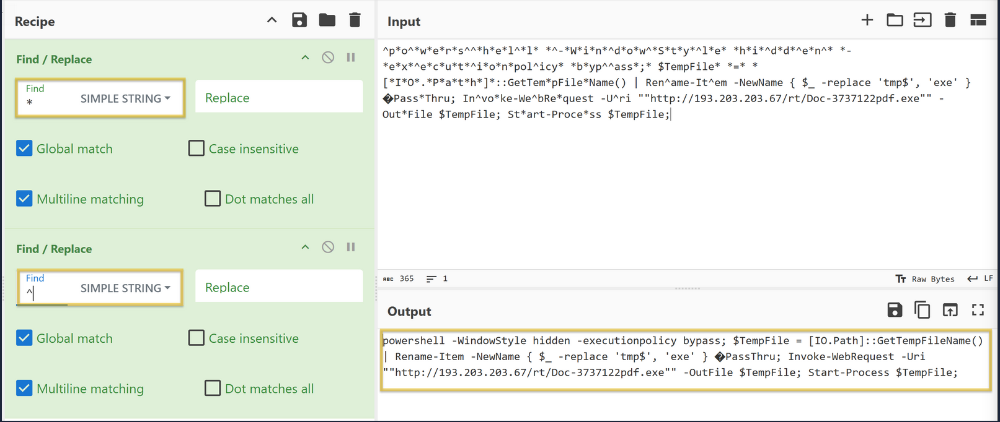

# TryHackMe: REMnux Getting Started

* **Room Link:** [REMnux Getting Started](https://tryhackme.com/room/remnuxgettingstarted)
* **Category:** Defensive Security Tooling
* **Difficulty:** Easy

## Introduction

Menganalisis software yang berpotensi berbahaya (_malware_) bisa jadi tugas yang menegangkan, terutama saat terjadi insiden keamanan (_security incident_). Analis diburu waktu untuk memberikan hasil seakurat mungkin tanpa membahayakan sistem yang ada.

Di sinilah **REMnux** berperan.

### What is REMnux?

**REMnux** adalah distro Linux khusus yang dirancang khusus untuk keperluan **Reverse Engineering Malware**.

Analogi simpelnya: Kalau Kali Linux adalah toolkit untuk anak _Offensive Security_ (Red Team) untuk membobol sistem, maka REMnux adalah **"meja operasi"** untuk anak _Defensive Security_ (Blue Team / Malware Analyst) untuk membedah virus.

Apa keunggulannya?
* Sudah ter-install ratusan _tools_ untuk analisis memori, jaringan, dan bedah file statis. (Contoh: Volatility, YARA, Wireshark, oledump, INetSim).
* Dirancang seperti lingkungan _sandbox_ yang aman untuk mengeksekusi dan mengobservasi software berbahaya tanpa resiko menginfeksi komputer pribadimu.
* Siap pakai (_ready to go_) — tidak perlu pusing install tools satu per satu secara manual.

### Learning Objectives

Setelah menyelesaikan room ini, kamu akan menguasai cara:
* Eksplorasi _tools_ bawaan di dalam REMnux VM.
* Menggunakan _tools_ untuk menganalisis dokumen berbahaya (_malicious documents_) secara efektif.
* Mensimulasikan jaringan palsu (_fake network_) untuk mengelabui malware selama analisis.
* Familiar dengan _tools_ yang digunakan untuk menganalisis _memory images_.

---

## File Analysis Tools

Saat sedang menghadapi insiden keamanan, sering kali musuhnya menyamar jadi _file_ kantoran biasa (_Excel, Word, PDF_). Di REMnux, kamu punya banyak alat bedah khusus untuk menangani hal ini.

### Membedah Dokumen Jahat dengan `oledump.py`

Pernah dapat email berlampiran _Excel_ yang tiba-tiba membuat komputer lemot? Kemungkinan besar _file_ itu menyimpan _malware_ berbasis _Macro_. Untuk membongkarnya dengan aman secara statis (tanpa perlu membuka aplikasinya), kamu bisa menggunakan **`oledump.py`**.

**Apa itu OLE2?**
Kalau kamu bingung, OLE2 (_Object Linking and Embedding_) itu teknologi jadul buatan Microsoft. Pada dasarnya, _file_ OLE2 seperti sebuah _zip folder_ transparan — bisa menyimpan banyak tipe data berbeda (teks, gambar, _script_ racun) berdesakan di dalam satu _file_ utuh. _Tool_ ini sangat jago untuk mengekstrak dan menelanjangi isi kandungan OLE2 tersebut.

**Cara Pakainya:**
Misal kamu dapet *file* mencurigakan bernama `agenttesla.xlsm`. Cukup panggil *tool*-nya di terminal:


```bash
oledump.py agenttesla.xlsm
```

**Membaca Hasil Output:**
Hasilnya bakal keluar struktur direktori dari dalem *file* Excel itu.
* Kolom pertama adalah nomor urut (*index*), sering juga disebut **data streams**.
* Kalau ada huruf **`M`** atau **`m`** besar/kecil di samping nomornya (misal: `A4: M 688 'VBA/ThisWorkbook'`), itu tanda bahaya merah — huruf 'M' berarti ada _script_ VBA Macro yang disisipkan di dalam partisi tersebut.
* Kolom angka di sebelahnya menunjukkan ukuran *byte* dari partisi itu, disusul nama partisinya.

Tugas kamu sebagai analis adalah membedah lebih dalem indeks nomor yang ada huruf 'M'-nya buat melihat isi nyatanya menulis *script* racun jenis apa.

**Menyelam Lebih Dalam ke Data Stream Jahat:**
Nah, anggap saja di _output_ sebelumnya kita curiga sama baris nomor 4 (`A4: M ...`). Kita bisa menyuruh _oledump_ untuk menampilkan isi mentahan dari _stream_ nomor 4 itu saja menggunakan _flag_ `-s` (_select_):

```bash
oledump.py agenttesla.xlsm -s 4
```

Masalahnya, hasil *output*-nya biasanya masih dalam wujud *hex dump* (kode campur aduk) yang bikin mata pusing. 

**Membaca Script Asli (Decompress):**
Agar _script_ VBA yang ada di dalamnya bisa dibaca manusia dengan waras, kamu perlu menambahkan _flag_ ekstra: `--vbadecompress`.

```bash
oledump.py agenttesla.xlsm -s 4 --vbadecompress
```

Sekarang barisan *script* aslinya bakal kelihatan. Kamu nggak perlu pusing membaca dan mengerti seluruh baris *script*-nya sampai hafal. 
Sebagai analis pemula, insting yang harus kamu tajamkan adalah mencari anomali kasat mata, misalnya:
* Alamat *Public IP* aneh yang bukan mikik perusahaanmu.
* Tulisan berakhiran `.exe` atau `.pdf`.
* Perintah *download* atau eksekusi *shell/CMD*.

**Membersihkan Sampah Script (Deobfuscation) Pakai CyberChef**
Berbicara soal anomali, saat kamu _scroll_ hasil _decompress_ tadi, kamu akan mudah menemukan baris _script_ panjang yang bentuknya penuh simbol aneh, misalnya:
`"^p*o^*w*e*r*s^^h*e*l^*l* *^-w*i*n^*d*o*w^*s*t*y^*l*e*..."`

Itu bukan _error_. Pembuat _malware_-nya sengaja menyisipkan karakter sampah (seperti `*` dan `^`) agar _tools_ antivirus bingung membacanya. Teknik menyembunyikan wujud asli ini disebut **Obfuscation**.

Dilihat dari baris *script* (contoh variabel `Sqtnew`), ketahuan kalau ada perintah `Replace` buat membuang karakter `*` dan `^` sebelum *script*-nya dieksekusi diam-diam di komputer korban. 

Tugas kamu sekarang adalah membuang sampah itu secara manual agar wujud aslinya terlihat. Tools yang paling tepat untuk pekerjaan ini adalah **CyberChef** (_swiss army knife_-nya anak _cybersec_).

*Langkah praktek:*
1. Buka **CyberChef** (bisa dari *browser* di dalam mesin REMnux atau _online_).
2. *Copy* kalimat acak-acakan tadi dan *paste* ke kotak **Input** di CyberChef.
3. Di sebelah kiri (*Operations*), cari dan geser fitur **Find/Replace** ke kolom *Recipe* (seret dua kali karena kita mau membuang dua simbol berbeda).
4. Di Find/Replace pertama: Isi kolom *Find* dengan tanda bintang `*`, biarkan kotak *Replace* **kosong melompong** (alias dihapus).
5. Di Find/Replace kedua: Isi kolom *Find* dengan tanda caping `^`, dan biarkan kotak *Replace* kosong juga.

dan di kotak **Output** pojok kanan bawah, deretan sampah itu bakal terbaca jelas sebagai perintah jahat (*Powershell* tersembunyi).

---

## Memory Investigation: Evidence Preprocessing

Di ranah Digital Forensik, analis tidak hanya melihat _file_ di dalam _harddisk_. Seringkali mereka harus membedah **Memory Image** (jejak rekaman RAM komputer korban saat masih menyala). Kenapa? Karena _malware_ modern biasanya tidak meninggalkan jejak di _harddisk_ (_fileless_), tapi murni berjalan dan bersembunyi di dalam _Memory_ (RAM).

### Volatility 3: Membaca Isi RAM

Senjata utama yang sudah otomatis ada di REMnux untuk urusan ini adalah **Volatility**. *Tool* ini sangat handal untuk membedah isi yang tersembunyi dari rekaman *memory image*, seperti melihat daftar aplikasi apa saja yang sedang berjalan secara *live* saat insiden terjadi, bahkan mendeteksi *password* yang sempat diketik korban.

Disini, fokus pembelajarannya menggunakan **Volatility 3** (versi terbaru). Karena ilmu mengupas hasil Volatility butuh pembahasan yang sangat panjang, di tahap Getting Started ini kamu hanya dituntut paham cara menjalankan *command*-nya dan merasakan proses menunggu alat ini bekerja (tiap *plugin* biasanya memakan waktu 2-3 menit untuk memunculkan *output*).

**Plugin Windows Utama:**
Jika target analisismu adalah mesin Windows, berikut deretan *parameter* (atau *plugins*) Volatility bawaan yang wajib kamu kenali fungsinya:

* `windows.pstree.PsTree`: Menampilkan daftar *process* (aplikasi yang berjalan) dalam bentuk pohon hierarki. Dari sini terlihat jelas mana aplikasi induk yang memanggil/menjalankan aplikasi mencurigakan lainnya.
* `windows.pslist.PsList`: Versi lebih dasar dari PsTree, sekadar menampilkan daftar lurus ke bawah untuk semua *process* yang sedang aktif.
* `windows.cmdline.CmdLine`: Mengecek perintah lengkap (*command line arguments*) yang digunakan untuk menjalankan aplikasi tersebut (terkadang perintah eksekusi *malware* tertulis jelas di bagian akhir argumennya).
* `windows.filescan.FileScan`: Mencari tahu *file* apa saja yang sempat tersentuh atau terbuka di dalam memori saat itu.
* `windows.dlllist.DllList`: Mengintip daftar DLL (*library* pendukung bawaan Windows) yang sedang digunakan (*loaded*) oleh sebuah aplikasi.
* `windows.malfind.Malfind`: *Plugin* andalan, otomatis mencari area *memory* aneh hasil injeksi tersembunyi yang berpotensi murni menyimpan kode *malware*.
* `windows.psscan.PsScan`: Digunakan untuk mencari *process* yang sudah mati atau sengaja disembunyikan oleh trik *rootkit* (sehingga aplikasinya tidak terlihat lagi kalau cuma dicek pakai `PsList` biasa).
