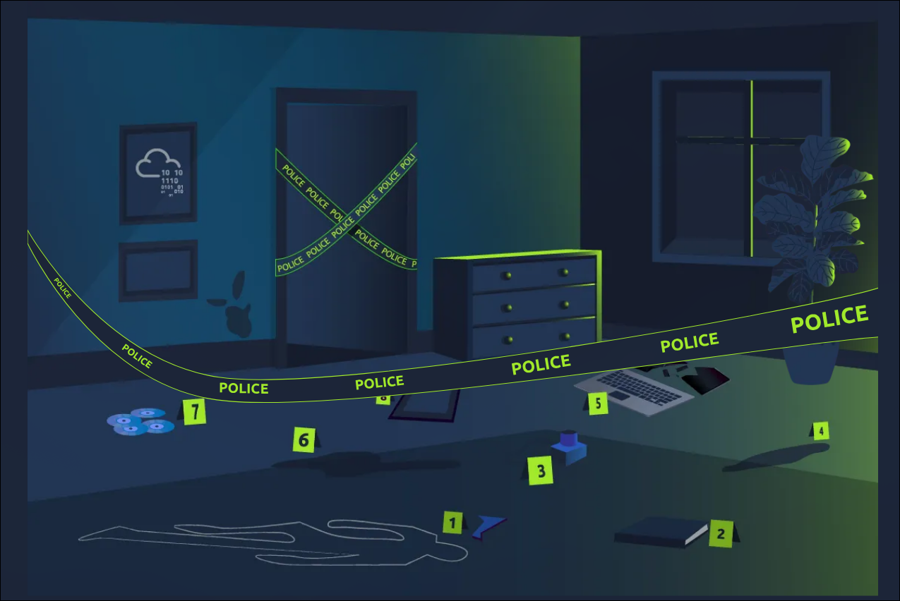
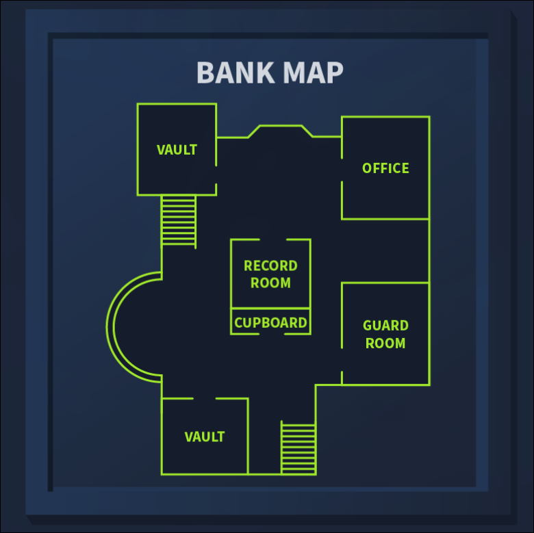
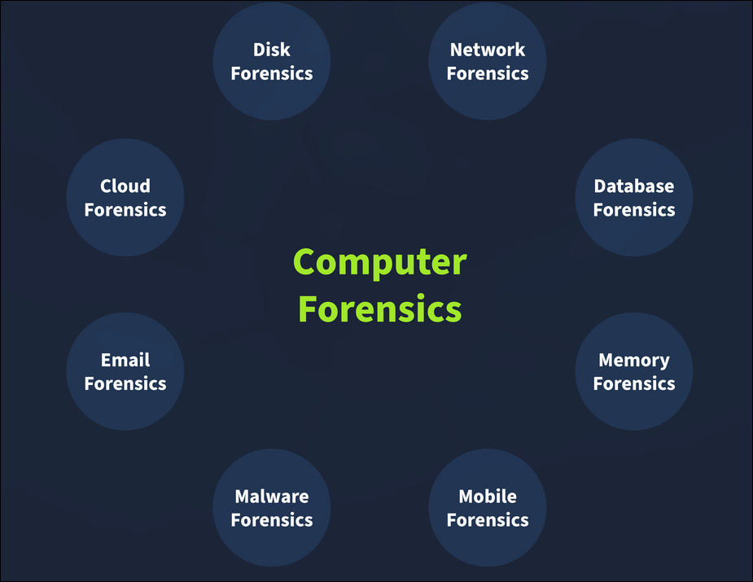
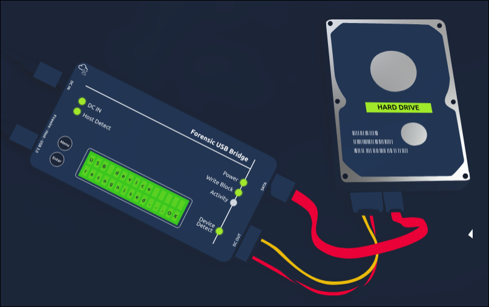
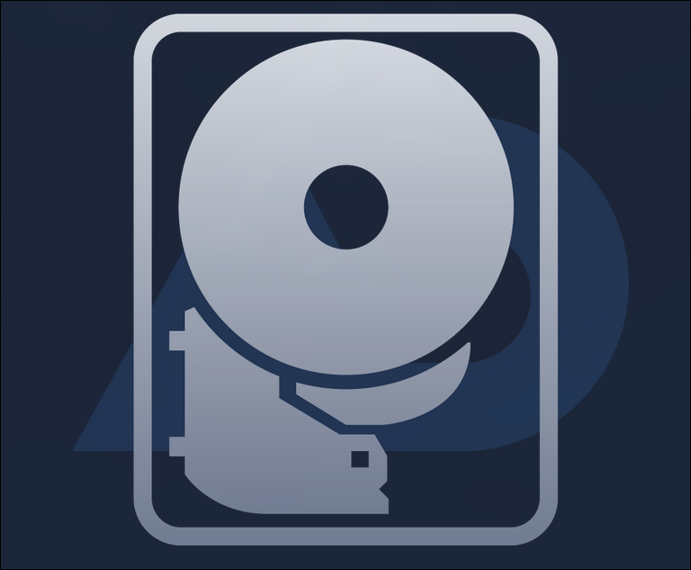
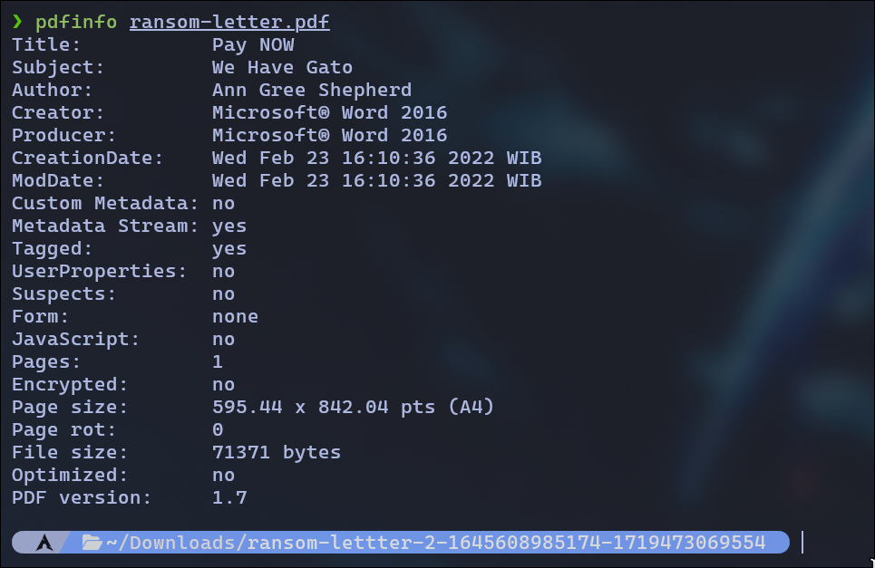

# TryHackMe: Digital Forensics Fundamentals

- **Room Link:** [Digital Forensics Fundamentals](https://tryhackme.com/room/introtodforensics)
- **Kategori:** Defensive Security
- **Difficulty:** easy

## Task 1: Introduction to Digital Forensics

Forensic itu penerapan metode dan prosedur buat menyelidiki dan memecahkan kejahatan. Cabang forensic yang khusus nyelidikin **Cyber Crime** dikenal sebagai **digital forensics**.

**Cyber crime** itu aktivitas kriminal apa pun yang dilakuin di atau pake perangkat digital. Berbagai tools dan teknik dipake buat nyelidikin perangkat digital secara menyeluruh setelah kejahatan terjadi, tujuannya buat nemuin dan menganalisis bukti demi tindakan hukum yang diperlukan.

Perangkat digital udah memecahkan banyak masalah di hidup kita. Komunikasi di seluruh dunia sekarang cuma tinggal kirim pesan atau telepon. Tapi karena penggunaan perangkat digital yang masif, peningkatan kejahatan digital **(cyber crimes)** juga ikut teramati. Berbagai macam kejahatan dilakuin pake perangkat digital.

**Contoh Kasus:** Bayangin aparat penegak hukum nge raid tempatnya perampok bank pake surat perintah penggeledahan. Beberapa perangkat digital ditemuin, termasuk laptop, HP, hard drive, dan USB. Aparat menyerahkan kasus ini ke tim digital forensics. Tim ngumpulin barang bukti dengan aman dan ngelakuin investigasi menyeluruh di dalam lab forensic pake tools forensic. Bukti berikut ditemuin di perangkat digital:

- Peta digital bank ditemuin di laptop tersangka — dipake buat ngerencanain perampokan.
- Dokumen berisi pintu masuk dan rute kabur bank ditemuin di hard drive tersangka.
- Dokumen di hard drive yang nge-list semua kontrol keamanan fisik bank. Tersangka bikin rencana buat bypass langkah-langkah keamanan tersebut.
- Beberapa file media (foto dan video perampokan sebelumnya) ditemuin di laptop tersangka.
- Setelah investigasi menyeluruh di HP tersangka, grup chat ilegal dan catatan panggilan terkait perampokan bank juga ditemuin.

Semua bukti ini bantu aparat penegak hukum dalam proses hukum kasus tersebut. Skenario ini ngebahas sebuah kasus dari awal sampe akhir. Ada beberapa prosedur yang diikutin tim digital forensics waktu ngumpulin bukti, nyimpennya, menganalisisnya, dan ngelaporinnya. Room ini bakal fokus ke pemahaman prosedur-prosedur tersebut.

**Learning Objectives:**

- Fase-fase digital forensics
- Jenis-jenis digital forensics
- Prosedur pengambilan barang bukti
- Windows forensics
- Memecahkan kasus forensik

**Answer the questions:**

- Cabang forensic apa yang khusus nyelidikin cyber crime? → **?**

## Task 2: Digital Forensics Methodology

Tim digital forensics punya berbagai macam kasus yang butuh tools dan teknik yang beda-beda. Tapi, **National Institute of Standards and Technology (NIST)** udah ngedefinisiin proses umum yang bisa dipake buat setiap kasus. NIST itu kerjaannya bikin framework buat berbagai bidang teknologi, termasuk cyber security — di mana mereka ngeperkenallin proses digital forensics dalam **empat fase**.

1. **Collection:** Fase pertama digital forensics adalah pengumpulan data. Identifikasi semua perangkat yang bisa jadi sumber data itu penting banget. Biasanya investigator bisa nemuin komputer pribadi, laptop, kamera digital, USB, dll di TKP. Pastiin juga data aslinya gak diutak-atik selama pengumpulan bukti, dan bikin dokumentasi yang rapi soal detail barang-barang yang dikumpulin. Prosedur pengambilan bukti bakal dibahas lebih lanjut di task-task berikutnya.

2. **Examination:** Data yang udah dikumpulin bisa bikin investigator kewalahan karena ukurannya. Data ini biasanya perlu di-filter dan informasi yang relevan perlu diekstrak. Contohnya, sebagai investigator kamu ngumpulin semua file media dari kamera digital di TKP. Kamu mungkin cuma butuh media tertentu yang direkam di tanggal dan waktu tertentu. Jadi di fase examination, kamu bakal filter file media sesuai waktu yang dibutuhin dan mindahin ke fase selanjutnya. Fase examination bantu kamu filter data tertentu buat dianalisis.

3. **Analysis:** Ini fase kritis. Investigator harus menganalisis data dengan menghubungkan berbagai bukti buat narik kesimpulan. Analisisnya tergantung skenario kasus dan data yang tersedia. Tujuannya buat mengekstrak aktivitas yang relevan dengan kasus secara kronologis.

4. **Reporting:** Di fase terakhir digital forensics, laporan detail disiapkan. Laporan ini berisi metodologi investigasi dan temuan detail dari bukti yang dikumpulin. Bisa juga berisi rekomendasi. Laporan ini dipresentasiin ke aparat penegak hukum dan manajemen eksekutif. Penting banget buat nyertain executive summary sebagai bagian dari laporan, dengan mempertimbangkan tingkat pemahaman semua pihak yang nerima.

Sebagai bagian dari fase collection, kita udah liat bahwa berbagai bukti bisa ditemuin di TKP. Menganalisis berbagai kategori bukti ini butuh tools dan teknik yang bervariasi. Ada beberapa jenis digital forensics, masing-masing punya metodologi pengumpulan dan analisis tersendiri. Berikut beberapa jenis yang paling umum:

- **Computer forensics:** Jenis digital forensics yang paling umum, fokusnya ke investigasi komputer — perangkat yang paling sering dipake dalam kejahatan.
- **Mobile forensics:** Investigasi perangkat mobile dan ngekstrak bukti kayak catatan panggilan, pesan teks, lokasi GPS, dan lainnya.
- **Network forensics:** Bidang forensik yang cakupannya melampaui perangkat individual — mencakup seluruh jaringan. Mayoritas bukti yang ditemuin di jaringan ada di network traffic logs.
- **Database forensics:** Banyak data penting disimpen di database khusus. Database forensics nyelidikin intrusi ke database yang mengakibatkan modifikasi data atau exfiltration.
- **Cloud forensics:** Jenis forensik yang investigasi data yang disimpen di infrastruktur cloud. Tipe ini kadang tricky buat investigator karena minimnya bukti yang tersedia di infrastruktur cloud.
- **Email forensics:** Email, metode komunikasi paling umum antar profesional, udah jadi bagian penting dari digital forensics. Email diinvestigasi buat nentuin apakah mereka bagian dari kampanye phishing atau penipuan.

**Answer the questions:**

- Berapa jumlah fase dalam proses digital forensics menurut NIST? → **?**
- Jenis forensik apa yang fokusnya ke investigasi network traffic logs? → **?**

## Task 3: Evidence Acquisition

Pengambilan bukti itu kerjaan yang krusial. Tim forensics harus ngumpulin semua bukti secara aman tanpa mengubah data aslinya. Metode pengambilan bukti buat perangkat digital beda-beda tergantung jenis perangkatnya. Tapi, ada beberapa praktik umum yang harus diikutin saat bukti diambil. Ayo kita bahas beberapa yang penting.

### Proper Authorization

Tim forensics harus dapetin otorisasi dari pihak berwenang yang relevan sebelum ngumpulin data apa pun. Bukti yang dikumpulin tanpa persetujuan sebelumnya bisa dianggep gak sah di pengadilan. Bukti forensic berisi data pribadi dan sensitif milik organisasi atau individu. Otorisasi yang tepat sebelum ngumpulin data ini penting banget buat investigasi sesuai batas hukum yang berlaku.

### Chain of Custody

Bayangin tim investigator ngumpulin semua bukti dari TKP, terus beberapa hari kemudian ada bukti yang ilang, atau ada perubahan di buktinya. Gak ada individu yang bisa dimintai pertanggungjawaban dalam skenario ini karena gak ada proses yang bener buat mendokumentasiin pemilik bukti. Masalah ini bisa diatasi dengan nge maintain **chain of custody** document. Chain of custody itu dokumen formal yang berisi semua detail tentang bukti. Beberapa detail kunci yang dicatat:

- Deskripsi bukti (nama, jenis).
- Nama individu yang ngumpulin bukti.
- Tanggal dan waktu pengumpulan bukti.
- Lokasi penyimpanan setiap bukti.
- Waktu akses dan catatan individu yang mengakses bukti.

Ini menciptakan jejak bukti yang proper dan bantu menjaga kelestariannya. Dokumen chain of custody bisa dipake buat membuktikan integritas dan keandalan bukti yang diajukan di pengadilan. Contoh chain of custody bisa diunduh dari [sini](https://www.nist.gov/document/sample-chain-custody-form).

### Use of Write Blockers

Write blockers itu bagian penting dari toolbox tim digital forensics. Misalnya kamu lagi ngumpulin bukti dari hard drive tersangka dan masangin hard drive itu ke workstation forensic. Selama proses pengumpulan, beberapa background tasks di workstation forensik bisa ngubah timestamp file di hard drive tersebut. Ini bisa bikin hambatan selama analisis dan akhirnya menghasilkan hasil yang salah. Sekarang bayangin data dikumpulin dari hard drive pake write blocker. Kali ini, hard drive tersangka bakal tetep dalam kondisi aslinya karena write blocker bisa memblokir semua aksi perubahan bukti.

**Answer the questions:**

- Dokumen apa yang berisi semua detail tentang bukti yang dikumpulin? → **?**
- Tools apa yang dipake buat mencegah perubahan data pada bukti digital? → **?**

## Task 4: Windows Forensics

Jenis bukti yang paling umum dikumpulin dari TKP adalah komputer desktop dan laptop, karena kebanyakan aktivitas kriminal melibatkan sistem personal. Perangkat-perangkat ini punya sistem operasi yang berbeda-beda. Di task ini, kita bakal bahas pengambilan dan analisis bukti dari sistem operasi Windows, yang merupakan OS yang sangat umum dan udah diinvestigasi di banyak kasus.

Sebagai bagian dari fase pengumpulan data, forensic images dari sistem operasi Windows diambil. Forensic images ini adalah salinan bit-by-bit dari keseluruhan sistem operasi. Dua kategori forensic images yang berbeda diambil dari sistem operasi Windows:

- **Disk image:** Disk image berisi semua data yang ada di perangkat penyimpanan sistem (HDD, SSD, dll.). Data ini bersifat non-volatile, artinya data disk bakal tetep bertahan bahkan setelah restart sistem operasi. Contohnya, semua file kayak media, dokumen, riwayat browsing internet, dan lainnya.

- **Memory image:** Memory image berisi data yang ada di dalam RAM sistem operasi. Memori ini bersifat volatile, artinya data bakal ilang setelah sistem dimatiin atau di-restart. Contohnya, buat capture file yang sedang dibuka, proses yang berjalan, koneksi jaringan aktif, dll., memory image harus diprioritasin dan diambil duluan dari sistem operasi tersangka; kalau gak, restart atau shutdown sistem bakal bikin semua data volatile kehapus. Saat melakukan digital forensics di sistem operasi Windows, disk dan memory images sangat penting buat dikumpulin.

Ayo bahas beberapa tools populer yang dipake buat pengambilan dan analisis disk dan memory image dari sistem operasi Windows.

**FTK Imager:** FTK Imager adalah tools yang banyak dipake buat mengambil disk images dari sistem operasi Windows. Tools ini punya graphical interface yang user-friendly buat membuat image dalam berbagai format. Tools ini juga bisa menganalisis isi dari disk image. Bisa dipake buat pengambilan maupun analisis.

**Autopsy:** Autopsy adalah platform digital forensics open-source yang populer. Investigator bisa mengimport disk image yang udah diambil ke tools ini, dan tools-nya bakal melakukan analisis ekstensif terhadap image tersebut. Autopsy nawarin berbagai fitur selama analisis image, termasuk keyword search, deleted file recovery, file metadata, extension mismatch detection, dan masih banyak lagi.

**DumpIt:** DumpIt nawarin utility buat mengambil memory image dari sistem operasi Windows. Tools ini buat memory images pake command-line interface dan beberapa perintah aja. Memory image-nya juga bisa diambil dalam berbagai format.

**Volatility:** Volatility adalah tools open-source yang powerful buat menganalisis memory images. Tools ini nawarin beberapa plugin yang sangat berguna. Setiap artifact bisa dianalisis pake plugin tertentu. Tools ini support berbagai sistem operasi, termasuk Windows, Linux, macOS, dan Android.

> **Note:** Berbagai tools lainnya juga dipake buat mengambil dan menganalisis disk dan memory images dari sistem operasi Windows.

**Answer the questions:**

- Jenis forensic image apa yang diambil buat ngumpulin data volatile dari sistem operasi? → **?**

## Task 5: Practical Example of Digital Forensics

Semua yang kita lakuin di perangkat digital, dari smartphone sampe komputer, ninggalin jejak. Ayo kita liat gimana kita bisa pake ini di investigasi berikutnya.

Kucing kita, Gato, udah diculik. Penculiknya ngirim dokumen berisi permintaan mereka dalam format MS Word Document. Kita udah convert dokumen itu ke format PDF dan ngekstrak gambar dari file MS Word buat memudahkan.

Kamu bisa download file yang dilampirin ke mesin lokal kamu buat inspeksi. File-nya bisa didownload dalam format zip: [📥 Download Task Files](../../Assets/Images/ransom-lettter-2-1645608985174-1719473069554.zip). Extract file-nya, dan kamu bakal nemuin file-file kasus di dalamnya.

Saat kamu bikin file teks (TXT), beberapa metadata otomatis disimpen oleh sistem operasi, kayak tanggal pembuatan file dan tanggal modifikasi terakhir. Tapi, lebih banyak informasi tersimpen di metadata file saat kamu pake editor yang lebih advanced, kayak MS Word. Ada berbagai cara buat baca metadata file; kamu bisa buka di viewer/editor resminya atau pake tools forensik yang sesuai. Perlu dicatat bahwa export file ke format lain, kayak PDF, bakal mempertahankan sebagian besar metadata dari dokumen aslinya, tergantung PDF writer yang dipake.

Ayo kita liat apa yang bisa kita pelajari dari file PDF ini. Kita bisa coba baca metadata-nya pake program `pdfinfo`. Pdfinfo nampilin berbagai metadata yang terkait dengan file PDF, kayak title, subject, author, creator, dan creation date. (Kalau kamu pake Linux dan belum punya `pdfinfo` terinstall, kamu bisa install pake `sudo apt install poppler-utils`.) Coba contoh berikut pake `pdfinfo ransom-letter.pdf`:

Dari output `pdfinfo` di atas, kita bisa dapetin beberapa informasi penting:

- **Title:** "Pay NOW" — judul dokumen yang dibuat oleh penculik.
- **Subject:** "We Have Gato" — subject yang mengkonfirmasi ini adalah surat tebusan.
- **Author:** "Ann Gree Shepherd" — nama author yang bikin dokumen ini, bisa jadi petunjuk penting buat investigasi.
- **Creator & Producer:** Microsoft® Word 2016 — software yang dipake buat bikin dokumen.
- **CreationDate & ModDate:** Wed Feb 23 16:10:36 2022 WIB — tanggal dan waktu dokumen dibuat dan terakhir dimodifikasi.
- **Pages:** 1 — dokumen cuma 1 halaman.
- **File size:** 71371 bytes — ukuran file PDF-nya.
