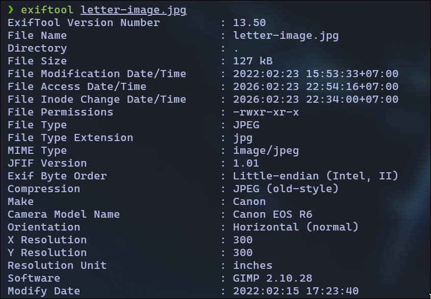
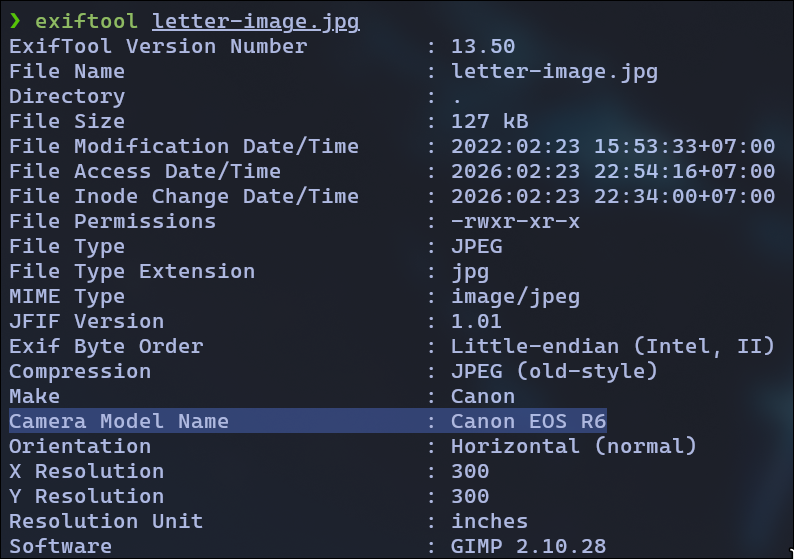
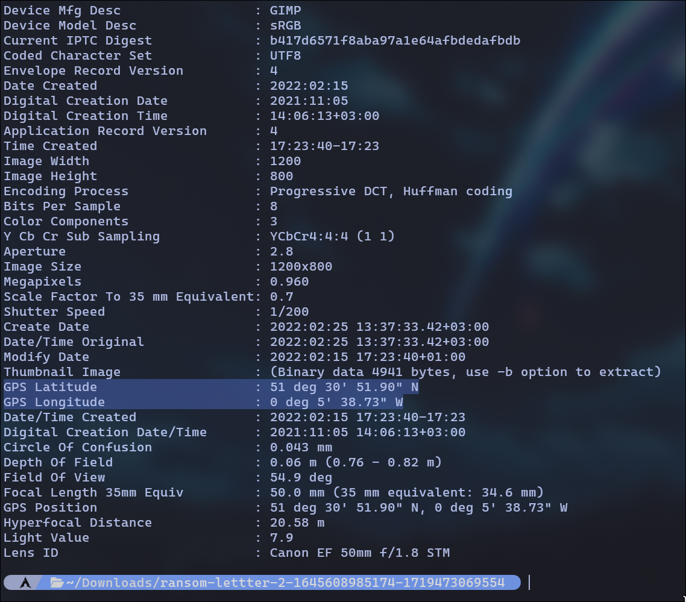
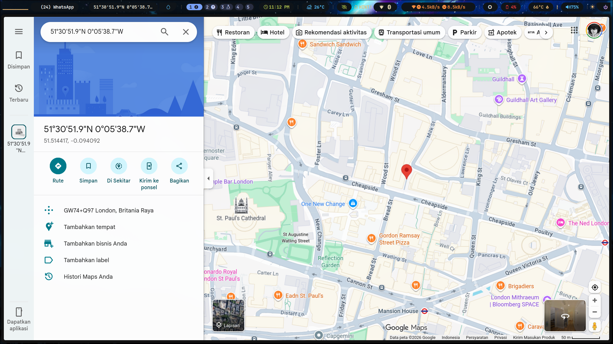

# TryHackMe: Digital Forensics Fundamentals

- **Room Link:** [Digital Forensics Fundamentals](https://tryhackme.com/room/introtodforensics)
- **Kategori:** Defensive Security
- **Difficulty:** easy

## Task 1: Introduction to Digital Forensics

**Digital Forensics** adalah cabang forensic yang khusus menyelidiki **cyber crime** menggunakan tools dan teknik buat nemuin, menganalisis, dan melaporkan bukti digital.

**Contoh Kasus:** Aparat nge-raid tempat perampok bank → ditemuin laptop, HP, hard drive, USB → diserahin ke tim digital forensics → bukti yang ditemuin:
- Peta digital bank di laptop
- Dokumen rute kabur & kontrol keamanan di hard drive
- File media perampokan sebelumnya
- Grup chat ilegal & catatan panggilan di HP

**Learning Objectives:** Fase digital forensics, jenis-jenis forensics, prosedur pengambilan bukti, Windows forensics, memecahkan kasus forensik.

**Q&A:** Cabang forensic yang khusus nyelidikin cyber crime? → **?**

## Task 2: Digital Forensics Methodology

**NIST** mendefinisikan proses digital forensics dalam **4 fase:**

1. **Collection** — Identifikasi & kumpulin semua perangkat (laptop, USB, kamera, dll.) tanpa mengubah data asli.
2. **Examination** — Filter data yang relevan dari data yang udah dikumpulin (misal: filter file berdasarkan tanggal tertentu).
3. **Analysis** — Hubungkan berbagai bukti dan buat timeline kronologis aktivitas.
4. **Reporting** — Buat laporan detail berisi metodologi, temuan, dan rekomendasi.

### Jenis-jenis Digital Forensics:
- **Computer forensics** — Investigasi komputer (paling umum)
- **Mobile forensics** — Catatan panggilan, SMS, lokasi GPS
- **Network forensics** — Analisis network traffic logs
- **Database forensics** — Investigasi intrusi & modifikasi database
- **Cloud forensics** — Investigasi data di cloud (tricky karena minimnya bukti)
- **Email forensics** — Deteksi phishing & penipuan via email

**Q&A:**
- Jumlah fase digital forensics menurut NIST? → **?**
- Forensik yang fokus ke network traffic logs? → **?**

## Task 3: Evidence Acquisition

Pengambilan bukti harus dilakukan dengan aman tanpa mengubah data asli. Beberapa praktik penting:

### Proper Authorization
Tim forensics harus punya otorisasi resmi sebelum ngumpulin data. Bukti tanpa izin → gak sah di pengadilan.

### Chain of Custody
Dokumen formal yang mencatat semua detail tentang bukti:
- Deskripsi bukti (nama, jenis)
- Siapa yang ngumpulin & kapan
- Lokasi penyimpanan
- Siapa aja yang akses & kapan

Contoh form: [NIST Sample Chain of Custody Form](https://www.nist.gov/document/sample-chain-custody-form)

### Write Blockers
Alat yang memblokir semua aksi tulis ke bukti digital → menjaga data tetap original selama proses pengumpulan.

**Q&A:**
- Dokumen yang berisi semua detail tentang bukti? → **?**
- Tools buat mencegah perubahan data pada bukti digital? → **?**

## Task 4: Windows Forensics

Windows forensics melibatkan pengambilan **forensic images** (salinan bit-by-bit) dari sistem. Ada 2 kategori:

- **Disk image** — Data non-volatile (HDD/SSD): file, dokumen, browser history → tetep ada setelah restart
- **Memory image** — Data volatile (RAM): proses aktif, koneksi jaringan → ilang setelah shutdown, jadi harus diambil duluan!

### Tools Populer:

**FTK Imager** — Akuisisi & analisis disk image, GUI-based.

**Autopsy** — Platform forensics open-source: keyword search, deleted file recovery, metadata, extension mismatch detection.

**DumpIt** — CLI tool buat akuisisi memory image Windows.

**Volatility** — Analisis memory image, support Windows/Linux/macOS/Android.

**Q&A:** Jenis forensic image buat ngumpulin data volatile? → **?**

## Task 5: Practical Example of Digital Forensics

Skenario: Kucing bernama **Gato** diculik → penculik kirim surat tebusan dalam format MS Word → di-convert ke PDF.

Download file kasus: [Download Task Files](../../Assets/Images/ransom-lettter-2-1645608985174-1719473069554.zip)

### Analisis Metadata PDF

Pake `pdfinfo` buat baca metadata PDF. Install: `sudo apt install poppler-utils` atau `sudo pacman -S poppler`.

Temuan penting dari `pdfinfo ransom-letter.pdf`:
- **Author:** Ann Gree Shepherd
- **Creator:** Microsoft® Word 2016
- **CreationDate:** Wed Feb 23 16:10:36 2022 WIB

### Photo EXIF Data

**EXIF** = metadata di file gambar (model kamera, waktu, GPS, aperture, ISO, dll.). Install `exiftool`: `sudo apt install libimage-exiftool-perl` atau `sudo pacman -S perl-image-exiftool`.

Dari `exiftool letter-image.jpg` → kamera: **Canon EOS R6**

GPS coordinates ditemukan: **51°30'51.90" N, 0°5'38.73" W**

Lokasi di Google Maps → **Milk Street, London** (deket St. Paul's Cathedral)

**Q&A:**
- Author file PDF `ransom-letter.pdf`? → **Ann Gree Shepherd**
- Nama jalan lokasi foto penculik? → **Milk Street**
- Model kamera yang dipake? → **Canon EOS R6**
