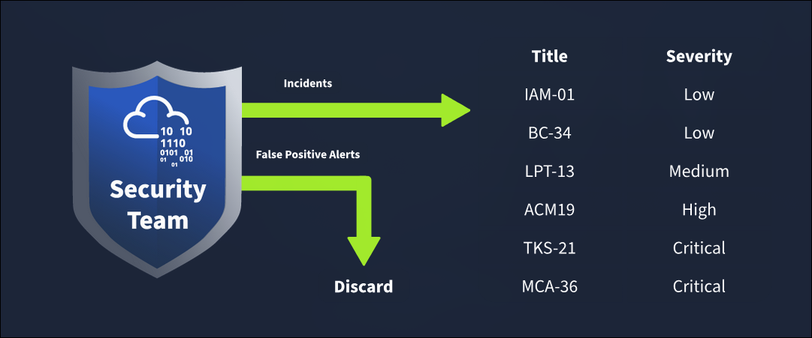

# TryHackMe: Incident Response Fundamentals

- **Room Link:** [Incident Response Fundamentals](https://tryhackme.com/room/incidentresponsefundamentals)
- **Kategori:** Defensive Security
- **Difficulty:** easy

## Introduction to Incident Response

Bayangin kamu tinggal di jalan yang rawan kejahatan dengan banyak barang mahal di rumah. Pasti kepikiran buat punya security guard dan beberapa kamera CCTV di rumah. Menyembunyikan barang berharga di ruangan bawah tanah tersembunyi juga ide bagus kalau ada penyusup yang berhasil masuk ke rumah. Ini semua langkah-langkah yang kamu rencanain buat keamanan rumah, bahkan sebelum serangan terjadi.

Selain langkah-langkah proaktif ini, pernah tidak kamu pikirin gimana semuanya bakal berjalan kalau seseorang berhasil melewati mekanisme keamanan eksternal dan dapet akses ke rumahmu? Kamu juga harus mengambil beberapa langkah lain setelah rumahmu diserang.

Ayo bawa konsep ini ke dunia digital. Kamu mungkin pernah denger tentang serangan cyber terhadap organisasi yang membuat mereka rugi ribuan dolar. Banyak kasus seperti gini yang dilaporin setiap hari di internet. Ini disebut sebagai **Cyber Security Incidents**. Sama seperti skenario di atas, di mana kamu merencanakan keamanan rumahmu, cyber security incidents juga butuh perencanaan dan sumber daya buat menghindari kerugian besar.

Incident Response menangani sebuah insiden dari awal sampai akhir. Mulai dari deploy keamanan di berbagai area buat mencegah insiden, sampai melawan insiden tersebut dan meminimalisir dampaknya — incident response adalah panduan yang menyeluruh.

Room ini bakal bantu kamu memahami konsep-konsep penting dari incident response dan memberi kesempatan buat menyelesaikan insiden pertamamu secara praktis.

### Learning Objectives

- Overview tentang apa itu insiden dan severity level-nya
- Jenis-jenis insiden yang umum terjadi
- Fase fase Incident Response dari framework SANS dan NIST
- Tools buat Incident Detection dan Response beserta peran PlayBooks
- Incident Response Plan

## What are Incidents?

Berbagai proses (interaktif & background) jalan di perangkat kita dan menghasilkan **events**. Events ini dimasukkin ke **security solutions** sebagai **logs** buat mendeteksi aktivitas berbahaya. Tantangan sebenarnya dimulai setelah security solution berhasil mendeteksi aktivitas mencurigakan dan memicu _alert_.

Tim keamanan bakal menganalisis _alerts_ ini:

- **False Positive:** Alert yang keliatan bahaya, tapi ternyata aman. (Contoh: Alert transfer data gede → ternyata cuma proses backup ke cloud).
- **True Positive:** Alert yang bener-bener berbahaya. (Contoh: Alert email masuk → ternyata email Phishing buat eksploitasi user).

True Positive alerts inilah yang disebut sebagai **Incidents (Insiden)**.

### Incident Severity

Kalau ada banyak insiden terjadi bersamaan, tim keamanan butuh prioritas berdasarkan dampaknya (_severity level_):
- **Low / Medium / High / Critical**
- Skala **Critical** selalu jadi prioritas tertinggi buat ditangani duluan.

* *Contoh*: Dari gambar di atas, **Title** merujuk ke ID tiket dari sebuah alert/insiden. Tim SOC akan memprioritaskan penyelesaian tiket **TKS-21** dan **MCA-36** terlebih dahulu karena statusnya **Critical**, sedangkan tiket dengan status Low seperti IAM-01 bisa ditunda pengerjaannya.

## Types of Incidents

Insiden keamanan siber itu ada banyak jenisnya, bukan cuma sebatas hacking biasa. Berbagai jenis insiden ini bisa terjadi secara mandiri atau serentak pada satu korban.

- **Malware Infections:** Malware itu program jahat yang dirancang buat merusak sistem, jaringan, atau aplikasi. Mayoritas insiden keamanan berhubungan dengan malware infection. Malware biasanya menyebar lewat file (teks, dokumen berlampiran jahat, file `.exe`, dll).
- **Security Breaches:** Terjadi saat orang yang tidak punya izin (unauthorized) berhasil mengakses data rahasia. Ini bahaya banget karena banyak bisnis yang bergantung sama data penting ini.
- **Data Leaks:** Kebocoran informasi rahasia ke pihak yang tidak berwenang. Attacker biasanya pakai data bocor ini buat **memeras korban** atau **ngerusak reputasi** target mereka. Beda dengan Security Breaches (yang disengaja), Data Leaks kadang bisa terjadi cuma karena **human error** atau **salah konfigurasi**.
- **Insider Attacks:** Insiden yang berasal dari *dalam* organisasi itu sendiri. Contohnya: Karyawan yang lagi marah/kecewa nancepin Flashdisk isi malware ke komputer di hari terakhir dia kerja. Serangan ini **sangat berbahaya** karena orang dalem pastinya punya akses (privilege) yang jauh lebih besar ke resource perusahaan dibanding outsider.
- **Denial of Service (DoS) Attacks:** _Availability_ (Ketersediaan) adalah salah satu dari 3 pilar utama cyber security (CIA Triad). Percuma melindungi data kalau datanya tidak bisa diakses. DoS attack adalah insiden di mana attacker nge-banjiri sistem/jaringan dengan *request palsu* bertubi-tubi. Akibatnya, resource server habis dan user asli yang sah (legitimate users) jadi tidak bisa mengakses layanannya.

Tiap insiden ini punya potensi ngerusak yang unik, dan dampaknya tidak bisa dipukul rata. Insiden yang kecil di satu perusahaan bisa jadi malapetaka di perusahaan lain. **Contoh:** Perusahaan A mungkin tidak terlalu kerasa rugi kalau kena Data Leak (karena datanya tidak penting), tapi mereka bisa rugi besar kalau kena **DoS Attack** karena bisnis utama mereka bergantung dari ngelayanin _customer_ lewat _website_.

---

### Questions

- Apa bedanya insiden Security Breaches dengan Data Leaks?
- Kenapa Insider Attack dianggap lebih berbahaya dari pada serangan dari luar (pihak eksternal)?
- Apa contoh paling umum dari insiden Denial of Service (DoS)?

## Incident Response Process

Karena *nature* dari tiap insiden itu beda-beda, menangani banyak insiden sekaligus di suatu environment bisa jadi kerusuhan besar. Makanya, butuh sebuah proses terstruktur atau kerangka kerja (**Framework**) buat menangani insiden agar lebih terarah.

Dua organisasi/framework yang paling populer dipakai di dunia Cyber Security:
1. **SANS:** Sering menyediakan kursus & sertifikasi mentereng di cyber security.
2. **NIST:** Fokusnya membuat standar & _guidelines_ keamanan siber.

Kedua organisasi ini punya kerangka kerja _incident response_ yang mirip-mirip. SANS merumuskan proses incident response dalam **6 Fase**, yang gampang diinget pakai singkatan **PICERL**.

Nah, ini rincian dari tiap fase **PICERL** (SANS Framework):

| Phase | Explanation | Example |
| :--- | :--- | :--- |
| **Preparation** | Fase pertama dan mendasar. Menyiapkan segala kebutuhan perlindungan sebelum insiden beneran terjadi (mulai tim SOC, alat keamanan, sampai _Incident Response Plan_). | Ngadain _training_ anti-phishing buat karyawan organisasi agar mereka pandai ngendus penipuan dari lampiran email mencurigakan. |
| **Identification** | Pemantauan aktivitas sistem buat nemuin tingkah laku aneh. Butuh banget dibantu _security tools/solutions_ buat mendeteksi _abnormal events_. | Tim IT sadar ada _traffic_ transfer data gede keluar masuk dari salah satu host, yang mana ternyata bocor gegara user sembarangan mncet phishing. |
| **Containment** | Kalo insiden sudah dikenali, fase ini jalan. Tujuannya mengisolasi si ancaman agar tidak menyebar luas ke _environment_ kita yang lain. | Segera melakukan _Network Isolation_ (memutus koneksi internet) di komputer staf yang kena malware tadi ke sisi network lain. |
| **Eradication** | Nah kalo isolasinya beres, sekarang singkirin ancaman sepenuhnya sampai bersih dan dipastikan 0 nyawa yang tersisa | Menjalankan *deep antivirus scan* buat memastikan *malicious software* sudah hangus tak tersisa. |
| **Recovery** | Lanjut proses recovery. Komputer yang rusak diperbaiki / build ulang dan disiapkin sesuai kondisi normal sediakala (seperti memulihkan *backup data* yang sehat). | Komputer dibersihkan ulang, dibalikin konfigurasi amannya dan dipulihkan. |
| **Lessons Learned** | Dokumentasi & Evaluasi. mempelajari celah proses dari insiden barusan, sehingga tim Security kedepannya bisa belajar ngerapihin prosedur pelacakan / perlindungannya. | Pertemuan evaluasi akhir (Pasca insiden) buat mendalami sumber masalah dan memperbaiki keamanan sehingga terhindar ke depannya. |

### NIST Incident Response Framework

Framework dari NIST ini mirip banget sama SANS di atas, bedanya dia diringkas jadi **4 Fase** saja (tidak 6 seperti PICERL):

1. **Preparation:** Sama seperti SANS, fase persiapan.
2. **Detection and Analysis:** Gabungan fase *Identification*. Nemu dan nganalisa insiden.
3. **Containment, Eradication, and Recovery:** Nah ini **3 fase SANS (C-E-R)** digabung total jadi satu fase gede di NIST. Murni proses bersihin dan benerin kerusakan.
4. **Post-Incident Activity:** Sama persis sama fase *Lessons Learned*. Evaluasi akhir.

### SANS vs NIST Comparison

Agar gampang bayangin perbandingannya, ini tabel yang nunjukin di mana letak perbandingannya:

| SANS | NIST |
| :--- | :--- |
| Preparation | Preparation |
| Identification | Detection and Analysis |
| Containment | Containment, Eradication, |
| Eradication | and Recovery |
| Recovery | |
| Lessons Learned | Post Incident Activity |

### Incident Response Plan

Organisasi biasanya ngegabungin dua framework ini buat nyusun panduan resmi mereka, yang dinamain **Incident Response Plan**. Dokumen ini isinya prosedur lengkap (sebelum, saat, dan sesudah insiden) yang sudah divalidasi dan disetujui sama petinggi perusahaan (Senior Management).

Komponen utama dari *Incident Response Plan* itu mencakup:
1. **Roles and Responsibilities:** Siapa ngerjain apa (jelas bagian tugas tim SOC).
2. **Incident Response methodology:** Cara kerja (bisa mengacu ke SANS / NIST).
3. **Communication plan:** Cara komunikasi ke petinggi (stakeholders) bahkan ke pihak berwajib (Law Enforcement/Polisi) agar informasinya tidak simpang siur dan aman.
4. **Escalation path:** Jalur laporan kalau insiden makin membesar.

---

### Questions

- Apa kepanjangan dari PICERL pada framework SANS?
- Pada framework NIST, fase apa saja dari SANS yang digabung menjadi satu fase tunggal?
- Memangnya buat apa sebuah organisasi membuat standar _Incident Response Plan_, dan siapa petinggi yang harus meleges/memvalidasi dokumen ini?
- Kenapa _Communication plan_ dimasukin sebagai salah satu komponen penting pas nyusun _Incident Response Plan_?

## Incident Response Techniques

Ingat kan kalau fase **Identification** (SANS) atau **Detection and Analysis** (NIST) itu susah *kalo cuma dikerjain secara manual* pakai mata manusia. Maka dari itu, muncul beragam alat canggih (*security solutions*) buat bantu deteksi insiden secara otomatis, bahkan sampai bantuin merespon insiden secara langsung (misal mengisolasi / *containment*).

Berikut ini trio alat utama yang sering muncul di dunia Cyber Security (SIEM, AV, EDR):
- **SIEM (Security Information and Event Management):** Pusat komandonya. SIEM memusatkan (centralized) semua jutaan log kejadian penting ke satu wadah. Terus dia bakal berkoordinasi & *mengkorelasikan* berbagai log itu secara otomatis buat nemuin tanda-tanda insiden yang lagi berlangsung.
- **AV (Antivirus):** Alat tempur jadul tapi wajib. Tugas rutinnya mendeteksi *malicious programs* (program-program bahaya) yang sudah **dikenal / punya tanda tangan viral (signature)** sebelum program itu membahayakan sistem.
- **EDR (Endpoint Detection and Response):** Singkatnya ini upgrade canggih dari AV. Dia dipasang langsung di masing-masing mesin host (*endpoint* seperti laptop orang cabang / desktop karyawan). Jagoannya EDR tidak sekadar buat deteksian biasa, bahkan dia dirancang buat ngelawan tipe ancaman level **Advanced**, yang bahkan mampu otomatis mengurung ancaman tsb (*contain and eradicate*) sebelum tim pusat ngerespon.

### Playbooks vs Runbooks

Masing-masing insiden pasti butuh penanganan yang beda-beda. Agar tim SOC tidak kebingungan atau buang-buang waktu pas lagi krisis, mereka butuh panduan *step-by-step*. Panduan ini disebut **Playbooks**.

**Playbook** adalah panduan menyeluruh (_guideline_) yang ngerinci apa saja yang harus dilakuin pas ada insiden tertentu.
Contoh isi Playbook kalau ada insiden **Phishing Email**:
1. Beritahu semua _stakeholders_ tentang insiden email _phishing_.
2. Cek apakah email itu beneran berbahaya (analisa _header_ dan isi pesannya).
3. Cari tau ada _attachment_ (lampiran) atau tidak, lalu analisa file tsb.
4. Cek apakah ada pegawai yang sudah terlanjur ngebuka lampiran bahayanya.
5. Putusin jaringan komputer pegawai yang terinfeksi agar malware nya tidak nular ke network lain (Isolasi / _Contain_).
6. Blokir email dari si pengirim jahat (Attacker).

Di sisi lain, ada yang namanya **Runbooks**. Bedanya, Runbooks itu instruksi yang lebih sempit, super detail, dan teknis buat _mengeksekusi_ step-step spesifik di dalem Playbook. (Misalnya: Step-by-step syntax terminal / *command* cara ngeblokir spammer di *server* perusahaan).

---

### Questions

- Singkatnya, buat apa sih SOC butuh **SIEM** padahal sudah punya security analyst manusia?
- Apa kelebihan **EDR** dibandingin **Antivirus (AV)** jaman dulu?
- Dalam _incident response_, apa bedanya **Playbook** sama **Runbook**?

