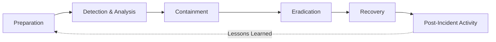
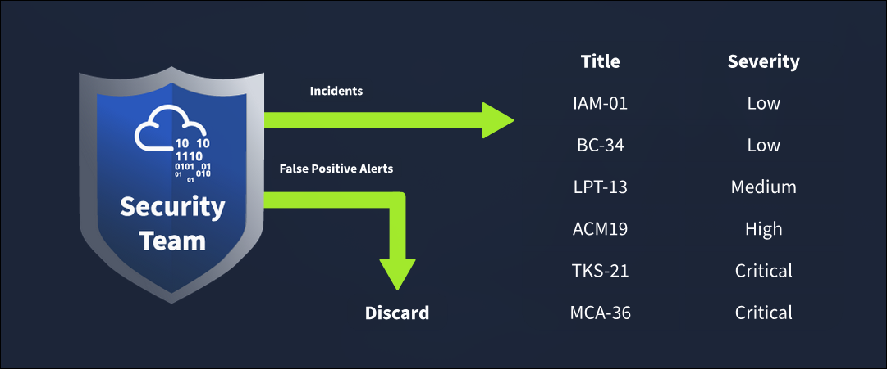

# TryHackMe: Incident Response Fundamentals

- **Room Link:** [Incident Response Fundamentals](https://tryhackme.com/room/incidentresponsefundamentals)
- **Kategori:** Defensive Security
- **Difficulty:** easy

## Introduction to Incident Response

Bayangkan kamu tinggal di jalan yang rawan kejahatan dengan banyak barang mahal di rumah. Pasti terpikir untuk punya security guard dan beberapa kamera CCTV. Menyembunyikan barang berharga di ruangan bawah tanah tersembunyi juga ide bagus kalau ada penyusup yang berhasil masuk. Ini semua langkah-langkah yang kamu rencanakan untuk keamanan rumah, bahkan sebelum serangan terjadi.

Selain langkah proaktif ini, pernahkah kamu memikirkan bagaimana semuanya akan berjalan kalau seseorang berhasil melewati mekanisme keamanan dan mendapatkan akses ke rumahmu? Kamu juga harus mengambil langkah-langkah lain setelah rumahmu diserang.

Bawa konsep ini ke dunia digital. Kamu mungkin pernah mendengar tentang serangan cyber terhadap organisasi yang menyebabkan kerugian ribuan dolar. Banyak kasus seperti ini dilaporkan setiap hari. Ini disebut **Cyber Security Incidents**. Sama seperti skenario di atas, insiden keamanan siber juga membutuhkan perencanaan dan sumber daya untuk menghindari kerugian besar.

*Incident Response* menangani insiden dari awal sampai akhir. Mulai dari men-deploy keamanan di berbagai area untuk mencegah insiden, sampai melawan insiden dan meminimalisir dampaknya.

Room ini akan membantu kamu memahami konsep-konsep penting dari incident response dan memberikan kesempatan untuk menyelesaikan insiden pertamamu secara praktis.

### Learning Objectives

- Overview tentang apa itu insiden dan severity level-nya
- Jenis-jenis insiden yang umum terjadi
- Fase fase Incident Response dari framework SANS dan NIST
- Tools buat Incident Detection dan Response beserta peran PlayBooks
- Incident Response Plan

```mermaid
flowchart LR
    A[Preparation] --> B[Detection & Analysis]
    B --> C[Containment]
    C --> D[Eradication]
    D --> E[Recovery]
    E --> F[Post-Incident Activity]
    F -.->|Lessons Learned| A
```

## What are Incidents?

Berbagai proses (interaktif & background) berjalan di perangkat kita dan menghasilkan **events**. Events ini dimasukkan ke **security solutions** sebagai **logs** untuk mendeteksi aktivitas berbahaya. Tantangan sebenarnya dimulai setelah security solution berhasil mendeteksi aktivitas mencurigakan dan memicu _alert_.

Tim keamanan akan menganalisis _alerts_ ini:

- **False Positive:** Alert yang terlihat bahaya, tapi ternyata aman. (Contoh: Alert transfer data besar → ternyata hanya proses backup ke cloud).
- **True Positive:** Alert yang benar-benar berbahaya. (Contoh: Alert email masuk → ternyata email phishing untuk eksploitasi user).

True Positive alerts inilah yang disebut sebagai **Incidents (Insiden)**.

### Incident Severity

Kalau ada banyak insiden terjadi bersamaan, tim keamanan perlu memprioritaskan berdasarkan dampaknya (_severity level_):
- **Low / Medium / High / Critical**
- Skala **Critical** selalu jadi prioritas tertinggi buat ditangani duluan.

* *Contoh*: Dari gambar di atas, **Title** merujuk ke ID tiket dari sebuah alert/insiden. Tim SOC akan memprioritaskan penyelesaian tiket **TKS-21** dan **MCA-36** terlebih dahulu karena statusnya **Critical**, sedangkan tiket dengan status Low seperti IAM-01 bisa ditunda pengerjaannya.

## Types of Incidents

Insiden keamanan siber itu ada banyak jenisnya, bukan cuma sebatas hacking biasa. Berbagai jenis insiden ini bisa terjadi secara mandiri atau serentak pada satu korban.

- **Malware Infections:** Malware adalah program jahat yang dirancang untuk merusak sistem, jaringan, atau aplikasi. Mayoritas insiden keamanan berhubungan dengan malware. Malware biasanya menyebar lewat file (teks, dokumen berlampiran jahat, file `.exe`, dll).
- **Security Breaches:** Terjadi saat orang yang tidak punya izin berhasil mengakses data rahasia. Ini berbahaya karena banyak bisnis yang bergantung pada data penting tersebut.
- **Data Leaks:** Kebocoran informasi rahasia ke pihak yang tidak berwenang. Penyerang biasanya memanfaatkan data bocor ini untuk **memeras korban** atau **merusak reputasi** target. Berbeda dengan Security Breaches (yang disengaja), Data Leaks kadang bisa terjadi karena **human error** atau **salah konfigurasi**.
- **Insider Attacks:** Insiden yang berasal dari *dalam* organisasi itu sendiri. Contohnya: karyawan yang sedang kecewa memasang flashdisk berisi malware ke komputer pada hari terakhir bekerja. Serangan ini **sangat berbahaya** karena orang dalam pasti punya akses yang jauh lebih besar ke resource perusahaan.
- **Denial of Service (DoS) Attacks:** *Availability* (Ketersediaan) adalah salah satu pilar utama CIA Triad. DoS attack terjadi ketika penyerang membanjiri sistem/jaringan dengan *request* palsu bertubi-tubi, sehingga resource server habis dan pengguna sah tidak bisa mengakses layanannya.

Dampak setiap insiden tidak bisa dipukul rata. Insiden yang kecil di satu perusahaan bisa jadi malapetaka di perusahaan lain. **Contoh:** Perusahaan A mungkin tidak terlalu terdampak jika terkena Data Leak (karena datanya tidak sensitif), tapi bisa rugi besar jika terkena **DoS Attack** karena bisnis utamanya bergantung pada layanan online.

---

### Questions

- Apa bedanya insiden Security Breaches dengan Data Leaks?
- Kenapa Insider Attack dianggap lebih berbahaya dari pada serangan dari luar (pihak eksternal)?
- Apa contoh paling umum dari insiden Denial of Service (DoS)?

## Incident Response Process

Karena sifat setiap insiden itu berbeda-beda, menangani banyak insiden sekaligus bisa menjadi kacau. Makanya, dibutuhkan sebuah proses terstruktur atau kerangka kerja (**Framework**) agar penanganan insiden lebih terarah.

Dua organisasi/framework yang paling populer dipakai di dunia Cyber Security:
1. **SANS:** Sering menyediakan kursus & sertifikasi mentereng di cyber security.
2. **NIST:** Fokusnya membuat standar & _guidelines_ keamanan siber.

Kedua organisasi ini punya kerangka kerja _incident response_ yang serupa. SANS merumuskan proses incident response dalam **6 Fase**, yang mudah diingat dengan singkatan **PICERL**.

Nah, ini rincian dari tiap fase **PICERL** (SANS Framework):

| Phase | Explanation | Example |
| :--- | :--- | :--- |
| **Preparation** | Fase pertama dan mendasar. Menyiapkan segala kebutuhan perlindungan sebelum insiden terjadi (mulai tim SOC, alat keamanan, sampai _Incident Response Plan_). | Mengadakan _training_ anti-phishing untuk karyawan agar mereka bisa mengenali lampiran email mencurigakan. |
| **Identification** | Pemantauan aktivitas sistem untuk menemukan perilaku aneh. Sangat membutuhkan bantuan _security tools_ untuk mendeteksi _abnormal events_. | Tim IT menyadari ada _traffic_ transfer data besar yang tidak wajar dari salah satu host, yang ternyata bocor karena user mengklik phishing. |
| **Containment** | Kalau insiden sudah teridentifikasi, fase ini berjalan. Tujuannya mengisolasi ancaman agar tidak menyebar ke bagian lain. | Segera melakukan _Network Isolation_ (memutus koneksi internet) di komputer staf yang terkena malware. |
| **Eradication** | Setelah isolasi selesai, singkirkan ancaman sepenuhnya sampai benar-benar bersih. | Menjalankan *deep antivirus scan* untuk memastikan *malicious software* sudah dihapus tuntas. |
| **Recovery** | Proses pemulihan. Komputer yang rusak diperbaiki atau di-build ulang dan dikembalikan ke kondisi normal (seperti memulihkan *backup data* yang sehat). | Komputer dibersihkan ulang, dikembalikan konfigurasinya, dan data dipulihkan. |
| **Lessons Learned** | Dokumentasi & evaluasi. Mempelajari celah dari insiden barusan agar tim Security bisa memperbaiki prosedur ke depannya. | Pertemuan evaluasi pasca-insiden untuk mendalami sumber masalah dan memperbaiki keamanan. |

### NIST Incident Response Framework

Framework dari NIST ini serupa dengan SANS, bedanya diringkas menjadi **4 Fase** saja:

1. **Preparation:** Sama seperti SANS, fase persiapan.
2. **Detection and Analysis:** Gabungan dari fase *Identification*. Menemukan dan menganalisis insiden.
3. **Containment, Eradication, and Recovery:** Tiga fase SANS (C-E-R) digabung menjadi satu fase di NIST. Murni proses membersihkan dan memperbaiki kerusakan.
4. **Post-Incident Activity:** Sama persis sama fase *Lessons Learned*. Evaluasi akhir.

### SANS vs NIST Comparison

Agar lebih mudah membandingkan, berikut tabelnya:

| SANS | NIST |
| :--- | :--- |
| Preparation | Preparation |
| Identification | Detection and Analysis |
| Containment | Containment, Eradication, |
| Eradication | and Recovery |
| Recovery | |
| Lessons Learned | Post Incident Activity |

### Incident Response Plan

Organisasi biasanya menggabungkan kedua framework ini untuk menyusun panduan resmi mereka, yang disebut **Incident Response Plan**. Dokumen ini berisi prosedur lengkap (sebelum, saat, dan sesudah insiden) yang sudah divalidasi dan disetujui oleh petinggi perusahaan (*Senior Management*).

Komponen utama dari *Incident Response Plan* itu mencakup:
1. **Roles and Responsibilities:** Siapa mengerjakan apa (jelas bagian tugas tim SOC).
2. **Incident Response methodology:** Cara kerja (bisa mengacu ke SANS / NIST).
3. **Communication plan:** Cara komunikasi ke petinggi (stakeholders) bahkan ke pihak berwajib (Law Enforcement/Polisi) agar informasinya tidak simpang siur dan aman.
4. **Escalation path:** Jalur laporan kalau insiden makin membesar.

---

### Questions

- Apa kepanjangan dari PICERL pada framework SANS?
- Pada framework NIST, fase apa saja dari SANS yang digabung menjadi satu fase tunggal?
- Memangnya buat apa sebuah organisasi membuat standar _Incident Response Plan_, dan siapa petinggi yang harus meleges/memvalidasi dokumen ini?
- Kenapa _Communication plan_ dimasukin sebagai salah satu komponen penting pas nyusun _Incident Response Plan_?

## Incident Response Techniques

Ingat bahwa fase **Identification** (SANS) atau **Detection and Analysis** (NIST) itu sulit dikerjakan secara manual. Maka dari itu, muncul berbagai *security solutions* untuk membantu mendeteksi insiden secara otomatis, bahkan sampai membantu merespons insiden secara langsung.

Berikut tiga alat utama yang sering muncul di dunia Cyber Security:
- **SIEM (Security Information and Event Management):** Pusat komando. SIEM memusatkan semua log kejadian ke satu wadah, lalu mengkorelasikan berbagai log tersebut secara otomatis untuk menemukan tanda-tanda insiden.
- **AV (Antivirus):** Alat dasar yang wajib ada. Tugasnya mendeteksi *malicious programs* yang sudah **dikenal** (memiliki *signature*) sebelum program itu membahayakan sistem.
- **EDR (Endpoint Detection and Response):** Versi canggih dari AV. Dipasang di masing-masing *endpoint* (laptop, desktop). EDR tidak hanya mendeteksi, tapi juga mampu secara otomatis mengurung ancaman (*contain and eradicate*) sebelum tim pusat merespons.

### Playbooks vs Runbooks

Setiap insiden membutuhkan penanganan yang berbeda. Agar tim SOC tidak kebingungan atau membuang waktu saat krisis, mereka membutuhkan panduan *step-by-step*. Panduan ini disebut **Playbooks**.

**Playbook** adalah panduan menyeluruh yang merinci apa saja yang harus dilakukan saat ada insiden tertentu.
Contoh isi Playbook untuk insiden **Phishing Email**:
1. Memberitahu semua _stakeholders_ tentang insiden email _phishing_.
2. Memeriksa apakah email tersebut benar-benar berbahaya (menganalisis _header_ dan isi pesannya).
3. Mencari tahu apakah ada _attachment_ (lampiran), lalu menganalisis file tersebut.
4. Memeriksa apakah ada pegawai yang sudah membuka lampiran berbahaya.
5. Memutus jaringan komputer pegawai yang terinfeksi agar malware tidak menyebar ke jaringan lain (Isolasi / _Contain_).
6. Memblokir email dari si pengirim jahat.

Di sisi lain, ada yang namanya **Runbooks**. Bedanya, Runbooks berisi instruksi yang lebih sempit, sangat detail, dan teknis untuk mengeksekusi step-step spesifik di dalam Playbook. (Misalnya: langkah-langkah teknis cara memblokir spammer di server perusahaan).

---

### Questions

- Singkatnya, buat apa sih SOC butuh **SIEM** padahal sudah punya security analyst manusia?
- Apa kelebihan **EDR** dibandingin **Antivirus (AV)** jaman dulu?
- Dalam _incident response_, apa bedanya **Playbook** sama **Runbook**?
