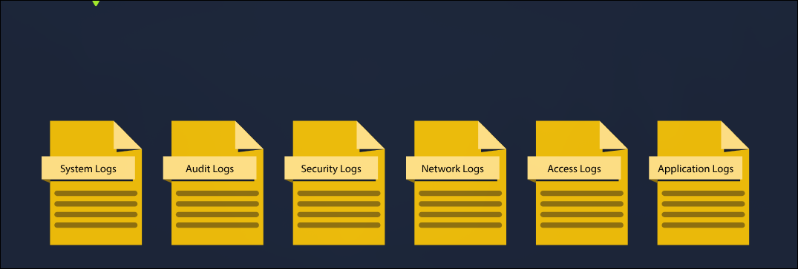

# TryHackMe: Logs Fundamentals

- **Room Link:** [Logs Fundamentals](https://tryhackme.com/room/logsfundamentals)
- **Kategori:** Defensive Security
- **Difficulty:** easy

---

Room ini bakal membahas tuntas soal apa itu _Logs_, kenapa penting banget, dan gimana cara kita ngebaca jejak-jejak digital.

## Introduction to Logs

Attacker pasti berusaha sebisa mungkin ngehapus jejak (meninggalkan _trace_ sesedikit mungkin) di sistem korban agar tidak ketahuan. Tapi kok tim Security tetep bisa mengetahui gimana serangannya terjadi, bahkan nemuin siapa dalangnya?

**Analoginya gini:**
Bayangin ada polisi lagi investigasi kasus orang hilang di gubuk tengah hutan salju.
Polisi nemuin petunjuk: pintu kayu hacur, atap jebol, jejak sepatu di salju, sama rekaman CCTV dari tetangga kejauhan. Dengan nyatuin kepingan-kepingan petunjuk (_traces_) ini, polisi akhirnya bisa tau kronologi dan siapa penjahatnya.

Nah, **Logs** di dunia cyber itu ibarat kepingan-kepingan petunjuk yang ditinggalin sama maling tadi. Kumpulan _traces_ dari berbagai sumber bakal digabungin buat jadi petunjuk menuju si kriminal.

Petunjuk (_traces_) ini punya peran super besar banget di dalam investigasi.
Sekarang kalau kejadiannya ada di dalam perangkat digital, di mana kita bisa nemuin _traces_ ini buat ngebantu investigasi lebih lanjut?

Jawabannya: **Logs**. Logs itu ibarat jejak kaki digital (_digital footprints_) yang ditinggalin setiap kali ada aktivitas apa pun (mau itu aktivitas wajar atau serangan jahat sekalipun). Dengan ngebaca logs ini, ngelacak sebuah aktivitas dan siapa dalang di baliknya bakal jadi jauh lebih gampang.

### Use Cases of Logs

Secara garis besar, ini dia beberapa area utama yang sangat bergantung sama logs buat bisa jalan dengan bener:

| Use Case | Description |
| :--- | :--- |
| **Security Events Monitoring** | Kalau dipantau secara langsung (_real-time_), logs ngebantu sistem buat ngedeteksi anomali (tingkah laku yang tidak wajar atau mencurigakan). |
| **Incident Investigation and Forensics** | Karena logs itu rekam jejak setiap aktivitas, tim Security bakal dapet info sedetail-detailnya pas lagi mencari akar masalah penyebab suatu insiden (Root Cause Analysis). |
| **Troubleshooting** | Sistem yang error atau aplikasi _crash_ juga kerasa banget kebantunya. Berdasarkan logs, masalah lebih gampang didiagnosa dan diperbaiki. |
| **Performance Monitoring** | Selain keamanan, logs juga menyediakan _insight_ / wawasan berharga soal bagus nggaknya performa aplikasi waktu lagi jalan. |
| **Auditing and Compliance** | Logs penting banget buat urusan kepatuhan peraturan (_compliance_). Punya jejak log mempermudah organisasi buktiin kalau mereka bersih dan legal dalam beraktivitas. |

### Learning Objectives

Setelah nyelesaiin _room_ ini, kita bakal belajar soal:
- Apa saja tipe-tipe logs.
- Gimana cara menganalisa logs.
- Melakukan analisa pada Windows Event logs.
- Melakukan analisa pada Web Access logs.

---

### Question

- Bisa kasih salah satu contoh kenapa _Auditing and Compliance_ sangat butuh campur tangan _Logs_?

## Types of Logs

Dari awal kita sudah tau betapa pentingnya _logs_. Tapi tunggu dulu, ada tantangan besar di sini. Bayangin kamu lagi menelusuri atau nginvestigasi _error_ (atau bahkan serangan dari _attacker_) di sebuah server. Kamu buka satu file _log_ utama server tersebut, lalu Kamu disuguhi puluhan ribu baris teks aneh yang isinya campur aduk dari berbagai macam _service_ sistem operasi tersebut. Pastinya kamu bakal _lost_ (kebingungan) mencari mana yang penting. Ini persis seperti disuruh mencari selembar struk ATM yang jatuh di tengah tumpukan gunungan sampah.

**Solusinya: (Pengelompokan)**

_Logs_ itu wajib banget dipecah dan dikelompokin ke dalam beberapa kategori terpisah berdasarkan "jenis informasi" yang mereka rekam. Dengan begitu, kamu cuma perlu mencari _log_ di "keranjang" log yang tepat sesuai sama insiden yang terjadi.

**Sebagai contoh:**
Kamu mau mencari _log_ rekaman kejadian orang nyoba _successful logins_ kemarin malem di OS Windows. Daripada kamu ngebaca ratusan ribu log yang isinya _random_ dari seluruh aktivitas OS secara keseluruhan, kamu cukup meluncur saja langsung ke bagian **Security Logs**. Informasi login-nya pasti nyangkut di situ. Simpel, presisi, dan hemat waktu investigasi secara efisien

Berdasarkan klasifikasi umumnya, ada beberapa tipe _logs_ utama yang biasa kita gunakan untuk mencari _traces_ saat kita berburu insiden:

| Tipe Log (_Log Type_) | Kegunaan Utama (_Usage_) | Contoh _Events_ (_Traces_) |
| :--- | :--- | :--- |
| **System Logs** | Sangat krusial buat diagnosa masalah di _Operating System_ (OS). OS bakal merekam semua aktivitas intinya di sini. (Bagi _attacker_, log ini sering dihapus/dimatikan agar aktivitas tak wajarnya ga tertangkap). | - _System Startup/Shutdown events_ - _Driver Loading events_ - _System Error events_ - _Hardware events_ |
| **Audit Logs** | Ibarat CCTV, fokus utamanya merakam pemenuhan aturan _compliance_ (kepatuhan laporan) seperti perubahan pada sistem oleh pengguna. Ini log *vital* bagi tim _Defensive_ untuk memantau aktivitas tak wajar dan menegakkan aturan (_Policy_). | - _Data Access events_ - _System Change events_ - _User Activity events_ - _Policy Enforcement events_ |
| **Security Logs** | Merekam semua aktivitas yang berkaitan langsung dengan autentikasi, otorisasi, dan hal-hal yang bersinggungan langsung dengan proteksi sistem keamanan. | - _Authentication events_ - _Authorization events_ - _Security Policy changes_ - _User Account changes_ - _Abnormal Activity events_ |
| **Network Logs** | Log buat nganalisa _traffic_ masuk/keluar di jaringan. Kalau ada anomali lalu-lintas data (seperti _beaconing malware_ atau *exfiltration* data yang ditranfser ke _Command and Control / C2 Server_ milik _attacker_), semuanya terekam di sini. | - _Incoming/Outgoing Network Traffic_ - _Network Connection Logs_ - _Network Firewall Logs_ |
| **Access Logs** | Mencatat sumber rinci secara spesifik setiap kali ada sebuah entitas yang me-request akses ke berbagai _resource_ dari layanan (_services_) tertentu, seperti *web server* atau *database*. | - _Webserver Access Logs_ - _Database Access Logs_ - _Application Access Logs_ - _API Access Logs_ |
| **Application Logs** | Merekam dinamika status yang terjadi spesifik di dalam sebuah aplikasi, entah itu interaksi yang dilakukan _user_ secara langsung maupun proses aplikasi yang berjalan di latar belakang tanpa disadari (_non-interactive_). | - _User Interaction events_ - _Application Changes events_ - _Application Update events_ - _Application Error events_ |

---

### Question

- Coba sebutin alasan logis paling utama kenapa _logs_ itu wajib dipisah-pisah golongannya?
- Kalau insting _OffSec/Forensic_ kamu jalan, kalau kita mau mengecek riwayat siapa saja yang berhasil (atau gagal) nyoba otentikasi login ke _remote server_ kita, kategori _log_ apa yang menurutmu bakal kamu bedah duluan?

## Windows Event Logs

Sebagai sistem operasi paling populer, **Windows** juga dilengkapi dengan mekanisme _logging_ bawaan yang lengkap. Sama seperti konsep di Task 2, Windows memisahkan rekaman aktivitasnya ke dalam berbagai kategori.

Secara umum, ada 3 kategori log utama di Windows yang sering dianalisa:

1.  **Application**
    Merekam aktivitas yang berhubungan dengan aplikasi, baik bawaan Windows maupun aplikasi pihak ketiga (_third-party_). Kalau ada aplikasi yang _error_, memberi _warning_, atau misal ada masalah kompatibilitas, semuanya bakal dicatat di sini.

2.  **System**
    Merekam aktivitas yang berhubungan langsung dengan komponen inti sistem operasi Windows itu sendiri. Ini mencakup informasi proses komputer saat nyala atau mati (_startup/shutdown_), _driver_, masalah _hardware_, hingga lalu-lintas _services_ Windows yang berjalan di *background*.

3.  **Security**
    Ini adalah log yang sangat penting buat urusan keamanan. Segala hal terkait autentikasi (kegagalan atau kesuksesan saat login), perizinan akses (_authorization_), proses menambah/menghapus akun _user_, sampai perubahan kebijakan keamanan (_security policy changes_) semuanya selalu direkam secara detail di sini.

### Event Viewer

Membaca _log_ yang formatnya cuma teks (_raw text_) biasa pastinya bakal membuat pusing karena isinya ribuan baris. Tapi untungnya Windows sudah memberi kemudahan.

Windows punya fitur bawaan bernama **Event Viewer** yang tampilannya menggunakan GUI (_Graphical User Interface_). Fitur ini sangat gampang dipakai untuk memfilter, mencari (_search_), dan menganalisa ribuan jejak aktivitas sistem tanpa perlu alat tambahan.

Cara aksesnya gampang banget. Kamu cukup buka **Start Menu**, terus ketikkan **Event Viewer**. Nantinya, semua jejak aktivitas yang terekam bakal disajikan di sana dengan rapi.

---

Berdasarkan *interface* dari Event Viewer tersebut, setiap _log_ kejadian di Windows punya informasi penting yang dibagi ke dalam beberapa kolom (*fields*) utama:

- **Description:** Kolom ini isinya detail kronologi dari *event* tersebut.
- **Log Name:** Kolom yang nandain apa nama _file log_ tempat kejadian ini dicatat (Misal: Security, System, dll).
- **Logged:** Kolom ini mencatat "waktu kejadian" (kapan pastinya aktivitas tersebut terjadi).
- **Event ID:** Ini adalah *nomor identitas unik* untuk setiap jenis kejadian.

**Kekuatan Event ID**
Daripada kita baca deskripsi _log_ satu per satu yang panjang banget, OS Windows sudah mengategorikan setiap jenis aktivitas pakai angka spesial (Event ID). Ini sangat krusial buat proses investigasi!

Contoh _real case_: Kalau kamu sebagai *Blue Team* mau investigasi siapa saja yang baru-baru ini berhasil *login*, kamu tidak perlu baca ribuan teks campur aduk. Kamu cukup nge-_filter_ angka **Event ID 4624** (identitas angka spesifik untuk aktivitas *successful login* di Windows). Beres!

---

Berikut ini adalah tabel daftar **Event ID** penting yang wajib diingat di Windows:

| Event ID | Description |
| :--- | :--- |
| **4624** | _A user account successfully logged in_ |
| **4625** | _A user account failed to login_ |
| **4634** | _A user account successfully logged off_ |
| **4720** | _A user account was created_ |
| **4724** | _An attempt was made to reset an account's password_ |
| **4722** | _A user account was enabled_ |
| **4725** | _A user account was disabled_ |
| **4726** | _A user account was deleted_ |

Sebenarnya masih banyak banget _Event ID_ lainnya di Windows selain yang ada di atas. Tidak perlu ngafalin semuanya, tapi setidaknya yang ada di tabel ini adalah Event ID yang paling sering muncul dan paling penting buat diingat saat investigasi.

## Web Server Access Logs Analysis

Setiap hari kita pasti berinteraksi sama *website*. Entah itu cuma sekadar baca artikel, _login_ ke akun, atau _upload_ file. Semua aksi yang kita lakuin ini disebut sebagai **request**.

Sebagai penyedia layanan, _web server_ (seperti Nginx atau *Apache*) bertugas mencatat setiap _request_ yang masuk ke dalam file *log* mereka. Kalau di lingkungan Linux, log akses _Apache_ ini biasanya ngumpet di direktori sakral `/var/log/apache2/access.log`.

Satu baris _log_ akses dari _web server_ ini menyimpan sekelumit data krusial tentang identitas si pengakses:

- **IP Address:** Alamat IP milik pengunjung (_user_ yang mengirim _request_).
- **Timestamp:** Stempel waktu kapan persisnya _request_ itu masuk ke server.
- **Request:** Berisi detail tipe permintaan yang dikirim (misal: `GET` buat mengambil halaman, `POST` buat mengirim data _login_). Termasuk juga URL _resource_ yang lagi diincar (misal mengakses halaman `/admin-panel`).
- **Status Code:** Kode angka balasan dari server. (Contoh: `200` berarti sukses masuk, `404` artinya halaman tidak ketemu, `500` berarti servernya _error_).
- **User-Agent:** Informasi _device_ pengunjung. Rekam jejak dari OS apa, aplikasi apa, atau _browser_ jenis apa yang dipakai pas mengirim _request_ tersebut.

### Senjata Command Line Linux buat Analisis Manual

Walau zaman sekarang sudah ada aplikasi _SIEM_ yang canggih, sebagai analis keamanan, kamu wajib kuasai *command line interface* (CLI) di terminal Linux

Berikut *tools* bawaan Linux yang bakal jadi teman harianmu buat ngebongkar _log file_ berbentuk *raw text*:

| Perintah (_Command_) | Kegunaan Utama saat Investigasi | Contoh Penggunaan |
| :--- | :--- | :--- |
| `cat` | Buat menampilkan seluruh isi file teks langsung ke layar terminal. | `cat access.log`  (Atau buat gabungin dua log jadi satu: `cat log1 log2 > combined_log`) |
| `grep` | Buat mencari kata kunci spesifik di dalam file. Kalau kamu cuma naruh IP _attacker_, baris log yang _nggak_ ada IP itu bakal diabaikan. | `grep "10.10.10.1" access.log` |
| `less` | Kalau file _log_-nya bergiga-giga, pakai ini agar layarnya tidak penuh. File bakal dibaca halaman per halaman (_page by page_). Tekan _Spacebar_ buat lanjut ke bawah. | `less access.log`   (Pro Tip: pas di dalam `less`, pencet `/` terus memasukkan teks buat ngelakuin pencarian cepat). |

---

### Question

- Anggaplah kamu menemukan rentetan baris _log_ Apache di mana ratusan _request_ `GET` dengan pola URL acak dan _Status Code_ `404` bermunculan dari satu buah IP unik dalam waktu 1 menit. Jika insting peretasanmu dipakai, indikasi serangan apakah ini?
- Kamu ditugaskan untuk secepat mungkin merangkum kemunculan *IP Address* dari seorang penyusup (`192.168.1.100`) di dalam sebuah file log akses raksasa tanpa menggunakan _mouse_. *Command* Linux apa yang paling efektif kamu eksekusi di terminal?
