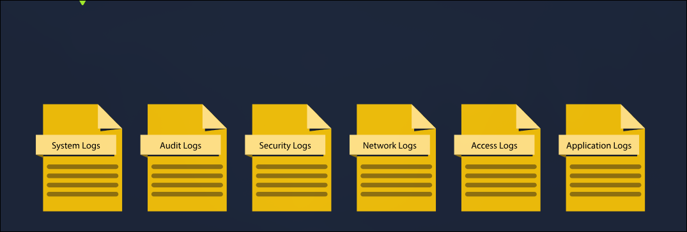

# TryHackMe: Logs Fundamentals

* **Room Link:** [Logs Fundamentals](https://tryhackme.com/room/logsfundamentals)
* **Kategori:** Defensive Security
* **Difficulty:** easy

---

Room ini membahas tuntas tentang apa itu _Logs_, kenapa sangat penting, dan bagaimana cara membaca jejak-jejak digital.

(Logs adalah sumber data utama yang dianalisis oleh tim [SOC](file:///home/dimm/CyberSec-Learning-Notes/THM-Notes/Cyber-Security-101/Defensive-Security/SOC-Fundamentals.md). Untuk analisis traffic jaringan secara visual, cek catatan [Wireshark Basic](file:///home/dimm/CyberSec-Learning-Notes/THM-Notes/Cyber-Security-101/Networking/Wireshark-basic.md))

## Introduction to Logs

Attacker pasti berusaha sebisa mungkin menghapus jejak (meninggalkan _trace_ sesedikit mungkin) di sistem korban agar tidak ketahuan. Tapi bagaimana tim Security tetap bisa mengetahui cara serangannya terjadi, bahkan menemukan siapa dalangnya?

**Analoginya gini:**
Bayangin ada polisi lagi investigasi kasus orang hilang di gubuk tengah hutan salju.
Polisi menemukan petunjuk: pintu kayu hancur, atap jebol, jejak sepatu di salju, dan rekaman CCTV dari tetangga. Dengan menyatukan kepingan-kepingan petunjuk (_traces_) ini, polisi akhirnya bisa mengetahui kronologi dan siapa penjahatnya.

Nah, **Logs** di dunia cyber itu seperti kepingan-kepingan petunjuk yang ditinggalkan oleh pencuri tadi. Kumpulan _traces_ dari berbagai sumber akan digabungkan buat jadi petunjuk menuju si kriminal.

Petunjuk (_traces_) ini punya peran sangat besar dalam investigasi. Kalau kejadiannya ada di dalam perangkat digital, di mana kita bisa menemukan _traces_ ini untuk membantu investigasi?

Jawabannya: **Logs**. Logs itu seperti jejak kaki digital (_digital footprints_) yang ditinggalkan setiap kali ada aktivitas apa pun (baik aktivitas wajar maupun serangan jahat). Dengan membaca logs ini, melacak sebuah aktivitas dan siapa dalang di baliknya menjadi jauh lebih mudah.

### Use Cases of Logs

Secara garis besar, ini beberapa area utama yang sangat bergantung pada logs untuk bisa berjalan dengan benar:

| Use Case | Description |
| :--- | :--- |
| **Security Events Monitoring** | Kalau dipantau secara langsung (_real-time_), logs membantu sistem mendeteksi anomali (tingkah laku yang tidak wajar atau mencurigakan). |
| **Incident Investigation and Forensics** | Karena logs adalah rekam jejak setiap aktivitas, tim Security mendapatkan info sedetail-detailnya saat mencari akar masalah penyebab suatu insiden (Root Cause Analysis). |
| **Troubleshooting** | Sistem yang _error_ atau aplikasi _crash_ juga sangat terbantu. Berdasarkan logs, masalah lebih mudah didiagnosa dan diperbaiki. |
| **Performance Monitoring** | Selain keamanan, logs juga menyediakan _insight_ berharga tentang performa aplikasi saat sedang berjalan. |
| **Auditing and Compliance** | Catatan *log* merupakan nyawa utama untuk urusan kepatuhan peraturan (_compliance_). Memiliki rekam jejak yang rapi membuat sebuah organisasi lebih tenang karena mereka punya bukti legal atas segala aktivitas jaringan mereka. |

### Learning Objectives

Setelah menyelesaikan _room_ ini, kita akan belajar tentang:
* Apa saja tipe-tipe logs.
* Bagaimana cara menganalisis logs.
* Melakukan analisis pada Windows Event logs.
* Melakukan analisis pada Web Access logs.

---

### Question

* Bisa kasih salah satu contoh kenapa _Auditing and Compliance_ sangat butuh campur tangan _Logs_?

## Types of Logs

Dari awal kita sudah tahu betapa pentingnya _logs_. Tapi ada tantangan besar di sini.

Bayangkan kamu sedang menelusuri atau menginvestigasi _error_ (atau bahkan serangan dari _attacker_) di sebuah server. Kamu membuka satu file _log_ utama, lalu disuguhi puluhan ribu baris teks aneh yang isinya campur aduk dari berbagai _service_. Pasti kebingungan mencari mana yang penting — seperti mencari selembar struk ATM di tengah tumpukan sampah.

**Solusinya: (Pengelompokan)**

_Logs_ wajib dipecah dan dikelompokkan ke dalam beberapa kategori terpisah berdasarkan "jenis informasi" yang mereka rekam. Dengan begitu, kamu cukup mencari _log_ di "keranjang" yang tepat sesuai insiden yang terjadi.

**Sebagai contoh:**
Kamu ingin mencari rekaman kejadian _successful logins_ kemarin malam di OS Windows. Daripada membaca ratusan ribu log _random_ dari seluruh aktivitas OS, kamu cukup langsung menuju bagian **Security Logs**. Informasi login pasti ada di situ. Simpel, presisi, dan hemat waktu.

Berdasarkan klasifikasi umumnya, ada beberapa tipe _logs_ utama yang biasa kita gunakan untuk mencari _traces_ saat kita berburu insiden:

| Tipe Log (_Log Type_) | Kegunaan Utama (_Usage_) | Contoh _Events_ (_Traces_) |
| :--- | :--- | :--- |
| **System Logs** | Sangat krusial buat diagnosa masalah di _Operating System_ (OS). OS akan merekam semua aktivitas intinya di sini. (Bagi _attacker_, log ini sering dihapus/dimatikan agar aktivitas tak wajarnya tidak tertangkap). | : _System Startup/Shutdown events_ - _Driver Loading events_ - _System Error events_ - _Hardware events_ |
| **Audit Logs** | Ibarat CCTV, fokus utamanya merakam pemenuhan aturan _compliance_ (kepatuhan laporan) seperti perubahan pada sistem oleh pengguna. Ini log *vital* bagi tim _Defensive_ untuk memantau aktivitas tak wajar dan menegakkan aturan (_Policy_). | : _Data Access events_ - _System Change events_ - _User Activity events_ - _Policy Enforcement events_ |
| **Security Logs** | Merekam semua aktivitas yang berkaitan langsung dengan autentikasi, otorisasi, dan hal-hal yang bersinggungan langsung dengan proteksi sistem keamanan. | : _Authentication events_ - _Authorization events_ - _Security Policy changes_ - _User Account changes_ - _Abnormal Activity events_ |
| **Network Logs** | Log buat menganalisis _traffic_ masuk/keluar di jaringan. Kalau ada anomali lalu-lintas data (seperti _beaconing malware_ atau *exfiltration* data yang ditranfser ke _Command and Control / C2 Server_ milik _attacker_), semuanya terekam di sini. | : _Incoming/Outgoing Network Traffic_ - _Network Connection Logs_ - _Network Firewall Logs_ |
| **Access Logs** | Mencatat sumber rinci secara spesifik setiap kali ada sebuah entitas yang me-request akses ke berbagai _resource_ dari layanan (_services_) tertentu, seperti *web server* atau *database*. | : _Webserver Access Logs_ - _Database Access Logs_ - _Application Access Logs_ - _API Access Logs_ |
| **Application Logs** | Merekam dinamika status yang terjadi spesifik di dalam sebuah aplikasi, entah itu interaksi yang dilakukan _user_ secara langsung maupun proses aplikasi yang berjalan di latar belakang tanpa disadari (_non-interactive_). | : _User Interaction events_ - _Application Changes events_ - _Application Update events_ - _Application Error events_ |

---

### Question

* Coba sebutin alasan logis paling utama kenapa _logs_ itu wajib dipisah-pisah golongannya?
* Kalau insting _OffSec/Forensic_ kamu jalan, kalau kita mau mengecek riwayat siapa saja yang berhasil (atau gagal) mencoba otentikasi login ke _remote server_ kita, kategori _log_ apa yang menurutmu akan kamu bedah duluan?

## Windows Event Logs

Sebagai sistem operasi paling populer, **Windows** juga dilengkapi dengan mekanisme _logging_ bawaan yang lengkap. Sama seperti konsep di Task 2, Windows memisahkan rekaman aktivitasnya ke dalam berbagai kategori.

Di dunia nyata, kita akan sering membedah 3 kategori *log* utama di ekosistem Windows:

1.  **Application**
    Merekam aktivitas yang berhubungan dengan aplikasi, baik bawaan Windows maupun aplikasi pihak ketiga (_third-party_). Kalau ada aplikasi yang _error_, memberi _warning_, atau misal ada masalah kompatibilitas, semuanya akan dicatat di sini.

2.  **System**
    Merekam aktivitas yang berhubungan langsung dengan komponen inti sistem operasi Windows itu sendiri. Ini mencakup informasi proses komputer saat menyala atau mati (_startup/shutdown_), _driver_, masalah _hardware_, hingga lalu-lintas _services_ Windows yang berjalan di *background*.

3.  **Security**
    Ini adalah log yang sangat penting buat urusan keamanan. Segala hal terkait autentikasi (kegagalan atau kesuksesan saat login), perizinan akses (_authorization_), proses menambah/menghapus akun _user_, sampai perubahan kebijakan keamanan (_security policy changes_) semuanya selalu direkam secara detail di sini.

### Event Viewer

Membaca _log_ yang formatnya cuma teks (_raw text_) biasa pastinya akan membuat pusing karena isinya ribuan baris. Tapi untungnya Windows sudah memberi kemudahan.

Windows punya fitur bawaan bernama **Event Viewer** yang tampilannya menggunakan GUI (_Graphical User Interface_). Fitur ini sangat gampang dipakai untuk memfilter, mencari (_search_), dan menganalisa ribuan jejak aktivitas sistem tanpa perlu alat tambahan.

Cara aksesnya gampang sekali. Kamu cukup buka **Start Menu**, terus ketikkan **Event Viewer**. Nantinya, semua jejak aktivitas yang terekam akan disajikan di sana dengan rapi.

---

Berdasarkan *interface* dari Event Viewer tersebut, setiap _log_ kejadian di Windows punya informasi penting yang dibagi ke dalam beberapa kolom (*fields*) utama:

* **Description:** Kolom ini isinya detail kronologi dari *event* tersebut.
* **Log Name:** Kolom yang menandai nama _file log_ tempat kejadian ini dicatat (Misal: Security, System, dll).
* **Logged:** Kolom ini mencatat "waktu kejadian" (kapan pastinya aktivitas tersebut terjadi).
* **Event ID:** Ini adalah *nomor identitas unik* untuk setiap jenis kejadian.

**Kekuatan Event ID**
Daripada kita baca deskripsi _log_ satu per satu yang panjang sekali, OS Windows sudah mengategorikan setiap jenis aktivitas pakai angka spesial (Event ID). Ini sangat krusial buat proses investigasi!

Contoh _real case_: Kalau kamu sebagai *Blue Team* mau investigasi siapa saja yang baru-baru ini berhasil *login*, kamu tidak perlu baca ribuan teks campur aduk. Kamu cukup memfilter angka **Event ID 4624** (identitas angka spesifik untuk aktivitas *successful login* di Windows). Beres!

---

Berikut ini adalah tabel daftar **Event ID** penting yang wajib diingat di Windows:

| Event ID | Description |
| :--- | :--- |
| **4624** | _A user account successfully logged in_ |
| **4625** | _A user account failed to login_ |
| **4634** | _A user account successfully logged off_ |
| **4720** | _A user account was created_ |
| **4724** | _An attempt was made to reset an account's password_ |
| **4722** | _A user account was enabled_ |
| **4725** | _A user account was disabled_ |
| **4726** | _A user account was deleted_ |

Kenyataannya, lautan _Event ID_ di Windows itu jumlahnya bejibun. Kamu tidak perlu menghafal semuanya di luar kepala, tapi jadikan tabel sakti di atas sebagai pegangan utama saat kamu terjun melacak jejak penyusupan.

## Web Server Access Logs Analysis

Setiap hari kita pasti berinteraksi dengan _website_ — membaca artikel, _login_ ke akun, atau _upload_ file. Semua aksi ini disebut sebagai **request**.

Sebagai penyedia layanan, _web server_ (seperti Nginx atau _Apache_) bertugas mencatat setiap _request_ yang masuk ke dalam file _log_ mereka. Di lingkungan Linux, log akses _Apache_ biasanya berada di `/var/log/apache2/access.log`.

Satu baris _log_ akses dari _web server_ ini menyimpan sekelumit data krusial tentang identitas si pengakses:

* **IP Address:** Alamat IP milik pengunjung (_user_ yang mengirim _request_).
* **Timestamp:** Stempel waktu kapan persisnya _request_ itu masuk ke server.
* **Request:** Berisi detail tipe permintaan yang dikirim (misal: `GET` untuk mengambil halaman, `POST` untuk mengirim data _login_). Termasuk juga URL _resource_ yang diakses (misal `/admin-panel`).
* **Status Code:** Kode angka balasan dari server. (Contoh: `200` berarti sukses, `404` artinya halaman tidak ditemukan, `500` berarti server _error_).
* **User-Agent:** Informasi _device_ pengunjung — OS apa, aplikasi apa, atau _browser_ jenis apa yang digunakan saat mengirim _request_ tersebut.

### Linux CLI Tools for Log Analysis

Meskipun sudah ada aplikasi _SIEM_ yang canggih, sebagai analis keamanan kamu wajib menguasai _command line interface_ (CLI) di terminal Linux.

Berikut _tools_ bawaan Linux yang menjadi teman harian untuk membedah _log file_ berbentuk _raw text_:

| Perintah (_Command_) | Kegunaan Utama saat Investigasi | Contoh Penggunaan |
| :--- | :--- | :--- |
| `cat` | Menampilkan seluruh isi file teks langsung ke layar terminal. | `cat access.log`  (Atau untuk menggabungkan dua log: `cat log1 log2 > combined_log`) |
| `grep` | Mencari kata kunci spesifik di dalam file. Baris log yang tidak mengandung kata kunci tersebut akan diabaikan. | `grep "10.10.10.1" access.log` |
| `less` | Kalau file _log_-nya bergiga-giga, gunakan ini agar layar tidak penuh. File dibaca halaman per halaman (_page by page_). Tekan _Spacebar_ untuk lanjut. | `less access.log`   (Pro Tip: di dalam `less`, tekan `/` lalu masukkan teks untuk melakukan pencarian cepat). |

---

### Question

* Anggaplah kamu menemukan rentetan baris _log_ Apache di mana ratusan _request_ `GET` dengan pola URL acak dan _Status Code_ `404` bermunculan dari satu buah IP unik dalam waktu 1 menit. Jika insting peretasanmu dipakai, indikasi serangan apakah ini?
* Kamu ditugaskan untuk secepat mungkin merangkum kemunculan *IP Address* dari seorang penyusup (`192.168.1.100`) di dalam sebuah file log akses raksasa tanpa menggunakan _mouse_. *Command* Linux apa yang paling efektif kamu eksekusi di terminal?
