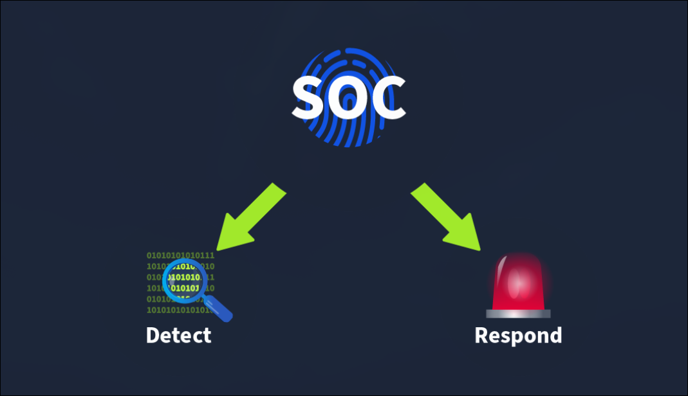
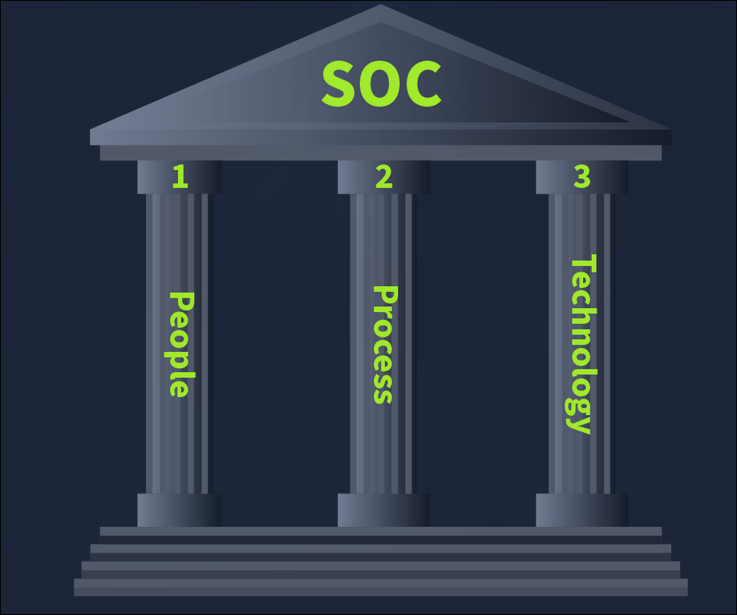
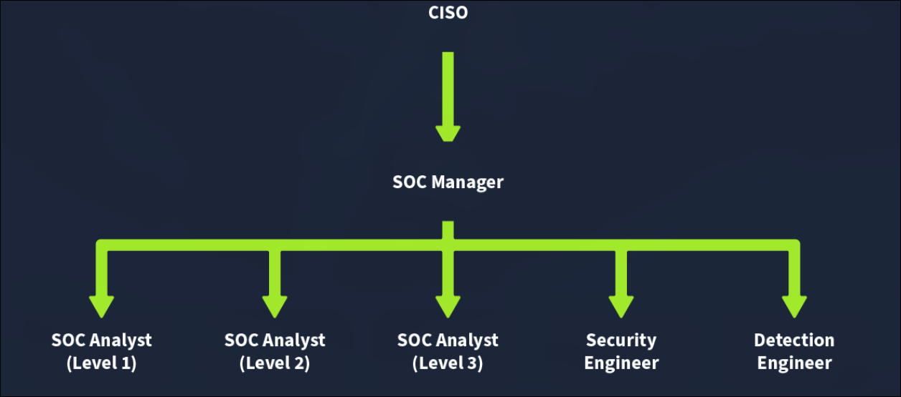
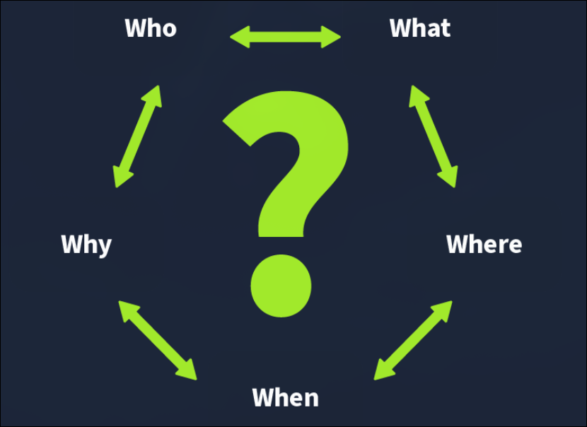

# TryHackMe: SOC Fundamentals

- **Room Link:** [SOC Fundamentals](https://tryhackme.com/room/socfundamentals)
- **Kategori:** Defensive Security
- **Difficulty:** easy

## Introduction to SOC

**SOC** (_Security Operations Center_) = tim spesialis keamanan yang memantau, mendeteksi, dan merespons ancaman cyber 24/7.

Kenapa butuh SOC? Karena data organisasi sekarang serba digital → target empuk _Threat Actors_ → keamanan tradisional (antivirus/firewall biasa) udah gak cukup.

**Learning Objectives:** Pondasi SOC, taktik Detection & Response, peran People/Processes/Technology, hands-on.

## Purpose And Component

### Detection
- **Detect vulnerabilities** — Temuin sistem yang belum di-patch / punya celah keamanan
- **Detect unauthorized activity** — Deteksi login mencurigakan (IP/lokasi gak wajar)
- **Detect intrusions** — Akses ilegal yang berhasil masuk (exploit, malware)

### Response
- **Incident Response** — Minimalisir kerusakan + lacak root cause

### The Trinity of SOC

Tiga pilar SOC: **People** (manusia), **Processes** (prosedur), **Technology** (tools). Ketiganya harus jalan bareng buat pertahanan yang matang.

## People

Otomatisasi tetep butuh manusia karena **Alert Fatigue** — terlalu banyak _False Positives_ dari security solutions → manusia yang validasi mana ancaman beneran.

### SOC Team Roles:
- **SOC Analyst L1** — First responder, alert triage, filter False Positives
- **SOC Analyst L2** — Investigasi lebih dalam, correlate log data
- **SOC Analyst L3** — Threat Hunting, komando Incident Response kritis
- **Security Engineer** — Deploy & konfigurasi infrastruktur security
- **Detection Engineer** — Bikin & pertajam Security Rules
- **SOC Manager** — Atur Processes, lapor ke CISO

> **Note:** Struktur tim SOC fleksibel, tergantung skala organisasi.

**Q&A:**
- Fenomena "kebisingan" akibat tumpukan False Positives? → **?**
- Kenapa butuh Human Intervention? → **?**
- First responder yang lakuin alert triage? → **?**
- Analis yang correlate log data? → **?**
- Analis yang Threat Hunting & komando IR? → **?**
- Yang deploy infrastruktur security? → **?**
- Yang bikin Security Rules? → **?**
- Yang atur Processes & lapor ke CISO? → **?**

## Processes

### Alert Triage
Langkah pertama SOC — klasifikasi severity tiap alert pake **5 Ws:**

**Contoh:** Alert `Malware detected on Host: GEORGE PC`

| 5W | Jawaban |
|---|---|
| **What?** | Malicious file terdeteksi di host |
| **When?** | 13:20, 5 Juni 2024 |
| **Where?** | Komputer "GEORGE PC" |
| **Who?** | User George |
| **Why?** | Download software bajakan dari web ilegal |

### Reporting
Alert yang valid → diubah jadi **tiket eskalasi** ke L2/L3 + sertakan 5Ws & screenshots.

### Incident Response and Forensics
Kasus kritis → L3/Incident Responder jalanin tanggap darurat + forensics buat cari root cause.

## Technology

Security solutions utama di SOC:

- **SIEM** (Security Information and Event Management) — Kumpulin logs dari semua perangkat → cocokkin sama detection rules → alert kalau match. Cuma **Detection**.
- **EDR** (Endpoint Detection and Response) — Visibilitas real-time di setiap endpoint → bisa investigasi & respons langsung.
- **Firewall** — Filter traffic masuk/keluar jaringan → blok traffic mencurigakan.

> **Note:** SIEM = Detection only. EDR = Detection + Response. Firewall = Network security.
