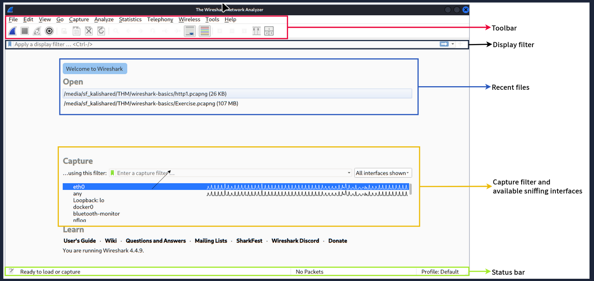
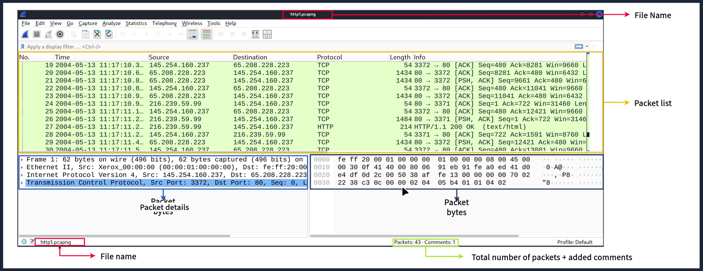
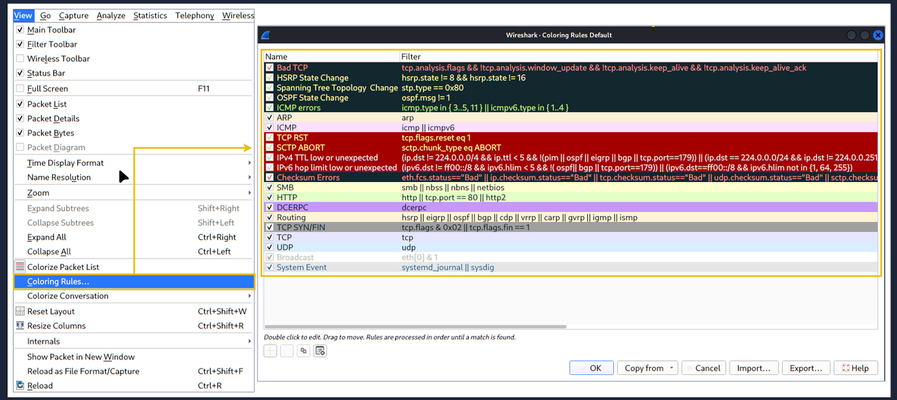

# TryHackMe: Wireshark: The Basics

---

- **Room Link:** [TryHackMe](https://tryhackme.com/room/wiresharkthebasics)
- **Category:** Networking / Analysis tool
- **Difficulty:** Easy

---

## Task 1: Introduction

**Wireshark** adalah alat analisis paket jaringan (*open-source*) yang paling populer di dunia. Ibarat sebuah **mikroskop** atau **mesin X-Ray** buat jaringan — dia membuat kita bisa melihat apa yang sebenarnya terjadi di dalam jaringan atau udara (Wi-Fi), membedah setiap bit data yang lewat.

**Kegunaan Utama:**
- **Sniffing:** Mengintip traffic yang sedang jalan secara *live*.
- **Investigating PCAP:** Membedah rekaman traffic (file `.pcap`) yang sudah diambil sebelumnya.

### Learning Objectives (Tujuan Kita):
Di room ini, kita bakal fokus menguasai:
1. Navigasi dan konfigurasi dasar Wireshark.
2. Membedah paket buat mencari informasi di setiap lapisan **TCP/IP**.
3. Cara pakai **Display Filters** buat memfilter data yang kita butuhkan.

---

## Tool Overview

### Use Cases (Kapan Kita Pakai Wireshark?)
Wireshark bisa dipakai buat banyak hal:
1. **Troubleshooting Jaringan:** Mendeteksi titik kegagalan (*failure points*) atau kemacetan (*congestion*) di jaringan.
2. **Mendeteksi Anomali Keamanan:** Mencari *host* mencurigakan, penggunaan *port* yang tidak biasa, atau *traffic* nakal.
3. **Mempelajari Protokol:** Menginvestigasi detail protokol seperti *response code* HTTP atau isi *payload* data.

> **Catatan Penting:** Wireshark **BUKAN** *Intrusion Detection System* (IDS). Dia tidak bisa mencegah serangan atau memberi peringatan otomatis. Dia hanya mengizinkan kita membedah paket secara mendalam dan dia **tidak memodifikasi** paket, cuma membacanya. Jadi, mendeteksi anomali itu bergantung penuh pada wawasan si analyst.

### GUI and Data
Tampilan antarmuka utama Wireshark dibagi menjadi 5 bagian penting:

| Bagian GUI | Penjelasan Fungsinya |
| ---------- | -------------------- |
| **Toolbar** | Menu utama yang berisi *shortcuts* untuk *packet sniffing*, *filtering*, menyortir, meringkas, mengekspor, atau menggabungkan file `.pcap`. |
| **Display Filter Bar** | Kolom utama untuk mengetik *query filter* (menyaring data yang lagi dilihat). |
| **Recent Files** | Daftar file yang barusan dibuka/dianalisis. Bisa diklik untuk buka lagi kalau ingin melanjutkan analisis. |
| **Capture Filter and Interfaces** | Tempat mengatur *capture filter* (filter yang jalan **sebelum** merekam) dan memilih capture interface (misal: antarmuka jaringan seperti `eth0`, `lo`, atau `ens33`). |
| **Status Bar** | Baris paling bawah yang menunjukkan status *tool*, profil, dan informasi nomor paket. |

Gambar dibawah menunjukkan tampilan utama Wireshark, juga bagian yang disorot sudah dijelaskan di atas:

### Loading a PCAP File

Sebelum membedah data, kita harus memasukkan file rekamannya (`.pcap` atau `.pcapng`). Caranya simple:
1. Pakai menu **File > Open**,
2. **Drag & drop** file langsung ke jendela Wireshark, atau
3. Cukup **klik ganda** di file `.pcap` yang mau di analisis.

Begitu file masuk, tampilan layar akan penuh dengan barisan data yang terlihat seperti bahasa *matrix*. Agar tidak *overwhelmed*, Kita cuma perlu fokus ke **3 jendela utama (*panes*)** ini. 

Ibarat kita lagi jadi detektif yang meriksa surat, 3 jendela ini mewakili kedalaman analisisnya:

| Jendela Utama (*Pane*) | Fungsi & Analogi Detektif |
| ---------------------- | ------------------------- |
| **1. Packet List** | **Ibarat Buku Tamu.** Ini adalah daftar panjang semua paket (mobil kurir) yang tertangkap. Di sini Kita bisa lihat rangkuman *high-level*: nomor urut, jam lewat (*Time*), siapa pengirim (*Source*), ke mana tujuannya (*Destination*), jalur yang dipakai (*Protocol*), dan info singkatnya. |
| **2. Packet Details** | **Ibarat Membongkar Isi Amplop Surat.** Kalau Kita klik salah satu baris di *Packet List*, jendela tengah ini bakal mengurai isi paketnya berlapis-lapis sesuai *OSI Layers*. Dari mulai bungkus luar (lapisan fisik/MAC) sampai ke inti jeroannya (protokol aplikasi seperti HTTP). |
| **3. Packet Bytes** | **Ibarat Melihat DNA / Atom dari Suratnya.** Ini adalah bentuk data paling mentah, Bagian ini menampilkan data paket dalam wujud *Hexadecimal* (angka *hex*) dan *ASCII* (teks yang bisa dibaca manusia). Terkadang Kita bisa nemu teks *password* atau *payload* tersembunyi bertebaran di sini. |

Di pojok pojok layar Wireshark yang lagi aktif, ada informasi penunjang tambahan:
- **File Name:** Nama file pcap yang lagi dibuka (ada di *tab browser* atas, dan *status bar* bawah kiri).
- **Total Packets:** Total jumlah baris catatan (jumlah paket) yang berhasil terekam (di *status bar* bawah kanan).

Biar kebayang gimana, liat gambar di bawah ini yang menyorot 3 jendela utama tadi:

---

### Colouring Packets

Pernah merhatiin kenapa baris-baris paket di Wireshark punya warna beda-beda? Itu bukan buat hiasan doang. Wireshark pakai sistem pewarnaan biar mata kita gampang menemukan masalah (anomali) atau protokol tertentu tanpa harus membaca detailnya satu per satu. 

Wireshark punya **Dua Jenis Metode Pewarnaan**:

| Jenis Pewarnaan | Karakteristik | Cara Akses |
| :--- | :--- | :--- |
| **Permanent Rules** | Aturan paten yang disimpen di profil lo. Aturan ini bakal tetep ada tiap kali lo buka Wireshark lagi di sesi berikutnya. | Klik menu **View > Coloring Rules** *(Bisa juga buat bikin rule custom sendiri)* |
| **Temporary Rules** | Aturan sementara yang cuma aktif selama sesi Wireshark. Kalau aplikasinya ditutup, warnanya ilang. | Klik kanan di paket **Colorize Conversation** (atau via menu **View > Conversation Filter**) |

Biar tampilan warnanya aktif (atau kalau mau matiin biar polos aja), bisa pakai opsi **View > Colorise Packet List**.

Coba cek penampakan *Coloring Rules Default* dari Wireshark di bawah ini:

---
