# TryHackMe: Wireshark: The Basics

---

- **Room Link:** [TryHackMe](https://tryhackme.com/room/wiresharkthebasics)
- **Category:** Networking / Analysis tool
- **Difficulty:** Easy

---

## Task 1: Introduction

**Wireshark** adalah alat analisis paket jaringan (_open-source_) yang paling populer di dunia. Ibarat sebuah **mikroskop** untuk jaringan — memungkinkan kamu melihat apa yang sebenarnya terjadi di dalam kabel jaringan atau udara (Wi-Fi), membedah setiap bit data yang lewat.

**Kegunaan Utama:**
- **Sniffing:** Memantau _traffic_ yang sedang berjalan secara _live_.
- **Investigating PCAP:** Membedah rekaman _traffic_ (file `.pcap`) yang sudah diambil sebelumnya.

### Learning Objectives
Di room ini, kamu akan fokus menguasai:
1. Navigasi dan konfigurasi dasar Wireshark.
2. Membedah paket untuk mencari informasi di setiap lapisan **TCP/IP**.
3. Cara menggunakan **Display Filters** untuk menyaring data yang dibutuhkan.

---

## Tool Overview

### Use Cases
Wireshark bisa digunakan untuk banyak hal:
1. **Troubleshooting Jaringan:** Mencari titik masalah (_failure points_) atau kemacetan (_congestion_) di jaringan.
2. **Mendeteksi Anomali Keamanan:** Mencari _host_ mencurigakan, pemakaian _port_ yang tidak wajar, atau _traffic_ nakal.
3. **Mempelajari Protokol:** Mempelajari detail protokol seperti _response code_ HTTP atau isi _payload_ data.

> **Catatan Penting:** Wireshark **BUKAN** _Intrusion Detection System_ (IDS). Dia tidak bisa mencegah serangan atau memberikan peringatan otomatis. Dia hanya memberikan jalan untuk membedah paket sedalam mungkin dan **tidak memodifikasi** paket — murni hanya membaca. Jadi, urusan deteksi bergantung penuh pada insting kamu sebagai analis.

### GUI and Data
Tampilan utama Wireshark dibagi menjadi 5 bagian penting:

| Bagian GUI | Fungsi |
| ---------- | ------ |
| **Toolbar** | Menu utama berisi _shortcuts_ untuk _packet sniffing_, _filtering_, menyortir, meringkas, ekspor, atau menggabungkan file `.pcap` |
| **Display Filter Bar** | Kolom penelusuran utama untuk mengetik _query filter_ (menyaring data yang sedang ditampilkan) |
| **Recent Files** | Daftar file rekaman yang baru dibuka. Klik untuk melanjutkan analisis |
| **Capture Filter and Interfaces** | Tempat mengatur _capture filter_ (aturan saringan **sebelum** mulai merekam) dan memilih antarmuka (misal: `eth0`, `lo`, atau `ens33`) |
| **Status Bar** | Baris paling bawah yang menampilkan status _tool_, profil, dan jumlah paket |

Gambar di bawah menunjukkan tampilan utama Wireshark:

### Loading a PCAP File

Sebelum mulai membedah data, kamu harus memasukkan file rekamannya (`.pcap` atau `.pcapng`). Caranya cukup sederhana:
1. Lewat menu **File > Open**,
2. **Drag & drop** file langsung ke jendela Wireshark, atau
3. **Klik ganda** di file `.pcap` yang mau dianalisis.

Begitu file masuk, layar akan penuh barisan data. Supaya tidak _overwhelmed_, kamu cukup fokus ke **3 jendela utama (_panes_)**. Ibarat kamu menjadi detektif yang memeriksa surat, 3 jendela ini mewakili tingkat kedalaman analisis:

| Jendela Utama (_Pane_) | Fungsi |
| ---------------------- | ------ |
| **1. Packet List** | **Ibarat buku tamu.** Daftar semua paket yang tertangkap. Menampilkan rangkuman _high-level_: nomor urut, waktu, pengirim (_Source_), tujuan (_Destination_), protokol, dan info singkat |
| **2. Packet Details** | **Ibarat membuka isi amplop surat.** Mengurai isi paket berlapis-lapis sesuai teori _OSI Layers_ — dari bungkus luar (lapisan fisik/MAC) sampai ke inti (protokol aplikasi seperti HTTP) |
| **3. Packet Bytes** | **Data paling mentah.** Menampilkan data paket dalam wujud _Hexadecimal_ dan _ASCII_. Kadang kamu bisa menemukan teks _password_ atau _payload_ tersembunyi di sini |

Informasi tambahan di pojok layar:
- **File Name:** Nama file pcap yang sedang dibuka (di _status bar_ sudut kiri bawah).
- **Total Packets:** Jumlah paket yang terekam (di _status bar_ sudut kanan bawah).

---

### Colouring Packets

Barisan paket di Wireshark punya warna yang berbeda-beda — itu bukan hiasan. Wireshark menggunakan sistem pewarnaan supaya mata kamu mudah mengenali anomali atau menemukan protokol tertentu tanpa harus memeriksa detail satu per satu.

Wireshark punya **Dua Jenis Metode Pewarnaan**:

| Jenis Pewarnaan | Karakteristik | Cara Akses |
| :--- | :--- | :--- |
| **Permanent Rules** | Aturan tetap yang disimpan di profil. Tetap ada setiap kali Wireshark dibuka | **View > Coloring Rules** (bisa juga untuk membuat rule custom) |
| **Temporary Rules** | Aturan sementara yang hanya aktif selama sesi berjalan. Hilang saat aplikasi ditutup | Klik kanan di baris paket > **Colorize Conversation** |

Untuk mengaktifkan/menonaktifkan pewarnaan: **View > Colorise Packet List**.

---

### Traffic Sniffing

Selain membaca file rekaman (PCAP), keahlian unggulan Wireshark adalah kemampuannya untuk _sniffing_ atau memantau _traffic_ jaringan secara _live_.

Di bagian kiri _Toolbar_ atas, ada 3 tombol untuk melakukan _sniffing_:

- **Blue Shark Button (Start):** Mulai menangkap _traffic_ yang sedang berjalan di jaringan.
- **Red Square Button (Stop):** Menghentikan penangkapan.
- **Green Arrow Button (Restart):** Mengulang proses _sniffing_ dari awal.

Saat _sniffing_ berjalan, kamu bisa memeriksa bagian _Status Bar_ (paling bawah layar):
1. **Interface yang Dipakai:** (Contoh: `eth0`) Memastikan jalur yang dipantau benar.
2. **Jumlah Paket:** (Contoh: `Packets: 122`) Menunjukkan seberapa banyak data yang sudah terkumpul.

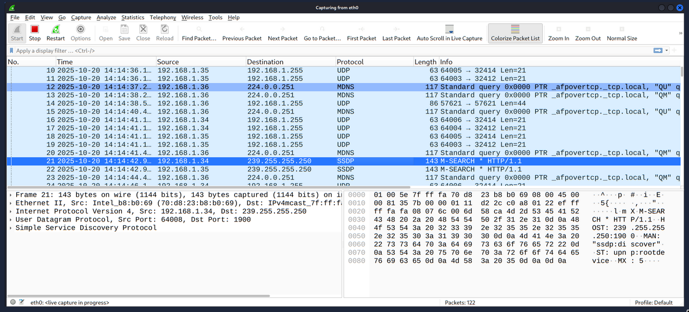

---

### Merge PCAP Files

Wireshark juga punya fitur untuk menggabungkan dua file `.pcap` menjadi satu file utuh:

1. Pastikan kamu sudah membuka satu file pcap utama di Wireshark.
2. Buka menu **File > Merge**.
3. Pilih file pcap kedua yang mau digabungkan.
4. Wireshark akan menampilkan estimasi total paket dari file kedua.
5. Klik **Open**, dan dua file akan menyatu menjadi satu _merged workspace_ (ditandai nama menjadi _Untitled_).

**Ingat:** Hasil gabungan sifatnya masih _temporary_ — **jangan lupa klik Save As** untuk menyimpan file PCAP gabungan sebelum memulai analisis.

### View File Details

Mengetahui identitas asli dari file pcap yang sedang kamu analisis itu penting, apalagi kalau menangani banyak file dari kasus yang berbeda-beda. Di bagian _File Details_, kamu bisa melihat info krusial:
- **File hash** (SHA256/MD5 untuk bukti forensik — membuktikan file belum dimodifikasi)
- **Capture time** (Kapan _traffic_ ini direkam)
- **Komentar file** (Catatan dari analis lain yang menangani file sebelumnya)
- **Interface & Statistics** (Jumlah paket dan byte data yang terekam)

Ada **dua cara** cepat untuk membuka jendela detail:
1. Lewat menu atas: **Statistics > Capture File Properties**
2. Lewat _shortcut_ GUI: Klik **icon pcap kecil di pojok kiri bawah** (di sebelah nama file).

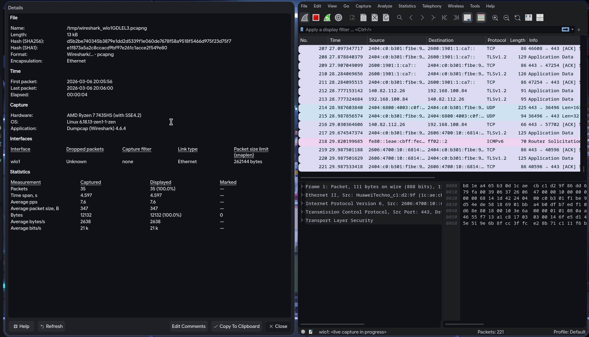

---

## Packet Dissection

_Packet dissection_ (bedah paket) intinya adalah menerjemahkan detail isi paket ke dalam wujud protokol dan kolom-kolom yang mudah dibaca. Wireshark memiliki banyak dukungan protokol bawaan, dan kamu bahkan bisa membuat _dissector scripts_ sendiri.

> **Note:** Kemampuan ini sangat bergantung pada seberapa paham kamu tentang konsep **OSI Model**. Pastikan pondasi OSI Layer kamu sudah kuat supaya membaca hasil _dissection_ terasa mudah.

### Packet Details (Layer by Layer)

Masih ingat **Jendela Tengah (_Packet Details_)** yang sudah dibahas sebelumnya? Ini adalah inti kemampuan Wireshark. Saat kamu mengeklik salah satu paket di _Packet List_, Wireshark akan membuka "amplop" paket tersebut berlapis-lapis sesuai konsep OSI Model.

Lapisan ini biasanya ada **5 sampai 7 tingkat**. Di bawah ini contoh membedah Paket HTTP nomor urut 27 — blok merah menandai pembagian lapisannya dari `Frame` (paling fisik) sampai `Hypertext Transfer Protocol` (paling abstrak/aplikasi).

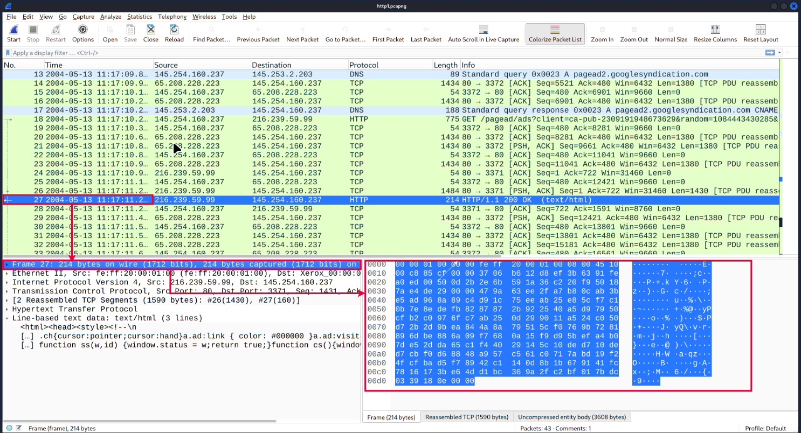

Setiap kali kamu mengeklik barisan informasi di **Packet Details**, jendela bawahnya (**Packet Bytes**) akan memberikan _highlight_ (warna biru) ke tampilan bytes mentah (_hex_) dari info yang sedang dipilih. Ini membuktikan bahwa apa yang ditampilkan di _Details_ adalah terjemahan langsung dari data mentahnya (_Bytes_).

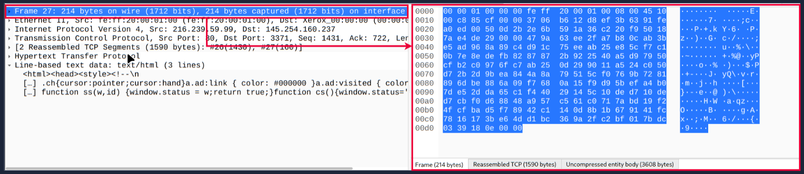

Kalau kamu memperbesar (_zoom-in_) jendela _Packet Details_, kamu bisa melihat ada **7 lapisan utama** yang mengurai detail paket dari fisik naik ke aplikasi:

1. **`frame/packet`** — Rangkuman paket mentah & dari _interface_ mana ditangkap
2. **`source [MAC]` / Ethernet II** — Alamat fisik (_MAC Address_) pengirim & penerima
3. **`source [IP]` / IPv4/v6** — Alamat logika (_IP Address_) pengirim & penerima
4. **`protocol` / TCP/UDP** — Jalur komunikasi (misal TCP _port_ 80 / 443)
5. **`protocol errors`** — Sisa atau _reassembly_ dari potongan TCP (jika ada)
6. **`application protocol`** — Protokol tingkat atas (contoh: HTTP, DNS, FTP)
7. **`application data`** — Inti data yang sedang dikirim (misal isi teks _HTML_)

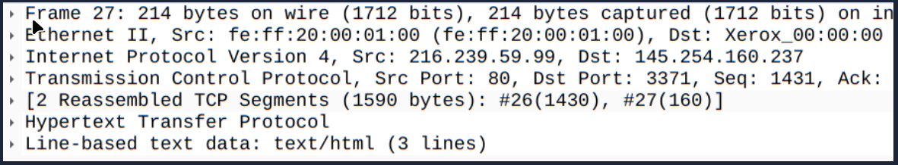

---

### The Frame (Layer 1)

Ini adalah lapisan terdasar yang merepresentasikan spesifikasi **Physical** (Fisik) pada model OSI. Bagian ini murni menceritakan "informasi penangkapan" paket, bukan membahas isi datanya. Di sini kamu bisa memeriksa detail metadata:
- **Frame Number:** Paket ke berapa yang sedang kamu lihat.
- **Arrival Time:** Cap waktu spesifik kapan paket ini sampai.
- **Length:** Ukuran asli paket di kabel (_bytes on wire_) vs ukuran yang berhasil direkam Wireshark (_captured_).
- Status rekaman dan _interface_ yang digunakan.

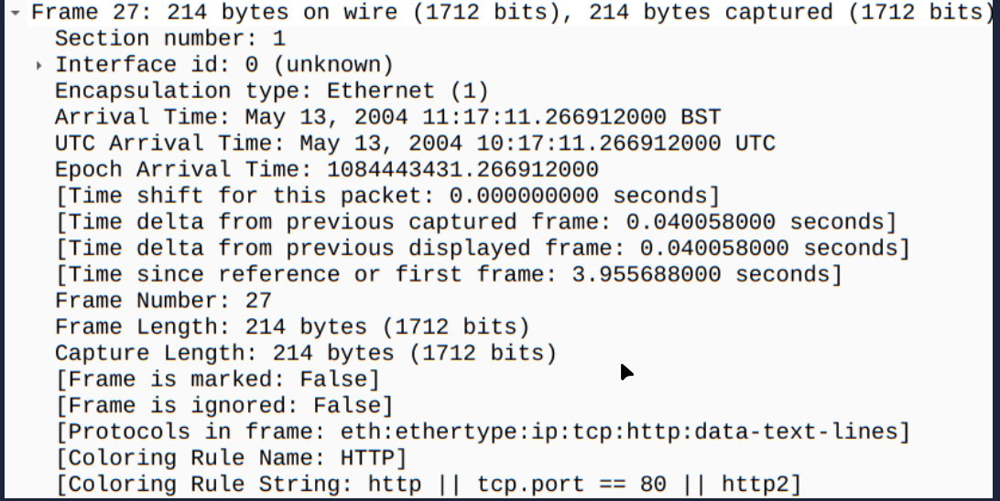

---

### Source [MAC] (Layer 2)

Ini adalah lapisan _Data Link_. Di sini kamu mulai membahas identitas perangkat keras di jaringan lokal. Bagian ini menampilkan **MAC Address** dari mesin pengirim (_Source_) dan mesin penerima (_Destination_).

Kalau kamu meng-_expand_ bagian _Ethernet II_ ini, kamu tidak hanya melihat nomor seri MAC-nya, tapi kadang bisa teridentifikasi juga vendor/merek _network card_ (NIC) yang digunakan oleh perangkat tersebut (misal: Xerox, Intel, Apple).

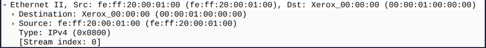

---

### Source [IP] (Layer 3)

Naik satu tingkat ke fungsi _routing_, ini merepresentasikan _Network Layer_ di OSI. Kalau di Layer 2 kamu berurusan dengan MAC Address (sesama mesin lokal), di Layer 3 kamu berurusan dengan **IPv4/IPv6 Address** (publik/antar jaringan luas).

Di bagian _Internet Protocol Version 4/6_, kamu bisa mengekstrak banyak info penting:
- Siapa IP sumbernya (Source) & siapa targetnya (Destination).
- Panjang alamat _header_.
- _Time to Live_ (TTL) — umur paket sebelum dibuang dari jaringan (informasi penting untuk menebak _Operating System_ mesin target).
- Protokol di atasnya menggunakan apa (misal TCP atau UDP).

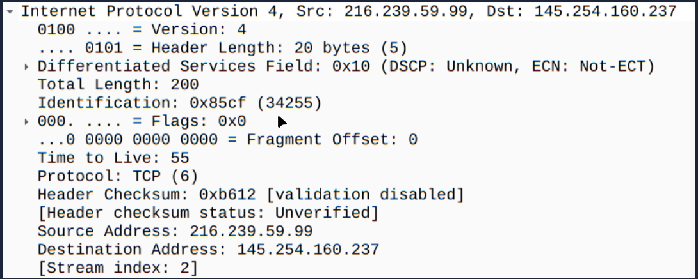

---

### Protocol (Layer 4)

Sekarang kita masuk ke ranah _Transport_ OSI Layer. Di bagian ini Wireshark menjabarkan cara data dikirim. Yang paling sering muncul adalah **TCP** (jalur aman — paket dijamin sampai berurutan) atau **UDP** (jalur cepat — tidak peduli kalau ada paket yang hilang di jalan).

Bagian _Transmission Control Protocol_ (jika menggunakan TCP) sangat detail. Kamu bisa menginvestigasi:
- **Source Port & Destination Port:** (Contoh: _Port_ 80 untuk HTTP, _Port_ 443 untuk HTTPS).
- **Sequence (Seq) & Acknowledgment (Ack) Number:** Sistem "nomor antrean" paket TCP supaya data tidak tertukar dan dikonfirmasi oleh penerima.
- **Flags:** Status spesifik dari koneksi (misal: SYN untuk memulai koneksi, FIN untuk menutup koneksi, PSH untuk mengirim data).

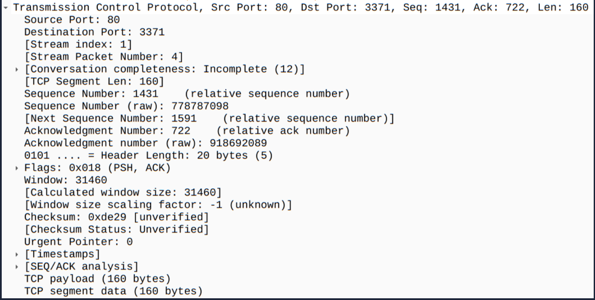

---

### Protocol Errors (Layer 4 Extension)

Lapisan kelima ini sejatinya masih ekstensi dari Layer 4 (Transport). Kamu tidak akan selalu menemukan blok ini di setiap paket.

Kalau datanya terlalu besar (misal saat mengirim file gambar atau kode HTML panjang), paketnya akan dipotong menjadi banyak segmen TCP kecil. Wireshark cukup pintar untuk mengumpulkan dan merakit ulang (_Reassembled_) potongan data TCP tersebut, sehingga kamu bisa melihat wujud aslinya di baris ini sebelum data naik ke Layer 7 (Aplikasi).

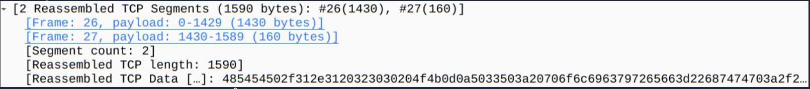

---

### Application Protocol (Layer 5/7)

Akhirnya sampai di lapisan yang paling dekat dan sering digunakan manusia sehari-hari: _Application Layer_. Di sinilah Wireshark membedah protokol spesifik dari aplikasi yang sedang digunakan — contohnya **HTTP** saat _browsing_, **FTP** untuk transfer file, atau **DNS** untuk mencari alamat web domain.

Di contoh screenshot berikut, protokolnya adalah _Hypertext Transfer Protocol_ (HTTP). Kamu bisa menemukan informasi penting:
- _Request_ apa yang diminta klien (misal `GET /page.html`).
- _Response Code_ jawaban dari server (misal `200 OK` atau `404 Not Found`).
- Jenis konten (_Content-Type_: text/html, image/png).
- Informasi teknis _header_ lainnya seperti _Host/Server_ dan _Date_.

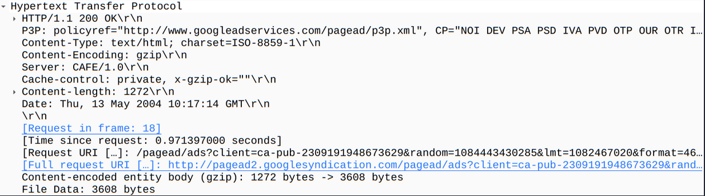

---

### Application Data (The Payload)

Ini adalah ujung perjalanan — _Application Data / Line-based text data_ — yang menampilkan secara terang-terangan **isi asli** dari paket yang dikirim.

Kalau protokolnya tidak dienkripsi (misal HTTP biasa, bukan HTTPS), kamu bisa membaca isi data tanpa halangan. Di contoh screenshot, Wireshark menampilkan file _script/HTML_ mentahnya (terlihat kode tag `<html><head>...`).

Bayangkan skenarionya: kamu menangkap _traffic_ dari _form login_ HTTP — _password_ asli korban (_plain text_) akan terlihat jelas di baris ini. Makanya web modern wajib menggunakan SSL/TLS (HTTPS).

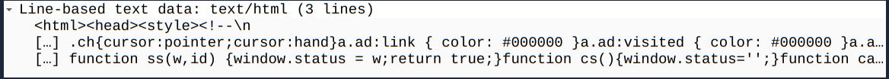

---

## Packet Navigation

### Packet Numbers

Wireshark menghitung dan memberikan nomor unik (berurutan) untuk setiap paket yang berhasil ditangkap. Ini sangat berguna saat menganalisis file _capture_ berukuran besar.

Dengan identitas di kolom **No.**, kamu jadi lebih mudah mengingat posisi, memanggil ulang paket spesifik, dan mencari referensi _event_ tertentu. Nomor urut ini juga sama persis dengan angka yang tertera di bagian `Frame` pada jendela _Packet Details_.

### Go to Packet

Karena setiap paket sudah punya nomor urut yang pasti, kamu bisa memanfaatkan fitur lompat cepat tanpa harus _scroll_ manual.

Fitur _Go to Packet_ sangat membantu untuk:
- Melompat ke nomor paket spesifik dengan instan.
- Melacak _frame_ demi _frame_ dan mengikuti alur pertukaran data (_conversation_) tertentu.

Cara mengakses fiturnya:
1. Klik menu: **Go > Go to Packet...**, lalu masukkan nomor paket yang dicari.
2. Atau langsung ketik nomor di kolom teks penelusuran paket, dan gunakan tombol _Previous/Next Packet_ di _toolbar_ utama.

---

### Find Packets

Selain lompat ke nomor tertentu, Wireshark punya fitur penelusuran (_Find_) untuk mencari paket berdasarkan isi datanya. Ini _skill_ penting untuk menangkap pola serangan (seperti _Intrusion_) atau jejak _error_ di tengah lautan _network traffic_.

Ada dua aturan penting saat mencari:
1. **Pilih Tipe Input:** Wireshark hanya menerima 4 jenis input (_Display filter_, _Hex_, _String_, dan _Regex_). Pencarian menggunakan _String_ (teks biasa) dan _Regex_ (pola khusus) adalah yang paling sering digunakan analis.
2. **Pilih Jendela Target:** Wireshark terbagi menjadi 3 jendela utama (_Packet List_, _Packet Details_, _Packet Bytes_). Kalau kata kunci yang dicari ada di _Packet Details_ (lapisan OSI) tapi kamu memasang target penelusuran di _Packet List_ (tabel ringkasan depan), Wireshark akan melaporkan tidak ditemukan.

Cara membuka kotak penelusuran: Klik menu **Edit > Find Packet...**

### Mark Packets

Untuk menandai temuan penting (supaya tidak hilang saat _scroll_), gunakan fitur **Mark Packets**.

Fitur ini bekerja seperti stabilo — paket yang ditandai akan otomatis berganti warna latar menjadi **Hitam**, menimpa pewarnaan _default_ protokol. Ini sangat membantu saat paket tersebut perlu di-_export_ untuk barang bukti.

Cara menggunakannya:
- Lewat menu: **Edit > Mark/Unmark Packet**
- Atau: **Klik kanan di baris paket > Mark/Unmark Packet**

> **Catatan Penting:** Tanda ini sifatnya sementara — hilang begitu sesi analisis selesai. Kalau Wireshark ditutup tanpa menyimpan ulang, semua status _"Marked"_ akan ikut hilang.

---

### Packet Comments

Selain ditandai (_Marking_), kamu juga bisa menyisipkan catatan digital (_Comments_) di paket tertentu. Fitur ini membantu:
- Sebagai pengingat (_reminder_) saat menjalani investigasi panjang.
- Sebagai alat komunikasi jika file PCAP dianalisis bersama analis SOC lain.

Berbeda dengan _Mark Packets_ yang hilang saat ditutup, **Packet Comments bersifat permanen** — tetap menempel di file PCAP sampai kamu sendiri yang menghapusnya (_note:_ pastikan menyimpan dengan ekstensi `.pcapng` agar komentar tetap utuh).

Cara menambahkan: **Klik kanan pada paket target > Packet Comments...**

### Export Packets

File _capture_ berukuran jutaan paket itu berat untuk diproses. Karena Wireshark hanya mesin pembaca statis (bukan _IDS_ otomatis), kamu yang menentukan mana paket normal dan mana paket mencurigakan.

Kalau sudah menemukan kumpulan paket yang berisi aktivitas _suspicious_, kamu bisa memisahkannya ke dalam file PCAP baru yang lebih terisolasi. Tujuannya agar data lebih bersih dan tidak perlu membagikan 99% paket _noise_ ke analis lainnya.

Cara mengekstrak: Klik menu **File > Export Specified Packets...**

### Export Objects (Files)

Ini fitur andalan _Security Analyst_. Wireshark mampu **mengekstrak ulang file utuh** (gambar, PDF, dokumen, atau _malware_ / _.exe_) yang melewati jaringan.

Syarat utamanya: protokol saat mengirim harus tidak dienkripsi (masih _plaintext_) atau menggunakan protokol standar (_HTTP_, _FTP_, _SMB_, _DICOM_, _IMF_, _TFTP_). Jadi kalau ada penyerang menyebarkan virus via HTTP, kamu bisa langsung mengekstrak _malware_ mentahnya untuk dibedah di _sandbox_.

Cara mengekstrak file: Klik menu **File > Export Objects > [Pilih protokol, misal HTTP]**

---

### Time Display Format

Secara _default_, Wireshark mengurutkan paket berdasarkan format **"Seconds Since Beginning of Capture"** (detik ke-sekian sejak tombol _Start_ ditekan).

Format detik ini memadai untuk durasi singkat, tapi **kurang ideal untuk investigasi**. Bayangkan kamu harus mencocokkan log _error_ server yang formatnya jam dan tanggal (misal `10:30 Pagi`) dengan riwayat detik Wireshark (misal detik ke `4502`). Sangat merepotkan.

**Best practice** analis kawakan: **ubah format tampilan** ke **UTC Time** (_Coordinated Universal Time_) atau **Local Time** supaya patokan waktunya sinkron dan mudah dicari.

Cara mengubah format: **View > Time Display Format > [Pilih format, misal UTC Date and Time]**

---

### Expert Info

Wireshark tidak hanya menampilkan data mentah — dia juga menyediakan fitur untuk mendeteksi anomali atau masalah teknis protokol. Rangkuman peringatan ini dikumpulkan di wadah bernama **Expert Info**.

> **Peringatan:** Analisis _Expert Info_ bertindak sebagai _suggestion_ (saran awal). Selalu ada kemungkinan _false positive_ (terlihat berbahaya padahal normal) atau _false negative_ (terlihat normal padahal berbahaya). Jangan langsung menelan mentah hasilnya.

Expert Info membagi level peringatannya ke dalam tingkatan **Severity** yang dibedakan lewat warna:

| Severity | Colour | Penjelasan |
| :--- | :---: | :--- |
| **Chat** | **Blue** | Informasi standar tentang alur kerja rutin (_usual workflow_). Normal dan bukan sinyal ancaman |
| **Note** | **Cyan** | Kejadian cukup unik (_notable events_), biasanya memuat kode _error_ wajar di level aplikasi |
| **Warn** | **Yellow** | Peringatan serius — melaporkan _error code_ yang tidak lumrah |
| **Error** | **Red** | Tanda darurat — menandakan ada paket yang pecah atau cacat teknis (_malformed packets_) |

Peringatan juga dikelompokkan berdasarkan jenis **Group**:

| Group A | Info | Group B | Info |
| :--- | :--- | :--- | :--- |
| **Checksum** | Validasi _checksum_ paket tidak sinkron | **Deprecated** | Protokol usang yang masih digunakan |
| **Comment** | Ada analis yang meninggalkan komentar di paket | **Malformed** | Paket dengan struktur yang rusak |

---

## Packet Filtering

Wireshark punya _filter engine_ yang membantu analis menyaring _traffic_ tidak penting (_noise_) untuk fokus menemukan kejadian spesifik.

Filter dibagi menjadi dua jenis utama:
1. **Capture Filters:** Menangkap paket tertentu saja **sebelum** _traffic_ masuk dan disimpan ke memori aplikasi (misal: "hanya menangkap paket HTTP port 80, sisanya dibuang").
2. **Display Filters:** Menampilkan paket tertentu dari file PCAP yang **sudah berhasil ditangkap** secara utuh. (Di _basic room_ ini, fokus kamu hanya pada _Display Filter_).

Menulis sintaks _filter_ manual memang cukup rumit. Untungnya, Wireshark punya antarmuka yang memudahkan. Ada satu prinsip emas (_Golden Rule_) untuk analis:

> **"If you can click on it, you can filter and copy it"**
> _(Kalau kamu bisa mengeklik bagian itu, berarti kamu pasti bisa memfilternya)._

### Apply as Filter

Ini cara paling _basic_ tapi sangat ampuh untuk _filtering_ — kamu tidak perlu menghafal sintaks.

Kalau menemukan _IP Address_ atau protokol tertentu di jendela _Packet List_ atau _Packet Details_, kamu tinggal:
1. Klik baris target yang mau dijaring.
2. Klik kanan.
3. Pilih **Apply as Filter** > Pilih cabangnya (misal: _Selected_ untuk filter yang cocok, atau _Not Selected_ untuk membuang _traffic_ pengganggu).

Rumus filter akan otomatis terisi di kolom _Display Filter Bar_ atas.

Catatan: Perbandingan total paket asli vs paket yang lolos filter selalu terlihat di **Status Bar** paling bawah (pojok kanan).

---

### Conversation Filter

Kalau _Apply as Filter_ biasanya memfilter dari **satu entitas** (misal hanya menampilkan paket dari IP tertentu), _Conversation Filter_ berbeda.

Kadang saat menyelidiki aktivitas mencurigakan, kamu membutuhkan **seluruh riwayat percakapan** — semua paket yang bolak-balik antara dua alamat IP atau _Port_ spesifik. Di sinilah _Conversation Filter_ berjasa.

Fitur ini mengisolasi "percakapan" dan **menyembunyikan** semua paket _noise_ yang tidak relevan.

Cara mengakses:
- **Klik kanan > Conversation Filter > [Pilih target, misal IPv4 atau TCP]**
- Atau via menu: **Analyse > Conversation Filter**

---

### Colourise Conversation

Opsi ini mirip dengan _Conversation Filter_, tapi ada satu perbedaan utama: **tidak menyembunyikan paket dari aktor lain**.

Ketimbang memfilter dan mengurangi jumlah paket yang tampil, _Colourise Conversation_ hanya memberi warna stabilo pada blok paket yang saling berkomunikasi. Warnanya menimpa aturan pewarnaan _default_, sehingga rantai dialog yang kamu incar langsung terlihat menonjol.

Cara menggunakan:
1. **Klik kanan paket target > Colourise Conversation** (atau via menu **View > Colourise Conversation**).
2. Untuk mengembalikan warna ke semula: **View > Colourise Conversation > Reset Colourisation**.

### Prepare as Filter

Kalau _Apply as Filter_ langsung mengeksekusi filter sekali klik, _Prepare as Filter_ lebih santai — ibarat "menyiapkan draf dulu, eksekusinya nanti".

Opsi ini sangat berguna saat kamu ingin meracik _Display Filter_ yang kompleks (butuh logika **AND** / **OR**). Wireshark hanya membantu **menuliskan** sintaksnya di kolom pencarian, tapi menunggu kamu menekan `Enter` secara manual untuk mengeksekusinya.

Cara mengakses: **Klik kanan > Prepare as Filter**. Lalu gabungkan logikanya dengan opsi _... and selected_ atau _... or selected_.

---

### Apply as Column

Secara _default_, tabel _Packet List_ hanya menampilkan kolom standar (No, Time, Source, Destination, Protocol, Length, Info). Bagaimana kalau kamu ingin memantau nilai spesifik dari lapisan OSI (misal ukuran _header_) langsung di halaman depan tanpa harus membuka detailnya satu per satu?

Solusinya: gunakan **Apply as Column**. Fitur ini mengambil satu nilai dari _Packet Details_ dan menjadikannya "kolom permanen baru" di tabel _Packet List_. Sangat efisien untuk mencocokkan satu parameter kunci melintasi ribuan paket sekaligus.

Cara menggunakan: Cari _value_ yang diinginkan di jendela _Packet Details_ > **Klik kanan > Apply as Column**. (Kolom baru bisa digeser posisinya, atau disembunyikan kapan pun dengan klik kanan di _header_ tabel).

### Follow Stream

Wireshark bekerja dengan menangkap data mentah (_raw traffic_) dalam porsi kecil yang terfragmentasi. Membaca potongan ini satu per satu sangat melelahkan. Untuk memahami makna aplikasinya secara utuh, kamu membutuhkan fitur rekonstruksi.

**Follow Stream** menyusun ulang dan merangkai (_reconstruct_) pecahan paket menjadi satu aliran utuh dialog aplikasi (_Application-level data_).

Kalau jaringannya tidak dienkripsi (seperti HTTP biasa, FTP, atau Telnet), fitur ini menjadi sangat ampuh — kamu bisa membaca _username_, _password_, atau _chat_ utuh dalam bentuk _plain text_. Dalam dialog _stream_, teks berwarna **merah** menandai data dari _Client_ (menuju Server), dan teks **biru** menandai balasan dari _Server_ (ke Client).

Cara membuka: **Klik kanan di paket target > Follow > [Pilih stream, misal TCP / UDP / HTTP Stream]**

---

## Simple Display Filter Queries

Selain mengandalkan klik kanan, analis berpengalaman biasanya lebih cepat mengetik _query filter_ langsung di _Display Filter Bar_. Berikut filter yang paling esensial:

### Filter By Protocol Name
Metode pencarian paling dasar — menyaring berdasarkan satu protokol tertentu:
- Ketik nama protokolnya di _search bar_ (wajib huruf kecil semua).
- Contoh: `http`, `ftp`, `dns`, `arp`, `icmp`, `ssh`.

### Filter By Protocol Port Number
Menyaring berdasarkan nomor _port_ spesifik — berguna saat aplikasi menggunakan _port_ yang tidak standar:
- Pola format: `<protocol>.port == <nomor port>`
- Contoh: `tcp.port == 80` (hanya menampilkan _traffic_ HTTP di port 80).

### Filter By IP
Mengisolasi _traffic_ dari satu alamat IP target saja (baik sebagai pengirim maupun penerima):
- Pola format: `ip.addr == <IP address>`
- Contoh: `ip.addr == 192.168.1.2` (menyaring paket yang _Source_ atau _Destination_-nya mengandung IP tersebut).

---

## Real-World Relevance

Di skenario _Security Operations Center (SOC)_ atau _Red Teaming_ di dunia nyata, Wireshark menjadi alat penyadapan yang sangat krusial:

- **Analisis Malware & Incident Response:** _Malware_ atau skrip C2 (_Command and Control_) kadang masih berkomunikasi via HTTP atau DNS biasa tanpa enkripsi. Tim SOC menggunakan _Follow Stream_ dan _Export Objects_ untuk merakit dan mengekstrak _malware payload_ utuh dari _network traffic_, lalu menganalisisnya di _sandbox_.
- **Pencurian Kredensial (Cleartext Sniffing):** Dalam fase _Lateral Movement_, penyerang yang sudah menembus intranet bisa menggunakan Wireshark (atau `tcpdump`) untuk menyadap kredensial admin yang masih dikirim via FTP, Telnet, atau aplikasi web internal tanpa SSL/HTTPS.
- **Risiko:** Teknik penyadapan ini sangat berbahaya karena sifatnya yang pasif — hanya "duduk dan mendengarkan" tanpa mengirim _exploit_. Akibatnya, aktivitas penyadapan tidak meninggalkan _log_ serangan yang bisa memicu alarm _Intrusion Detection System (IDS)_.
