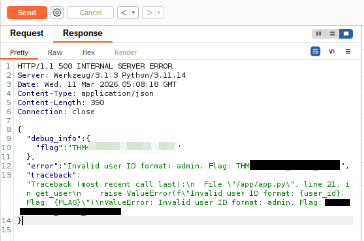
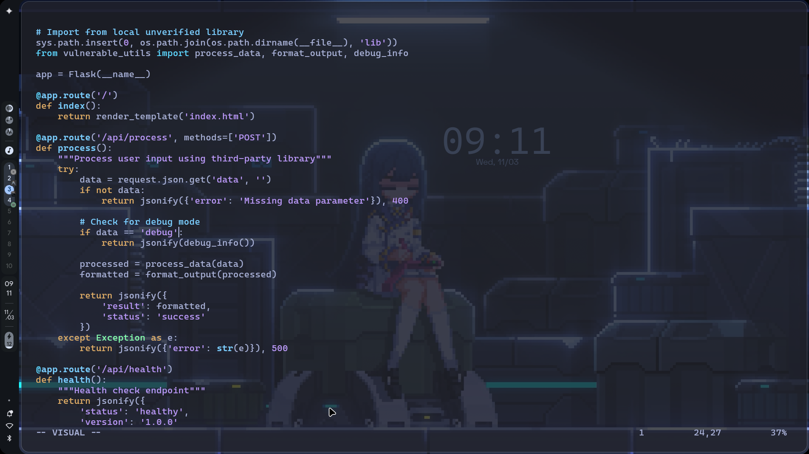
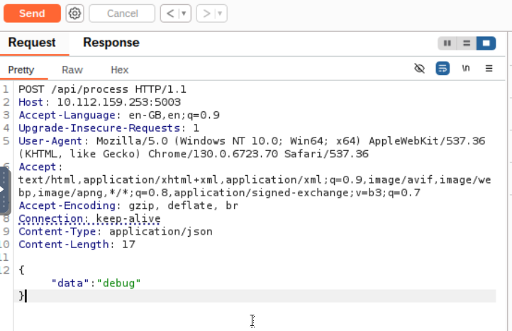
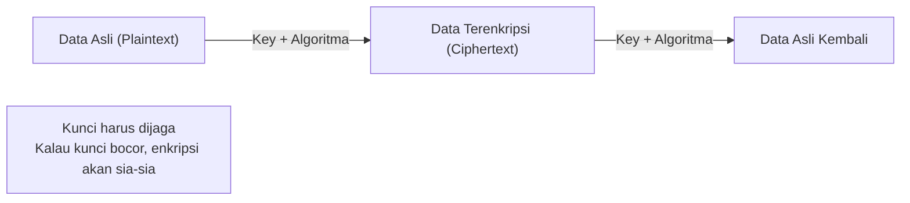
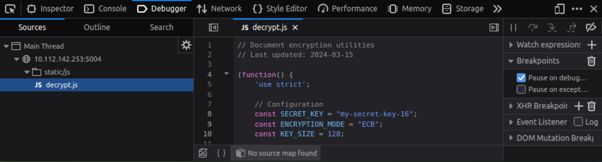
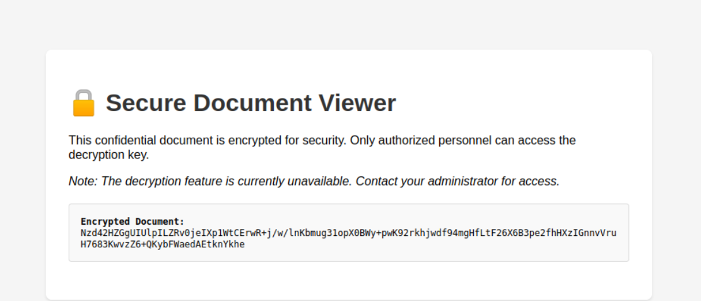
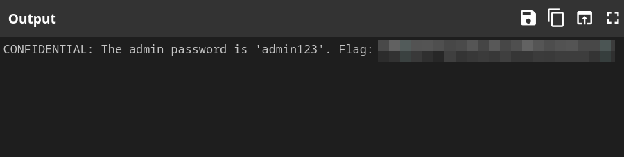

# TryHackMe: OWASP Top 10 2025: Application Design Flaws

* **Room Link:** [OWASP Top 10 2025: Application Design Flaws](https://tryhackme.com/room/owasptop102025applicationdesignflaws)
* **Category:** OWASP Top 10 (2025)
* **Difficulty:** Easy

## Introduction

Room ini memecah 4 dari 10 kategori **OWASP Top 10 2025** yang semuanya berkaitan dengan kelemahan di sisi _arsitektur dan desain sistem_. **OWASP** (_Open Worldwide Application Security Project_) adalah organisasi global yang secara rutin merilis daftar 10 risiko keamanan aplikasi web paling kritis. Bukan soal bug di kode, tapi soal **keputusan desain yang salah sejak awal** — yang membuat aplikasi rentan meskipun kode nya bersih.

Kamu akan mempelajari teori setiap kategori sekaligus melihat contoh nyata lewat _challenge_ yang sudah ku selesaikan yang ada di room nya.

**Kategori yang dibahas di room ini:**

| No. | Kode | Kategori | Inti Masalah |
| :-: | :--- | :------- | :----------- |
| 1 | **AS02** | Security Misconfigurations | Konfigurasi default/salah yang membuka celah keamanan |
| 2 | **AS03** | Software Supply Chain Failures | Dependency/library pihak ketiga yang rentan |
| 3 | **AS04** | Cryptographic Failures | Implementasi kriptografi yang lemah atau salah |
| 4 | **AS06** | Insecure Design | Desain arsitektur yang tidak memperhitungkan keamanan |

(Room ini adalah bagian kedua dari seri OWASP Top 10 2025. Bagian pertama tentang kegagalan autentikasi ada di catatan [OWASP Top 10 2025: IAAA Failures](file:///home/dimm/CyberSec-Learning-Notes/THM-Notes/Cyber-Security-101/OWASP-Top-10-(2025)/OWASP-Top-10-2025-IAAA%20Failures.md))

## AS02: Security Misconfigurations

> **Referensi:** [OWASP : A02:2025 Security Misconfiguration](https://owasp.org/Top10/2025/A02_2025-Security_Misconfiguration/)

### What It Is

**Security Misconfiguration** terjadi ketika sistem, server, atau aplikasi di-_deploy_ (dipasang dan dijalankan di server produksi) dengan pengaturan default yang tidak aman, pengaturan yang tidak lengkap, atau service yang terekspos tanpa seharusnya. Ini **bukan bug di kode**, tapi kesalahan dalam *cara sistem dikonfigurasi* — mulai dari environment, software, sampai jaringannya. Hasilnya? Pintu masuk gratisan untuk attacker.

### Why It Matters

Bahkan kesalahan konfigurasi kecil bisa membuat data sensitif terekspos, memungkinkan **privilege escalation** (naik hak akses), atau memberikan attacker pijakan awal ke dalam sistem. Aplikasi modern bergantung pada _stack_ yang kompleks — cloud services, third-party API, container, framework — dan **satu saja** panel admin yang terekspos, storage bucket yang terbuka, atau permission yang salah bisa **merusak seluruh sistem**.

### Real-World Example

Pada tahun 2017, **Uber** mengekspos backup **AWS S3 bucket** (layanan penyimpanan file di cloud milik Amazon) berisi data sensitif pengguna (termasuk informasi driver dan penumpang). Bucket tersebut bisa diakses publik tanpa credential apapun. Ini menunjukkan bagaimana satu kesalahan deployment bisa berujung pada kebocoran data yang masif.

### Common Patterns

Pola-pola misconfiguration yang paling sering ditemukan:

* Credential default atau password lemah yang **tidak pernah diganti**
* Service atau **endpoint** (alamat URL spesifik di server yang bisa diakses, misal: `/api/users`) yang tidak diperlukan tetap terekspos ke internet
* Cloud storage yang salah konfigurasi (S3, Azure Blob, GCP Buckets) — **terbuka untuk publik**
* API tanpa autentikasi atau otorisasi yang memadai
* Pesan error yang terlalu _verbose_ (terlalu detail) — mengekspos **stack trace** (jejak lengkap dari error yang menampilkan nama file, nomor baris, dan variabel internal) atau detail sistem internal
* Software, framework, atau container yang sudah **deprecated** (usang dan tidak didukung lagi) serta punya vulnerability yang sudah diketahui
* Endpoint **AI/ML** yang terekspos tanpa kontrol akses yang tepat

### How To Prevent It

| Langkah Pencegahan | Detail |
| :--- | :--- |
| **Harden default config** | Ubah semua konfigurasi default dan hapus fitur/service yang tidak dipakai |
| **Enforce strong auth** | Terapkan autentikasi kuat dan prinsip _least privilege_ di semua sistem |
| **Limit network exposure** | Batasi akses jaringan dan segmentasi resource sensitif |
| **Patch regularly** | Selalu update software, framework, dan container ke versi terbaru |
| **Hide error details** | Sembunyikan stack trace dan informasi sistem dari pesan error |
| **Audit cloud config** | Rutin periksa konfigurasi dan permission cloud |
| **Secure AI endpoints** | Lindungi endpoint AI/ML dengan kontrol akses dan monitoring yang tepat |
| **Automate security checks** | Integrasikan review konfigurasi dan pengecekan keamanan otomatis ke dalam deployment pipeline |

### Challenge

Challenge ini mendemonstrasikan dua misconfiguration yang terjadi bersamaan di satu aplikasi:

| Masalah | Dampak |
| :--- | :--- |
| **API tanpa autentikasi** | Endpoint User Management bisa diakses siapa pun tanpa login — data user bocor hanya dengan menebak ID-nya. Teknik ini disebut **IDOR** (_Insecure Direct Object Reference_), yaitu ketika aplikasi tidak mengecek apakah kamu berhak mengakses data tersebut |
| **Debug mode aktif di produksi** | Saat input tidak valid dikirim ke API, server mengembalikan **full stack trace** beserta informasi sensitif yang seharusnya tidak terlihat |

> **Common Mistake:** Membiarkan **Debug Mode** atau **Verbose Error Messages** aktif di lingkungan produksi. Pesan error yang terlalu detail (stack trace, variabel internal) bisa membocorkan rahasia sistem kepada siapapun yang memicu error.

---

## AS03: Software Supply Chain Failures

> **Referensi:** [OWASP : A03:2025 Software Supply Chain Failures](https://owasp.org/Top10/2025/A03_2025-Software_Supply_Chain_Failures/)

### What It Is

**Software Supply Chain Failure** terjadi ketika aplikasi bergantung pada komponen, library, service, atau model AI dari pihak ketiga yang ternyata sudah **disusupi attacker**, **deprecated**, atau tidak diverifikasi dengan benar. Intinya: kelemahannya **bukan di kode kamu sendiri**, tapi di software dan tools eksternal yang kamu gunakan sebagai pondasi. Attacker mengeksploitasi mata rantai terlemah ini untuk menyuntikkan kode berbahaya, melewati keamanan, atau mencuri data sensitif.

Bayangkan kamu membangun rumah, bahan bangunan (bata, semen, kabel) kamu beli dari supplier. Kalau salah satu supplier diam-diam mencampur bahan cacat atau bahkan beracun, rumahmu tetap terlihat bagus di luar, tapi sudah bermasalah dari dalam — padahal tukangnya tidak salah.

### Why It Matters

Aplikasi modern dibangun dari banyak **dependency** (komponen/library pihak ketiga yang menjadi pondasi aplikasi) — seperti package dari npm, PyPI, third-party API, dan model AI. Satu saja dependency yang disusupi bisa memberi attacker akses ke seluruh sistem kamu, **tanpa pernah menyentuh kode aslimu**. Serangan supply chain bisa diotomatisasi dan didistribusikan secara massal, membuatnya sulit dideteksi dan sangat merusak.

### Real-World Example

Pada tahun 2021, **SolarWinds Orion** — software manajemen IT yang dipakai ribuan organisasi — diretas melalui supply chain-nya. Attacker menyisipkan kode berbahaya ke dalam update resmi yang dipercaya. Ribuan organisasi yang secara otomatis menginstal update tersebut langsung terkena dampaknya. Ini bukan bug di logika inti SolarWinds, melainkan celah di **proses pembuatan, verifikasi, dan distribusi update software**-nya.

Di era AI, risiko serupa muncul ketika menggunakan model pihak ketiga atau dataset fine-tuned yang tidak diverifikasi — bisa mengandung _hidden behaviours_, backdoor, atau bias tersembunyi yang **merusak sistem dari dalam**.

### Common Patterns

* Menggunakan library atau dependency yang **tidak diverifikasi** atau sudah tidak di-_maintain_
* Menginstal update secara otomatis **tanpa verifikasi** keasliannya
* Terlalu bergantung pada model AI pihak ketiga tanpa monitoring atau audit
* **CI/CD pipeline** (_Continuous Integration/Continuous Deployment_ — sistem otomatis untuk membangun, menguji, dan men-deploy kode) yang tidak diamankan, memungkinkan penyusupan
* Tidak melacak **provenance** (asal-usul dan riwayat perubahan) serta lisensi komponen
* Tidak memonitor vulnerability di dependency setelah aplikasi di-deploy

### How To Protect The Supply Chain

| Langkah Pencegahan | Detail |
| :--- | :--- |
| **Verifikasi sebelum pakai** | Periksa semua komponen, library, dan model AI pihak ketiga sebelum digunakan |
| **Monitor & patch rutin** | Pantau dan perbarui dependency secara berkala |
| **Sign & audit update** | Tanda-tangani, verifikasi, dan audit setiap software update dan package |
| **Amankan CI/CD** | Kunci pipeline build agar tidak bisa disusupi dari luar |
| **Lacak provenance** | Catat asal-usul dan lisensi setiap dependency |
| **Runtime monitoring** | Pantau perilaku abnormal dari dependency atau komponen AI saat aplikasi berjalan |
| **Integrasikan ke SDLC** | Masukkan threat modelling supply chain ke dalam **SDLC** (_Software Development Life Cycle_ — seluruh siklus pengembangan software dari perencanaan sampai maintenance) |

### Challenge

Challenge ini mensimulasikan skenario nyata: aplikasi utama mengimpor library pihak ketiga yang **deprecated** (`lib/vulnerable_utils.py`). Di dalam library tersebut tersembunyi fungsi debug yang seharusnya tidak ada di versi produksi.

Ketika fungsi debug tersebut dipanggil melalui endpoint API, server langsung membocorkan informasi sensitif — termasuk admin token, internal secret key, dan flag.

| Masalah | Dampak |
| :--- | :--- |
| **Vulnerable Dependency** | Aplikasi mengandalkan library **deprecated** yang masih memiliki "fitur debug" tersembunyi |
| **Information Disclosure** | Fungsi debug di library membocorkan admin token, internal secret, dan data sensitif lainnya |

> **My Common Mistake:** Saat mengirim data JSON lewat Burp Suite Repeater, pastikan header `Content-Type` diatur ke `application/json`. Jika labelnya salah (misal `application/x-www-form-urlencoded`), server akan menolak memproses request (error **415 Unsupported Media Type**).

---

## AS04: Cryptographic Failures

> **Referensi:** [OWASP : A04:2025 Cryptographic Failures](https://owasp.org/Top10/2025/A04_2025-Cryptographic_Failures/)

### What It Is

**Cryptographic Failures** terjadi ketika aplikasi atau sistem gagal menerapkan enkripsi dengan benar untuk melindungi data sensitif. Bayangkan kamu punya **kotak surat** yang berisi dokumen rahasia, tapi kamu menggunakan **gembok murah** yang kuncinya bisa dibeli di toko mainan mana saja, atau bahkan kuncinya sengaja kamu gantung di samping kotak surat itu.

Intinya, enkripsi ada (atau seharusnya ada), tapi karena cara pakai yang salah, algoritma yang sudah kuno, atau manajemen kunci yang ceroboh, enkripsi tersebut jadi tidak berguna. Attacker tidak perlu repot-repot mengeksploitasi enkripsi yang mustahil, mereka cukup mencari jalan pintas atau mengeksploitasi kelemahannya.

### Why It Matters

Kriptografi adalah keamanan terakhir untuk menjaga **kerahasiaan** (*confidentiality*) dan **integritas** data. Jika keamanan ini gagal, dampaknya sangat fatal:
*   **Data PII Bocor:** Informasi pribadi pengguna (nama, alamat, email) bisa dicuri.
*   **Credentials Terungkap:** Password yang tidak di-*hash* dengan benar bisa dilihat langsung oleh attacker.
*   **Account Takeover:** Token sesi atau API key yang tidak diamankan memungkinkan attacker menyamar menjadi pengguna sah.
*   **Regulatory Penalties:** Pelanggaran hukum (seperti GDPR atau UU PDP di Indonesia) karena gagal melindungi data nasabah/pengguna.

### Encryption Flow

### Key Concepts

Agar kamu tidak bingung dengan singkatan-singkatan teknis yang sering muncul:
*   **MD5 & SHA-1:** Algoritma *hashing* (pengacak data satu arah) yang sekarang sudah dianggap **broken** (rusak) karena mudah di-crack menggunakan bantuan GPU modern dan brute force attack. Sangat tidak disarankan untuk password.
*   **ECB (Electronic Codebook):** Mode enkripsi yang paling dasar dan **paling tidak aman** karena pola data asli masih bisa terlihat di hasil enkripsi.
*   **AES (Advanced Encryption Standard):** Standard enkripsi modern yang sangat kuat. Biasanya dipakai bersama mode **GCM** agar lebih aman.
*   **Argon2id:** Algoritma *hashing* password paling modern dan direkomendasikan saat ini. Ia dirancang khusus untuk sangat berat dijalankan di GPU/ASIC, sehingga sangat sulit di-crack meskipun penyerang punya perangkat canggih.
*   **TLS (Transport Layer Security):** Protokol yang mengamankan traffic internet (apa yang membuat **https** itu aman). Versi terbaru adalah **TLS 1.3**, yang telah membuang fitur kriptografi lama yang tidak aman sehingga menjadikannya standar keamanan modern yang jauh lebih tangguh.

### Common Patterns vs. Prevention

| Common Patterns | How To Prevent It |
| :--- | :--- |
| **Weak/Deprecated Algorithms:** Menggunakan algoritma lemah seperti MD5, SHA-1, atau mode ECB | **Strong & Modern Algorithms:** Gunakan algoritma kuat seperti AES-GCM, ChaCha20-Poly1305, atau paksa penggunaan TLS 1.3 dengan sertifikat valid |
| **Hard-coded Secrets:** Menyimpan *secret key* atau password langsung di dalam kode atau file konfigurasi | **Secure Key Management:** Gunakan layanan manajemen kunci yang aman seperti Azure Key Vault, AWS KMS, atau HashiCorp Vault |
| **Poor Key Management:** Rotasi kunci yang buruk atau praktek manajemen yang tidak standar | **Regular Rotation:** Lakukan rotasi *secret* dan kunci secara berkala sesuai dengan periode kripto yang ditentukan |
| **Insecure Data Handling:** Kurangnya enkripsi untuk data sensitif saat disimpan (*at rest*) atau saat dikirim (*in transit*) | **Policy Enforcement:** Dokumentasikan dan terapkan standar prosedur operasional (SOP) untuk manajemen siklus hidup kunci |
| **Invalid TLS Certificates:** Menggunakan sertifikat TLS yang *self-signed* atau sudah tidak valid | **Certificate Inventory:** Selalu pantau dan buat inventory lengkap untuk sertifikat, kunci, beserta pemiliknya |
| **Insecure AI/ML Inputs:** Menggunakan sistem AI/ML tanpa penanganan rahasia yang tepat untuk parameter model atau input sensitif | **Secure AI Models:** Pastikan model AI dan agen otomatis tidak pernah mengekspos rahasia atau data sensitif yang tidak terenkripsi |

> **Common Mistakes:** Jangan pernah menyimpan **Secret Key** (kunci enkripsi) langsung di dalam file `.py`, `.js`, atau file konfigurasi yang ikut ter push ke GitHub. Gunakan **Environment Variables** atau file `.env` yang sudah dimasukkan ke dalam `.gitignore`.

### Challenge Breakdown

Challenge ini menunjukkan betapa bahayanya jika logika enkripsi dan kunci rahasia diletakkan di sisi klien (browser). Attacker bisa dengan mudah mengintip kode JavaScript melalui fitur **Inspect Element** atau **Debugger**.

Dalam skenario ini, kita menemukan file `decrypt.js` yang berisi informasi sangat sensitif:
*   **Hardcoded Secret Key:** Kunci enkripsi (`my-secret-key-16`) tertulis jelas di kode.
*   **Weak Mode:** Menggunakan mode **ECB** yang tidak terjamin keamanannya di era modern.

Dengan informasi ini, dokumen yang seharusnya terkunci bisa didekripsi dengan mudah oleh siapa saja yang tahu cara membaca kode.

Setelah kunci rahasia tersebut digunakan ke dalam pendeskripsi (seperti CyberChef atau script manual), maka data asli akan terekspos sepenuhnya.

| Masalah | Dampak |
| :--- | :--- |
| **Client-Side Secrets** | Kunci rahasia terekspos ke publik karena diletakkan di kode JavaScript yang dikirim ke browser |
| **Weak Encryption Mode** | Menggunakan ECB membuat enkripsi lebih mudah dianalisis dan dipatahkan |

---

## AS06: Insecure Design

> **Referensi:** [OWASP : A06:2025 Insecure Design](https://owasp.org/Top10/2025/A06_2025-Insecure_Design/)
