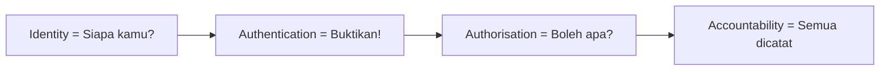
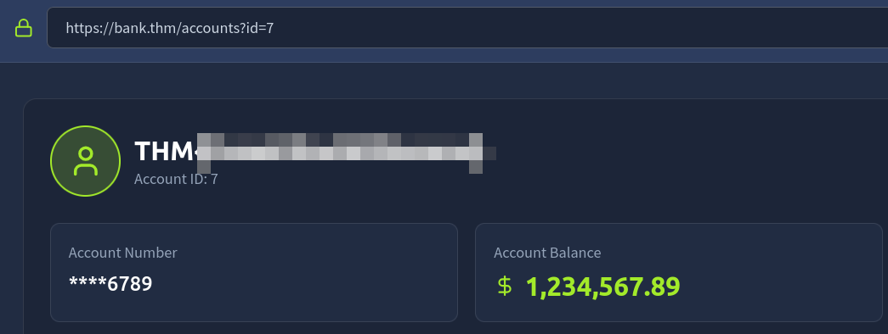
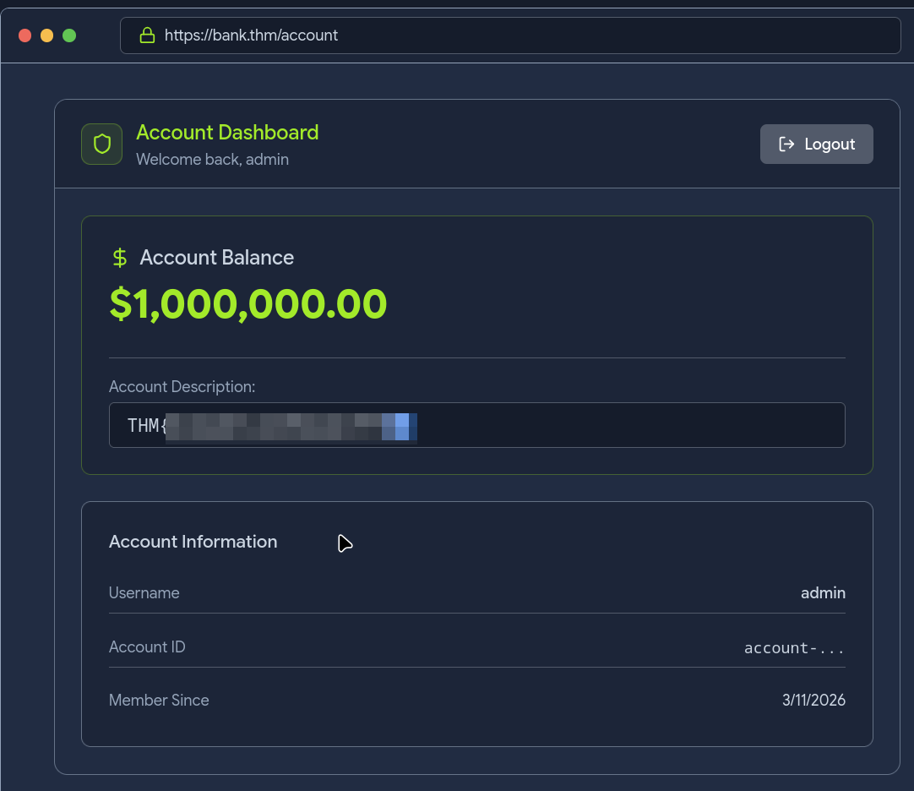
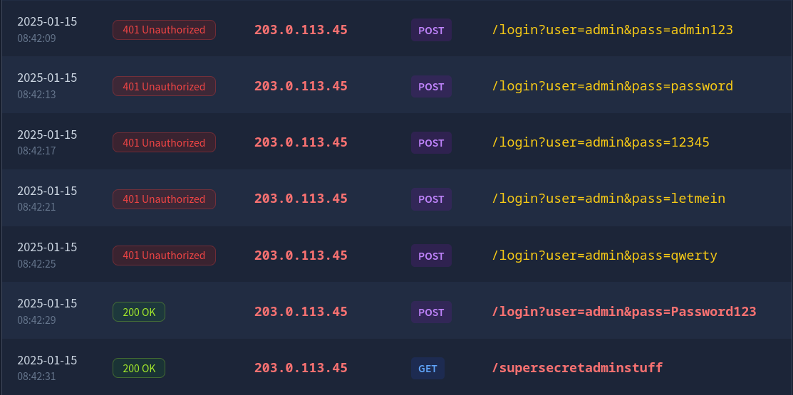

# TryHackMe: OWASP Top 10 2025: IAAA Failures

* **Room Link:** [OWASP Top 10 2025: IAAA Failures](https://tryhackme.com/room/owasptop102025iaaafailures)
* **Category:** OWASP Top 10 (2025)
* **Difficulty:** Easy

---

## Introduction

Room ini akan membedah 3 kategori dari **OWASP Top 10 (2025)** yang berkaitan dengan kegagalan dalam penerapan **Identity, Authentication, Authorisation, dan Accountability (IAAA)** pada aplikasi. **OWASP** (_Open Worldwide Application Security Project_) adalah organisasi global yang secara rutin merilis daftar 10 risiko keamanan aplikasi web paling kritis.

Kamu akan mempelajari teori dan langsung mempraktikkannya melalui tantangan (*challenges*) yang tersedia. Kategori yang akan dibahas meliputi:

1. **A01: Broken Access Control**
2. **A07: Authentication Failures**
3. **A09: Logging & Alerting Failures**

Room ini dibuat untuk pemula dan tidak memerlukan pengetahuan keamanan sebelumnya.

(Room ini adalah bagian pertama dari seri OWASP Top 10 2025. Bagian kedua tentang kelemahan desain aplikasi ada di catatan [OWASP Top 10 2025: Application Design Flaws](OWASP-Top-10-2025-Application-Design-Flaws.md))

---

## What is IAAA ?

**IAAA** adalah cara sederhana untuk memahami bagaimana pengguna dan tindakan mereka diverifikasi dalam aplikasi. Setiap kategori berperan sangat penting dan kamu **tidak bisa melompati levelnya**. Jika level sebelumnya tidak dilakukan, maka level berikutnya tidak bisa dijalankan.

Keempat item tersebut adalah:

* **Identity (Identitas):** Akun unik (misal: user ID/email) yang mewakili seseorang atau layanan. : *Siapa kamu?*
* **Authentication (Autentikasi):** Membuktikan identitas tersebut (misal: password, **OTP** (_One-Time Password_ — kode sekali pakai yang dikirim via SMS/email), passkeys). : *Buktikan kalau itu benar kamu*
* **Authorisation (Autorisasi):** Apa yang boleh dilakukan oleh identitas tersebut. : *Kamu boleh melakukan apa saja di sini?*
* **Accountability (Akuntabilitas):** Mencatat dan memberi peringatan tentang siapa melakukan apa, kapan, dan dari mana. : *Siapa yang mencatat jejakmu?*

Tiga kategori dari **OWASP Top 10:2025** yang dibahas di room ini berkaitan dengan kegagalan dalam penerapan IAAA. Kelemahan di sini bisa sangat fatal karena memungkinkan penyerang untuk mengakses data pengguna lain atau mendapatkan hak akses lebih (*privilege*) dari yang seharusnya mereka miliki.

---

## A01: Broken Access Control

> **Referensi:** [OWASP : A01:2025 Broken Access Control](https://owasp.org/Top10/2025/A01_2025-Broken_Access_Control/)

**Broken Access Control** terjadi ketika server tidak memeriksa dengan benar **siapa yang boleh mengakses apa** di setiap permintaan. Masalah ini muncul karena aplikasi terlalu percaya pada input dari sisi pengguna (*client*).

Celah yang paling umum di kategori ini adalah **IDOR (Insecure Direct Object Reference)**.

### What Is IDOR?
Bayangkan kamu sedang melihat data akunmu dan muncul parameter di URL seperti `?accountID=7`. Jika kamu iseng mengganti angkanya menjadi `?accountID=6` dan tiba-tiba kamu bisa melihat atau bahkan mengedit data orang lain, itulah IDOR.

### Types of Privilege Escalation
Dalam praktiknya, kegagalan kontrol akses ini terbagi menjadi dua:

1.  **Horizontal Privilege Escalation:**
    *   Mengakses data milik pengguna lain yang level atau perannya sama denganmu.
    *   **Analogi:** Kamu penyewa apartemen, dan kamu bisa masuk ke unit tetanggamu yang juga penyewa biasa.
2.  **Vertical Privilege Escalation:**
    *   Meloncat dari pengguna biasa ke tindakan yang hanya boleh dilakukan oleh admin.
    *   **Analogi:** Kamu penyewa biasa, tapi tiba-tiba bisa masuk ke ruang panel utama gedung atau ruang manajer.

**Ingat:** Jika kamu bisa memanipulasi ID di URL untuk melihat data sensitif (misalnya mencari user yang punya saldo lebih dari $1 juta), berarti sistem tersebut memiliki celah keamanan yang serius.

> **Common Mistake:** Mengecek otorisasi hanya saat login. Padahal, pengecekan harus dilakukan di **setiap request** ke server. Attacker bisa saja sudah login secara sah, lalu langsung mengganti parameter ID untuk mengakses data orang lain.

(Contoh praktis eksploitasi IDOR juga dibahas di challenge [OWASP Top 10 2025: Application Design Flaws : AS02](OWASP-Top-10-2025-Application-Design-Flaws.md))

---

## A07: Authentication Failures

> **Referensi:** [OWASP : A07:2025 Authentication Failures](https://owasp.org/Top10/2025/A07_2025-Authentication_Failures/)

Jika *Access Control* (A01) bicara tentang apa yang boleh kamu lakukan, maka **Authentication** bicara tentang membuktikan siapa kamu. **Authentication Failures** terjadi ketika aplikasi tidak bisa memverifikasi identitas pengguna dengan benar.

### Common Authentication Issues
*   **Username Enumeration:** Penyerang bisa menebak apakah sebuah username ada di database atau tidak (misal melalui pesan error yang berbeda).
*   **Weak Passwords:** Penggunaan password yang gampang ditebak dan tidak adanya sistem penguncian (*account lockout*) setelah beberapa kali gagal login.
*   **Logic Flaws:** Celah dalam alur login atau registrasi.
*   **Insecure Session Handling:** Penanganan **cookie** (file kecil yang disimpan browser untuk mengingat sesi login kamu) atau sesi yang tidak aman, sehingga bisa dicuri atau dimanipulasi.

### Example: Account Confusion
Ini adalah cara licik untuk mengelabui aplikasi agar memberikan akses ke akun orang lain.
*   **Skenario:** Kita tahu ada user bernama `admin`. Kita mencoba mendaftar akun baru dengan nama yang sangat mirip, misalnya `aDmiN`.
*   **Kenapa ini berhasil?** Jika aplikasi tidak menstandarisasi penulisan username (misalnya mengubah semuanya jadi huruf kecil sebelum disimpan) atau tidak mengecek keunikan secara mendalam, aplikasi mungkin akan bingung dan menganggap kamu adalah admin asli saat kamu login.

Ini adalah bentuk kegagalan serius dalam tahap **Authentication** pada model IAAA.

> **Common Mistake:** Tidak menstandarisasi input username (case sensitivity). Selalu konversi username ke lowercase sebelum menyimpan dan membandingkan, agar `admin` dan `aDmiN` dianggap sama.

---

## A09: Logging & Alerting Failures

> **Referensi:** [OWASP : A09:2025 Security Logging and Alerting Failures](https://owasp.org/Top10/2025/A09_2025-Security_Logging_and_Alerting_Failures/)

Pernah lihat gedung yang punya CCTV tapi tidak ada rekamannya atau tidak ada satpam yang memantau? Itu adalah gambaran **Logging & Alerting Failures**.

Dalam keamanan siber, **Logging** adalah pondasi dari **Accountability** (Akuntabilitas). Artinya, kita harus bisa membuktikan: *siapa melakukan apa, kapan, dan dari mana.*

### What Happens When Logging Fails?
Tanpa catatan yang baik, tim keamanan (*defenders*) tidak bisa mendeteksi atau menyelidiki serangan. Kegagalan ini biasanya terlihat seperti:
*   **Missing Authentication Events:** Tidak mencatat kapan seseorang login atau logout.
*   **Vague Error Logs:** Log yang terlalu umum sehingga tidak memberikan informasi berguna.
*   **No Alerting on Brute-force:** Sistem diam saja saat ada **brute-force** (serangan yang mencoba ribuan kombinasi password secara otomatis) atau perubahan hak akses yang mencurigakan.
*   **Short Retention:** Catatan log dihapus terlalu cepat sebelum sempat diselidiki.
*   **Tampering Risks:** Log disimpan di tempat yang bisa dijangkau dan diubah oleh penyerang untuk menghapus jejak mereka.

### Why Is This Dangerous?
Bayangkan ada penyerang masuk ke sistem. Jika tidak ada log yang mencatat aktivitas mereka, kita tidak akan pernah tahu:
1.  Dari mana asal serangan (IP address)?
2.  Akun mana saja yang sudah **disusupi**?
3.  Data sensitif apa yang sudah diakses atau dicuri?

Tanpa akuntabilitas yang kuat, sebuah aplikasi seperti rumah tanpa pintu yang bisa dimasuki siapa saja tanpa meninggalkan jejak.

> **Common Mistake:** Menyimpan log di lokasi yang bisa dijangkau attacker. Jika penyerang berhasil masuk dan bisa menghapus log, maka seluruh bukti serangan hilang. Simpan log di server terpisah atau gunakan layanan logging eksternal.

(Penjelasan lebih mendalam tentang logging ada di catatan [Logs Fundamentals](../Defensive-Security/Logs-Fundamentals.md) dan [SOC Fundamentals](../Defensive-Security/SOC-Fundamentals.md))

---

## Conclusion

Room **OWASP Top 10 (2025): IAAA Failures** ini mengajarkan kita bahwa mengamankan identitas dan akses bukan cuma soal pasang password. 

Kita harus memastikan:
1.  **Access Control** yang ketat agar user tidak bisa saling intip data (**Authorisation**).
2.  **Authentication** yang kuat agar identitas tidak mudah dipalsukan atau dikelabui.
3.  **Logging & Alerting** yang sigap agar setiap tindakan mencurigakan terekam dan bisa ditindaklanjuti (**Accountability**).

Penerapan **IAAA** yang solid adalah kunci utama untuk menjaga aplikasi dari penyalahgunaan akses yang fatal.
