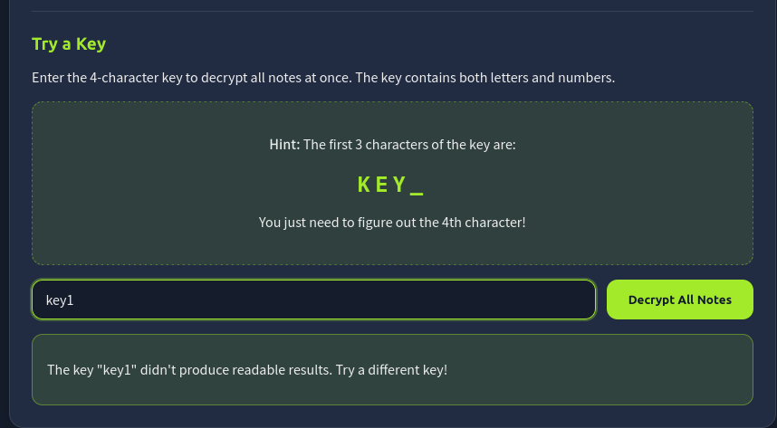
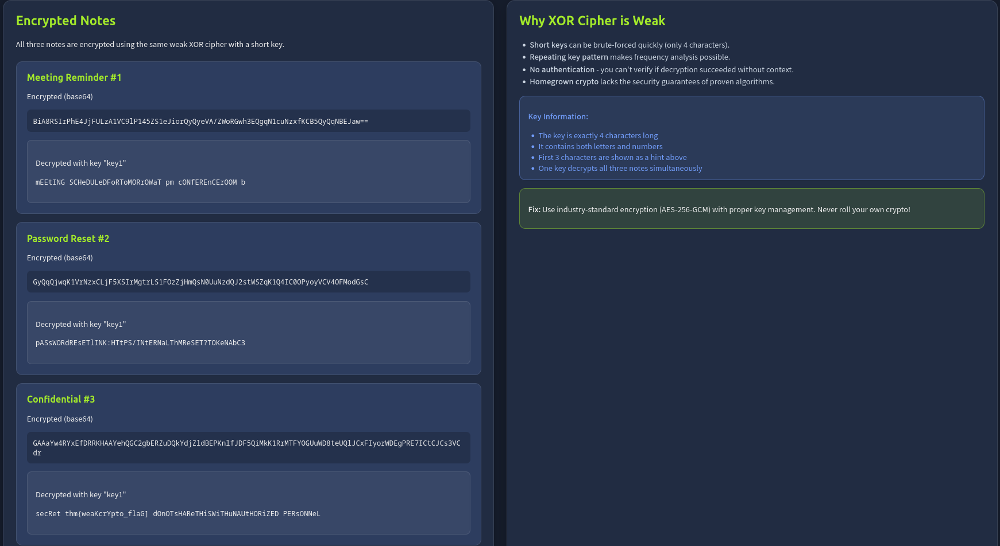

# TryHackMe: OWASP Top 10 2025: Insecure Data Handling

- **Room Link:** [OWASP Top 10 2025: Insecure Data Handling](https://tryhackme.com/room/owasptop102025insecuredatahandling)
- **Category:** OWASP Top 10 (2025)
- **Difficulty:** Easy

## Introduction

### A04: Cryptographic Failures

### A04: Cryptographic Failures

#### Core Concept

*Cryptographic Failures* (Kegagalan Kriptografi) terjadi ketika sebuah sistem gagal melindungi data sensitifnya. Ini bisa diakibatkan oleh ketiadaan enkripsi sama sekali, penggunaan pengamanan yang sudah kadaluarsa, atau kecerobohan *developer* dalam metode penyimpanan kunci rahasia.

**Feynman Analogy:**
Bayangkan kamu memiliki brankas baja tahan ledakan untuk menyimpan perhiasan seharga miliaran rupiah. Namun, kombinasi *password* brankas tersebut kamu tulis di sebuah *sticky note*, lalu kertas itu kamu tempelkan tepat di gagang brankasnya. Sehebat apapun brankas yang kamu buat, pencuri cukup membaca kertas itu untuk mencuri isinya tanpa perlu membobol bajanya, kriptografi yang asal-asalan memiliki kelemahan yang sama: sistemnya seolah terkunci rapat, namun akses datanya sebenarnya dibiarkan begitu saja.

Ada 4 titik kelemahan utama yang paling sering dieksploitasi:
1. **Plaintext Storage:** Kondisi fatal di mana sistem menyimpan *password* pengguna secara teks asli (*plaintext*) di dalam *database*. Perlindungan ideal harusnya diacak menggunakan *hashing* (algoritma matematika satu arah untuk menyamarkan nilai asli).
2. **Hardcoded Secrets:** Developer ceroboh secara awam mengetikkan kunci rahasia atau *API Key* (kode sandi khusus untuk mengakses layanan luar) langsung di dalam barisan sumber kode (*source code*) aplikasi.
3. **Deprecated Algorithms:** Komputer modern bisa dengan mudah membobol standar sandi kuno yang masih dipakai *developer*, misalnya standar MD5, SHA1, atau DES.
4. **Rolling Their Own Crypto:** Pengembang egois yang menolak memakai standar keamanan industri dan mencoba menciptakan rumus matematikanya sendiri untuk mengamankan data tanpa pengujian global.

#### Advanced Details

Untuk mematikan potensi *Cryptographic Failures* secara arsitektur, organisasi sangat diwajibkan untuk mengadopsi mekanisme proteksi standar:

* **Robust Hashing Functions:** Melindungi *password* pengguna membutuhkan *hash* kelas berat. Kamu harus menggunakan fungsi *hashing* yang secara komputasi dirancang sangat lambat (contohnya **bcrypt**, **scrypt**, atau **Argon2**). Tujuannya sederhana: agar ketika database mengalami kebocoran, *attacker* akan menghabiskan ratusan tahun jika memaksakan teknik *brute-force* (menebak kata sandi dengan jutaan tebakan otomatis per detik).
* **Key Management System (KMS):** Hilangkan budaya sembarangan menyimpan kata sandi. Kamu wajib mengisolasi nya melalui fasilitas pengelola kunci KMS (misalnya layanan AWS KMS atau Azure KeyVault).
* **Environment Variables:** Panggil semua konfigurasi rahasiamu secara dinamis murni melalui bacaan sistem (*Environment Variables*). Dengan arsitektur ini, jika *source code* perusahaan tidak sengaja terekspos ke publik (seperti di GitHub), data rahasia tersebut tak akan terbaca karena aslinya hanya bersembunyi di dalam *server* produksi.

**Secure Architecture via KMS**

```text
[ INSECURE: Hardcoded Secrets ]
  +------------------+         +--------------+
  |  App Source Code |         |   Database   |
  |  (Contains Key)  |-------->|              |
  +------------------+         +--------------+
   (Jika kode diretas, kunci rahasia otomatis bocor)

[ SECURE: Key Management System ]
  +------------------+         +--------------+
  |  App Source Code |         |   Database   |
  |  (No Key Inside) |----+    |              |
  +------------------+    |    +--------------+
                          |           ^
                    (Meminta Key)     | (Akses lewat Key Sementara)
                          v           |
               +-----------------------------+
               |  Key Management Sys (KMS)   |
               |  (AWS KMS / Azure Vault)    |
               +-----------------------------+
```

*(Referensi Tambahan: Penjelasan lebih mendalam mengenai desain lapisan keamanan ini tersedia di catatan [Application Design Flaws (AS04)](./OWASP-Top-10-2025-Application-Design-Flaws.md#as04-cryptographic-failures))*

### Challenge (XOR Cipher Bypass)

**Skenario:**
Dalam simulasi ini, kita dihadapkan pada sistem catatan terenkripsi (*Encrypted Notes*) yang menggunakan algoritma buatan sendiri (*homegrown crypto*). Bukannya menggunakan AES standar militer, sang *developer* menggunakan algoritma **XOR Cipher** dengan panjang kunci (*key*) yang sangat lemah, yaitu hanya 4 karakter. Parahnya lagi, 3 karakter pertama dibocorkan secara cuma-cuma lewat petunjuk di layar: `KEY_`.



**Langkah Eksploitasi:**

1. **Analisis Kelemahan:** Enkripsi XOR dengan kunci pendek berulang sangat rentan terhadap serangan tebak paksa (*brute-force*). Karena kita sudah tahu 3 huruf pertamanya adalah `KEY` (atau huruf kecil `key`), kita hanya perlu menebak 1 karakter terakhir berupa angka atau huruf.
2. **Brute-Force Sederhana:** Sebagai langkah observasi pertama, kita mencoba memasukkan kata sandi tebakan asal seperti `key1`. Jika enkripsi ini dirancang dengan pengamanan arsitektur tingkat tinggi (ada proses autentikasi keabsahan kunci), sistem seharusnya menolak *password* tersebut secara tegas.
3. **Data Terekspos (Lack of Authentication):** Di sinilah fatalnya Custom Crypto terbukti. Karena XOR Cipher rakitan ini tidak memiliki mekanisme verifikasi (seperti *Message Authentication Code*/MAC) untuk mengecek apakah kuncinya 100% tepat, sistem tetap meloloskan dan mendekripsi pesannya secara paksa. Hasilnya? Meskipun `key1` bukan sandi aslinya (ditandai dengan huruf besar-kecil obrolan yang *glitch* berantakan seperti `mEEtINg` dan `pASsWORD`), seluruh kalimat rahasianya tetap bisa dibaca kosa katanya dengan sangat jelas oleh mata manusia



**Hasil Akhir:**
Kelemahan validasi matematika pada *XOR decryption* ini berujung tereksposnya pesan rahasia ketiga secara telanjang yang memuat objek pencarian kita: `thm{weaKcrYpto_flaG}`.

**Takeaway (Pelajaran Penting):**
Insiden ini secara sempurna mendemonstrasikan peringatan *Don't roll your own crypto*. Selalu gunakan standar enkripsi industri yang telah teruji dan otomatis memvalidasi keutuhan datanya (seperti **AES-256-GCM**) dan panjang sandi yang kompleks.
