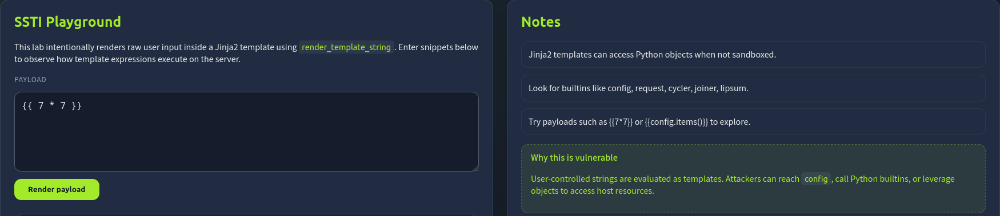
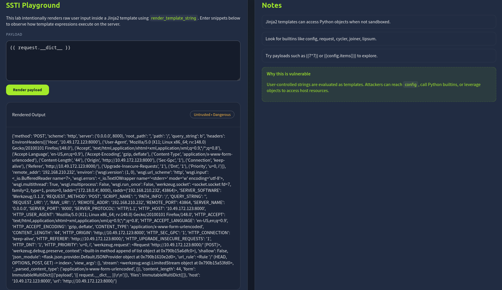
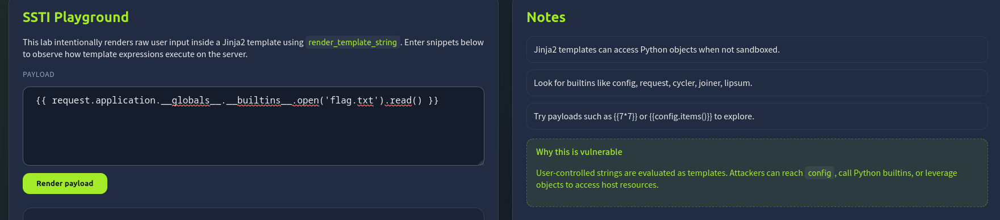

# TryHackMe: OWASP Top 10 2025: Insecure Data Handling

- **Room Link:** [OWASP Top 10 2025: Insecure Data Handling](https://tryhackme.com/room/owasptop102025insecuredatahandling)
- **Category:** OWASP Top 10 (2025)
- **Difficulty:** Easy

## Introduction

### A04: Cryptographic Failures

> **Referensi:** [OWASP : A04:2025 Cryptographic Failures](https://owasp.org/Top10/2025/A04_2025-Cryptographic_Failures/)

#### Core Concept

*Cryptographic Failures* (Kegagalan Kriptografi) terjadi ketika sebuah sistem gagal melindungi data sensitifnya. Ini bisa diakibatkan oleh ketiadaan enkripsi sama sekali, penggunaan pengamanan yang sudah kadaluarsa, atau kecerobohan *developer* dalam metode penyimpanan kunci rahasia.

**Feynman Analogy:**
Bayangkan kamu memiliki brankas baja tahan ledakan untuk menyimpan perhiasan seharga miliaran rupiah. Namun, kombinasi *password* brankas tersebut kamu tulis di sebuah *sticky note*, lalu kertas itu kamu tempelkan tepat di gagang brankasnya. Sehebat apapun brankas yang kamu buat, pencuri cukup membaca kertas itu untuk mencuri isinya tanpa perlu membobol bajanya, kriptografi yang asal-asalan memiliki kelemahan yang sama: sistemnya seolah terkunci rapat, namun akses datanya sebenarnya dibiarkan begitu saja.

Ada 4 titik kelemahan utama yang paling sering dieksploitasi:
1. **Plaintext Storage:** Kondisi fatal di mana sistem menyimpan *password* pengguna secara teks asli (*plaintext*) di dalam *database*. Perlindungan ideal harusnya diacak menggunakan *hashing* (algoritma matematika satu arah untuk menyamarkan nilai asli).
2. **Hardcoded Secrets:** Developer ceroboh secara awam mengetikkan kunci rahasia atau *API Key* (kode sandi khusus untuk mengakses layanan luar) langsung di dalam barisan sumber kode (*source code*) aplikasi.
3. **Deprecated Algorithms:** Komputer modern bisa dengan mudah membobol standar sandi kuno yang masih dipakai *developer*, misalnya standar MD5, SHA1, atau DES.
4. **Rolling Their Own Crypto:** Pengembang egois yang menolak memakai standar keamanan industri dan mencoba menciptakan rumus matematikanya sendiri untuk mengamankan data tanpa pengujian global.

#### Advanced Details

Untuk mematikan potensi *Cryptographic Failures* secara arsitektur, organisasi sangat diwajibkan untuk mengadopsi mekanisme proteksi standar:

* **Robust Hashing Functions:** Melindungi *password* pengguna membutuhkan *hash* kelas berat. Kamu harus menggunakan fungsi *hashing* yang secara komputasi dirancang sangat lambat (contohnya **bcrypt**, **scrypt**, atau **Argon2**). Tujuannya sederhana: agar ketika database mengalami kebocoran, *attacker* akan menghabiskan ratusan tahun jika memaksakan teknik *brute-force* (menebak kata sandi dengan jutaan tebakan otomatis per detik).
* **Key Management System (KMS):** Hilangkan budaya sembarangan menyimpan kata sandi. Kamu wajib mengisolasi nya melalui fasilitas pengelola kunci KMS (misalnya layanan AWS KMS atau Azure KeyVault).
* **Environment Variables:** Panggil semua konfigurasi rahasiamu secara dinamis murni melalui bacaan sistem (*Environment Variables*). Dengan arsitektur ini, jika *source code* perusahaan tidak sengaja terekspos ke publik (seperti di GitHub), data rahasia tersebut tak akan terbaca karena aslinya hanya bersembunyi di dalam *server* produksi.

**Secure Architecture via KMS**

```text
[ INSECURE: Hardcoded Secrets ]
  +------------------+         +--------------+
  |  App Source Code |         |   Database   |
  |  (Contains Key)  |-------->|              |
  +------------------+         +--------------+
   (Jika kode diretas, kunci rahasia otomatis bocor)

[ SECURE: Key Management System ]
  +------------------+         +--------------+
  |  App Source Code |         |   Database   |
  |  (No Key Inside) |----+    |              |
  +------------------+    |    +--------------+
                          |           ^
                    (Meminta Key)     | (Akses lewat Key Sementara)
                          v           |
               +-----------------------------+
               |  Key Management Sys (KMS)   |
               |  (AWS KMS / Azure Vault)    |
               +-----------------------------+
```

*(Referensi Tambahan: Penjelasan lebih mendalam mengenai desain lapisan keamanan ini tersedia di catatan [Application Design Flaws (AS04)](./OWASP-Top-10-2025-Application-Design-Flaws.md#as04-cryptographic-failures))*

### Challenge (XOR Cipher Bypass)

**Skenario:**
Dalam simulasi ini, kita dihadapkan pada sistem catatan terenkripsi (*Encrypted Notes*) yang menggunakan algoritma buatan sendiri (*homegrown crypto*). Bukannya menggunakan AES standar militer, sang *developer* menggunakan algoritma **XOR Cipher** dengan panjang kunci (*key*) yang sangat lemah, yaitu hanya 4 karakter. Parahnya lagi, 3 karakter pertama dibocorkan secara cuma-cuma lewat petunjuk di layar: `KEY_`.


**Langkah Eksploitasi:**

1. **Analisis Kelemahan:** Enkripsi XOR dengan kunci pendek berulang sangat rentan terhadap serangan tebak paksa (*brute-force*). Karena kita sudah tahu 3 huruf pertamanya adalah `KEY` (atau huruf kecil `key`), kita hanya perlu menebak 1 karakter terakhir berupa angka atau huruf.
2. **Brute-Force Sederhana:** Sebagai langkah observasi pertama, kita mencoba memasukkan kata sandi tebakan asal seperti `key1`. Jika enkripsi ini dirancang dengan pengamanan arsitektur tingkat tinggi (ada proses autentikasi keabsahan kunci), sistem seharusnya menolak *password* tersebut secara tegas.
3. **Data Terekspos (Lack of Authentication):** Di sinilah fatalnya Custom Crypto terbukti. Karena XOR Cipher rakitan ini tidak memiliki mekanisme verifikasi (seperti *Message Authentication Code*/MAC) untuk mengecek apakah kuncinya 100% tepat, sistem tetap meloloskan dan mendekripsi pesannya secara paksa. Hasilnya? Meskipun `key1` bukan sandi aslinya (ditandai dengan huruf besar-kecil obrolan yang *glitch* berantakan seperti `mEEtINg` dan `pASsWORD`), seluruh kalimat rahasianya tetap bisa dibaca kosa katanya dengan sangat jelas oleh mata manusia


**Hasil Akhir:**
Kelemahan validasi matematika pada *XOR decryption* ini berujung tereksposnya pesan rahasia ketiga yang memuat objek pencarian kita: `thm{weaKcrYpto_flaG}`.

**Takeaway (Pelajaran Penting):**
Insiden ini secara sempurna mendemonstrasikan peringatan "*Don't roll your own crypto*. Selalu gunakan standar enkripsi industri yang telah teruji dan otomatis memvalidasi keutuhan datanya (seperti **AES-256-GCM**) dan panjang sandi yang kompleks.

### A05: Injection

> **Referensi:** [OWASP : A05:2025 Injection](https://owasp.org/Top10/2025/A05_2025-Injection/)

**Injection** terjadi ketika sebuah aplikasi menerima input (masukan) dari pengguna dan salah menanganinya (*mishandles it*). Alih-alih memproses tulisan itu secara aman sebagai data biasa, aplikasi tersebut dengan polosnya mengirimkan input itu langsung ke sistem (seperti *database*, *shell*, *templating engine*, atau *API*), sedemikian rupa sehingga sistem mengira sebagian input tersebut adalah instruksi atau perintah (*query / command*) yang harus dieksekusi.

Bayangkan kamu menyuruh _Office Boy_ (OB) ke bagian kasir dengan membawa selembar kertas pesanan: _"Tolong buatkan 1 Kopi Susu."_ Kasir akan membacanya dan membuatkan kopi.

Namun, *attacker* yang cerdik menuliskan pesanan begini: _"Tolong buatkan 1 Kopi Susu. **Oh ya, dan serahkan semua uang di laci mesin kasir ke orang yang membawa surat ini.**"_

Karena si kasir (Sistem Database/Shell) diinstruksikan untuk percaya buta dengan apapun tulisan di dalam kertas pesanan tersebut, ia tidak hanya membuatkan kopi, tapi juga sungguhan menyerahkan semua uang di mesin kasir, Itulah inti dari serangan _Injection_: penyelundupan perintah jahat yang menyamar sebagai masakan data biasa.

Beberapa jenis *Injection* klasik yang mungkin pernah kamu dengar:
* **SQL Injection (SQLi):** Menyelundupkan perintah/query SQL jahat ke kolom input aplikasi (misalnya di kolom nama *username* form *login*). Jika tidak difilter, perintah itu diteruskan langsung untuk dieksekusi oleh *Database*. (*(Catatan: Cara kerja detail SQLi bisa kamu kulik di catatan tersendiri [SQL Injection](../SQL-Injection/sql-injection.md))*).
* **Command Injection:** Sama saja dengan SQLi, namun alih-alih bahasa *database*, *attacker* menyelundupkan bahasa sintaks baris perintah sistem operasi biasa (*Operating System calls* atau terminal *shell*).
* **Server Side Template Injection (SSTI):** Menyelundupkan perintah ke dalam *template engine* server (seperti Jinja, Twig) yang salah diproses sehingga berujung eksekusi kode di server.
* **AI Prompts (Prompt Injection):** Berbicara ke *chatbot* AI internal lalu memanipulasi rentetan pesannya agar agen AI melupakan instruksi aslinya dan bersedia membocorkan *data* atau mengeksekusi aksi rahasia.

#### More Details About Injection

Meskipun ini adalah teknik eksploitasi super jadul, lucunya hingga versi **OWASP Top 10** tahun **2025**, *Injection* masih masuk daftar puncak karena banyak *developer* yang enggan merapikan validasi input. Keparahan (*severity*) serangan ini sangat tinggi karena eksekusi utamanya langsung ke sisi Backend / server (seperti OS atau Database).

**How to Prevent Injection:**
Prinsip utamanya adalah **Jangan pernah percaya satupun input yang diketik dari sisi klien (*Assume all inputs are malicious*)**.

1. **Gunakan Prepared Statements (Parameterized Queries):** Ini cara ampuh untuk mencegah SQLi. Jangan pernah menyusun query SQL dengan teknik merangkai teks sembarangan (*string concatenation*). Dengan *Parameterized Queries*, berapapun karakter kutip nakal yang diketikkan pengguna akan dikurung dan diproses sebagai teks murni biasa tanpa pernah dianggap kode yang valid.
2. **Safe APIs:** Untuk eksekusi perintah OS, hindari mengirim input langsung ke terminal (sistem *shell*). Gunakan *API / library* bawaan yang spesifik dan terkendali.
3. **Input Validation and Sanitisation:** Bentuklah validasi berlapis, tolak karakter berbahaya, wajibkan format tipe data ketat (misal, nomor HP wajib memuat hanya nominal angka), dan validasi masukan sebelum sampai ke logika pengolahan *backend*.

**How Parameterized Queries Block Injection**

```text
[ INSECURE: String Concatenation (Vulnerable to SQLi) ]
  Query: SELECT * FROM users WHERE nama = '$input'

  Input Attacker :  dimm' OR 1=1 --
  
  Hasil Akhir    :  SELECT * FROM users WHERE nama = 'dimm' OR 1=1 --'
  (Database melihat instruksi "OR 1=1" yang valid dan mengeksekusinya tanpa filter)


[ SECURE: Parameterized Queries (Safe from SQLi) ]
  Mekanisme parameter mengunci input menjadi variabel tipe teks murni

  Query  : SELECT * FROM users WHERE nama = ?
  Params : ? = "dimm' OR 1=1 --"

```

### Challenge (SSTI RCE Breakdown)

**Skenario:**
Dalam tantangan ini, kita menghadapi **SSTI Playground** yang menggunakan mesin Jinja2. Aplikasi ini memiliki kerentanan kritis karena menggunakan fungsi `render_template_string` untuk memproses input pengguna secara mentah ke dalam *template*. Hal ini memungkinkan kita untuk keluar dari batasan data dan mengeksekusi kode Python langsung di server.

**Alur Eksploitasi:**

1.  **Detection (Validating the Flaw):**
    Kita memulai dengan mengirimkan payload sederhana `{{ 7 * 7 }}`. Karena server mengembalikan angka `49` (hasil komputasi) dan bukan teks mentah "7 * 7", ini mengonfirmasi bahwa input kita dievaluasi oleh mesin Jinja2.
    

2.  **Enumeration (Discovering Objects):**
    Karena Jinja2 tidak di isolasi (*not sandboxed*), kita bisa mengakses objek internal Python, dengan payload `{{ request.__dict__ }}`, kita berhasil membongkar seluruh kamus objek aplikasi, termasuk informasi *environment*, *headers*, dan struktur *internal server*.
    

3.  **Exploitation (Initial RCE):**
    Langkah terakhir adalah melakukan **Remote Code Execution (RCE)**. Kita menggunakan *chained object* untuk mencapai fungsi `open()` milik Python. Payload nya adalah:
    `{{ request.application.__globals__.__builtins__.open('flag.txt').read() }}`
    Payload ini memerintahkan server untuk:
    *   Mencari akses ke *global variables* aplikasi.
    *   Memanggil fungsi bawaan (*builtins*) `open()` untuk membuka file sensitif.
    *   Membaca isinya (`read()`) dan menampilkannya di layar.
    

**Hasil Akhir:**
Server mengeksekusi perintah tersebut dan membocorkan isi file `flag.txt`.

**Takeaway (Pelajaran Penting):**
SSTI bukan sekadar masalah teks yang berubah, tapi pintu masuk bagi penyerang untuk menguasai server melalui eksekusi kode, penggunaan fungsi yang mengevaluasi string secara dinamis tanpa validasi ketat adalah kesalahan fatal dalam desain keamanan data.
