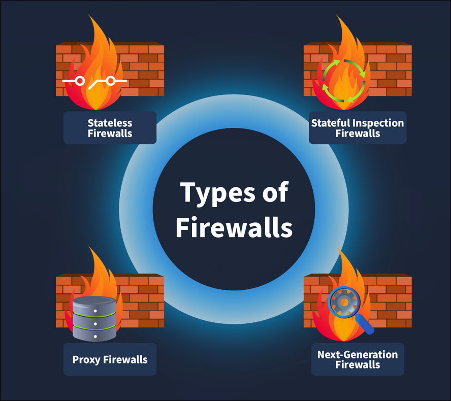

# TryHackMe: Firewall Fundamentals

- **Room Link:** [Firewall Fundamentals](https://tryhackme.com/room/firewallfundamentals)
- **Category:** Security Solutions
- **Difficulty:** easy

## What is Purpose of Firewall

Pernahkah kamu memperhatikan satpam (*security guard*) yang berjaga di pintu masuk *mall*, bank, atau rumah? Tugas utama mereka adalah mengawasi setiap orang yang keluar-masuk, dan memastikan tidak ada penyusup yang bisa masuk tanpa izin. Satpam ini bertindak sebagai **tembok penghalang** antara pengunjung luar dan area gedung.

Nah, sama seperti fungsi satpam tersebut, **Firewall** adalah sistem keamanan yang bertugas mengawasi ribuan lalu lintas data (*traffic*) yang masuk dan keluar dari sebuah jaringan digital kita.

Firewall bertindak sebagai **tembok pertahanan utama** yang memisahkan jaringan internal kita yang aman dari jaringan eksternal (Internet). Berbekal aturan khusus (*rules*), Firewall akan memutuskan apakah suatu data diizinkan masuk atau akan diblokir mentah-mentah.

### Learning Objectives

- Tipe-tipe firewall
- Firewall rules dan komponennya
- Windows Defender Firewall
- Linux firewall (iptables)

## Type Of Firewall

nyatanya ada banyak **tipe Firewall berbeda** di luar sana—masing-masing dirancang dengan tujuannya sendiri

Yang membuat keren Firewall adalah beda jenis Firewall, beda juga tempat kerjanya. Mereka beroperasi di **lapisan (*layer*) OSI Model yang berbeda-beda**. Ibaratnya, ada satpam yang hanya memeriksa KTP di pagar depan, ada juga yang sampai memeriksa isi tas sampai ke dalam-dalamnya di ruang VIP

Berikut adalah beberapa kategori Firewall yang wajib kita tahu:

### 1. Stateless Firewall (Satpam Pemalas)

*Stateless Firewall* ini ibarat **satpam pemalas** yang jaga di gerbang depan (Beroperasi di **OSI Layer 3 & 4**).
Dia kerja super cepat buat meriksa *header* paket data (ngecek IP dari mana, mau ke mana, dan lewat Port berapa). TAPI kelemahannya: dia **GAK PUNYA INGATAN**.
- Dia gak peduli paket ini kelanjutan dari koneksi yang wajar atau bukan.
- Kalau ada paket aneh diblokir hari ini, pas paket itu datang lagi besok, si firewall ini bakal nanya dari awal lagi karena lupa kalau kemarin paket itu udah diblokir.

### 2. Stateful Firewall (Satpam Rajin)

Beda dari yang *Stateless*, si **Stateful Firewall** ini satpamnya bawa buku catatan (*State Table*) kemana-mana (Beroperasi di **OSI Layer 3 & 4** juga).
- Kalau ada paket yang diizinin masuk, dia bakal catat koneksi itu. Jadi pas ada paket balasan dari saluran yang sama, dia bakal otomatis izinin masuk **tanpa perlu diinterogasi dari nol lagi**.
- Begitu juga kalau ada paket berbahaya yang dia usir, dia bakal catet cirinya buat nolak paket serupa di masa depan secara otomatis. Jauh lebih aman

### 3. Proxy Firewall (Asisten Kurir)

Nah ini beda kelas. *Proxy Firewall* (atau *Application-level Gateway*) ini kerjanya udah di ruangan VIP (**OSI Layer 7**).
Kelemahan *firewall* sebelumnya adalah mereka cuma cek "kulit/amplop"-nya doang, gak berani buka isinya. *Proxy* memecahkan masalah itu:
- Dia bertindak layaknya **Asisten Kurir Pribadi**. Pas kamu mau kunjungi server luar, si *Proxy* yang bakal repot-repot pergi nemuin server itu, ngambil datanya, lalu nganterin balik ke kamu.
- Karena dia yang ngambilin barang, dia bakal ngebongkar isinya dulu. Kalau isinya *malware*, langsung dia buang.
- Nilai plusnya: IP asli kamu jadi anonim/tersembunyi karena yang maju berhadapan sama internet adalah si *Proxy*.

### 4. Next-Generation Firewall (NGFW) (Unit Pasukan Khusus)

Ini adalah *Firewall Last Boss* sejuta umat zaman sekarang. NGFW beroperasi nyapu bersih dari **OSI Layer 3 sampai Layer 7**.
Dia bukan cuma satpam, tapi udah kayak **Sistem Pertahanan Militer Lengkap**:
- Punya fitur *Deep Packet Inspection* (mengecek paket sampai ke dalem-dalemnya).
- Punya sistem IPS (*Intrusion Prevention System*) buat mencegah ancaman/serangan secara *Real-Time*.
- Bisa nebak pola serangan dan mendeskripsi lalu lintas yang disamarkan (*SSL/TLS decryption*). Singkatnya: NGFW itu *All-in-One Security*

> **Note:**
> BONUS:

### Web Application Firewall (WAF)

Kalau *Firewall* biasa tugasnya mengamankan pintu server secara umum, WAF punya tugas spesifik: **Mengamankan Aplikasi Web/Website**. Dia berada di depan *web server* buat mencegah serangan-serangan peretas *web* tingkat tinggi kayak *SQL Injection* atau *Cross-Site Scripting (XSS)*.

### Ringkasan Karakteristik Firewall

Biar makin gampang buat *review* atau nentuin *firewall* mana yang pas buat dipakai, cek tabel di bawah ini:

| Tipe Firewall | Karakteristik Utama |
| :--- | :--- |
| **Stateless Firewall** | - Cuma bisa penyaringan dasar (*Basic filtering*) - Gak punya rekaman koneksi sebelumnya (*No track*) - Cocok buat jaringan yang butuh kecepatan tinggi karena kerjanya ngebut |
| **Stateful Firewall** | - Bisa mengenali lalu lintas data lewat pola (*Recognize traffic by patterns*) - Bisa dikasih aturan yang lumayan rumit (*Complex rules*) - Benar-benar memantau jaringan dan mencatat koneksi yang sedang jalan |
| **Proxy Firewall** | - Berani membongkar dan inspeksi isi paket datanya - Punya fitur penyaringan konten (*Content filtering*) - Pegang kendali penuh atas aplikasi keamanan - Bisa mendekripsi dan inspeksi paket data yang disandikan pakai SSL/TLS |
| **Next-Generation Firewall**  | - Perlindungan paling mutakhir (*Advanced threat protection*) - Udah bawaan punya sistem IPS (*Intrusion Prevention System*) - Bisa menganalisa hal-hal aneh secara heuristik (berdasarkan kecerdasan buatan) - Sama kayak Proxy, jago dekripsi dan inspeksi paket data SSL/TLS |
| **Web Application Firewall (WAF)** | - Khusus dipasang di depan Web Server buat melindungi Aplikasi Web / Website - Fokus mencegah serangan *hacker* web spesifik kayak *SQL Injection* & *Cross-Site Scripting (XSS)* |

## Rules in Firewall

Firewall memberikan kita **kekuasaan penuh (*control*)** untuk mengatur *traffic* yang masuk dan keluar dari jaringan.

Meski dari *Firewall* sudah dibekali aturan keamanan standar, bagian paling seru untuk seorang Analis/Admin adalah kita bisa membuat **Aturan Sendiri (*Custom Rules*)** yang spesifik.

**Contoh Kasus (Skenario Akses SSH):**
Normalnya, buat menjaga server dari *hacker* , kita bakal pasang aturan: *"Firewall Tolak mentah-mentah (*Deny*) semua orang asing dari luar yang mencoba masuk ke server kita lewat jalur SSH (Port 22)."*

Tapi, masalah muncul kalau kebetulan kita (sebagai admin) sedang kerja *remote* dari *cafe* dan butuh akses SSH ke server itu. Di sinilah saksinya *Custom Rules* bekerja. Kita tinggal tambahin instruksi pengecualian:
*"Tolak semua akses SSH **KECUALI** kalau orang itu datang dari alamat IP `192.168.100.55` (Ini IP WiFi *cafe* tempat kita nongkrong). Kalau si IP itu yang minta masuk, bukain pintunya (*Allow*)"*

Intinya: **Aturan Firewall (*Firewall Rules*) itu adalah hukum mutlak buatan sendiri.** Kita yang menentukan siapa yang harus ditolak, dan siapa pengecualian yang boleh masuk.
