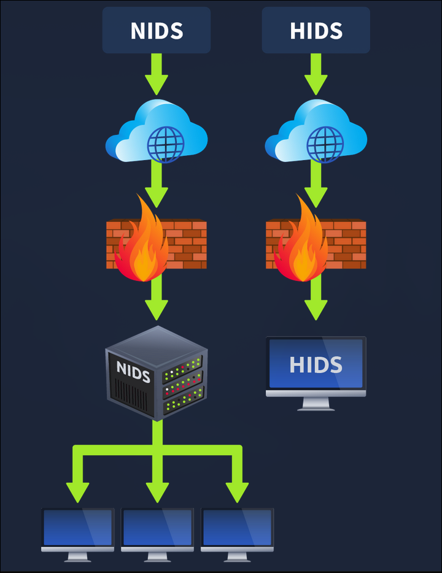
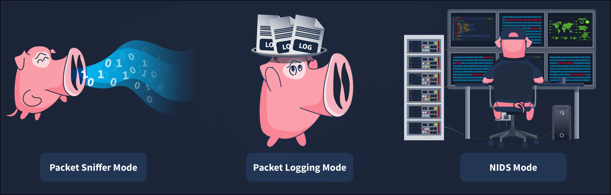
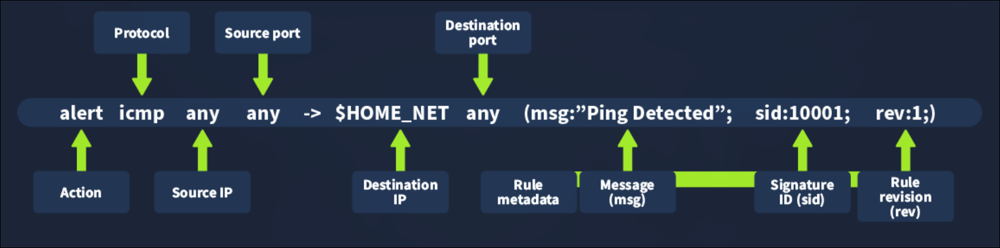

# TryHackMe: IDS Fundamentals

- **Room Link:** [IDS Fundamentals](https://tryhackme.com/room/idsfundamentals)
- **Category:** Security Solutions
- **Difficulty:** easy

## What is an IDS ?

Kita sudah mempelajari bahwa **Firewall** bertugas sebagai satpam penjaga gerbang (mengontrol siapa yang boleh masuk dan keluar). Namun, sebuah sistem tidak pernah luput dari kelemahan. Bagaimana jika ada penyusup yang berhasil menyamar sebagai pengunjung sah dan melewati satpam tersebut? Begitu mereka sudah berada di dalam jaringan internal, Firewall di pintu depan tidak lagi bisa mengawasi mereka.

Untuk memperbaiki celah *blind spot* (titik buta) inilah, para arsitek jaringan menciptakan **Intrusion Detection System (IDS)**.

Jika *Firewall* adalah satpam di pos penjagaan depan, maka **IDS adalah kamera pengawas (CCTV) berteknologi tinggi** yang dipasang menyebar di seluruh sudut ruangan dalam jaringan.

**Sistem Kerja Utama IDS:**
1. **Memantau Tanpa Henti:** IDS berada di dalam infrastruktur (berbeda dengan Firewall yang ada di batas luar) dan terus memantau seluruh lalu lintas data (*traffic*) yang berlalu-lalang di dalam.
2. **Mendeteksi Kejanggalan:** Layaknya CCTV pintar, IDS akan menganalisis setiap paket data untuk mencari pergerakan abnormal (*Anomaly*) atau mencocokkannya dengan rekam jejak kriminal (*Signature-based detection*).
3. **Membunyikan Alarm (Sifat Pasif):** Ini adalah karakteristik paling mutlak dari sebuah IDS konvensional. Ketika IDS melihat ada aktivitas penyusupan yang berhasil lolos, **ia tidak akan melakukan pemblokiran secara mandiri**. Tugas tunggalnya hanyalah membunyikan sistem peringatan dini (*generate alert*) kepada Administrator Keamanan. Keputusan akhir untuk memblokir penjahat tersebut tetap berada di tangan Administrator atau sistem keamanan lain.

### Learning Objectives

Kita akan mengetahui lebih mendalam mengenai Security solution IDS, termasuk eksplorasi alat IDS *open-source* paling populer (Snort). Fokus pembelajaran kita meliputi:
- Konsep berbagai Tipe IDS beserta kemampuan deteksinya.
- Pemahaman cara kerja dasar Snort IDS.
- Mempelajari struktur aturan bawaan (*Default Rules*) dan aturan kustomisasi di dalam Snort.
- Praktik merancang *Custom Rule* sendiri menggunakan bahasa spesifik Snort.

## Type of IDS
IDS dapat dikategorikan berdasarkan fungsinya. Klasifikasi utamanya terbagi atas dua hal: **Berdasarkan Posisi Penempatan (Deployment)** dan **Berdasarkan Cara Deteksi (Detection)**.

### 1. Deployment Modes (Posisi Penempatan)

Berdasarkan letak di mana sistem ini di install, IDS terbagi menjadi dua kelompok:

- **Host Intrusion Detection System (HIDS):**
  Jika NIDS adalah CCTV bangunan, maka HIDS ini ibarat **Pengawal Pribadi (Bodyguard) VIP**.
  Solusi HIDS diinstal secara individu langsung ke dalam satu perangkat spesifik (seperti Server Database atau laptop Direktur). Tugasnya eksklusif hanya mengawasi ancaman yang berpotensi menyerang perangkat *host* tersebut.
  *Keunggulan:* Mampu memberikan pengawasan aktivitas lokal dengan visibilitas yang sangat detail.
  *Kelemahan:* Sangat merepotkan untuk dikelola pada jaringan perusahaan yang masif, karena Administratif harus menginstal dan merawat sistem pengawal ini pada setiap perangkat individu (*resource-intensive*).

- **Network Intrusion Detection System (NIDS):**
  Ini adalah **Sistem CCTV Utama** yang mengawasi seluruh bangunan operasional.
  NIDS tidak peduli dengan urusan individu perangkat. Ia diletakkan di titik persimpangan jaringan (seperti di belakang Router atau *Switch*) untuk memantau lalu lintas data dari semua perangkat yang terhubung dalam ekosistem jaringan tersebut.
  *Fungsi Utama:* Memberikan gambaran (*centralized view*) terpusat mengenai segala hal yang terjadi di dalam jaringan secara keseluruhan.

<P align="center">

</p>

### 2. Detection Modes (Cara Deteksi)

Setelah menentukan di mana CCTV (IDS) akan dipasang, langkah selanjutnya adalah memahami bagaimana otak dari CCTV tersebut bekerja dalam mendeteksi ancaman. Umumnya ada tiga metode deteksi:

- **Signature-Based IDS (Berdasarkan Rekam Jejak):**
  Metode ini bekerja layaknya polisi yang berpatroli sambil membawa buku **Daftar Pencarian Orang (DPO)**.
  Setiap serangan siber pasti meninggalkan pola atau sidik jari yang unik (disebut *Signature*). IDS jenis ini sudah dibekali *database* berisi ribuan *signature* dari serangan-serangan yang pernah terjadi di dunia.
  *Kelebihan:* Sangat cepat dan akurat dalam mendeteksi ancaman yang sudah populer.
  *Kelemahan Fatal:* Buta terhadap serangan *Zero-Day* (serangan jenis baru yang belum pernah terjadi dan belum ada di buku DPO). Jika penjahat menggunakan modus baru, IDS ini akan diam saja. (*Contoh alat Populer: Snort*).

- **Anomaly-Based IDS (Berdasarkan Perilaku Normal):**
  Berbeda dengan metode sebelumnya, IDS jenis ini tidak membawa buku DPO. Ia bekerja dengan cara **Mempelajari Kebiasaan (*Baseline*)**.
  Awalnya, sistem ini akan diterjunkan ke dalam jaringan untuk belajar: "Oh, biasanya *traffic* harian jam 9 pagi cuma segini", atau "Oh, biasanya server ini cuma diakses oleh IP lokal". Ketika suatu masa ada aktivitas yang menyimpang dari kebiasaan normal tersebut (misal: *traffic* tiba-tiba melonjak tengah malam), ia akan langsung membunyikan alarm.
  *Kelebihan:* Sangat jago menangkap serangan *Zero-Day* yang belum punya *signature*.
  *Kelemahan Fatal:* Sering terjadi *False Positives* (salah sangka). Aktivitas normal yang kebetulan agak tinggi (misal: karyawan sedang mengunduh file besar untuk presentasi besok) bisa ditandai sebagai serangan. Butuh proses *fine-tuning* (penyesuaian manual) yang panjang agar sistem ini tidak terlalu paranoid.

- **Hybrid IDS (Sistem Kombinasi):**
  Sesuai namanya, metode ini merupakan gabungan kekuatan dari *Signature-Based* dan *Anomaly-Based*.
  Jika ada ancaman lama yang masuk, ia akan gunakan buku DPO (*Signature*) untuk memblokir dengan cepat tanpa menguras tenaga. Namun jika ada ancaman misterius yang mencoba menyusup, sistem *Anomaly* miliknya akan mengambil alih deteksi.

## IDS Example: Snort

**Snort** adalah salah satu IDS solution *open-source* paling terkenal dan paling banyak digunakan di dunia (dikembangkan sejak tahun 1998).

Snort pada dasarnya beroperasi sebagai **Hybrid IDS**. Ia menggunakan gabungan dari pendeteksian pola (*Signature-based*) dan pendeteksian perilaku (*Anomaly-based*) untuk mengidentifikasi ancaman keamanan.

Semua kecerdasan Snort bergantung pada *Rule Files* (Kumpulan Aturan). Aturan ini terbagi menjadi dua jenis operasional:

1. **Built-in Rules (Aturan Bawaan):**
   Saat kita menginstal Snort, ia sudah dibekali dengan paket aturan bawaan yang sangat masif (*pre-installed*). Paket ini berisi ribuan *signature* (rekam jejak) dari berbagai pola serangan siber yang sudah dikenali secara global. Dengan bermodalkan *Built-in Rules* ini saja, Snort sudah siap untuk mendeteksi sebagian besar lalu lintas berbahaya (*malicious traffic*).

2. **Custom Rules (Aturan Kustom):**
   Snort memberikan kebebasan penuh kepada Administrator Keamanan. Jika ada jaringan bisnis spesifik yang memiliki karakteristik lalu lintas unik, Administrator dapat menulis **aturan buatan sendiri (*Custom Rules*)**.
   Selain itu, untuk menghindari peringatan palsu (*False Positives*) atau menghemat kinerja sistem, Administrator juga dibebaskan untuk menonaktifkan (*disable*) aturan bawaan manapun yang dirasa tidak relevan dengan lingkungan server mereka.

### Modes of Snort

<p align="center">

</p>

| Snort Mode | Deskripsi Analogi (*Description*) | Kasus Penggunaan (*Use Case*) |
| :--- | :--- | :--- |
| **Packet Sniffer Mode** | Mode hanya digunakan snort untuk membaca dan menampilkan lalu lintas jaringan mentah (*raw traffic*) ke layar terminal secara *real-time*. Tidak ada proses analisis keamanan yang terjadi (tidak bertindak sebagai IDS). | Sangat berguna bagi tim jaringan (*Network Engineer*) yang butuh melihat aliran data harian untuk melakukan *troubleshooting* (mendiagnosis masalah kinerja jaringan). |
| **Packet Logging Mode** | Mode **Perekam Kotak Hitam (*Black Box*)**. Snort difungsikan semata-mata untuk merekam seluruh paket lalu lintas ke dalam format standar `PCAP`. | Digunakan oleh tim forensik digital (*Digital Forensics*). Mereka membutuhkan *file log* dari Snort ini untuk menyelidiki akar penyebab (*root cause*) suatu serangan yang sudah terlanjur membobol sistem. |
| **Network Intrusion Detection System (NIDS) Mode** | Mode **Deteksi Intrusi Sebenarnya**. Ini adalah mode utama di mana Snort aktif bekerja penuh sebagai IDS (*Sistem CCTV Pintar*). Ia mencocokkan lalu lintas dengan *database* rekam jejak (*Signatures*) dan membunyikan peringatan (*Alerts*). | Wajib dihidupkan jika Tim Keamanan membutuhkan pemantauan proaktif dan sistem peringatan dini dari sebuah potensi ancaman peretasan. |

*(Meski kegunaan paling relevan dari Snort adalah sebagai NIDS, penggunaan mode lain [Sniffer/Logging] bebas disesuaikan dengan kebutuhan situasional tim)*.

## Snort Usage

### Catatan Penting Saat Instalasi Snort

Saat proses pemasangan awal (*installation*), kita wajib menentukan *Network Interface* (Kartu Jaringan) dan rentang IP yang akan diawasi. Secara bawaan (*default*), Snort hanya akan peduli dan menangkap paket data yang memang ditujukan khusus ke perangkat *host* tempat ia diinstal saja.

**Bagaimana agar Snort bisa mengawasi seluruh jaringan (bertindak sebagai NIDS)?**
Kita harus memaksa Kartu Jaringan pada perangkat tersebut untuk masuk ke dalam **Promiscuous Mode** (Mode Menerima Segala Arah). Dengan mode ini, Kartu Jaringan akan menerima seluruh paket data yang lalu lalang di sekitarnya, terlepas paket itu ditujukan untuk dirinya atau bukan.

### Struktur Direktori dan Konfigurasi Snort

Setelah diinstal, wujud fisik dari otak dan catatan Snort akan tersimpan di dalam direktori `/etc/snort`.

Di dalam direktori ini, terdapat berbagai macam *file* penting. Namun, yang dipercaya memegang peran sebagai **Key File** adalah *file* khusus bernama `snort.conf` (*Configuration File*).

Melalui `snort.conf` inilah, seorang Administrator Keamanan memberikan instruksi operasional kepada Snort:
- Aturan pendeteksian mana saja yang boleh dibaca dan diaktifkan.
- Rentang wilayah/IP jaringan mana yang wajib dipantau siang dan malam.
- Dan berbagai macam *setting* teknis lainnya.

Sedangkan, *file-file* yang memuat *database* ribuan rekam jejak ancaman (*Signatures*) akan disimpan secara terpisah dan diamankan di dalam sebuah sarang (*folder*) yang dinamakan **`rules`**.

Berikut adalah contoh di Terminal ketika kita membedah isi dari direktori Snort:

```bash
user@arch:~$ ls /etc/snort
classification.config  reference.config  snort.arch.conf
community-sid-msg.map  rules             threshold.conf
gen-msg.map            snort.conf        unicode.map
```

### Rule Format

Agar Snort bisa bekerja, kita harus menulis aturan dengan tata letak (*Syntax*) yang sangat presisi. Sebagai contoh, mari kita bedah anatomi dari sebuah *rule* sederhana yang dirancang untuk mendeteksi datangnya paket *ping* (Protokol ICMP) ke dalam jaringan pangkalan kita:

<p align="center">

</p>

Aturan tersebut terlihat seperti baris kode yang membingungkan, namun fungsinya sangat masuk akal jika dipecah per komponen:

- **Action (*Tindakan Utama*):** `alert`
  Menentukan apa respons Snort jika ada paket data yang tertangkap basah cocok dengan parameter aturan ini. Dalam hal ini, tindakannya adalah membunyikan alarm peringatan (`alert`).
- **Protocol (*Bahasa Komunikasi*):** `icmp`
  Target protokol spesifik yang sedang diawasi. Pada contoh ini, kita secara spesifik menargetkan paket ping yang menggunakan protokol `ICMP`.
- **Source IP & Port (*Asal Keberangkatan*):** `any any`
  Menentukan dari alamat IP mana dan melalui *port* manakah paket tersebut diizinkan berasal. Kata sakti `any` (apa saja) berarti Snort akan mengawasi *traffic* yang datang dari titik mana pun di internet tanpa pilih pilih.
- **Direction Operator (*Panah Arah Tujuan*):** `->`
  Tanda panah ini mutlak untuk menunjukkan rute perjalanan paket. Artinya, paket ini bergerak dari wilayah *Source* (sisi kiri) menuju masuk ke wilayah *Destination* (sisi kanan).
- **Destination IP & Port (*Titik Pendaratan*):** `$HOME_NET any`
  Di mana titik tujuan paket ini yang kita anggap sebagai bahaya? `$HOME_NET` adalah sebuah variabel. Nilainya otomatis merujuk kembali kepada jangkauan IP jaringan internal kita yang sebelumnya telah didata di dalam `snort.conf`. Sedangkan *port* tujuannya diatur terbuka lebar ke `any` (seluruh *port*).
- **Rule Metadata / Options (*Informasi Tambahan*):** `(msg:...; sid:...; rev:...;)`
  Bagian yang dikurung sepasang tanda kurung ini adalah informasi tambahan (*Rule Options*). Semuanya diletakkan berderet di bagian paling akhir kalimat:
  - **`msg` (*Message*):** Teks pesan (contoh: "Ping Detected") yang akan langsung dimunculkan di layar (*console*) saat peringatan terpicu. Ini adalah pesan yang disampaikan snort agar tim analis keamanan paham jenis bahaya apa yang sedang terjadi.
  - **`sid` (*Signature ID*):** Nomor identitas unik (*Signature*) milik aturan ini. Ibarat nomor KTP, setiap *rule* wajib memiliki nomor tunggal yang berbeda (di sini nilainya: `10001`) agar tidak tertukar satu sama lain saat proses evaluasi.
  - **`rev` (*Revision*):** Nomor rekaman edisi referensi. Jika besok hari tim analis merevisi *rule* ini menjadi lebih canggih, nilai `rev` wajib mereka naikkan satu angka (misal menjadi `rev:2`). Tujuannya murni sebagai rekam jejak versi.

### Rule Creation

Mari kita praktikkan penulisan resep keamanan di atas. Semua *rule* buatan sendiri (*Custom Rules*) biasanya dikumpulkan ke dalam satu *file* spesifik bernama `local.rules`.

Pertama, buka *file* `local.rules` tersebut menggunakan teks editor (misalnya `nano`) dengan hak akses penuh (`sudo`):
```bash
ubuntu@tryhackme:~$ sudo nano /etc/snort/rules/local.rules
```

Kemudian, tambahkan baris aturan pantauan kita di baris paling bawah *file* tersebut:
```snort
alert icmp any any -> 127.0.0.1 any (msg:"Loopback Ping Detected"; sid:10003; rev:1;)
```
*(Catatan: Biarkan aturan-aturan lama yang sudah ada di dalamnya tetap hidup, jangan dihapus).*

maksud dari *rule* di atas:
"Jika ada paket ping (`icmp`) dari siapapun dan dari *port* manapun (`any any`) yang menuju (`->`) tepat ke alamat IP lokal komputer kita sendiri (`127.0.0.1`) di *port* manapun (`any`), maka segera bunyikan alarm (`alert`) dan tampilkan tulisan `Loopback Ping Detected`."

Setelah ditambahkan, simpan modifikasi *file* tersebut.

### Rule Testing

Setelah diberikan instruksi baru, saatnya kita mengaktifkan Snort untuk menguji apakah ia benar-benar bisa menaati dan mendeteksi ancaman sesuai *rule* `local.rules` kita.

Jalankan perintah pengaktifan Snort berikut di layar terminal:
```bash
user@arch:~$ sudo snort -q -l /var/log/snort -i lo -A console -c /etc/snort/snort.conf
```
*Command di atas pada dasarnya memerintahkan Snort untuk hidup, membaca konfigurasi utama (`snort.conf`), mendengarkan secara pasif di kartu jaringan lokal (`-i lo`), merekam hasil pantauan (`-l`), dan menampilkan alarm peringatannya langsung ke layar.*

Karena instruksi yang kita buat khusus terfokus untuk mendeteksi datangnya paket Ping (ICMP) menuju alamat IP lokal (*loopback* `127.0.0.1`), maka cara menguji (*testing*) pembuktiannya sangat sederhana: cukup *ping* ke alamat IP lokal komputer sendiri untuk melihat apakah alarm Snort menyala.

```bash
user@arch:~$ ping 127.0.0.1
```

Output di bawah menunjukkan peringatan "Loopback Ping Detected" yang dihasilkan Snort ketika kita melakukan ping ke IP loopback host kita. Artinya aturan kami berfungsi dengan baik.

```bash
user@arch:~$ sudo snort -q -l /var/log/snort -i lo -A console -c /etc/snort/snort.conf
07/24-10:46:52.401504  [**] [1:1000001:1] Loopback Ping Detected [**] [Priority: 0] {ICMP} 127.0.0.1 -> 127.0.0.1
07/24-10:46:53.406552  [**] [1:1000001:1] Loopback Ping Detected [**] [Priority: 0] {ICMP} 127.0.0.1 -> 127.0.0.1
07/24-10:46:54.410544  [**] [1:1000001:1] Loopback Ping Detected [**] [Priority: 0] {ICMP} 127.0.0.1 -> 127.0.0.1
```

### Referensi Tambahan

Untuk penguasaan penulisan *rule* Snort yang lebih dalam dan bervariasi (seperti pendeteksian serangan *Web*, *Malware*, dsb), sangat disarankan untuk merujuk langsung pada **Docs Resmi Snort** melalui tautan berikut:
- [Official Snort Documentation (snort.org/documents)](https://www.snort.org/documents)

### Running Snort on PCAP Files

Sejauh ini kita melihat ketangguhan Snort dalam mendeteksi ancaman pada lalu lintas jaringan yang sedang berjalan masuk secara seketika (*real-time traffic*).

Namun di dunia nyata, adakalanya kita akan menemui skenario di mana Sistem Keamanan sudah terlanjur kebobolan, dan yang tersisa hanyalah sekumpulan *file log* rekaman aktivitas jaringan masa lalu. *File* ini biasanya terekam dalam format standar yang disebut **PCAP** (*Packet Capture*).

Bagaikan memutar kembali kaset rekaman CCTV lama untuk mencari wajah pelaku pencurian, Snort sangat mampu ditugaskan untuk membaca dan menganalisis *file* PCAP lama untuk keperluan investigasi Digital Forensics

Berikut adalah perintah (*command*) dengan hak akses Penuh (*sudo privilege*) yang bisa digunakan untuk menjalankan skenario ini:

```bash
user@arch:~$ sudo snort -q -l /var/log/snort -r Task.pcap -A console -c /etc/snort/snort.conf
```
*(Catatan: Ganti nama `Task.pcap` dengan lokasi *file* `PCAP` spesifik yang ingin dianalisis).*

Bisa diperhatikan bahwa command yang diketik hampir persis sama dengan perintah Snort sebelumnya. Satu-satunya kunci perbedaannya terletak pada pergantian operator sumber asal paket:
- Instruksi **`-i lo`** (mengawasi kartu Antarmuka/Interface secara langsung) kini telah **digantikan oleh `-r Task.pcap`** (menginstruksikan Snort untuk membaca/*read* dari sebuah *file* statis).
