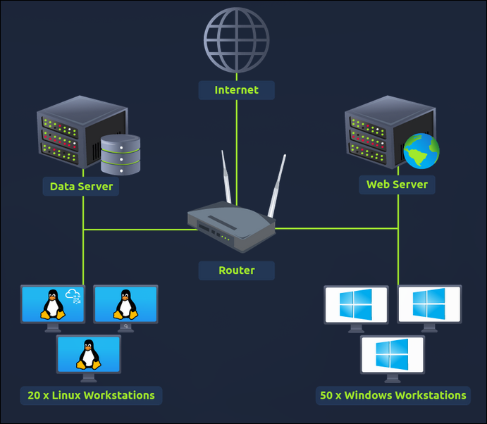
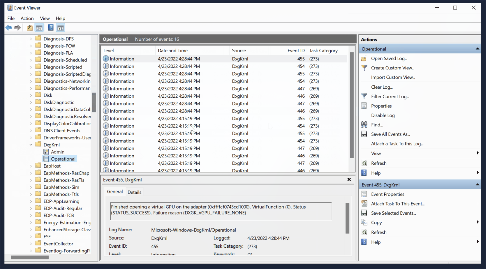

# TryHackMe: Introduction to SIEM

- **Room Link:** [Introduction to SIEM](https://tryhackme.com/room/introductiontosiem)
- **Kategori:** Security Solutions
- **Difficulty:** easy

## Introduction to SIEM

**Security Information and Event Management (SIEM)** adalah sebuah security solution_ yang bertugas mengumpulkan, menganalisis, dan mengelola data keamanan dari berbagai sumber di dalam jaringan. Secara fungsional, SIEM membantu tim keamanan seperti _Security Operations Center_ / SOC untuk mendeteksi keanehan, menganalisis ancaman, dan merespons insiden keamanan secara *real-time*.

### Learning Objectives

Setelah menyelesaikan modul ini, kita akan memahami:
- Berbagai jenis data keamanan yang dikumpulkan oleh sistem SIEM.
- Titik buta (batasan) yang terjadi ketika log hanya dibiarkan terisolasi di masing-masing perangkat.
- Pentingnya posisi SIEM sebagai pondasi solusi keamanan siber modern.
- Cara kerja dan fitur-fitur utama yang disediakan oleh alat SIEM.

---

## Logs Everywhere, Answers Anywhere

### Log Everywhere

Di dalam sebuah arsitektur jaringan, perangkat akan terus berkomunikasi satu sama lain maupun dengan dunia luar (internet) melalui *router*. Gambar di bawah ini mengilustrasikan contoh jaringan sederhana yang terdiri dari perangkat *endpoint* (PC Linux/Windows), sebuah *Data Server*, dan sebuah situs web.

Setiap perangkat tersebut secara aktif menghasilkan **Log Events** secara berkelanjutan. Rangkaian log ini berfungsi sebagai jejak digital historis dari setiap aktivitas komputer, yang menjadi instrumen krusial bagi analis keamanan untuk mengejar jejak peretasan maupun sekadar melakukan _troubleshooting_ sistem.

Secara garis besar, klasifikasi pengumpulan _log_ ini dibagi menjadi dua kategori utama:

### 1. Host-Centric Log Sources

Ini adalah sumber log yang fokus mencatat peristiwa spesifik di dalam komponen internal sebuah mesin atau perangkat. Perangkat penghasil _Host-Centric Log_ meliputi komputer pengguna (Windows/Linux) maupun _server_ utama.

Beberapa contoh aktivitas yang dicatat dalam log ini:
- Interaksi pengguna saat membuka, mengakses, atau menghapus sebuah file.
- Percobaan autentikasi (login sukses maupun gagal) ke dalam sistem operasi.
- Modifikasi terhadap *registry* sistem (penambahan, pengubahan, atau penghapusan _key_).
- Eksekusi _script_ melalui terminal seperti PowerShell.
- Penjalanan program (file *executable*).

### 2. Network-Centric Log Sources

Berbeda dengan _host-centric_, log jenis ini berfokus pada aktivitas lalu lintas jaringan. Ini mencakup komunikasi antar perangkat di dalam area lokal maupun komunikasi keluar menuju internet. Perangkat pembuat log ini biasanya beroperasi di level infrastruktur perantara, seperti _Firewall_, _Router_, maupun sistem deteksi intrusi (IDS/IPS).

Beberapa contoh aktivitas yang dicatat di jaringan:
- Rekam jejak koneksi *remote* (misal via protokol SSH).
- Transfer dan akses file menggunakan protokol FTP.
- Lalu lintas aktivitas _browsing_ dan akses situs (*Web Traffic*).
- Indikasi *user* yang menjalin koneksi aman (atau menyembunyikan IP) ke internet melalui VPN.
- Aktivitas pembagian komputasi jaringan secara masif (*file sharing*).

---

### Answers Nowhere

Melihat penjabaran masifnya data _log_ di atas, secara teori mencari jejak aktivitas hacker seharusnya menjadi sangat mudah. Namun, di real world tidak sesederhana itu.

Beberapa kendala yang mungkin terjadi:

- **Volume Data yang Masif:** Banyaknya sumber log yang tersebar di berbagai perangkat membuat proses pemeriksaan log satu per satu sangat memakan waktu.
- **Tidak Terpusat (*No Centralization*):** Karena _log_ pada dasarnya menetap (tersimpan) di mesin asalnya, analis dituntut untuk melakukan sambungan *remote login* (seperti lewat SSH untuk Linux, atau RDP untuk Windows) ke setiap perangkat secara manual hanya untuk membacanya. Proses ini sangat tidak efisien dan akan menguras waktu berharga saat jalannya penyelidikan.
- **Konteks Log Terbatas (*Limited Context*):** Satu kejadian _log_ aja nggak pernah bisa menceritakan gambaran utuh dari sebuah peretasan. Aktivitas _login_ yang kelihatannya normal di satu komputer ternyata bisa jadi awal mula insiden penyusupan beruntun (*Lateral Movement*) kalau nggak dianalisa barengan (dikorelasikan) sama rekam jejak komputer lain di sekitarnya.
- **Analisis Terbatas (*Limited Analysis*):** setiap log source menghasilkan banyak logs tiap detik nya, menganalisis setiap log secara manual untuk mencari event yang abnormal itu hampir mustahil dilakukan manusia, kadang para analis keamanan melewatkan banyak hal penting.
- **Masalah Format log (*format log issue*):** analis keamanan perlu mengetahui format log dari setiap log source yang berbeda beda, ini akan memakan waktu dan tenaga.

## Why SIEM ?

Sebelumnya kita sudah membahas tentang log, log source dan kategorinya, dan kendala analis keamanan saat mengidentifikasi sebuah log, lalu bagaimana SIEM sebagai solusi keamanan bisa membantu ?

Disinilah SIEM berperan sebagai solusi keamanan modern, Security Information and Event Management (SIEM) adalah alat yang dirancang untuk mengumpulkan, menganalisis, dan mengelola data keamanan dari berbagai sumber di dalam jaringan

### Fitur utama SIEM

SIEM tidak hanya mengatasi kendala-kendala yang dihadapi analis keamanan, tetapi juga meningkatkan efisiensi tim SOC saat menganalisis log.

Berikut adalah fitur-fitur utama dari SIEM:

- **Centralized Log Collection:**

**SIEM** mengumpulkan log dari berbagai sumber di dalam jaringan lalu dipindahkan ke dalam satu tempat / kelompok. sehingga analis keamanan tidak perlu lagi melakukan secara manual misalnya melakukan remote login pakai SSH atau RDP ke setiap perangkat untuk membaca log.

- **Normalization of Logs:**

Raw log memiliki format dasar laporan yang berbeda-beda, sehingga SIEM melakukan parsing (memecah isi menjadi kolom inti) lalu dilanjutkan proses normalisasi untuk menyeragamkan format log tersebut dalam satu bahasa tampilan yang sama, sehingga analis keamanan tidak perlu lagi mengetahui format log dari setiap log source yang berbeda beda.

- **Correlation of Logs:**

**SIEM** mengkorelasikan log dari berbagai sumber di dalam jaringan untuk mendeteksi aktivitas yang mencurigakan dan menganalisa pola nya. sehingga analis keamanan tidak perlu lagi menganalisis setiap log secara manual untuk mencari event yang abnormal.

contoh aktivitas yang ada di sistem user selama waktu 5 menit:

1. Wowok login melalui VPN dari IP yang belum pernah digunakan sebelumnya
2. Wowok mengakses beberapa dokumen yang ada di shared drive / folder
3. Wowok menjalankan file script di PowerShell
4. Secara diam-diam, sistem merespons dengan membangun koneksi keluar (Outbound Network Connection) menuju alamat IP server asing di internet

Jika analis keamanan memeriksa log satu per satu, mereka mungkin akan melewatkan aktivitas mencurigakan ini. Namun, dengan **SIEM**, aktivitas ini akan dikorelasikan dan memicu peringatan (alert) karena aktivitas ini tidak sesuai dengan perilaku normal user (anomali).

- **Real-time Alerting:**

**SIEM** akan mendeteksi aktivitas mencurigakan dan memicu peringatan (alert) secara real-time kepada analis keamanan, sehingga analis keamanan dapat segera menindaklanjuti insiden tersebut, analis juga bisa mmebuat aturan baru untuk mendeteksi aktivitas mencurigakan yang baru muncul.

- **Dashboards and Reporting:**

Dashboard merupakan bagian penting dari SIEM, karena dashboard digunakan untuk memvisualisasikan data log yang dikumpulkan oleh SIEM, sehingga analis keamanan dapat dengan mudah memantau aktivitas di dalam jaringan dan membuat laporan untuk manajemen, dan berikut beberapa informasi apa aja yang bisa ditampilkan di dashboard:

- Alert Highlight
- Notifikasi System
- Health Alert System
- Daftar percobaan login yang gagal
- Jumlah aktivitas (Event) yang ada di log
- Rules Triggered ( Menunjukkan seberapa sering indikasi ancaman bentrok dengan aturan/kebijakan khusus yang sudah dibuat analis di dalam sistem SIEM)
- Top Domain Visited (Domain yang paling sering diakses): Berguna mendeteksi secara visual jika tiba-tiba ada banyak traffic yang mengarah ke situs tak terdaftar

## Log, Source, And Ingestion

### Log Source

Setiap aktivitas yang terjadi pada perangkat yang ada di dalam jaringan akan menghasilkan log, seperti user mengunjungi sebuah website, connect ke SSH, dll

berikut beberapa alat yang dipakai untuk menampilkan log disebuah perangkat:

### Windows Event Viewer

Di windows OS, kita bisa melihat log dengan menggunakan **Event Viewer** yang juga log tersebut dapat diteruskan ke SIEM untuk dianalisis lebih lanjut.

### Linux Log Files

OS Linux menyimpan log tentang event, errors, peringatan, dan informasi sistem lainnya yang tersimpan dalam bentuk file teks yang tersebar di berbagai direktori antara lain:

- `/var/log/httpd/:` Berisi tentang HTTP Request / Response dan error logs
- `/var/log/cron:` Berisi tentang aktivitas penjadwalan tugas (cron jobs)
