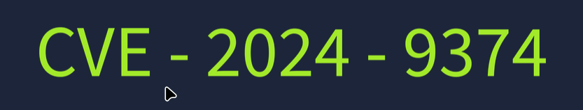

# TryHackMe: Vulnerability Scanner Overview

- **Room Link:** [Vulnerability Scanner Overview](https://tryhackme.com/room/vulnerabilityscanneroverview)
- **Category:** Security Solutions
- **Difficulty:** Easy

## What Are Vulnerabilities?

### Konsep Dasar: Vulnerability & Patching

Bayangkan kamu punya rumah kecil yang nyaman. Suatu hari, kamu menyadari bahwa atap rumahmu ternyata penuh dengan lubang-lubang kecil. Meskipun kecil, lubang-lubang ini bisa menimbulkan masalah besar: saat hujan, air merembes masuk dan merusak perabotan. Debu dan serangga pun bisa leluasa masuk lewat celah-celah itu.

Lubang-lubang kecil di atap ini adalah analogi sempurna untuk **Vulnerability** (Kerentanan) dalam dunia cyber. Sementara proses memperbaiki atap agar rumah kembali aman disebut **Patching**.

### Vulnerability di Dunia Digital

Sama seperti rumah tadi, perangkat digital (komputer, server, smartphone) juga menyimpan kelemahan tersembunyi di dalam _software_ maupun _hardware_-nya. Kelemahan-kelemahan inilah yang bisa dimanfaatkan (_exploit_) oleh penyerang untuk mengambil alih kendali perangkat kita.

Bedanya dengan lubang di atap rumah: **Vulnerability digital jauh lebih sulit dideteksi**. Kita tidak bisa melihatnya secara kasat mata. Dibutuhkan upaya aktif untuk memburu (_hunting_) kelemahan-kelemahan ini. Bahkan, meskipun terdengar sepele (seperti lubang kecil yang "bisa diperbaiki kapan saja"), jika dibiarkan terlalu lama, dampaknya bisa sangat besar.

**Alur sederhananya:**

| Tahap | Aksi | Analogi Rumah |
| ----- | ---- | ------------- |
| 1. Vulnerability muncul | Kelemahan ada di software/hardware | Lubang kecil muncul di atap |
| 2. Hacker mencari | Penyerang aktif memburu celah | Hujan dan serangga mengincar lubang |
| 3. Exploitation | Penyerang memanfaatkan celah | Air merembes, perabotan rusak |
| 4. Patching | Tim keamanan menambal celah | Kamu memperbaiki atap rumah |

### Learning Objectives

Kita akan mempelajari lebih dalam mengenai:
- Apa itu _Vulnerability Scanning_ dan jenis-jenisnya.
- _Tools_ yang digunakan untuk melakukan _vulnerability scanning_.
- Demonstrasi penggunaan **OpenVAS** (_vulnerability scanner open-source_).
- Latihan praktik langsung.

---

## Vulnerability Scanning

### Apa Itu Vulnerability Scanning?

**Vulnerability Scanning** adalah proses inspeksi (pemeriksaan) sistem digital secara menyeluruh untuk menemukan kelemahan-kelemahan yang tersembunyi di dalamnya.

Organisasi menyimpan banyak data penting di infrastruktur digital mereka. Kalau kelemahan ini dibiarkan, penyerang bisa memanfaatkannya untuk membobol sistem dan menyebabkan kerugian besar. Makanya, _vulnerability scanning_ secara rutin itu **bukan pilihan, tapi kewajiban**. Bahkan banyak standar keamanan (_compliance_) yang mengharuskan organisasi melakukan scanning ini minimal **sekali per tahun**.

### Kenapa Harus Otomatis?

Mencari kelemahan secara manual itu ibarat memeriksa setiap genteng di atap rumah satu per satu dengan mata telanjang — **sangat melelahkan, lambat, dan rawan terlewat**. Semakin besar jaringannya, semakin mustahil dilakukan secara manual.

Di sinilah _vulnerability scanner_ otomatis hadir. Cukup install _tool_-nya, masukkan alamat IP target (satu _host_ atau satu rentang jaringan), lalu biarkan _tool_ tersebut bekerja. Hasilnya? Laporan rapi yang berisi daftar kelemahan lengkap dengan detailnya.

Setelah kelemahan teridentifikasi, tim keamanan akan memperbaikinya dengan melakukan perubahan pada _software_ atau sistem. Perubahan-perubahan perbaikan ini disebut **Patches**.

### Authenticated vs. Unauthenticated Scans

_Vulnerability scan_ bisa dikategorikan ke dalam banyak jenis, namun pembagian paling mendasar adalah berdasarkan **ada tidaknya kredensial (_login_) saat scanning**:

- **Authenticated Scan:** Scanner diberikan credential (username & password) dari _host_ target. Ibarat kamu masuk ke dalam rumah dan memeriksa setiap ruangan dari dalam — hasilnya jauh lebih detail dan mendalam.

- **Unauthenticated Scan:** Scanner hanya diberikan alamat IP target, tanpa credential apapun. Ibarat kamu memeriksa rumah dari luar pagar — kamu bisa lihat mana jendela yang terbuka, tapi tidak bisa lihat isi di dalamnya.

| Aspek | Authenticated Scan | Unauthenticated Scan |
| ----- | ------------------ | -------------------- |
| **Credential** | Wajib diberikan ke scanner | Hanya butuh alamat IP target |
| **Perspective** | Dari dalam sistem (_insider view_) | Dari luar sistem (_outsider view_) |
| **Depth** | Lebih detail, bisa scan konfigurasi dan aplikasi terinstall | Lebih dangkal, tapi lebih cepat dan ringan |
| **Example** | Scanning database internal dengan memberikan credential | Scanning website publik yang bisa diakses siapa saja |

### Internal vs. External Scans

Selain berdasarkan credential, _vulnerability scan_ juga bisa dibedakan berdasarkan **posisi scanner** saat melakukan pemeriksaan:

- **Internal Scan:** Dilakukan dari _dalam_ jaringan. Fokusnya adalah menemukan kelemahan yang bisa dieksploitasi oleh penyerang yang **sudah berhasil masuk** ke jaringan internal. Ibarat memeriksa keamanan rumah dari dalam — apakah ada laci yang tidak dikunci, dokumen penting yang tergeletak sembarangan, dll.

- **External Scan:** Dilakukan dari _luar_ jaringan. Fokusnya adalah menemukan kelemahan yang terlihat dari perspektif penyerang yang **belum masuk** sama sekali. Ibarat pencuri yang mengintai rumah dari jalan — apakah ada jendela terbuka, pagar rendah, atau pintu belakang yang terbuka.

| Aspek | Internal Scan | External Scan |
| ----- | ------------- | ------------- |
| **Position** | Dari dalam jaringan | Dari luar jaringan |
| **Focus** | Kelemahan yang bisa dieksploitasi setelah penyerang masuk | Kelemahan yang terekspos ke penyerang dari luar |
| **Perspective** | Apa yang dilihat _insider_ (karyawan, hacker yang sudah masuk) | Apa yang dilihat _outsider_ (hacker dari internet) |

Secara praktik, kedua kategori scan ini saling berhubungan. **Authenticated Scan** biasanya dipasangkan dengan **Internal Scan** (karena kita sudah di dalam jaringan dan punya credential), sedangkan **Unauthenticated Scan** lebih sering digunakan untuk **External Scan** (mensimulasikan penyerang dari luar yang tidak punya akses login sama sekali).

---

## Tools for Vulnerability Scanning

Ada banyak tools untuk melakukan vulnerability scanning, baik yang open-source maupun komersial. Berikut adalah beberapa contohnya:

### Nessus

**Nessus** awalnya lahir sebagai proyek _open-source_ pada tahun 1998, lalu diakuisisi oleh **Tenable** pada tahun 2005 dan menjadi _software_ berbayar (_proprietary_). Sekarang, Nessus adalah salah satu _vulnerability scanner_ paling populer di kalangan perusahaan besar.

| Aspek | Detail |
| ----- | ------ |
| **Tipe** | Komersial (ada versi gratis terbatas) |
| **Deployment** | _On-premises_ (harus di-install dan dikelola sendiri di server lokal) |
| **Versi Gratis** | Fitur scan terbatas |
| **Versi Berbayar** | Fitur scan lengkap, unlimited scan, dan dukungan profesional |

### Qualys

**Qualys** dikembangkan pada tahun 1999 sebagai solusi _vulnerability management_ berbasis langganan (_subscription_). Selain scanning kerentanan, Qualys juga menyediakan _compliance checks_ (pemeriksaan kepatuhan) dan _asset management_ (pengelolaan aset). Ia secara otomatis memberikan _alert_ ketika menemukan kelemahan selama proses pemantauan berkelanjutan.

| Aspek | Detail |
| ----- | ------ |
| **Tipe** | Komersial (berbasis langganan) |
| **Deployment** | _Cloud-based_ (tidak perlu install di server lokal, tinggal pakai) |
| **Keunggulan** | Tidak ada biaya tambahan untuk _hardware_ dan pemeliharaan, karena semuanya berjalan di cloud |

### Nexpose

**Nexpose** dikembangkan oleh **Rapid7** pada tahun 2005 sebagai solusi _vulnerability management_ berbasis langganan. Keunggulan utamanya adalah kemampuannya untuk terus-menerus menemukan aset baru di jaringan dan langsung melakukan scan terhadapnya. Nexpose juga memberikan _risk score_ (skor resiko keamanan) berdasarkan nilai aset dan dampak kerentanannya — jadi kita bisa tahu mana yang harus diprioritaskan untuk di-_patch_ duluan.

| Aspek | Detail |
| ----- | ------ |
| **Tipe** | Komersial (berbasis langganan) |
| **Deployment** | _On-premises_ dan _Hybrid_ (cloud + on-premises) |
| **Keunggulan** | Auto-discovery aset baru, risk scoring, dan compliance checks |

### OpenVAS (Open Vulnerability Assessment System)

**OpenVAS** adalah solusi _vulnerability assessment_ **open-source** yang dikembangkan oleh **Greenbone Security**. Meski fiturnya tidak selengkap tools komersial di atas, OpenVAS sudah cukup mumpuni untuk memberikan gambaran utuh tentang cara kerja _vulnerability scanner_. Sehingga sangat cocok untuk organisasi kecil atau sistem individu yang ingin melakukan scanning tanpa biaya langganan.

| Aspek | Detail |
| ----- | ------ |
| **Tipe** | _Open-source_ (gratis) |
| **Deployment** | _On-premises_ |
| **Keunggulan** | Gratis, cocok untuk belajar dan organisasi kecil |
| **Keterbatasan** | Fitur tidak selengkap Nessus/Qualys/Nexpose |

### Reports & Choosing the Right Tool

Semua _vulnerability scanner_ di atas memiliki satu kesamaan: **semuanya menghasilkan laporan (_report_) setelah selesai melakukan scan**. Laporan ini berisi daftar kerentanan yang ditemukan, skor risikonya, serta deskripsi detailnya. Beberapa tools bahkan menyertakan rekomendasi perbaikan (_remediation_) dan bisa di-_export_ dalam berbagai format.

Setiap tool punya kekuatan masing-masing. Saat memilih _vulnerability scanner_ yang tepat, pertimbangkan tiga hal utama:
- **Scope** — Seberapa besar jaringan yang perlu di-scan?
- **Resources** — Berapa budget dan infrastruktur yang tersedia?
- **Depth** — Seberapa dalam analisis yang dibutuhkan?

---

## CVE & CVSS

Bayangkan kamu bekerja di _help desk_ sebuah perusahaan IT yang menangani ratusan keluhan klien setiap hari. Supaya tidak bingung, setiap keluhan pasti diberi **nomor tiket unik** agar mudah dilacak dan di-_follow up_. Konsep inilah yang mendasari **CVE** dan **CVSS** di dunia _cybersecurity_.

### CVE (Common Vulnerabilities and Exposures)

**CVE** adalah sistem penomoran unik yang diberikan kepada setiap kerentanan keamanan yang ditemukan. Dikembangkan oleh **MITRE Corporation**, setiap kali ada kerentanan baru ditemukan pada suatu aplikasi _software_, kerentanan tersebut akan mendapat nomor CVE dan dipublikasikan ke _database_ CVE secara online. Tujuannya agar semua orang bisa mengetahui detail kerentanan tersebut dan segera mengambil langkah _patching_.

<strong>Format nomor CVE:</strong>

  

| Bagian | Penjelasan | Contoh |
| ------ | ---------- | ------ |
| **CVE prefix** | Semua nomor CVE diawali dengan prefix "CVE" | `CVE` |
| **Year** | Tahun kerentanan ditemukan | `2024` |
| **Arbitrary Digits** | Empat atau lebih digit unik sebagai identitas | `9374` |
