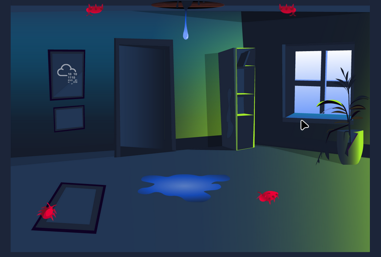

# TryHackMe: Vulnerability Scanner Overview

- **Room Link:** [Vulnerability Scanner Overview](https://tryhackme.com/room/vulnerabilityscanneroverview)
- **Category:** Security Solutions
- **Difficulty:** Easy

## What Are Vulnerabilities?

### Konsep Dasar: Vulnerability & Patching

Bayangkan kamu punya rumah kecil yang nyaman. Suatu hari, kamu menyadari bahwa atap rumahmu ternyata penuh dengan lubang-lubang kecil. Meskipun kecil, lubang-lubang ini bisa menimbulkan masalah besar: saat hujan, air merembes masuk dan merusak perabotan. Debu dan serangga pun bisa leluasa masuk lewat celah-celah itu.

Lubang-lubang kecil di atap ini adalah analogi sempurna untuk **Vulnerability** (Kerentanan) dalam dunia cyber. Sementara proses memperbaiki atap agar rumah kembali aman disebut **Patching**.

  

### Vulnerability di Dunia Digital

Sama seperti rumah tadi, perangkat digital (komputer, server, smartphone) juga menyimpan kelemahan tersembunyi di dalam _software_ maupun _hardware_-nya. Kelemahan-kelemahan inilah yang bisa dimanfaatkan (_exploit_) oleh penyerang untuk mengambil alih kendali perangkat kita.

Bedanya dengan lubang di atap rumah: **Vulnerability digital jauh lebih sulit dideteksi**. Kita tidak bisa melihatnya secara kasat mata. Dibutuhkan upaya aktif untuk memburu (_hunting_) kelemahan-kelemahan ini. Bahkan, meskipun terdengar sepele (seperti lubang kecil yang "bisa diperbaiki kapan saja"), jika dibiarkan terlalu lama, dampaknya bisa sangat besar.

**Alur sederhananya:**

| Tahap | Aksi | Analogi Rumah |
| ----- | ---- | ------------- |
| 1. Vulnerability muncul | Kelemahan ada di software/hardware | Lubang kecil muncul di atap |
| 2. Hacker mencari | Penyerang aktif memburu celah | Hujan dan serangga mengincar lubang |
| 3. Exploitation | Penyerang memanfaatkan celah | Air merembes, perabotan rusak |
| 4. Patching | Tim keamanan menambal celah | Kamu memperbaiki atap rumah |

### Learning Objectives

Kita akan mempelajari lebih dalam mengenai:
- Apa itu _Vulnerability Scanning_ dan jenis-jenisnya.
- _Tools_ yang digunakan untuk melakukan _vulnerability scanning_.
- Demonstrasi penggunaan **OpenVAS** (_vulnerability scanner open-source_).
- Latihan praktik langsung.

---
