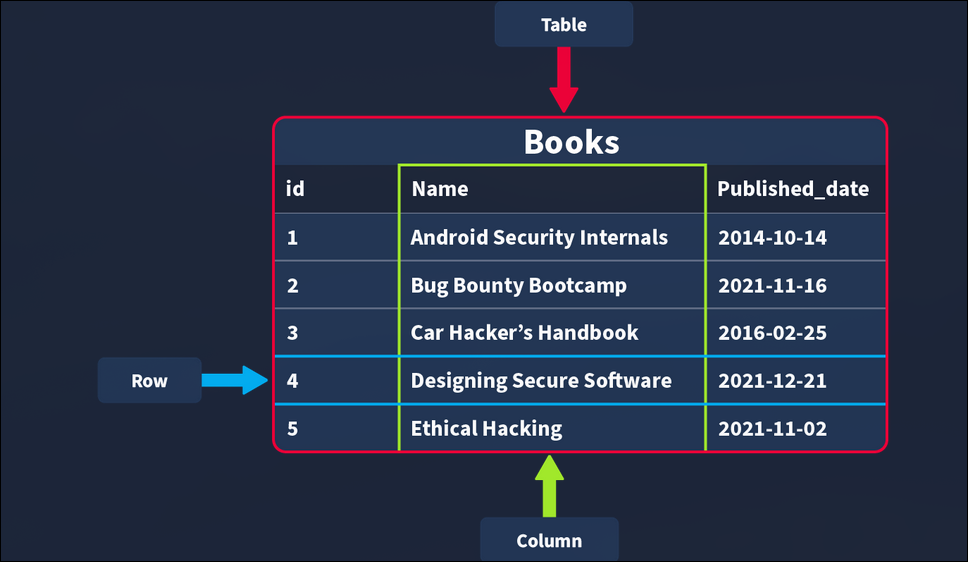

# TryHackMe - Sql Fundamental

- **Room Link:** [Sql Fundamental](https://tryhackme.com/room/sqlfundamentals)
- **Category:** Web Hacking
- **Difficulty:** Easy

## Task 1: Introduction

Di sisi offensive database dapat membantu kita memahami kerentanan SQL dengan lebih baik, seperti SQL injection, dan membuat Query yang membantu kita memanipulasi atau mengambil data di dalam layanan yang telah disusupi. Di sisi lain, pada sisi defensif, database dapat membantu kita menelusuri basis data dan menemukan aktivitas mencurigakan atau informasi relevan; database juga dapat membantu kita melindungi layanan dengan lebih baik dengan menerapkan batasan saat dibutuhkan

Karena database ada di mana-mana, penting untuk memahaminya, Kita akan mempelajari dasar-dasar database, mencakup istilah-istilah penting, konsep, dan tipe-tipe yang berbeda sebelum memahami SQL

**Learning Objectives:**

- Paham apa itu database, serta istilah dan konsep utama
- Memahami berbagai jenis database
- Paham apa itu SQL
- Memahami dan mampu menggunakan Operasi SQL CRUD **(Create, Read, Update, Delete)**
- Paham cara pakai SQL Clauses **(perintah tambahan untuk menyaring data)**
- Paham cara menjalankan berbagai **Operations**, **Operators**, dan **Functions** di dalam SQL

## Task 2: Databases 101

### Introducing Databases

Seperti yang sudah dijelaskan di task 1, Database itu ada di hampir setiap sistem, jadi besar kemungkinan kita sering berinteraksi dengan layanan yang menggunakannya sehari-hari, database adalah kumpulan informasi atau data terstruktur terorganisir yang mudah diakses dan dapat dimanipulasi atau dianalisis, data tersebut bisa dalam berbagai bentuk misal authentication user (nama pengguna dan password), yang disimpan dan diperiksa saat login ke dalam aplikasi atau situs (seperti TryHackMe, dll), data yang dibuat pengguna di media sosial (Seperti Instagram dan Facebook) tempat data kayak postingan pengguna, komentar, suka, dll dikumpulkan dan disimpan, serta informasi lalui riwayat tontonan yang disimpan oleh layanan streaming seperti Netflix dan digunakan buat menghasilkan rekomendasi

### Different Types of Databases

Ada cukup banyak jenis database yang bisa dibuat, tapi untuk ini, kita hanya fokus pada dua tipe utama: **Relational Databases (atau SQL)** vs **Non-Relational Databases (atau NoSQL)**

<p align="center">

</p>

**Relational Databases:** Menyimpan data yang terstruktur, yang artinya setiap data yang masuk harus mengikuti pola atau aturan tertentu, Contohnya data user itu isinya wajib ada `nama_depan`, `nama_belakang`, `email`, `username`, sama `password`. Relational databases paling cocok untuk Menyimpan Data Terstruktur, menghubungkan Antar Data yang Kompleks, dan Sistem Autentikasi & Kontrol Akses

```SQL
-- Membuat tabel user dengan struktur yang tetap
CREATE TABLE users (
    user_id INT PRIMARY KEY,
    first_name VARCHAR(50),
    last_name VARCHAR(50),
    email_address VARCHAR(100),
    occupation VARCHAR(100)
);

-- Memasukkan data (entry) ke dalam tabel mengikuti struktur tersebut
INSERT INTO users (user_id, first_name, last_name, email_address, occupation)
VALUES (1, 'Thomas', 'Anderson', 'neo@matrix.com', 'Cyber Security');

INSERT INTO users (user_id, first_name, last_name, email_address, occupation)
VALUES (2, 'John', 'Doe', 'doe@thm.ac.id', 'Student');

-- Membuat tabel relasi (contoh: riwayat login)
CREATE TABLE login_attempts (
    attempt_id INT PRIMARY KEY,
    user_id INT,
    status VARCHAR(20),
    FOREIGN KEY (user_id) REFERENCES users(user_id)
);
```

**Non-Relational Databases:** Kalau SQL tadi ibarat tabel Excel yang kaku, NoSQL ini lebih ke arah folder berisi dokumen-dokumen yang isinya bisa beda-beda formatnya, Cocok banget kalau kita punya data yang isinya bervariasi. Contohnya, hasil scan dokumen yang tipe dan jumlah datanya beda-beda setiap lembar, jadi butuh database yang nggak memaksa data harus masuk ke kolom tertentu

```JSON
{
    "_id": ObjectId("65ccba12f3d4567890abcdef"),
    "nama": { "first_name": "John", "last_name": "Doe" },
    "jurusan": "Teknik Informatika",
    "hobi": ["Cyber Security", "Gaming", "Gym"],
    "stats_game": {
        "level": 7,
        "rank": "Newbie",
        "total_playtime_seconds": NumberLong(12500430)
    },
    "is_active": true
}
```

### Tables, Rows and Columns

Semua data yang disimpan dalam relational database akan disimpan di sebuah tabel, misalnya kumpulan buku yang ada di toko buku maka disimpan dalam tabel bernama “Buku”

<p align="center">

</p>

Saat membuat tabel, kita perlu menetapkan informasi apa saja yang dibutuhkan—seperti `id`, `Nama`, dan `tanggal_terbit` yang nantinya akan menjadi kolom. Setiap kolom ini wajib memiliki tipe data tertentu. Jika ada data yang masuk dengan tipe yang tidak sesuai, sistem secara otomatis akan menolaknya untuk menjaga konsistensi data, secara umum ada empat tipe data inti yang selalu digunakan: **String (teks dan karakter)**, **Integer (angka bulat)**, **Float/Desimal (angka pecahan)**, serta **Date/Time** (waktu dan tanggal).

setelah tabel dan kolomnya selesai dibuat, kita bisa mulai memasukkan data pertama ke database. Misalnya, untuk buku `Android Security Internals` dengan ID `1` dan tanggal terbit `14-10-2014`. Setelah berhasil dimasukkan, seluruh informasi ini akan tersimpan dan muncul sebagai satu baris **(row)** utuh dalam tabel tersebut.

### Primary and Foreign Keys

Ketika data semakin banyak, kita bisa memisahkan informasi ke berbagai tabel, contohnya tabel `Buku` dan tabel `Penulis`, Agar informasi di kedua tabel ini tetap sinkron misalnya kita ingin tau buku tertentu ditulis oleh siapa—kita harus menghubungkan keduanya melalui kunci **(Keys)**. Ada dua jenis kunci yang perlu dipahami:

<p align="center">

</p>

- **Primary Key:** digunakan untuk menjamin bahwa data dalam kolom tertentu bersifat unik. Artinya, setiap baris dalam tabel harus memiliki satu nilai khusus yang menjadi pengenal tetap dan tidak boleh sama dengan data lainnya. Dalam setiap tabel, kita wajib memilih satu kolom sebagai Primary Key, biasanya kolom `id` adalah pilihan terbaik karena nilai ini dibuat khusus untuk setiap entry (satu baris di dalam tabel), sementara judul atau tanggal bisa saja memiliki kemiripan.

- **Foreign Key:** adalah kolom (atau kumpulan kolom) yang berfungsi sebagai penghubung antara dua tabel dalam sebuah database. Contohnya, kita bisa menambahkan kolom`id_penulis` di tabel Buku, kolom ini bertindak sebagai **Foreign Key** karena nilainya merujuk langsung ke kolom id di tabel Penulis, Foreign Key inilah yang memungkinkan terciptanya hubungan antar tabel dalam relational database ,dalam satu tabel kita boleh memiliki lebih dari satu Foreign Key.

## Task 3: SQL

### What is SQL?

Semua teori tadi emang terdengar bagus, tapi dalam praktek, bagaimana sih cara database itu benar-benar bekerja? Bagaimana cara kita membuat tabel pertama dan mengisinya dengan data? Alat apa yang sebenarnya kita gunakan?

Nah, di sinilah peran DBMS (Database Management System). Anggap saja DBMS sebagai pusat kendali atau jembatan antara kita (pengguna) dengan database yang ada. DBMS adalah perangkat lunak yang memungkinkan kita untuk narik, ganti, dan ngatur data yang tersimpan dengan mudah

**Contoh DBMS yang Sering Dipakai:**

- MySQL & MariaDB: Si paling populer buat relational database (SQL).

- MongoDB: Andalan buat database non-relational (NoSQL) yang fleksibel.

- Oracle Database: Biasanya dipakai oleh perusahaan-perusahaan besar untuk skala raksasa.

Untuk bisa 'ngobrol' atau berinteraksi dengan database, kita menggunakan SQL (Structured Query Language). SQL sendiri adalah bahasa komunikasi khusus untuk database yang fungsinya buat manggil, mengatur, hingga mengolah data yang tersimpan di dalam relational database

### The Benefits of SQL and Relational Databases

Berikut adalah beberapa manfaat yang diperoleh dengan mempelajari dan menggunakan SQL:

- **SQL itu cepat:** relational database (yang menggunakan SQL) sanggup menarik data dalam jumlah besar hampir seketika, Hal ini bisa terjadi karena format penyimpanannya yang sangat efisien (nggak makan banyak tempat) serta kecepatan pemrosesannya yang tinggi.

- **Easy to learn:** Berbeda dengan banyak bahasa pemrograman lain, SQL ditulis menggunakan bahasa Inggris sederhana **(plain English)**, sehingga jauh lebih mudah untuk dipahami, Sifat bahasanya yang sangat mudah dibaca membuat kita bisa lebih fokus untuk mempelajari fungsi dan logikanya saja

- **Reliable:** Seperti yang sudah dibahas sebelumnya, relational database menjamin tingkat akurasi data yang tinggi, ini karena adanya aturan struktur yang ketat, setiap kumpulan data wajib memenuhi kriteria struktur tersebut agar bisa masuk ke dalam sistem

- **Flexible:** SQL menyediakan berbagai macam kapabilitas dalam hal menanyakan (querying) database, hal ini memungkinkan pengguna untuk menjalankan tugas analisis data yang luas secara sangat efisien

## Task 4: Databases And Table Statment

### Time to Learn

Saatnya untuk mulai mempelajari SQL dan cara menggunakannya untuk berinteraksi dengan database. di task ini, kita akan mulai dengan belajar menggunakan database dan pernyataan tabel. Bagaimanapun, pernyataan inilah yang pertama-tama kita perlukan untuk membuat database/tabel dan memulai.

### Database Statements

- **CREATE DATABASE**

Kalau ingin sebuah database baru, langkah pertama yang kita ambil adalah membuatnya. caranya di dalam SQL menggunakan pernyataan CREATE DATABASE, Syntax nya seperti ini:

```SQL

mysql> CREATE DATABASE database_name;

```

disini contoh aku akan membuat database bernama `bookstore_db`

```SQL

mysql> CREATE DATABASE bookstore_db;

```

- **SHOW DATABASES**

kita dapat melihatnya database yang sebelumnya dibuat menggunakan statment `SHOW DATABASES`. statment `SHOW DATABASES` akan mengembalikan daftar database yang ada, cara nya:

```SQL

mysql> SHOW DATABASES;

```

Di daftar yang muncul, kita bakal nemuin database yang baru aja dibikin plus beberapa database default kayak `mysql`, `information_schema`, `performance_schema`, dan `sys`. Database bawaan ini penting untuk MySQL agar bisa berfungsi.

- **USE DATABASES**

Setelah database dibuat, kita harus kasih tahu MySQL database mana yang mau kita pakai supaya perintah-perintah selanjutnya dieksekusi di tempat yang benar. Untuk mengaktifkan database yang baru kita buat, kita gunakan perintah `USE` seperti ini:

```SQL

mysql> USE bookstore_db;

```

- **DROP DATABASES**

Kalau database udah nggak kepake lagi misal cuma buat coba-coba atau testing kita bisa hapus pake perintah `DROP`. Cara pakenya simple:

```SQL

mysql> DROP database bookstore_db;

```

### Table Statements

Sekarang setelah kita paham cara mengelola database (mulai dari membuat, melihat daftar, menggunakan, hingga menghapusnya), saatnya kita masuk ke bagian yang lebih seru: mengisi database tersebut dengan tabel dan mempelajari cara berinteraksi langsung dengan data di dalamnya

- **CREATE TABLE**

Sama seperti logika pembuatan database, untuk membuat tabel kita juga menggunakan perintah `CREATE`. Setelah database diaktifkan (dengan menjalankan perintah `USE`), kita bisa langsung membuat tabel di dalamnya menggunakan sintaks berikut:

```SQL
CREATE TABLE nama_tabel (
    column_name1 data_type,
    column_name2 data_type,
    column_name3 data_type
);
```

sekarang kita terapkan di database `bookstore_db;`

```SQL

CREATE TABLE book_inventory (
    id INT AUTO_INCREMENT PRIMARY KEY,
    name VARCHAR(255) NOT NULL,
    published_date DATE,
    description TEXT
);

```

statment ini akan membuat tabel `book_inventory` dengan empat kolom: `id`, `name`, `published_date`, dan `description`. `id` adalah **INT** (Integer) karena seharusnya hanya berupa angka, `AUTO_INCREMENT` ada, artinya buku pertama yang disisipkan akan diberi `id 1`, buku kedua yang disisipkan akan diberi `id 2`, dan seterusnya. Terakhir, `id` ditetapkan sebagai `PRIMARY KEY` karena ini akan menjadi cara kita secara
unik mengidentifikasi catatan buku di tabel kita (dan catatan utama harus ada di tabel)

`name` mempunyai tipe data `VARCHAR(255)`, artinya dapat menggunakan karakter variabel (teks/angka/tanda baca) dan dibatasi 255 karakter dan `NOT NULL`, artinya tidak boleh kosong (jadi jika seseorang mencoba memasukkan record ke dalam tabel ini tetapi `name` kosong maka akan ditolak). `published_date` diatur sebagai tipe data `DATE`. `description` menggunakan tipe data `TEXT` untuk menyimpan teks yang lebih panjang.

- **SHOW TABLES**

Sama seperti kita dapat membuat daftar database menggunakan pernyataan `SHOW`, kita juga dapat membuat daftar tabel dalam database yang sedang aktif (database yang terakhir kali kita gunakan pernyataan `USE`). Jalankan perintah berikut, kita bisa melihat tabel yang baru saja dibuat:

```SQL
mysql> SHOW TABLES;
```

- **DESCRIBE**

Jika kita ingin mengetahui kolom apa saja yang terdapat dalam sebuah tabel (dan tipe datanya), kita dapat mendeskripsikannya menggunakan perintah `DESCRIBE` (yang juga bisa disingkat `DESC`). untuk menjelaskan tabel yang baru saja dibuat menggunakan perintah berikut:

```SQL
mysql> DESCRIBE book_inventory;
```

Ini akan menampilkan detail tabel seperti ini:

```SQL
mysql> DESCRIBE book_inventory;
+----------------+--------------+------+-----+---------+----------------+
| Field          | Type         | Null | Key | Default | Extra          |
+----------------+--------------+------+-----+---------+----------------+
| id             | int          | NO   | PRI | NULL    | auto_increment |
| name           | varchar(255) | NO   |     | NULL    |                |
| published_date | date         | YES  |     | NULL    |                |
| description    | text         | YES  |     | NULL    |                |
+----------------+--------------+------+-----+---------+----------------+
4 rows in set (0.02 sec)
```

- **ALTER**

Dalam pengembangan database, sangat wajar jika kebutuhan data kita berubah seiring waktu. daripada tabel nya dihapus dan membuat ulang dari awal yang akan membuang waktu dan data, kita bisa menggunakan perintah `ALTER`.

```SQL
ALTER TABLE book_inventory
ADD page_count INT;
```

`ALTER` statment digunakan untuk melakukan perubahan pada tabel, seperti mengganti nama kolom, mengubah tipe data pada kolom, atau menghapus kolom.

- **DROP**

Mirip dengan menghapus database, kita juga bisa menghapus tabel menggunakan statment `DROP`. , sintaks nya seperti ini:

```SQL
mysql> DROP TABLE table_name;
```

## Task 5: CRUD Operations

### CRUD

CRUD adalah singkatan dari **C**reate, **R**ead, **U**pdate, dan **D**elete, yang dianggap sebagai operasi dasar dalam sistem apa pun yang mengelola data

kita akan mempelajari bagaimana cara kerja berbagai operasi MySQL secara langsung, kita akan banyak berinteraksi dengan tabel `book_inventory` di database `bookstore_db`. Langkah pertamanya simpel: jalankan pernyataan use `bookstore_db;` untuk mengakses semua data di dalamnya

- **Create Operation (INSERT)**

Operasi `CREATE` merupakan langkah fundamental untuk menambahkan data baru ke dalam sistem. Dalam ekosistem MySQL, proses ini dijalankan menggunakan pernyataan `INSERT INTO` yang memungkinkan kita untuk memasukkan catatan atau record baru secara permanen ke dalam tabel

```SQL
mysql> INSERT INTO book_inventory (name, published_date, description)
    VALUES ("Offensive Security", "2026-07-17", "An In-Depth Guide to Offensive Security");

Query OK, 1 row affected (0.01 sec)
```

`INSERT INTO` operation berfungsi untuk menentukan tabel target, dalam hal ini tabel `book_inventory` sebagai tempat menambahkan data atau record baru. Kolom-kolom seperti `id`, `name`, `published_date`, dan `description` merupakan elemen yang membentuk catatan di dalam tabel tersebut.

- **Read Operation (SELECT)**

Read operation berfungsi sebagai metode utama untuk mengambil atau menampilkan informasi yang tersimpan di dalam tabel. Melalui pernyataan `SELECT`, kita memiliki fleksibilitas untuk memanggil kolom tertentu secara spesifik atau menampilkan seluruh isi tabel

- `SELECT` spesifik: Digunakan jika kita hanya membutuhkan kolom tertentu, misalnya hanya judul buku

- `SELECT` all: Menggunakan tanda bintang (\*) untuk menarik data di semua kolom yang tersedia sekaligus

```SQL
-- Menambahkan data baru ke tabel book_inventory
mysql> INSERT INTO book_inventory (name, published_date, description)
    -> VALUES ("Offensive Security", "2026-02-15", "The latest complete guide to learning Offensive Security");
Query OK, 1 row affected (0.01 sec)

-- Membaca seluruh kolom menggunakan wildcard (*)
mysql> SELECT * FROM book_inventory;
+----+---------------------------+----------------+----------------------------------------------------------+
| id | name                      | published_date | description                                              |
+----+---------------------------+----------------+----------------------------------------------------------+
|  1 | Android Security Internals | 2014-10-14     | An In-Depth Guide to Android's Security Architecture     |
|  2 | Offensive Security        | 2026-02-15     | The latest complete guide to learning Offensive Security |
|  3 | Defensive Security        | 2026-02-16     | Security Best Practices and Risk Reduction                |
+----+---------------------------+----------------+----------------------------------------------------------+
3 rows in set (0.00 sec)
```

operation `SELECT` yang kita gunakan diikuti oleh simbol bintang (`*`), yang dalam dunia database berfungsi sebagai wildcard untuk mengambil seluruh kolom yang tersedia dalam tabel. Setelah itu, kita menyertakan klausa `FROM` untuk menentukan target tabelnya, yang dalam skenario ini adalah tabel `book_inventory`

Jika kita ingin memilih kolom tertentu seperti nama dan deskripsi, kita harus menentukannya
alih alih pakai simbol `*`, seperti yang ditunjukkan di bawah ini

```SQL
-- Mengambil hanya kolom nama dan deskripsi
mysql> SELECT name, description FROM book_inventory;
+----------------------------+----------------------------------------------------------+
| name                       | description                                              |
+----------------------------+----------------------------------------------------------+
| Android Security Internals  | An In-Depth Guide to Android's Security Architecture     |
| Offensive Security         | The latest complete guide to learning Offensive Security |
| Defensive Security         | Security Best Practices and Risk Reduction                |
+----------------------------+----------------------------------------------------------+
3 rows in set (0.00 sec)
```

- **Update Operation (UPDATE)**

Update operation adalah bagian krusial dari siklus CRUD yang memungkinkan modifikasi data secara real-time, Pernyataan `UPDATE` bekerja dengan cara menimpa data lama dengan informasi terbaru yang akan kita berikan

```SQL
-- Memperbarui deskripsi buku dengan ID 2
mysql> UPDATE book_inventory
    -> SET description = "The latest complete guide to learning Offensive Security"
    -> WHERE id = 2;
Query OK, 1 row affected (0.01 sec)
Rows matched: 1  Changed: 1  Warnings: 0

-- Cek Data terbaru
mysql> SELECT name, description FROM book_inventory WHERE id = 2;
+--------------------+----------------------------------------------------------+
| name               | description                                              |
+--------------------+----------------------------------------------------------+
| Offensive Security | The latest complete guide to learning Offensive Security |
+--------------------+----------------------------------------------------------+
1 row in set (0.00 sec)
```

Pernyataan UPDATE berfungsi untuk menentukan tabel target—dalam skenario ini adalah tabel `book_inventory` sebagai objek yang akan dimodifikasi, Kita menggunakan kata kunci `SET` untuk menetapkan nilai baru pada kolom spesifik yang ingin diperbarui,Untuk menjaga akurasi, klausa `WHERE` bertindak sebagai filter yang memastikan perubahan hanya terjadi pada baris yang memenuhi kriteria, seperti baris dengan `id` 2

- **Delete Operation (DELETE)**

Operasi Delete berfungsi sebagai tahap akhir dalam siklus hidup data untuk menghapus catatan secara permanen dari tabel menggunakan pernyataan DELETE

```SQL
mysql> DELETE FROM book_inventory WHERE id = 2;

Query OK, 1 row affected (0.00 sec)
```

Pernyataan `DELETE` yang diikuti klausa `FROM` memungkinkan kita untuk menentukan target tabelnya, yakni tabel `book_inventory`. Namun, bagian paling krusial adalah klausa `WHERE`, yang berfungsi sebagai pengunci target agar sistem hanya menghapus baris dengan `id` 2. Langkah ini memastikan bahwa operasi penghapusan bersifat presisi dan tidak mengganggu data lainnya

### Summary

Singkatnya, hasil operasi CRUD sangat penting untuk operasi data dan ketika berinteraksi dengan database. Pernyataan yang terkait dengan mereka tercantum di bawah ini

- **Create (`INSERT` statement)** - Menambahkan data baru ke dalam tabel.
- **Read (`SELECT` statement)** - Mengambil data dari tabel.
- **Update (`UPDATE` statement)** - Mengubah data yang sudah ada di dalam tabel.
- **Delete (`DELETE` statement)** - Menghapus data dari tabel.

## Task 6: Clauses

klausa adalah komponen tambahan dari sebuah pernyataan yang berfungsi untuk menetapkan kriteria spesifik pada data yang akan kita manipulasi. Jika pernyataan dasar seperti `SELECT` atau `UPDATE` adalah perintah utamanya, maka klausa seperti `WHERE` atau `FROM` adalah pemberi instruksi detail mengenai data mana yang harus diambil atau bagaimana urutannya ditampilkan

fokus utama kita adalah menguasai empat klausa penting: `DISTINCT`, `GROUP BY`, `ORDER BY`, dan `HAVING`

disini kita akan menggunakan tabel `book_inventory` dari database `bookstore_db;`

- **DISTINCT Clause**

DISTINCT clause digunakan untuk menghilangkan data ganda dalam hasil query, sehingga yang muncul hanya nilai-nilai yang unik (berbeda) saja.

Kita gunakan query `SELECT * FROM book_inventory` untuk melihat isi tabel (asumsikan kita telah mengisi kembali tabel dengan data sampel berikut):

```SQL
mysql> SELECT * FROM book_inventory;
+----+---------------------------+----------------+----------------------------------------------------------+
| id | name                      | published_date | description                                              |
+----+---------------------------+----------------+----------------------------------------------------------+
|  1 | Android Security Internals | 2014-10-14     | An In-Depth Guide to Android's Security Architecture     |
|  2 | Bug Bounty Bootcamp        | 2021-11-16     | The Guide to Finding and Reporting Web Vulnerabilities   |
|  3 | Car Hacker's Handbook      | 2016-02-25     | A Guide for the Penetration Tester                       |
|  4 | Designing Secure Software  | 2021-12-21     | A Guide for Developers                                   |
|  5 | Ethical Hacking            | 2021-11-02     | A Hands-on Introduction to Breaking In                   |
|  6 | Ethical Hacking            | 2021-11-02     |                                                          |
+----+---------------------------+----------------+----------------------------------------------------------+

6 rows in set (0.00 sec)
```

Bisa dilihat di hasil query di atas, data buku 'Ethical Hacking' muncul dua kali (duplikat). Nah, biar yang tampil cuma data yang unik , kita bisa pakai klausa **DISTINCT**.

```SQL
mysql> SELECT DISTINCT name FROM book_inventory;
+----------------------------+
| name                       |
+----------------------------+
| Android Security Internals |
| Bug Bounty Bootcamp        |
| Car Hacker's Handbook      |
| Designing Secure Software  |
| Ethical Hacking            |
+----------------------------+
5 rows in set (0.00 sec)
```

Outputnya menunjukkan bahwa hanya lima baris yang diambil, dan hanya satu contoh buku Ethical Hacking yang ditampilkan dengan id unik

- **GROUP BY Clause**

GROUP BY clause ini fungsinya buat mengelompokkan data berdasarkan kolom tertentu, biasanya dipakai bersama fungsi kayak `COUNT()`, `MAX()`, `MIN()`, `SUM()`, atau `AVG()`.

Contohnya , kita ingin tau ada berapa jumlah buku untuk setiap judulnya? Kita bisa pakai query ini:

```SQL
mysql> SELECT name, COUNT(*)
    -> FROM book_inventory
    -> GROUP BY name;
+----------------------------+----------+
| name                       | COUNT(*) |
+----------------------------+----------+
| Android Security Internals |        1 |
| Bug Bounty Bootcamp        |        1 |
| Car Hacker's Handbook      |        1 |
| Designing Secure Software  |        1 |
| Ethical Hacking            |        2 |
+----------------------------+----------+
5 rows in set (0.00 sec)
```

Nah, buku "Ethical Hacking" ada 2 jumlahnya, sementara yang lain cuma 1.

- **ORDER BY Clause**

The `ORDER BY` clause can be used to sort the records returned by a query in ascending or descending order. Using functions like `ASC` and `DESC` can help us to accomplish that, as shown below in the next two examples.

**ASCENDING ORDER**

```SQL
mysql> SELECT *
    -> FROM book_inventory
    -> ORDER BY published_date ASC;
+----+---------------------------+----------------+----------------------------------------------------------+
| id | name                      | published_date | description                                              |
+----+---------------------------+----------------+----------------------------------------------------------+
|  1 | Android Security Internals | 2014-10-14     | An In-Depth Guide to Android's Security Architecture     |
|  3 | Car Hacker's Handbook      | 2016-02-25     | A Guide for the Penetration Tester                       |
|  5 | Ethical Hacking            | 2021-11-02     | A Hands-on Introduction to Breaking In                   |
|  6 | Ethical Hacking            | 2021-11-02     |                                                          |
|  2 | Bug Bounty Bootcamp        | 2021-11-16     | The Guide to Finding and Reporting Web Vulnerabilities   |
|  4 | Designing Secure Software  | 2021-12-21     | A Guide for Developers                                   |
+----+---------------------------+----------------+----------------------------------------------------------+
6 rows in set (0.00 sec)
```

**DESCENDING ORDER**

```SQL
mysql> SELECT *
    -> FROM book_inventory
    -> ORDER BY published_date DESC;
+----+---------------------------+----------------+----------------------------------------------------------+
| id | name                      | published_date | description                                              |
+----+---------------------------+----------------+----------------------------------------------------------+
|  4 | Designing Secure Software  | 2021-12-21     | A Guide for Developers                                   |
|  2 | Bug Bounty Bootcamp        | 2021-11-16     | The Guide to Finding and Reporting Web Vulnerabilities   |
|  5 | Ethical Hacking            | 2021-11-02     | A Hands-on Introduction to Breaking In                   |
|  6 | Ethical Hacking            | 2021-11-02     |                                                          |
|  3 | Car Hacker's Handbook      | 2016-02-25     | A Guide for the Penetration Tester                       |
|  1 | Android Security Internals | 2014-10-14     | An In-Depth Guide to Android's Security Architecture     |
+----+---------------------------+----------------+----------------------------------------------------------+
6 rows in set (0.00 sec)
```

We can observe the difference when sorting by ascending order using `ASC` and in descending order using `DESC`, both using the `published_date` as reference.
