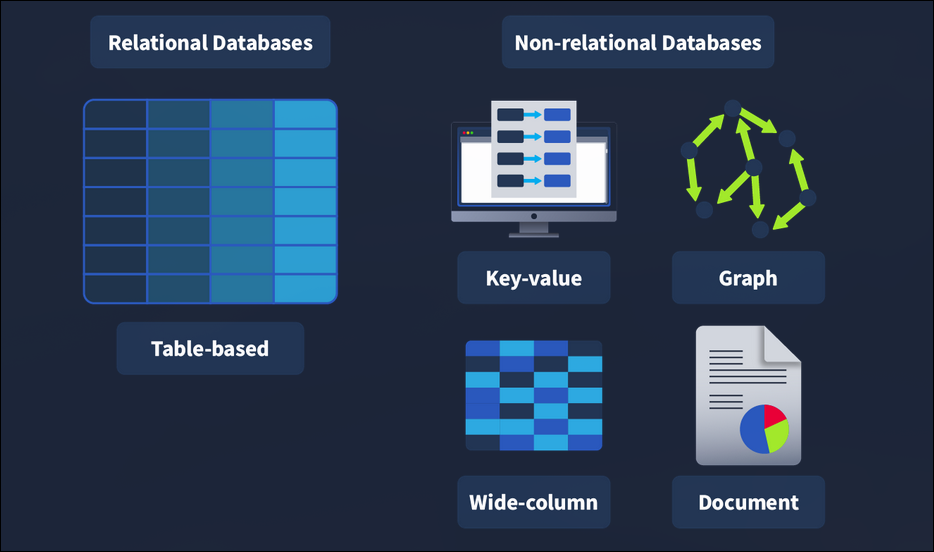
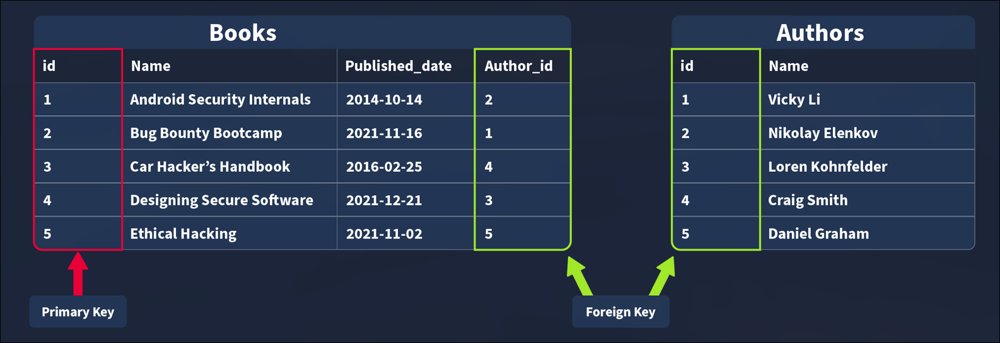

# TryHackMe - Sql Fundamental

- **Room Link:** [Sql Fundamental](https://tryhackme.com/room/sqlfundamentals)
- **Category:** Web Hacking
- **Difficulty:** Easy

## Introduction

Di sisi offensive, database bisa bantuin kita ngerti kerentanan SQL pake lebih baik, kayak SQL injection, dan bikin Query yang bantuin kita manipulasi atau ngambil data di dalam layanan yang udah disusupi. Di sisi lain, sisi defensif, database bisa bantuin kita nelusurin basis data dan nemuin aktivitas mencurigakan atau informasi relevan; database juga bisa bantuin kita ngelindungin layanan pake lebih baik dengan nerapin batasan waktu dibutuhin.

Karena database ada di mana-mana, penting banget buat ngerti ini. Kita bakal belajar dasar-dasar database, mencakup istilah-istilah penting, konsep, dan tipe-tipe yang beda sebelum masuk ke SQL.

**Learning Objectives:**

- Paham apa itu database, serta istilah dan konsep utama
- Ngerti berbagai jenis database
- Paham apa itu SQL
- Ngerti dan mampu pake Operasi SQL CRUD **(Create, Read, Update, Delete)**
- Paham cara pake SQL Clauses **(perintah tambahan buat nyaring data)**
- Paham cara jalanin berbagai **Operations**, **Operators**, dan **Functions** di dalam SQL

## Databases 101

### Introducing Databases

Kayak yang udah dijelasin di task 1, Database itu ada di hampir setiap sistem, jadi besar kemungkinan kita sering berinteraksi sama layanan yang pake ini sehari-hari. Database itu kumpulan informasi atau data terstruktur terorganisir yang gampang diakses dan bisa dimanipulasi atau dianalisis. Data itu bisa dalam berbagai bentuk, misal authentication user (nama pengguna dan password) yang disimpen dan dicek waktu login ke dalam aplikasi atau situs (kayak TryHackMe, dll), data yang dibuat pengguna di media sosial (kayak Instagram dan Facebook) tempat data kayak postingan pengguna, komentar, suka, dll dikumpulin dan disimpen, serta informasi riwayat tontonan yang disimpen sama layanan streaming kayak Netflix dan dipake buat ngasilin rekomendasi.

### Different Types of Databases

Ada cukup banyak jenis database yang bisa dibuat, tapi kita cuma fokus ke dua tipe utama: **Relational Databases (atau SQL)** vs **Non-Relational Databases (atau NoSQL)**.

<p align="center">

</p>

**Relational Databases:** Nyimpen data yang terstruktur, artinya setiap data yang masuk harus ngikutin pola atau aturan tertentu. Contohnya data user itu isinya wajib ada `nama_depan`, `nama_belakang`, `email`, `username`, sama `password`. Relational databases paling cocok buat Nyimpen Data Terstruktur, ngehubungin Antar Data yang Kompleks, dan Sistem Autentikasi & Kontrol Akses.

```SQL
-- Bikin tabel user pake struktur yang tetap
CREATE TABLE users (
    user_id INT PRIMARY KEY,
    first_name VARCHAR(50),
    last_name VARCHAR(50),
    email_address VARCHAR(100),
    occupation VARCHAR(100)
);

-- Masukin data (entry) ke dalam tabel ngikutin struktur itu
INSERT INTO users (user_id, first_name, last_name, email_address, occupation)
VALUES (1, 'Thomas', 'Anderson', 'neo@matrix.com', 'Cyber Security');

INSERT INTO users (user_id, first_name, last_name, email_address, occupation)
VALUES (2, 'John', 'Doe', 'doe@thm.ac.id', 'Student');

-- Bikin tabel relasi (contoh: riwayat login)
CREATE TABLE login_attempts (
    attempt_id INT PRIMARY KEY,
    user_id INT,
    status VARCHAR(20),
    FOREIGN KEY (user_id) REFERENCES users(user_id)
);
```

**Non-Relational Databases:** Kalau SQL tadi ibarat tabel Excel yang kaku, NoSQL ini lebih ke arah folder berisi dokumen-dokumen yang isinya bisa beda-beda formatnya. Cocok banget kalau kita punya data yang isinya bervariasi. Contohnya, hasil scan dokumen yang tipe dan jumlah datanya beda-beda setiap lembar, jadi butuh database yang gak maksa data harus masuk ke kolom tertentu.

```JSON
{
    "_id": ObjectId("65ccba12f3d4567890abcdef"),
    "nama": { "first_name": "John", "last_name": "Doe" },
    "jurusan": "Teknik Informatika",
    "hobi": ["Cyber Security", "Gaming", "Gym"],
    "stats_game": {
        "level": 7,
        "rank": "Newbie",
        "total_playtime_seconds": NumberLong(12500430)
    },
    "is_active": true
}
```

### Tables, Rows and Columns

Semua data yang disimpen dalam relational database bakal disimpen di sebuah tabel, misalnya kumpulan buku yang ada di toko buku disimpen dalam tabel bernama "Buku".

<p align="center">

</p>

Waktu bikin tabel, kita perlu nentuin informasi apa aja yang dibutuhin—kayak `id`, `Nama`, dan `tanggal_terbit` yang nantinya bakal jadi kolom. Setiap kolom ini wajib punya tipe data tertentu. Kalau ada data yang masuk pake tipe yang gak sesuai, sistem otomatis bakal nolaknya buat jaga konsistensi data. Secara umum ada empat tipe data inti yang selalu dipake: **String (teks dan karakter)**, **Integer (angka bulat)**, **Float/Desimal (angka pecahan)**, serta **Date/Time** (waktu dan tanggal).

Setelah tabel dan kolomnya selesai dibuat, kita bisa mulai masukin data pertama ke database. Misalnya, buat buku `Android Security Internals` pake ID `1` dan tanggal terbit `14-10-2014`. Setelah berhasil dimasukin, seluruh informasi ini bakal tersimpan dan muncul sebagai satu baris **(row)** utuh dalam tabel itu.

### Primary and Foreign Keys

Waktu data makin banyak, kita bisa misahin informasi ke berbagai tabel, contohnya tabel `Buku` dan tabel `Penulis`. Biar informasi di kedua tabel ini tetep sinkron, misalnya kita mau tau buku tertentu ditulis sama siapa—kita harus hubungin keduanya lewat kunci **(Keys)**. Ada dua jenis kunci yang perlu dipahami:

<p align="center">

</p>

- **Primary Key:** dipake buat jamin bahwa data dalam kolom tertentu bersifat unik. Artinya, setiap baris dalam tabel harus punya satu nilai khusus yang jadi pengenal tetap dan gak boleh sama sama data lainnya. Dalam setiap tabel, kita wajib milih satu kolom sebagai Primary Key, biasanya kolom `id` itu pilihan terbaik karena nilai ini dibuat khusus buat setiap entry (satu baris di dalam tabel), sementara judul atau tanggal bisa aja punya kemiripan.

- **Foreign Key:** itu kolom (atau kumpulan kolom) yang fungsinya jadi penghubung antara dua tabel dalam sebuah database. Contohnya, kita bisa tambahin kolom `id_penulis` di tabel Buku, kolom ini bertindak sebagai **Foreign Key** karena nilainya merujuk langsung ke kolom id di tabel Penulis. Foreign Key inilah yang bikin terciptanya hubungan antar tabel dalam relational database, dalam satu tabel kita boleh punya lebih dari satu Foreign Key.

## SQL

### What is SQL?

Semua teori tadi emang kedengeran bagus, tapi dalam praktek, gimana sih cara database itu beneran bekerja? Gimana cara kita bikin tabel pertama dan ngisinya pake data? Alat apa yang sebenernya kita pake?

Nah, di sinilah peran DBMS (Database Management System). Anggep aja DBMS sebagai pusat kendali atau jembatan antara kita (pengguna) sama database yang ada. DBMS itu software yang bikin kita bisa narik, ganti, dan ngatur data yang tersimpan pake gampang.

**Contoh DBMS yang Sering Dipake:**

- MySQL & MariaDB: Si paling populer buat relational database (SQL).

- MongoDB: Andalan buat database non-relational (NoSQL) yang fleksibel.

- Oracle Database: Biasanya dipake sama perusahaan-perusahaan besar buat skala raksasa.

Buat bisa 'ngobrol' atau berinteraksi sama database, kita pake SQL (Structured Query Language). SQL itu bahasa komunikasi khusus buat database yang fungsinya buat manggil, ngatur, sampe ngolah data yang tersimpan di dalam relational database.

### The Benefits of SQL and Relational Databases

Berikut beberapa manfaat yang didapet dengan belajar dan pake SQL:

- **SQL itu cepet:** relational database (yang pake SQL) sanggup narik data dalam jumlah besar hampir seketika. Ini bisa terjadi karena format penyimpanannya yang efisien banget (gak makan banyak tempat) serta kecepatan pemrosesannya yang tinggi.

- **Gampang dipelajari:** Beda sama banyak bahasa pemrograman lain, SQL ditulis pake bahasa Inggris sederhana **(plain English)**, jadi jauh lebih gampang dipahami. Sifat bahasanya yang gampang dibaca bikin kita bisa lebih fokus buat belajar fungsi dan logikanya aja.

- **Reliable:** Kayak yang udah dibahas sebelumnya, relational database jamin tingkat akurasi data yang tinggi, ini karena adanya aturan struktur yang ketat, setiap kumpulan data wajib memenuhi kriteria struktur itu biar bisa masuk ke dalam sistem.

- **Flexible:** SQL nyediain berbagai macam kapabilitas dalam hal querying database, ini bikin pengguna bisa jalanin tugas analisis data yang luas secara efisien banget.

## Databases And Table Statement

### Time to Learn

Saatnya mulai belajar SQL dan cara pakenya buat berinteraksi sama database. Di task ini, kita bakal mulai belajar pake database dan pernyataan tabel. Pernyataan inilah yang pertama-tama kita butuhin buat bikin database/tabel dan memulai.

### Database Statements

- **CREATE DATABASE**

Kalau mau bikin database baru, langkah pertama itu bikin dulu. Caranya di SQL pake pernyataan CREATE DATABASE, Syntax-nya kayak gini:

```SQL

mysql> CREATE DATABASE database_name;

```

Di sini contoh aku bakal bikin database bernama `bookstore_db`

```SQL

mysql> CREATE DATABASE bookstore_db;

```

- **SHOW DATABASES**

Kita bisa liat database yang sebelumnya dibuat pake statement `SHOW DATABASES`. Statement `SHOW DATABASES` bakal ngembaliin daftar database yang ada, caranya:

```SQL

mysql> SHOW DATABASES;

```

Di daftar yang muncul, kita bakal nemuin database yang baru aja dibikin plus beberapa database default kayak `mysql`, `information_schema`, `performance_schema`, dan `sys`. Database bawaan ini penting buat MySQL biar bisa berfungsi.

- **USE DATABASES**

Setelah database dibuat, kita harus kasih tau MySQL database mana yang mau kita pake biar perintah-perintah selanjutnya dieksekusi di tempat yang bener. Buat ngaktifin database yang baru kita buat, kita pake perintah `USE` kayak gini:

```SQL

mysql> USE bookstore_db;

```

- **DROP DATABASES**

Kalau database udah gak kepake lagi, misal cuma buat coba-coba atau testing, kita bisa hapus pake perintah `DROP`. Cara pakenya simpel:

```SQL

mysql> DROP database bookstore_db;

```

### Table Statements

Sekarang setelah kita paham cara ngelola database (mulai dari bikin, liat daftar, pake, sampe hapusnya), saatnya kita masuk ke bagian yang lebih seru: ngisi database itu pake tabel dan belajar cara berinteraksi langsung sama data di dalamnya.

- **CREATE TABLE**

Sama kayak logika pembuatan database, buat bikin tabel kita juga pake perintah `CREATE`. Setelah database diaktifin (pake perintah `USE`), kita bisa langsung bikin tabel di dalamnya pake sintaks berikut:

```SQL
CREATE TABLE nama_tabel (
    column_name1 data_type,
    column_name2 data_type,
    column_name3 data_type
);
```

Sekarang kita terapin di database `bookstore_db;`

```SQL

CREATE TABLE book_inventory (
    id INT AUTO_INCREMENT PRIMARY KEY,
    name VARCHAR(255) NOT NULL,
    published_date DATE,
    description TEXT,
    category VARCHAR(100)
);

```

Statement ini bakal bikin tabel `book_inventory` pake empat kolom: `id`, `name`, `published_date`, dan `description`. `id` tipenya **INT** (Integer) karena seharusnya cuma berupa angka, `AUTO_INCREMENT` ada artinya buku pertama yang disipin bakal dikasih `id 1`, buku kedua dikasih `id 2`, dan seterusnya. Terakhir, `id` ditetapin sebagai `PRIMARY KEY` karena ini jadi cara kita secara unik mengidentifikasi catatan buku di tabel kita (dan catatan utama harus ada di tabel).

`name` punya tipe data `VARCHAR(255)`, artinya bisa pake karakter variabel (teks/angka/tanda baca) dan dibatasi 255 karakter dan `NOT NULL`, artinya gak boleh kosong (jadi kalau seseorang nyoba masukin record ke tabel ini tapi `name` kosong maka bakal ditolak). `category` pake tipe data `VARCHAR(100)` buat nyimpen kategori buku. `published_date` diatur sebagai tipe data `DATE`. `description` pake tipe data `TEXT` buat nyimpen teks yang lebih panjang.

- **SHOW TABLES**

Sama kayak kita bisa bikin daftar database pake pernyataan `SHOW`, kita juga bisa bikin daftar tabel dalam database yang lagi aktif. Jalanin perintah berikut, kita bisa liat tabel yang baru aja dibuat:

```SQL
mysql> SHOW TABLES;
```

- **DESCRIBE**

Kalau kita mau tau kolom apa aja yang ada di sebuah tabel (dan tipe datanya), kita bisa deskripsiin pake perintah `DESCRIBE` (yang juga bisa disingkat `DESC`). Buat ngejelasin tabel yang baru aja dibuat pake perintah berikut:

```SQL
mysql> DESCRIBE book_inventory;
```

Ini bakal nampilin detail tabel kayak gini:

```SQL
mysql> DESCRIBE book_inventory;
+----------------+--------------+------+-----+---------+----------------+
| Field          | Type         | Null | Key | Default | Extra          |
+----------------+--------------+------+-----+---------+----------------+
| id             | int          | NO   | PRI | NULL    | auto_increment |
| name           | varchar(255) | NO   |     | NULL    |                |
| published_date | date         | YES  |     | NULL    |                |
| description    | text         | YES  |     | NULL    |                |
| category       | varchar(100) | YES  |     | NULL    |                |
+----------------+--------------+------+-----+---------+----------------+
5 rows in set (0.02 sec)
```

- **ALTER**

Dalam pengembangan database, wajar banget kalau kebutuhan data kita berubah seiring waktu. Daripada tabelnya dihapus dan bikin ulang dari awal yang bakal buang waktu dan data, kita bisa pake perintah `ALTER`.

```SQL
ALTER TABLE book_inventory
ADD page_count INT;
```

`ALTER` statement dipake buat lakuin perubahan di tabel, kayak ganti nama kolom, ubah tipe data di kolom, atau hapus kolom.

- **DROP**

Mirip sama hapus database, kita juga bisa hapus tabel pake statement `DROP`. Sintaksnya kayak gini:

```SQL
mysql> DROP TABLE table_name;
```

## CRUD Operations

### CRUD

CRUD itu singkatan dari **C**reate, **R**ead, **U**pdate, dan **D**elete, yang dianggep sebagai operasi dasar dalam sistem apa pun yang ngelola data.

Kita bakal belajar gimana cara kerja berbagai operasi MySQL secara langsung. Kita bakal banyak berinteraksi sama tabel `book_inventory` di database `bookstore_db`. Langkah pertamanya simpel: jalanin pernyataan use `bookstore_db;` buat ngakses semua data di dalamnya.

- **Create Operation (INSERT)**

Operasi `CREATE` itu langkah fundamental buat nambahin data baru ke dalam sistem. Dalam ekosistem MySQL, proses ini dijalanin pake pernyataan `INSERT INTO` yang bikin kita bisa masukin catatan atau record baru secara permanen ke dalam tabel.

```SQL
mysql> INSERT INTO book_inventory (name, published_date, description, category)
    VALUES ("Offensive Security", "2026-07-17", "An In-Depth Guide to Offensive Security", "Cyber Security");

Query OK, 1 row affected (0.01 sec)
```

`INSERT INTO` operation fungsinya buat nentuin tabel target, dalam hal ini tabel `book_inventory` sebagai tempat nambahin data atau record baru. Kolom-kolom kayak `id`, `name`, `published_date`, dan `description` itu elemen yang bentuk catatan di dalam tabel itu.

- **Read Operation (SELECT)**

Read operation fungsinya sebagai metode utama buat ngambil atau nampilin informasi yang tersimpan di dalam tabel. Lewat pernyataan `SELECT`, kita punya fleksibilitas buat manggil kolom tertentu secara spesifik atau nampilin seluruh isi tabel.

- `SELECT` spesifik: Dipake kalau kita cuma butuhin kolom tertentu, misalnya cuma judul buku.
- `SELECT` all: Pake tanda bintang (\*) buat narik data di semua kolom yang tersedia sekaligus.

```SQL
-- Nambahin data baru ke tabel book_inventory
mysql> INSERT INTO book_inventory (name, published_date, description, category)
    -> VALUES ("Offensive Security", "2026-02-15", "The latest complete guide to learning Offensive Security", "Cyber Security");
Query OK, 1 row affected (0.01 sec)

-- Baca seluruh kolom pake wildcard (*)
mysql> SELECT * FROM book_inventory;
+----+---------------------------+----------------+----------------------------------------------------------+-------------------+
| id | name                      | published_date | description                                              | category          |
+----+---------------------------+----------------+----------------------------------------------------------+-------------------+
|  1 | Android Security Internals | 2014-10-14     | An In-Depth Guide to Android's Security Architecture     | Defensive Security   |
|  2 | Offensive Security        | 2026-02-15     | The latest complete guide to learning Offensive Security | Cyber Security    |
|  3 | Defensive Security        | 2026-02-16     | Security Best Practices and Risk Reduction                | Cyber Security    |
+----+---------------------------+----------------+----------------------------------------------------------+-------------------+
3 rows in set (0.00 sec)
```

Operasi `SELECT` yang kita pake diikutin sama simbol bintang (`*`), yang dalam dunia database fungsinya sebagai wildcard buat ngambil seluruh kolom yang tersedia dalam tabel. Setelah itu, kita pake klausa `FROM` buat nentuin target tabelnya, yang dalam skenario ini itu tabel `book_inventory`.

Kalau kita mau milih kolom tertentu kayak nama dan deskripsi, kita harus nentuin secara spesifik alih-alih pake simbol `*`, kayak yang ditunjukin di bawah ini:

```SQL
-- Ngambil cuma kolom nama dan deskripsi
mysql> SELECT name, description FROM book_inventory;
+----------------------------+----------------------------------------------------------+
| name                       | description                                              |
+----------------------------+----------------------------------------------------------+
| Android Security Internals  | An In-Depth Guide to Android's Security Architecture     |
| Offensive Security         | The latest complete guide to learning Offensive Security |
| Defensive Security         | Security Best Practices and Risk Reduction                |
+----------------------------+----------------------------------------------------------+
3 rows in set (0.00 sec)
```

- **Update Operation (UPDATE)**

Update operation itu bagian krusial dari siklus CRUD yang bikin modifikasi data secara real-time jadi mungkin. Pernyataan `UPDATE` bekerja pake cara nimpa data lama sama informasi terbaru yang bakal kita kasih.

```SQL
-- Update deskripsi buku pake ID 2
mysql> UPDATE book_inventory
    -> SET description = "The latest complete guide to learning Offensive Security"
    -> WHERE id = 2;
Query OK, 1 row affected (0.01 sec)
Rows matched: 1  Changed: 1  Warnings: 0

-- Cek Data terbaru
mysql> SELECT name, description FROM book_inventory WHERE id = 2;
+--------------------+----------------------------------------------------------+
| name               | description                                              |
+--------------------+----------------------------------------------------------+
| Offensive Security | The latest complete guide to learning Offensive Security |
+--------------------+----------------------------------------------------------+
1 row in set (0.00 sec)
```

Pernyataan UPDATE fungsinya buat nentuin tabel target—dalam skenario ini tabel `book_inventory` sebagai objek yang bakal dimodifikasi. Kita pake kata kunci `SET` buat netapin nilai baru di kolom spesifik yang mau diupdate. Buat jaga akurasi, klausa `WHERE` bertindak sebagai filter yang mastiin perubahan cuma terjadi di baris yang memenuhi kriteria, kayak baris pake `id` 2.

- **Delete Operation (DELETE)**

Operasi Delete fungsinya sebagai tahap akhir dalam siklus hidup data buat hapus catatan secara permanen dari tabel pake pernyataan DELETE.

```SQL
mysql> DELETE FROM book_inventory WHERE id = 2;

Query OK, 1 row affected (0.00 sec)
```

Pernyataan `DELETE` yang diikutin klausa `FROM` bikin kita bisa nentuin target tabelnya, yaitu tabel `book_inventory`. Tapi, bagian paling krusial itu klausa `WHERE`, yang fungsinya sebagai pengunci target biar sistem cuma hapus baris pake `id` 2. Langkah ini mastiin bahwa operasi penghapusan bersifat presisi dan gak ganggu data lainnya.

### Summary

Singkatnya, hasil operasi CRUD penting banget buat operasi data dan waktu berinteraksi sama database. Pernyataan yang terkait sama mereka ada di bawah ini:

- **Create (`INSERT` statement)** - Nambahin data baru ke dalam tabel.
- **Read (`SELECT` statement)** - Ngambil data dari tabel.
- **Update (`UPDATE` statement)** - Ngubah data yang udah ada di dalam tabel.
- **Delete (`DELETE` statement)** - Hapus data dari tabel.

## Clauses

Klausa itu komponen tambahan dari sebuah pernyataan yang fungsinya buat netapin kriteria spesifik di data yang bakal kita manipulasi. Kalau pernyataan dasar kayak `SELECT` atau `UPDATE` itu perintah utamanya, maka klausa kayak `WHERE` atau `FROM` itu pemberi instruksi detail soal data mana yang harus diambil atau gimana urutannya ditampilin.

Fokus utama kita itu nguasain empat klausa penting: `DISTINCT`, `GROUP BY`, `ORDER BY`, dan `HAVING`.

Di sini kita bakal pake tabel `book_inventory` dari database `bookstore_db;`

- **DISTINCT Clause**

DISTINCT clause dipake buat ngilangin data ganda dalam hasil query, jadi yang muncul cuma nilai-nilai yang unik (beda) aja.

Kita pake query `SELECT * FROM book_inventory` buat liat isi tabel (asumsiin kita udah ngisi kembali tabel pake data sampel berikut):

```SQL
mysql> SELECT * FROM book_inventory;
+----+---------------------------+----------------+----------------------------------------------------------+-------------------+
| id | name                      | published_date | description                                              | category          |
+----+---------------------------+----------------+----------------------------------------------------------+-------------------+
|  1 | Android Security Internals | 2014-10-14     | An In-Depth Guide to Android's Security Architecture     | Defensive Security   |
|  2 | Bug Bounty Bootcamp        | 2021-11-16     | The Guide to Finding and Reporting Web Vulnerabilities   | Offensive Security|
|  3 | Car Hacker's Handbook      | 2016-02-25     | A Guide for the Penetration Tester                       | Offensive Security|
|  4 | Designing Secure Software  | 2021-12-21     | A Guide for Developers                                   | Defensive Security|
|  5 | Ethical Hacking            | 2021-11-02     | A Hands-on Introduction to Breaking In                   | Offensive Security|
|  6 | Ethical Hacking            | 2021-11-02     |                                                          | Offensive Security|
+----+---------------------------+----------------+----------------------------------------------------------+-------------------+

6 rows in set (0.00 sec)
```

Bisa diliat di hasil query di atas, data buku 'Ethical Hacking' muncul dua kali (duplikat). Nah, biar yang tampil cuma data yang unik, kita bisa pake klausa **DISTINCT**.

```SQL
mysql> SELECT DISTINCT name FROM book_inventory;
+----------------------------+
| name                       |
+----------------------------+
| Android Security Internals |
| Bug Bounty Bootcamp        |
| Car Hacker's Handbook      |
| Designing Secure Software  |
| Ethical Hacking            |
+----------------------------+
5 rows in set (0.00 sec)
```

Outputnya nunjukin bahwa cuma lima baris yang diambil, dan cuma satu contoh buku Ethical Hacking yang ditampilin pake id unik.

- **GROUP BY Clause**

GROUP BY clause ini fungsinya buat ngelompokin data berdasarkan kolom tertentu, biasanya dipake bareng fungsi kayak `COUNT()`, `MAX()`, `MIN()`, `SUM()`, atau `AVG()`.

Contohnya, kita mau tau ada berapa jumlah buku buat setiap judulnya? Kita bisa pake query ini:

```SQL
mysql> SELECT name, COUNT(*)
    -> FROM book_inventory
    -> GROUP BY name;
+----------------------------+----------+
| name                       | COUNT(*) |
+----------------------------+----------+
| Android Security Internals |        1 |
| Bug Bounty Bootcamp        |        1 |
| Car Hacker's Handbook      |        1 |
| Designing Secure Software  |        1 |
| Ethical Hacking            |        2 |
+----------------------------+----------+
5 rows in set (0.00 sec)
```

Nah, buku "Ethical Hacking" ada 2 jumlahnya, sementara yang lain cuma 1.

- **ORDER BY Clause**

`ORDER BY` Clause bisa dipake buat ngurutin hasil query, baik dari atas (ascending) maupun dari bawah (descending). Kita bisa pake fungsi kayak `ASC` dan `DESC` buat lakuin itu, kayak yang ditunjukin di dua contoh di bawah ini.

**ASCENDING ORDER**

```SQL
mysql> SELECT *
    -> FROM book_inventory
    -> ORDER BY published_date ASC;
+----+---------------------------+----------------+----------------------------------------------------------+-------------------+
| id | name                      | published_date | description                                              | category          |
+----+---------------------------+----------------+----------------------------------------------------------+-------------------+
|  1 | Android Security Internals | 2014-10-14     | An In-Depth Guide to Android's Security Architecture     | Defensive Security   |
|  3 | Car Hacker's Handbook      | 2016-02-25     | A Guide for the Penetration Tester                       | Offensive Security|
|  5 | Ethical Hacking            | 2021-11-02     | A Hands-on Introduction to Breaking In                   | Offensive Security|
|  6 | Ethical Hacking            | 2021-11-02     |                                                          | Offensive Security|
|  2 | Bug Bounty Bootcamp        | 2021-11-16     | The Guide to Finding and Reporting Web Vulnerabilities   | Offensive Security|
|  4 | Designing Secure Software  | 2021-12-21     | A Guide for Developers                                   | Defensive Security|
+----+---------------------------+----------------+----------------------------------------------------------+-------------------+
6 rows in set (0.00 sec)
```

**DESCENDING ORDER**

```SQL
mysql> SELECT *
    -> FROM book_inventory
    -> ORDER BY published_date DESC;
+----+---------------------------+----------------+----------------------------------------------------------+-------------------+
| id | name                      | published_date | description                                              | category          |
+----+---------------------------+----------------+----------------------------------------------------------+-------------------+
|  4 | Designing Secure Software  | 2021-12-21     | A Guide for Developers                                   | Defensive Security|
|  2 | Bug Bounty Bootcamp        | 2021-11-16     | The Guide to Finding and Reporting Web Vulnerabilities   | Offensive Security|
|  5 | Ethical Hacking            | 2021-11-02     | A Hands-on Introduction to Breaking In                   | Offensive Security|
|  6 | Ethical Hacking            | 2021-11-02     |                                                          | Offensive Security|
|  3 | Car Hacker's Handbook      | 2016-02-25     | A Guide for the Penetration Tester                       | Offensive Security|
|  1 | Android Security Internals | 2014-10-14     | An In-Depth Guide to Android's Security Architecture     | Defensive Security   |
+----+---------------------------+----------------+----------------------------------------------------------+-------------------+
6 rows in set (0.00 sec)
```

Kita bisa liat perbedaannya waktu ngurutin dari atas pake `ASC` dan dari bawah pake `DESC`, di mana keduanya pake `published_date` sebagai contoh.

- **HAVING Clause**

`HAVING` Clause dipake bareng clause lain buat filter grup atau hasil record berdasarkan suatu kondisi. Dalam kasus `GROUP BY`, dia mengevaluasi kondisi jadi TRUE atau FALSE. Beda sama clause `WHERE`, `HAVING` filter hasil setelah agregasi dilakuin.

```SQL
mysql> SELECT name, COUNT(*)
    -> FROM book_inventory
    -> GROUP BY name
    -> HAVING name LIKE '%Hack%';
+-----------------------+----------+
| name                  | COUNT(*) |
+-----------------------+----------+
| Car Hacker's Handbook |        1 |
| Ethical Hacking       |        2 |
+-----------------------+----------+
2 rows in set (0.00 sec)
```

Di contoh di atas, kita bisa liat bahwa query ngembaliin buku-buku pake nama yang ngandung kata **hack** beserta jumlahnya.

## Operators

Operator fungsinya buat filter dan manipulasi data secara efektif. Dengan nguasain operator, kita bisa bangun query yang jauh lebih akurat dan canggih daripada sekadar pengambilan data standar.

- **Logical Operators**

Operator ini ngecek kebenaran suatu kondisi dan ngembaliin nilai boolean `TRUE` atau `FALSE`.

- **LIKE Operator**

Operator `LIKE` biasanya dipake bareng clause kayak `WHERE` buat filter pola tertentu dalam sebuah kolom.

Contoh penggunaan:

- `%A` = Berakhiran huruf **A**.
- `A%` = Berawalan huruf **A**.
- `%A%` = Ngandung huruf **A** di posisi mana aja.

```SQL
mysql> SELECT *
    -> FROM book_inventory
    -> WHERE description LIKE "%guide%";
+----+---------------------------+----------------+----------------------------------------------------------+-------------------+
| id | name                      | published_date | description                                              | category          |
+----+---------------------------+----------------+----------------------------------------------------------+-------------------+
|  1 | Android Security Internals | 2014-10-14     | An In-Depth Guide to Android's Security Architecture     | Defensive Security   |
|  2 | Bug Bounty Bootcamp        | 2021-11-16     | The Guide to Finding and Reporting Web Vulnerabilities   | Offensive Security|
|  3 | Car Hacker's Handbook      | 2016-02-25     | A Guide for the Penetration Tester                       | Offensive Security|
|  4 | Designing Secure Software  | 2021-12-21     | A Guide for Developers                                   | Defensive Security|
+----+---------------------------+----------------+----------------------------------------------------------+-------------------+
4 rows in set (0.00 sec)
```

Query di atas nampilin daftar buku yang udah difilter, yaitu cuma buku yang deskripsinya ngandung kata **guide** (pake operator `LIKE`).

- **AND Operator**

Operator `AND` bikin kita bisa gabungin dua kondisi atau lebih dalam satu query. Hasilnya cuma bakal `TRUE` kalau **semua** kondisi terpenuhi.

Contoh berikut nyari buku pake kategori **"Offensive Security"** DAN judul **"Bug Bounty Bootcamp"**:

```SQL
mysql> SELECT *
    -> FROM book_inventory
    -> WHERE category = "Offensive Security" AND name = "Bug Bounty Bootcamp";
+----+---------------------+--------------------+----------------+--------------------------------------------------------+--------------------+
| id | name                | published_date     | description                                            | category           |
+----+---------------------+--------------------+----------------+--------------------------------------------------------+--------------------+
|  2 | Bug Bounty Bootcamp | 2021-11-16         | The Guide to Finding and Reporting Web Vulnerabilities | Offensive Security |
+----+---------------------+--------------------+----------------+--------------------------------------------------------+--------------------+
1 row in set (0.00 sec)
```

- **OR Operator**

Operator `OR` gabungin beberapa kondisi dalam query dan ngembaliin nilai `TRUE` kalau **setidaknya satu** dari kondisi itu bernilai bener.

```SQL
mysql> SELECT *
    -> FROM book_inventory
    -> WHERE name LIKE "%Android%" OR name LIKE "%iOS%";
+----+----------------------------+----------------+----------------------------------------------------------+-------------------+
| id | name                       | published_date | description                                              | category          |
+----+----------------------------+----------------+----------------------------------------------------------+-------------------+
|  1 | Android Security Internals | 2014-10-14     | An In-Depth Guide to Android's Security Architecture     | Mobile Security   |
+----+----------------------------+----------------+----------------------------------------------------------+-------------------+
1 row in set (0.00 sec)
```

- **NOT Operator**

Operator `NOT` balikin nilai dari operator boolean, bikin kita bisa ngecualiin kondisi tertentu.

```SQL
mysql> SELECT *
    -> FROM book_inventory
    -> WHERE NOT description LIKE "%guide%";
+----+-----------------+----------------+----------------------------------------+--------------------+
| id | name            | published_date | description                            | category           |
+----+-----------------+----------------+----------------------------------------+--------------------+
|  5 | Ethical Hacking | 2021-11-02     | A Hands-on Introduction to Breaking In | Offensive Security |
+----+-----------------+----------------+----------------------------------------+--------------------+
1 row in set (0.00 sec)
```

- **BETWEEN Operator**

Operator `BETWEEN` bikin kita bisa ngetes apakah suatu nilai ada dalam rentang tertentu.

```SQL
mysql> SELECT *
    -> FROM book_inventory
    -> WHERE id BETWEEN 2 AND 4;
+----+---------------------------+----------------+--------------------------------------------------------+--------------------+
| id | name                      | published_date | description                                            | category           |
+----+---------------------------+----------------+--------------------------------------------------------+--------------------+
|  2 | Bug Bounty Bootcamp       | 2021-11-16     | The Guide to Finding and Reporting Web Vulnerabilities | Offensive Security |
|  3 | Car Hacker's Handbook     | 2016-02-25     | A Guide for the Penetration Tester                     | Offensive Security |
|  4 | Designing Secure Software | 2021-12-21     | A Guide for Developers                                 | Defensive Security |
+----+---------------------------+----------------+--------------------------------------------------------+--------------------+
3 rows in set (0.00 sec)
```

- **Comparison Operators**

Operator perbandingan dipake buat ngebandingin nilai dan ngecek apakah nilai itu memenuhi kriteria yang ditentuin.

**Equal To Operator**

Operator `=` (Sama Dengan) ngebandingin dua ekspresi dan nentuin apakah keduanya sama.

```SQL
mysql> SELECT *
    -> FROM book_inventory
    -> WHERE name = "Designing Secure Software";
+----+---------------------------+----------------+------------------------+--------------------+
| id | name                      | published_date | description            | category           |
+----+---------------------------+----------------+------------------------+--------------------+
|  4 | Designing Secure Software | 2021-12-21     | A Guide for Developers | Defensive Security |
+----+---------------------------+----------------+------------------------+--------------------+
1 row in set (0.10 sec)
```

**Not Equal To Operator**

Operator `!=` (Tidak Sama Dengan) ngebandingin ekspresi dan ngetes apakah keduanya gak sama.

```SQL
mysql> SELECT *
    -> FROM book_inventory
    -> WHERE category != "Offensive Security";
+----+----------------------------+----------------+------------------------------------------------------+--------------------+
| id | name                       | published_date | description                                          | category           |
+----+----------------------------+----------------+------------------------------------------------------+--------------------+
|  1 | Android Security Internals | 2014-10-14     | An In-Depth Guide to Android's Security Architecture | Defensive Security |
|  4 | Designing Secure Software  | 2021-12-21     | A Guide for Developers                               | Defensive Security |
+----+----------------------------+----------------+------------------------------------------------------+--------------------+
2 rows in set (0.00 sec)
```

**Less Than Operator**

Operator `<` (Kurang Dari) ngebandingin apakah nilai dalam ekspresi lebih kecil dari nilai yang ditentuin.

```SQL
mysql> SELECT *
    -> FROM book_inventory
    -> WHERE published_date < "2020-01-01";
+----+----------------------------+----------------+------------------------------------------------------+--------------------+
| id | name                       | published_date | description                                          | category           |
+----+----------------------------+----------------+------------------------------------------------------+--------------------+
|  1 | Android Security Internals | 2014-10-14     | An In-Depth Guide to Android's Security Architecture | Defensive Security |
|  3 | Car Hacker's Handbook      | 2016-02-25     | A Guide for the Penetration Tester                   | Offensive Security |
+----+----------------------------+----------------+------------------------------------------------------+--------------------+
2 rows in set (0.00 sec)
```

**Greater Than Operator**

Operator `>` (Lebih Besar Dari) ngebandingin apakah nilai dalam ekspresi lebih besar dari nilai yang ditentuin.

```SQL
mysql> SELECT *
    -> FROM book_inventory
    -> WHERE published_date > "2020-01-01";
+----+---------------------------+----------------+--------------------------------------------------------+--------------------+
| id | name                      | published_date | description                                            | category           |
+----+---------------------------+----------------+--------------------------------------------------------+--------------------+
|  2 | Bug Bounty Bootcamp       | 2021-11-16     | The Guide to Finding and Reporting Web Vulnerabilities | Offensive Security |
|  4 | Designing Secure Software | 2021-12-21     | A Guide for Developers                                 | Defensive Security |
|  5 | Ethical Hacking           | 2021-11-02     | A Hands-on Introduction to Breaking In                 | Offensive Security |
+----+---------------------------+----------------+--------------------------------------------------------+--------------------+
3 rows in set (0.00 sec)
```

**Less Than or Equal To and Greater Than or Equal To Operators**

Operator `<=` ngebandingin apakah nilai dalam ekspresi lebih kecil atau sama pake nilai yang dikasih. Di sisi lain, operator `>=` ngebandingin apakah nilai dalam ekspresi lebih besar atau sama pake nilai yang dikasih.

```SQL
mysql> SELECT *
    -> FROM book_inventory
    -> WHERE published_date <= "2021-11-15";
+----+----------------------------+----------------+------------------------------------------------------+--------------------+
| id | name                       | published_date | description                                          | category           |
+----+----------------------------+----------------+------------------------------------------------------+--------------------+
|  1 | Android Security Internals | 2014-10-14     | An In-Depth Guide to Android's Security Architecture | Defensive Security |
|  3 | Car Hacker's Handbook      | 2016-02-25     | A Guide for the Penetration Tester                   | Offensive Security |
|  5 | Ethical Hacking            | 2021-11-02     | A Hands-on Introduction to Breaking In               | Offensive Security |
+----+----------------------------+----------------+------------------------------------------------------+--------------------+
3 rows in set (0.00 sec)
```

```SQL
mysql> SELECT *
    -> FROM book_inventory
    -> WHERE published_date >= "2021-11-02";
+----+---------------------------+----------------+--------------------------------------------------------+--------------------+
| id | name                      | published_date | description                                            | category           |
+----+---------------------------+----------------+--------------------------------------------------------+--------------------+
|  2 | Bug Bounty Bootcamp       | 2021-11-16     | The Guide to Finding and Reporting Web Vulnerabilities | Offensive Security |
|  4 | Designing Secure Software | 2021-12-21     | A Guide for Developers                                 | Defensive Security |
|  5 | Ethical Hacking           | 2021-11-02     | A Hands-on Introduction to Breaking In                 | Offensive Security |
+----+---------------------------+----------------+--------------------------------------------------------+--------------------+
3 rows in set (0.00 sec)
```

## Functions

Waktu kerja sama data, fungsi bisa bantuin kita nyederhanaiin query, lakuin operasi, serta manipulasi data pake lebih efisien. Ayo kita jelajahin beberapa fungsi yang sering dipake biar pemahaman kita makin luwes!

### String Functions

Fungsi string berguna banget waktu kita mau manipulasi teks dalam kolom.

- **CONCAT()**
  Fungsi ini dipake buat gabungin dua atau lebih string jadi satu.

  Contoh: Gabungin `name` dan `category` jadi satu kalimat.

  ```SQL
  mysql> SELECT CONCAT(name, ' is in category: ', category) AS Book_Info
      -> FROM book_inventory;
  +-----------------------------------------------------------------+
  | Book_Info                                                     |
  +-----------------------------------------------------------------+
  | Android Security Internals is in category: Defensive Security |
  | Bug Bounty Bootcamp is in category: Offensive Security        |
  | ...                                                           |
  +-----------------------------------------------------------------+
  ```

- **GROUP_CONCAT()**
  Nah, ini fungsi sakti mandraguna! `GROUP_CONCAT()` bisa gabungin hasil dari banyak baris jadi satu baris string. Berguna banget kalau kita mau liat semua item dalam satu kategori tanpa baris yang terpisah-pisah.

  ```SQL
  mysql> SELECT category, GROUP_CONCAT(name) AS Books
      -> FROM book_inventory
      -> GROUP BY category;
  +--------------------+------------------------------------------------------------------+
  | category           | Books                                                            |
  +--------------------+------------------------------------------------------------------+
  | Cyber Security     | Offensive Security,Defensive Security                            |
  | Defensive Security | Android Security Internals,Designing Secure Software             |
  | Offensive Security | Bug Bounty Bootcamp,Car Hacker's Handbook,Ethical Hacking        |
  +--------------------+------------------------------------------------------------------+
  ```

- **SUBSTRING()**
  Ngambil sebagian teks dari posisi tertentu.

  Contoh: Ngambil 10 karakter pertama dari `description`.

  ```SQL
  mysql> SELECT name, SUBSTRING(description, 1, 10) AS Short_Desc
      -> FROM book_inventory;
  ```

- **LENGTH()**
  Ngitung jumlah karakter dalam sebuah string. Berguna buat analisis panjang data.

### Aggregate Functions

Fungsi ini dipake buat lakuin perhitungan di sekumpulan nilai dan ngembaliin satu nilai tunggal.

- **COUNT()**: Ngitung jumlah baris yang cocok sama kriteria.

  ```SQL
  mysql> SELECT COUNT(*) FROM book_inventory; -- Ngitung total buku
  ```

- **MIN()** & **MAX()**: Nyari nilai terkecil dan terbesar.

  ```SQL
  mysql> SELECT MIN(published_date), MAX(published_date) FROM book_inventory;
  ```

- **SUM()**: Njumlahin nilai numerik (Contoh: Total harga buku kalau ada kolom harga).

### System Functions

Nah, fungsi-fungsi ini populer banget di dunia **Hacking** (terutama waktu lakuin SQL Injection) karena bisa ngasih informasi vital tentang sistem database target.

- **USER()**: Nampilin username yang lagi dipake buat koneksi database.
- **DATABASE()**: Nampilin nama database yang lagi aktif dipake.
- **VERSION()**: Nampilin versi dari software database (MySQL/MariaDB) yang jalan.

Contoh penggunaan:

```SQL
mysql> SELECT USER(), DATABASE(), VERSION();
+----------------+--------------+-------------------------+
| USER()         | DATABASE()   | VERSION()               |
+----------------+--------------+-------------------------+
| root@localhost | bookstore_db | 10.4.22-MariaDB-1:10... |
+----------------+--------------+-------------------------+
1 row in set (0.00 sec)
```

## Conclusion

Modul ini diharapkan bisa kasih gambaran betapa pentingnya database dalam dunia komputasi. Mengingat hampir setiap aplikasi yang kita pake sehari-hari bergantung sama data, paham fundamental database itu **wajib hukumnya** kalau mau serius terjun ke dunia Cyber Security.

Poin-poin penting yang kita pelajari di sini:

1.  **Database** itu kumpulan data yang terorganisir, gampang diakses, di-manage, dan dianalisis.
2.  Ada dua jenis utama database: **Relational Database** (data terstruktur dalam tabel) dan **Non-Relational Database** (format non-tabel).
3.  Relational Database terdiri dari **Tabel, Kolom, dan Baris**. **Primary Key** mastiin setiap data unik, sedangkan **Foreign Key** ngehubungin antar tabel.
4.  **SQL** itu bahasa yang powerful tapi gampang dipelajari buat berinteraksi sama relational database.
5.  Statement **Database & Table** dipake buat bikin atau modifikasi struktur penyimpanan data.
6.  **CRUD Operations** (INSERT, SELECT, UPDATE, DELETE) itu "jurus dasar" buat ngelola isi data dalam database.
7.  **Clauses** (kayak WHERE, ORDER BY, GROUP BY) bantuin kita ngatur data mana yang mau diambil, difilter, atau diurutin.
8.  Pake **Operators** (AND, OR, LIKE, dll) dan **Functions** (CONCAT, COUNT, dll) yang tepat bikin manipulasi data jadi jauh lebih efisien dan spesifik.

Happy hacking !
