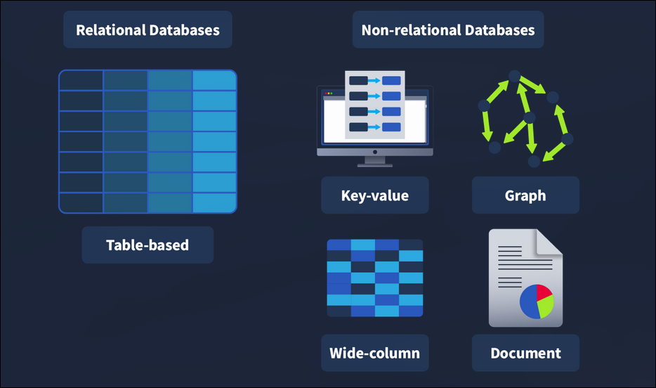
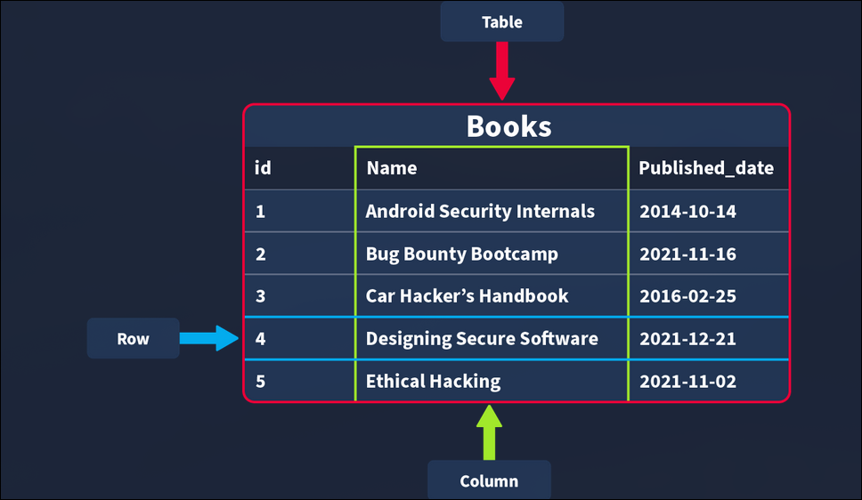
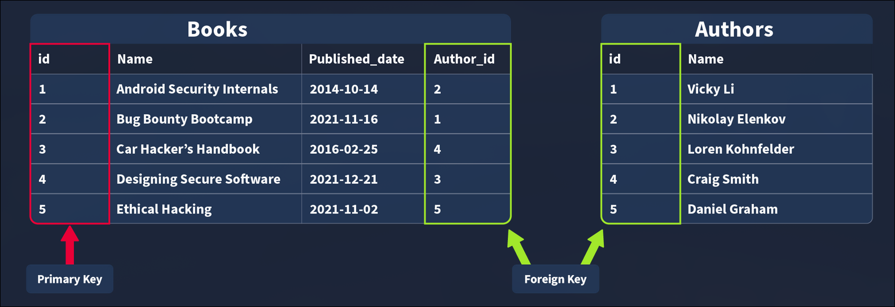

# TryHackMe : Sql Fundamental

* **Room Link:** [Sql Fundamental](https://tryhackme.com/room/sqlfundamentals)
* **Category:** Web Hacking
* **Difficulty:** Easy

## Introduction

Di sisi offensive, database bisa membantu kita mengerti kerentanan SQL dengan lebih baik, seperti SQL injection, dan membuat Query yang membantu kita manipulasi atau mengambil data di dalam layanan yang sudah disusupi. Di sisi lain, sisi defensif, database bisa membantu kita menelusuri basis data dan menemukan aktivitas mencurigakan atau informasi relevan; database juga bisa membantu kita melindungi layanan dengan lebih baik dengan menerapkan batasan saat dibutuhkan.

Karena database ada di mana-mana, penting banget buat mengerti ini. Kita bakal belajar dasar-dasar database, mencakup istilah-istilah penting, konsep, dan tipe-tipe yang beda sebelum masuk ke SQL.

**Learning Objectives:**

* Paham apa itu database, serta istilah dan konsep utama
* Mengerti berbagai jenis database
* Paham apa itu SQL
* Mengerti dan mampu pakai Operasi SQL CRUD **(Create, Read, Update, Delete)**
* Paham cara menggunakan SQL Clauses **(perintah tambahan untuk menyaring data)**
* Paham cara jalanin berbagai **Operations**, **Operators**, dan **Functions** di dalam SQL

(Setelah paham dasar SQL, kamu bisa lanjut belajar cara mengeksploitasinya di catatan [SQL Injection](file:///home/dimm/CyberSec-Learning-Notes/THM-Notes/SQL-Injection/sql-injection.md) atau menggunakan tool otomatis [SQLMap](file:///home/dimm/CyberSec-Learning-Notes/THM-Notes/Cyber-Security-101/Offensive-Security-Tooling/SQLMap: The Basics.md))


## Databases 101

### Introducing Databases

Seperti yang sudah dijelaskan di task 1, Database itu ada di hampir setiap sistem, jadi besar kemungkinan kita sering berinteraksi sama layanan yang memakainya sehari-hari. Database itu kumpulan informasi atau data terstruktur terorganisir yang mudah diakses dan bisa dimanipulasi atau dianalisis. Data itu bisa dalam berbagai bentuk, misal authentication user (nama pengguna dan password) yang disimpan dan dicek waktu login ke dalam aplikasi atau situs (seperti TryHackMe, dll), data yang dibuat pengguna di media sosial (seperti Instagram dan Facebook) tempat data seperti postingan pengguna, komentar, suka, dll dikumpulkan dan disimpan, serta informasi riwayat tontonan yang disimpan sama layanan streaming seperti Netflix dan dipakai untuk menghasilkan rekomendasi.

### Different Types of Databases

Ada cukup banyak jenis database yang bisa dibuat, tapi kita cuma fokus ke dua tipe utama: **Relational Databases (atau SQL)** vs **Non-Relational Databases (atau NoSQL)**.

<p align="center">

</p>

**Relational Databases:** Menyimpan data yang terstruktur, artinya setiap data yang masuk harus mengikuti pola atau aturan tertentu. Contohnya data user itu isinya wajib ada `nama_depan`, `nama_belakang`, `email`, `username`, dan `password`. Relational databases paling cocok untuk menyimpan Data Terstruktur, menghubungkan Antar Data yang Kompleks, dan Sistem Autentikasi & Kontrol Akses.

```SQL
-- Membuat tabel user pakai struktur yang tetap
CREATE TABLE users (
    user_id INT PRIMARY KEY,
    first_name VARCHAR(50),
    last_name VARCHAR(50),
    email_address VARCHAR(100),
    occupation VARCHAR(100)
);

-- Memasukkan data (entry) ke dalam tabel mengikuti struktur itu
INSERT INTO users (user_id, first_name, last_name, email_address, occupation)
VALUES (1, 'Thomas', 'Anderson', 'neo@matrix.com', 'Cyber Security');

INSERT INTO users (user_id, first_name, last_name, email_address, occupation)
VALUES (2, 'John', 'Doe', 'doe@thm.ac.id', 'Student');

-- Membuat tabel relasi (contoh: riwayat login)
CREATE TABLE login_attempts (
    attempt_id INT PRIMARY KEY,
    user_id INT,
    status VARCHAR(20),
    FOREIGN KEY (user_id) REFERENCES users(user_id)
);
```

**Non-Relational Databases:** Kalau SQL tadi ibarat tabel Excel yang kaku, NoSQL ini lebih ke arah folder berisi dokumen-dokumen yang isinya bisa beda-beda formatnya. Cocok banget kalau kita punya data yang isinya bervariasi. Contohnya, hasil scan dokumen yang tipe dan jumlah datanya beda-beda setiap lembar, jadi butuh database yang tidak maksa data harus masuk ke kolom tertentu.

```JSON
{
    "_id": ObjectId("65ccba12f3d4567890abcdef"),
    "nama": { "first_name": "John", "last_name": "Doe" },
    "jurusan": "Teknik Informatika",
    "hobi": ["Cyber Security", "Gaming", "Gym"],
    "stats_game": {
        "level": 7,
        "rank": "Newbie",
        "total_playtime_seconds": NumberLong(12500430)
    },
    "is_active": true
}
```

### Tables, Rows and Columns

Semua data yang disimpan dalam relational database bakal disimpan di sebuah tabel, misalnya kumpulan buku yang ada di toko buku disimpan dalam tabel bernama "Buku".

<p align="center">

</p>

Saat membuat tabel, kita perlu menentukan informasi apa saja yang dibutuhkan—seperti `id`, `Nama`, dan `tanggal_terbit` yang nantinya bakal jadi kolom. Setiap kolom ini wajib punya tipe data tertentu. Kalau ada data yang masuk pakai tipe yang tidak sesuai, sistem otomatis akan menolaknya buat menjaga konsistensi data. Di lapangan, kamu akan sering bertemu empat tipe data ini di dalam database: **String (teks dan karakter)**, **Integer (angka bulat)**, **Float/Desimal (angka pecahan)**, serta **Date/Time** (waktu dan tanggal).

Setelah tabel dan kolomnya selesai dibuat, kita bisa mulai memasukkan data pertama ke database. Misalnya, buat buku `Android Security Internals` pakai ID `1` dan tanggal terbit `14-10-2014`. Setelah berhasil dimasukin, seluruh informasi ini bakal tersimpan dan muncul sebagai satu baris **(row)** utuh dalam tabel itu.

### Primary and Foreign Keys

Waktu data makin banyak, kita bisa misahin informasi ke berbagai tabel, contohnya tabel `Buku` dan tabel `Penulis`. Agar informasi di kedua tabel ini tetep sinkron, misalnya kita mau tau buku tertentu ditulis sama siapa—kita harus hubungin keduanya lewat kunci **(Keys)**. Ada dua jenis kunci yang perlu dipahami:

<p align="center">

</p>

* **Primary Key:** dipake buat jamin bahwa data dalam kolom tertentu bersifat unik. Artinya, setiap baris dalam tabel harus punya satu nilai khusus yang jadi pengenal tetap dan tidak boleh sama sama data lainnya. Dalam setiap tabel, kita wajib milih satu kolom sebagai Primary Key, biasanya kolom `id` itu pilihan terbaik karena nilai ini dibuat khusus buat setiap entry (satu baris di dalam tabel), sementara judul atau tanggal bisa saja punya kemiripan.

* **Foreign Key:** itu kolom (atau kumpulan kolom) yang fungsinya jadi penghubung antara dua tabel dalam sebuah database. Contohnya, kita bisa tambahin kolom `id_penulis` di tabel Buku, kolom ini bertindak sebagai **Foreign Key** karena nilainya merujuk langsung ke kolom id di tabel Penulis. Foreign Key inilah yang membuat terciptanya hubungan antar tabel dalam relational database, dalam satu tabel kita boleh punya lebih dari satu Foreign Key.

## SQL

### What is SQL?

Semua teori tadi memang terdengar bagus, tapi dalam praktek, bagaimana cara database itu benar-benar bekerja? Bagaimana cara kita membuat tabel pertama dan mengisinya pakai data? Alat apa yang sebenarnya kita pakai?

Nah, di sinilah peran DBMS (Database Management System). Anggap saja DBMS sebagai pusat kendali atau jembatan antara kita (pengguna) sama database yang ada. DBMS itu software yang membuat kita bisa mengambil, mengganti, dan mengatur data yang tersimpan pakai gampang.

**Contoh DBMS yang Sering Dipake:**

* MySQL & MariaDB: Si paling populer buat relational database (SQL).

* MongoDB: Andalan buat database non-relational (NoSQL) yang fleksibel.

* Oracle Database: Biasanya dipake sama perusahaan-perusahaan besar buat skala raksasa.

Untuk bisa 'berkomunikasi' atau berinteraksi sama database, kita pakai SQL (Structured Query Language). SQL itu bahasa komunikasi khusus untuk database yang fungsinya untuk memanggil, mengatur, sampai mengolah data yang tersimpan di dalam relational database.

### The Benefits of SQL and Relational Databases

Berikut beberapa manfaat yang didapet dengan belajar dan pakai SQL:

* **SQL itu cepat:** relational database (yang pakai SQL) sanggup mengambil data dalam jumlah besar hampir seketika. Ini bisa terjadi karena format penyimpanannya yang efisien banget (tidak makan banyak tempat) serta kecepatan pemrosesannya yang tinggi.

* **Gampang dipelajari:** Beda sama banyak bahasa pemrograman lain, SQL ditulis pakai bahasa Inggris sederhana **(plain English)**, jadi jauh lebih gampang dipahami. Sifat bahasanya yang gampang dibaca membuat kita bisa lebih fokus buat belajar fungsi dan logikanya saja.

* **Reliable:** Seperti yang sudah dibahas sebelumnya, relational database jamin tingkat akurasi data yang tinggi, ini karena adanya aturan struktur yang ketat, setiap kumpulan data wajib memenuhi kriteria struktur itu agar bisa masuk ke dalam sistem.

* **Flexible:** SQL menyediakan berbagai macam kapabilitas dalam hal querying database, ini membuat pengguna bisa jalanin tugas analisis data yang luas secara efisien banget.

## Databases And Table Statement

### Time to Learn

Saatnya mulai belajar SQL dan bagaimana cara memakainya buat berinteraksi sama database. Di task ini, kita bakal mulai belajar pakai database dan pernyataan tabel. Pernyataan inilah yang pertama-tama kita butuhin buat membuat database/tabel dan memulai.

### Database Statements

* **CREATE DATABASE**

Kalau mau membuat database baru, langkah pertama itu membuat dulu. Caranya di SQL pakai pernyataan CREATE DATABASE, Syntax-nya seperti gini:

```SQL

mysql> CREATE DATABASE database_name;

```

Di sini contoh aku bakal membuat database bernama `bookstore_db`

```SQL

mysql> CREATE DATABASE bookstore_db;

```

* **SHOW DATABASES**

Kita bisa melihat database yang sebelumnya dibuat menggunakan statement `SHOW DATABASES`. Statement `SHOW DATABASES` akan mengembalikan daftar database yang ada, caranya:

```SQL

mysql> SHOW DATABASES;

```

Di daftar yang muncul, kita akan menemukan database yang baru saja dibuat plus beberapa database default seperti `mysql`, `information_schema`, `performance_schema`, dan `sys`. Database bawaan ini penting agar MySQL bisa berfungsi.

* **USE DATABASES**

Setelah database dibuat, kita harus memberitahu MySQL database mana yang mau kita pakai agar perintah-perintah selanjutnya dieksekusi di tempat yang benar. Untuk mengaktifkan database yang baru kita buat, kita pakai perintah `USE` seperti ini:

```SQL

mysql> USE bookstore_db;

```

* **DROP DATABASES**

Kalau database sudah tidak kepake lagi, misal cuma buat coba-coba atau testing, kita bisa hapus pakai perintah `DROP`. Cara pakenya simpel:

```SQL

mysql> DROP database bookstore_db;

```

### Table Statements

Sekarang setelah kita paham cara mengelola database (mulai dari membuat, melihat daftar, menggunakan, sampai menghapus), saatnya kita masuk ke bagian yang lebih seru: mengisi database itu dengan tabel dan belajar cara berinteraksi langsung dengan data di dalamnya.

* **CREATE TABLE**

Sama seperti logika pembuatan database, buat membuat tabel kita juga pakai perintah `CREATE`. Setelah database diaktifin (pakai perintah `USE`), kita bisa langsung membuat tabel di dalamnya pakai sintaks berikut:

```SQL
CREATE TABLE nama_tabel (
    column_name1 data_type,
    column_name2 data_type,
    column_name3 data_type
);
```

Sekarang kita terapin di database `bookstore_db;`

```SQL

CREATE TABLE book_inventory (
    id INT AUTO_INCREMENT PRIMARY KEY,
    name VARCHAR(255) NOT NULL,
    published_date DATE,
    description TEXT,
    category VARCHAR(100)
);

```

Statement ini bakal membuat tabel `book_inventory` pakai empat kolom: `id`, `name`, `published_date`, dan `description`. `id` tipenya **INT** (Integer) karena seharusnya cuma berupa angka, `AUTO_INCREMENT` ada artinya buku pertama yang disipin bakal dikasih `id 1`, buku kedua dikasih `id 2`, dan seterusnya. Terakhir, `id` ditetapin sebagai `PRIMARY KEY` karena ini jadi cara kita secara unik mengidentifikasi catatan buku di tabel kita (dan catatan utama harus ada di tabel).

`name` punya tipe data `VARCHAR(255)`, artinya bisa pakai karakter variabel (teks/angka/tanda baca) dan dibatasi 255 karakter dan `NOT NULL`, artinya tidak boleh kosong (jadi kalau seseorang nyoba memasukkan record ke tabel ini tapi `name` kosong maka bakal ditolak). `category` pakai tipe data `VARCHAR(100)` buat menyimpan kategori buku. `published_date` diatur sebagai tipe data `DATE`. `description` pakai tipe data `TEXT` buat menyimpan teks yang lebih panjang.

* **SHOW TABLES**

Sama seperti kita bisa membuat daftar database pakai pernyataan `SHOW`, kita juga bisa membuat daftar tabel dalam database yang lagi aktif. Jalanin perintah berikut, kita bisa melihat tabel yang baru saja dibuat:

```SQL
mysql> SHOW TABLES;
```

* **DESCRIBE**

Kalau kita mau tahu kolom apa saja yang ada di sebuah tabel (dan tipe datanya), kita bisa mendeskripsikan menggunakan perintah `DESCRIBE` (yang juga bisa disingkat `DESC`). Untuk menjelaskan tabel yang baru saja dibuat, gunakan perintah berikut:

```SQL
mysql> DESCRIBE book_inventory;
```

Ini bakal menampilkan detail tabel seperti gini:

```SQL
mysql> DESCRIBE book_inventory;
+----------------+--------------+------+-----+---------+----------------+
| Field          | Type         | Null | Key | Default | Extra          |
+----------------+--------------+------+-----+---------+----------------+
| id             | int          | NO   | PRI | NULL    | auto_increment |
| name           | varchar(255) | NO   |     | NULL    |                |
| published_date | date         | YES  |     | NULL    |                |
| description    | text         | YES  |     | NULL    |                |
| category       | varchar(100) | YES  |     | NULL    |                |
+----------------+--------------+------+-----+---------+----------------+
5 rows in set (0.02 sec)
```

* **ALTER**

Dalam pengembangan database, wajar banget kalau kebutuhan data kita berubah seiring waktu. Daripada tabelnya dihapus dan membuat ulang dari awal yang bakal buang waktu dan data, kita bisa pakai perintah `ALTER`.

```SQL
ALTER TABLE book_inventory
ADD page_count INT;
```

`ALTER` statement dipake buat lakuin perubahan di tabel, seperti ganti nama kolom, ubah tipe data di kolom, atau hapus kolom.

* **DROP**

Mirip sama hapus database, kita juga bisa hapus tabel pakai statement `DROP`. Sintaksnya seperti gini:

```SQL
mysql> DROP TABLE table_name;
```

## CRUD Operations

### CRUD

CRUD itu singkatan dari **C**reate, **R**ead, **U**pdate, dan **D**elete, yang dianggap sebagai operasi dasar dalam sistem apa pun yang mengelola data.

Kita bakal belajar gimana cara kerja berbagai operasi MySQL secara langsung. Kita bakal banyak berinteraksi sama tabel `book_inventory` di database `bookstore_db`. Langkah pertamanya simpel: jalanin pernyataan use `bookstore_db;` buat mengakses semua data di dalamnya.

* **Create Operation (INSERT)**

Operasi `CREATE` itu langkah fundamental buat nambahin data baru ke dalam sistem. Dalam ekosistem MySQL, proses ini dijalanin pakai pernyataan `INSERT INTO` yang membuat kita bisa memasukkan catatan atau record baru secara permanen ke dalam tabel.

```SQL
mysql> INSERT INTO book_inventory (name, published_date, description, category)
    VALUES ("Offensive Security", "2026-07-17", "An In-Depth Guide to Offensive Security", "Cyber Security");

Query OK, 1 row affected (0.01 sec)
```

`INSERT INTO` operation fungsinya buat menentukan tabel target, dalam hal ini tabel `book_inventory` sebagai tempat nambahin data atau record baru. Kolom-kolom seperti `id`, `name`, `published_date`, dan `description` itu elemen yang bentuk catatan di dalam tabel itu.

* **Read Operation (SELECT)**

Read operation fungsinya sebagai metode utama buat mengambil atau menampilkan informasi yang tersimpan di dalam tabel. Lewat pernyataan `SELECT`, kita punya fleksibilitas buat manggil kolom tertentu secara spesifik atau menampilkan seluruh isi tabel.

* `SELECT` spesifik: Dipake kalau kita cuma butuhin kolom tertentu, misalnya cuma judul buku.
* `SELECT` all: Pakai tanda bintang (\*) buat mengambil data di semua kolom yang tersedia sekaligus.

```SQL
-- Nambahin data baru ke tabel book_inventory
mysql> INSERT INTO book_inventory (name, published_date, description, category)
    : VALUES ("Offensive Security", "2026-02-15", "The latest complete guide to learning Offensive Security", "Cyber Security");
Query OK, 1 row affected (0.01 sec)

-- Baca seluruh kolom pakai wildcard (*)
mysql> SELECT * FROM book_inventory;
+----+---------------------------+----------------+----------------------------------------------------------+-------------------+
| id | name                      | published_date | description                                              | category          |
+----+---------------------------+----------------+----------------------------------------------------------+-------------------+
|  1 | Android Security Internals | 2014-10-14     | An In-Depth Guide to Android's Security Architecture     | Defensive Security   |
|  2 | Offensive Security        | 2026-02-15     | The latest complete guide to learning Offensive Security | Cyber Security    |
|  3 | Defensive Security        | 2026-02-16     | Security Best Practices and Risk Reduction                | Cyber Security    |
+----+---------------------------+----------------+----------------------------------------------------------+-------------------+
3 rows in set (0.00 sec)
```

Operasi `SELECT` yang kita pakai diikutin sama simbol bintang (`*`), yang dalam dunia database fungsinya sebagai wildcard buat mengambil seluruh kolom yang tersedia dalam tabel. Setelah itu, kita pakai klausa `FROM` buat menentukan target tabelnya, yang dalam skenario ini itu tabel `book_inventory`.

Kalau kita mau milih kolom tertentu seperti nama dan deskripsi, kita harus menentukan secara spesifik alih-alih pakai simbol `*`, seperti yang ditunjukin di bawah ini:

```SQL
-- Mengambil cuma kolom nama dan deskripsi
mysql> SELECT name, description FROM book_inventory;
+----------------------------+----------------------------------------------------------+
| name                       | description                                              |
+----------------------------+----------------------------------------------------------+
| Android Security Internals  | An In-Depth Guide to Android's Security Architecture     |
| Offensive Security         | The latest complete guide to learning Offensive Security |
| Defensive Security         | Security Best Practices and Risk Reduction                |
+----------------------------+----------------------------------------------------------+
3 rows in set (0.00 sec)
```

* **Update Operation (UPDATE)**

Update operation itu bagian krusial dari siklus CRUD yang membuat modifikasi data secara real-time jadi mungkin. Pernyataan `UPDATE` bekerja pakai cara menimpa data lama sama informasi terbaru yang bakal kita kasih.

```SQL
-- Update deskripsi buku pakai ID 2
mysql> UPDATE book_inventory
    : SET description = "The latest complete guide to learning Offensive Security"
    : WHERE id = 2;
Query OK, 1 row affected (0.01 sec)
Rows matched: 1  Changed: 1  Warnings: 0

-- Cek Data terbaru
mysql> SELECT name, description FROM book_inventory WHERE id = 2;
+--------------------+----------------------------------------------------------+
| name               | description                                              |
+--------------------+----------------------------------------------------------+
| Offensive Security | The latest complete guide to learning Offensive Security |
+--------------------+----------------------------------------------------------+
1 row in set (0.00 sec)
```

Pernyataan UPDATE fungsinya buat menentukan tabel target—dalam skenario ini tabel `book_inventory` sebagai objek yang bakal dimodifikasi. Kita pakai kata kunci `SET` buat netapin nilai baru di kolom spesifik yang mau diupdate. Buat jaga akurasi, klausa `WHERE` bertindak sebagai filter yang memastikan perubahan cuma terjadi di baris yang memenuhi kriteria, seperti baris pakai `id` 2.

* **Delete Operation (DELETE)**

Operasi Delete fungsinya sebagai tahap akhir dalam siklus hidup data buat hapus catatan secara permanen dari tabel pakai pernyataan DELETE.

```SQL
mysql> DELETE FROM book_inventory WHERE id = 2;

Query OK, 1 row affected (0.00 sec)
```

Pernyataan `DELETE` yang diikutin klausa `FROM` membuat kita bisa menentukan target tabelnya, yaitu tabel `book_inventory`. Tapi, bagian paling krusial itu klausa `WHERE`, yang fungsinya sebagai pengunci target agar sistem cuma hapus baris pakai `id` 2. Langkah ini memastikan bahwa operasi penghapusan bersifat presisi dan tidak ganggu data lainnya.

### Summary

Singkatnya, hasil operasi CRUD penting banget buat operasi data dan waktu berinteraksi sama database. Pernyataan yang terkait sama mereka ada di bawah ini:

* **Create (`INSERT` statement)** : Nambahin data baru ke dalam tabel.
* **Read (`SELECT` statement)** : Mengambil data dari tabel.
* **Update (`UPDATE` statement)** : Mengubah data yang sudah ada di dalam tabel.
* **Delete (`DELETE` statement)** : Hapus data dari tabel.

## Clauses

Klausa itu komponen tambahan dari sebuah pernyataan yang fungsinya buat netapin kriteria spesifik di data yang bakal kita manipulasi. Kalau pernyataan dasar seperti `SELECT` atau `UPDATE` itu perintah utamanya, maka klausa seperti `WHERE` atau `FROM` itu pemberi instruksi detail soal data mana yang harus diambil atau gimana urutannya ditampilin.

Fokus utama kita itu menguasai empat klausa penting: `DISTINCT`, `GROUP BY`, `ORDER BY`, dan `HAVING`.

Di sini kita bakal pakai tabel `book_inventory` dari database `bookstore_db;`

* **DISTINCT Clause**

DISTINCT clause dipake buat menghilangkan data ganda dalam hasil query, jadi yang muncul cuma nilai-nilai yang unik (beda) saja.

Kita pakai query `SELECT * FROM book_inventory` untuk melihat isi tabel (asumsikan kita sudah mengisi kembali tabel pakai data sampel berikut):

```SQL
mysql> SELECT * FROM book_inventory;
+----+---------------------------+----------------+----------------------------------------------------------+-------------------+
| id | name                      | published_date | description                                              | category          |
+----+---------------------------+----------------+----------------------------------------------------------+-------------------+
|  1 | Android Security Internals | 2014-10-14     | An In-Depth Guide to Android's Security Architecture     | Defensive Security   |
|  2 | Bug Bounty Bootcamp        | 2021-11-16     | The Guide to Finding and Reporting Web Vulnerabilities   | Offensive Security|
|  3 | Car Hacker's Handbook      | 2016-02-25     | A Guide for the Penetration Tester                       | Offensive Security|
|  4 | Designing Secure Software  | 2021-12-21     | A Guide for Developers                                   | Defensive Security|
|  5 | Ethical Hacking            | 2021-11-02     | A Hands-on Introduction to Breaking In                   | Offensive Security|
|  6 | Ethical Hacking            | 2021-11-02     |                                                          | Offensive Security|
+----+---------------------------+----------------+----------------------------------------------------------+-------------------+

6 rows in set (0.00 sec)
```

Bisa diliat di hasil query di atas, data buku 'Ethical Hacking' muncul dua kali (duplikat). Nah, agar yang tampil cuma data yang unik, kita bisa pakai klausa **DISTINCT**.

```SQL
mysql> SELECT DISTINCT name FROM book_inventory;
+----------------------------+
| name                       |
+----------------------------+
| Android Security Internals |
| Bug Bounty Bootcamp        |
| Car Hacker's Handbook      |
| Designing Secure Software  |
| Ethical Hacking            |
+----------------------------+
5 rows in set (0.00 sec)
```

Outputnya nunjukin bahwa cuma lima baris yang diambil, dan cuma satu contoh buku Ethical Hacking yang ditampilin pakai id unik.

* **GROUP BY Clause**

GROUP BY clause ini fungsinya untuk mengelompokkan data berdasarkan kolom tertentu, biasanya digunakan bersama fungsi seperti `COUNT()`, `MAX()`, `MIN()`, `SUM()`, atau `AVG()`.

Contohnya, kita mau tau ada berapa jumlah buku buat setiap judulnya? Kita bisa pakai query ini:

```SQL
mysql> SELECT name, COUNT(*)
    : FROM book_inventory
    : GROUP BY name;
+----------------------------+----------+
| name                       | COUNT(*) |
+----------------------------+----------+
| Android Security Internals |        1 |
| Bug Bounty Bootcamp        |        1 |
| Car Hacker's Handbook      |        1 |
| Designing Secure Software  |        1 |
| Ethical Hacking            |        2 |
+----------------------------+----------+
5 rows in set (0.00 sec)
```

Nah, buku "Ethical Hacking" ada 2 jumlahnya, sementara yang lain cuma 1.

* **ORDER BY Clause**

`ORDER BY` Clause bisa dipakai untuk mengurutkan hasil query, baik dari atas (ascending) maupun dari bawah (descending). Kita bisa pakai fungsi seperti `ASC` dan `DESC` untuk melakukan itu, seperti yang ditunjukkan di dua contoh di bawah ini.

**ASCENDING ORDER**

```SQL
mysql> SELECT *
    : FROM book_inventory
    : ORDER BY published_date ASC;
+----+---------------------------+----------------+----------------------------------------------------------+-------------------+
| id | name                      | published_date | description                                              | category          |
+----+---------------------------+----------------+----------------------------------------------------------+-------------------+
|  1 | Android Security Internals | 2014-10-14     | An In-Depth Guide to Android's Security Architecture     | Defensive Security   |
|  3 | Car Hacker's Handbook      | 2016-02-25     | A Guide for the Penetration Tester                       | Offensive Security|
|  5 | Ethical Hacking            | 2021-11-02     | A Hands-on Introduction to Breaking In                   | Offensive Security|
|  6 | Ethical Hacking            | 2021-11-02     |                                                          | Offensive Security|
|  2 | Bug Bounty Bootcamp        | 2021-11-16     | The Guide to Finding and Reporting Web Vulnerabilities   | Offensive Security|
|  4 | Designing Secure Software  | 2021-12-21     | A Guide for Developers                                   | Defensive Security|
+----+---------------------------+----------------+----------------------------------------------------------+-------------------+
6 rows in set (0.00 sec)
```

**DESCENDING ORDER**

```SQL
mysql> SELECT *
    : FROM book_inventory
    : ORDER BY published_date DESC;
+----+---------------------------+----------------+----------------------------------------------------------+-------------------+
| id | name                      | published_date | description                                              | category          |
+----+---------------------------+----------------+----------------------------------------------------------+-------------------+
|  4 | Designing Secure Software  | 2021-12-21     | A Guide for Developers                                   | Defensive Security|
|  2 | Bug Bounty Bootcamp        | 2021-11-16     | The Guide to Finding and Reporting Web Vulnerabilities   | Offensive Security|
|  5 | Ethical Hacking            | 2021-11-02     | A Hands-on Introduction to Breaking In                   | Offensive Security|
|  6 | Ethical Hacking            | 2021-11-02     |                                                          | Offensive Security|
|  3 | Car Hacker's Handbook      | 2016-02-25     | A Guide for the Penetration Tester                       | Offensive Security|
|  1 | Android Security Internals | 2014-10-14     | An In-Depth Guide to Android's Security Architecture     | Defensive Security   |
+----+---------------------------+----------------+----------------------------------------------------------+-------------------+
6 rows in set (0.00 sec)
```

Kita bisa melihat perbedaannya waktu mengurutkan dari atas pakai `ASC` dan dari bawah pakai `DESC`, di mana keduanya pakai `published_date` sebagai contoh.

* **HAVING Clause**

`HAVING` Clause dipake bareng clause lain buat filter grup atau hasil record berdasarkan suatu kondisi. Dalam kasus `GROUP BY`, dia mengevaluasi kondisi jadi TRUE atau FALSE. Beda sama clause `WHERE`, `HAVING` filter hasil setelah agregasi dilakuin.

```SQL
mysql> SELECT name, COUNT(*)
    : FROM book_inventory
    : GROUP BY name
    : HAVING name LIKE '%Hack%';
+-----------------------+----------+
| name                  | COUNT(*) |
+-----------------------+----------+
| Car Hacker's Handbook |        1 |
| Ethical Hacking       |        2 |
+-----------------------+----------+
2 rows in set (0.00 sec)
```

Di contoh di atas, kita bisa melihat bahwa query mengembalikan buku-buku dengan nama yang mengandung kata **hack** beserta jumlahnya.

## Operators

Operator fungsinya buat filter dan manipulasi data secara efektif. Dengan menguasai operator, kita bisa bangun query yang jauh lebih akurat dan canggih daripada sekadar pengambilan data standar.

* **Logical Operators**

Operator ini mengecek kebenaran suatu kondisi dan mengembalikan nilai boolean `TRUE` atau `FALSE`.

* **LIKE Operator**

Operator `LIKE` biasanya dipake bareng clause seperti `WHERE` buat filter pola tertentu dalam sebuah kolom.

Contoh penggunaan:

* `%A` = Berakhiran huruf **A**.
* `A%` = Berawalan huruf **A**.
* `%A%` = Ngandung huruf **A** di posisi mana saja.

```SQL
mysql> SELECT *
    : FROM book_inventory
    : WHERE description LIKE "%guide%";
+----+---------------------------+----------------+----------------------------------------------------------+-------------------+
| id | name                      | published_date | description                                              | category          |
+----+---------------------------+----------------+----------------------------------------------------------+-------------------+
|  1 | Android Security Internals | 2014-10-14     | An In-Depth Guide to Android's Security Architecture     | Defensive Security   |
|  2 | Bug Bounty Bootcamp        | 2021-11-16     | The Guide to Finding and Reporting Web Vulnerabilities   | Offensive Security|
|  3 | Car Hacker's Handbook      | 2016-02-25     | A Guide for the Penetration Tester                       | Offensive Security|
|  4 | Designing Secure Software  | 2021-12-21     | A Guide for Developers                                   | Defensive Security|
+----+---------------------------+----------------+----------------------------------------------------------+-------------------+
4 rows in set (0.00 sec)
```

Query di atas menampilkan daftar buku yang sudah difilter, yaitu cuma buku yang deskripsinya mengandung kata **guide** (pakai operator `LIKE`).

* **AND Operator**

Operator `AND` membuat kita bisa gabungin dua kondisi atau lebih dalam satu query. Hasilnya cuma bakal `TRUE` kalau **semua** kondisi terpenuhi.

Contoh berikut mencari buku pakai kategori **"Offensive Security"** DAN judul **"Bug Bounty Bootcamp"**:

```SQL
mysql> SELECT *
    : FROM book_inventory
    : WHERE category = "Offensive Security" AND name = "Bug Bounty Bootcamp";
+----+---------------------+--------------------+----------------+--------------------------------------------------------+--------------------+
| id | name                | published_date     | description                                            | category           |
+----+---------------------+--------------------+----------------+--------------------------------------------------------+--------------------+
|  2 | Bug Bounty Bootcamp | 2021-11-16         | The Guide to Finding and Reporting Web Vulnerabilities | Offensive Security |
+----+---------------------+--------------------+----------------+--------------------------------------------------------+--------------------+
1 row in set (0.00 sec)
```

* **OR Operator**

Operator `OR` menggabungkan beberapa kondisi dalam query dan mengembalikan nilai `TRUE` kalau **setidaknya satu** dari kondisi itu bernilai benar.

```SQL
mysql> SELECT *
    : FROM book_inventory
    : WHERE name LIKE "%Android%" OR name LIKE "%iOS%";
+----+----------------------------+----------------+----------------------------------------------------------+-------------------+
| id | name                       | published_date | description                                              | category          |
+----+----------------------------+----------------+----------------------------------------------------------+-------------------+
|  1 | Android Security Internals | 2014-10-14     | An In-Depth Guide to Android's Security Architecture     | Mobile Security   |
+----+----------------------------+----------------+----------------------------------------------------------+-------------------+
1 row in set (0.00 sec)
```

* **NOT Operator**

Operator `NOT` membalikkan nilai dari operator boolean, membuat kita bisa mengecualikan kondisi tertentu.

```SQL
mysql> SELECT *
    : FROM book_inventory
    : WHERE NOT description LIKE "%guide%";
+----+-----------------+----------------+----------------------------------------+--------------------+
| id | name            | published_date | description                            | category           |
+----+-----------------+----------------+----------------------------------------+--------------------+
|  5 | Ethical Hacking | 2021-11-02     | A Hands-on Introduction to Breaking In | Offensive Security |
+----+-----------------+----------------+----------------------------------------+--------------------+
1 row in set (0.00 sec)
```

* **BETWEEN Operator**

Operator `BETWEEN` membuat kita bisa menguji apakah suatu nilai ada dalam rentang tertentu.

```SQL
mysql> SELECT *
    : FROM book_inventory
    : WHERE id BETWEEN 2 AND 4;
+----+---------------------------+----------------+--------------------------------------------------------+--------------------+
| id | name                      | published_date | description                                            | category           |
+----+---------------------------+----------------+--------------------------------------------------------+--------------------+
|  2 | Bug Bounty Bootcamp       | 2021-11-16     | The Guide to Finding and Reporting Web Vulnerabilities | Offensive Security |
|  3 | Car Hacker's Handbook     | 2016-02-25     | A Guide for the Penetration Tester                     | Offensive Security |
|  4 | Designing Secure Software | 2021-12-21     | A Guide for Developers                                 | Defensive Security |
+----+---------------------------+----------------+--------------------------------------------------------+--------------------+
3 rows in set (0.00 sec)
```

* **Comparison Operators**

Operator perbandingan digunakan untuk membandingkan nilai dan mengecek apakah nilai itu memenuhi kriteria yang ditentukan.

**Equal To Operator**

Operator `=` (Sama Dengan) membandingkan dua ekspresi dan menentukan apakah keduanya sama.

```SQL
mysql> SELECT *
    : FROM book_inventory
    : WHERE name = "Designing Secure Software";
+----+---------------------------+----------------+------------------------+--------------------+
| id | name                      | published_date | description            | category           |
+----+---------------------------+----------------+------------------------+--------------------+
|  4 | Designing Secure Software | 2021-12-21     | A Guide for Developers | Defensive Security |
+----+---------------------------+----------------+------------------------+--------------------+
1 row in set (0.10 sec)
```

**Not Equal To Operator**

Operator `!=` (Tidak Sama Dengan) membandingkan ekspresi dan menguji apakah keduanya tidak sama.

```SQL
mysql> SELECT *
    : FROM book_inventory
    : WHERE category != "Offensive Security";
+----+----------------------------+----------------+------------------------------------------------------+--------------------+
| id | name                       | published_date | description                                          | category           |
+----+----------------------------+----------------+------------------------------------------------------+--------------------+
|  1 | Android Security Internals | 2014-10-14     | An In-Depth Guide to Android's Security Architecture | Defensive Security |
|  4 | Designing Secure Software  | 2021-12-21     | A Guide for Developers                               | Defensive Security |
+----+----------------------------+----------------+------------------------------------------------------+--------------------+
2 rows in set (0.00 sec)
```

**Less Than Operator**

Operator `<` (Kurang Dari) membandingkan apakah nilai dalam ekspresi lebih kecil dari nilai yang ditentukan.

```SQL
mysql> SELECT *
    : FROM book_inventory
    : WHERE published_date < "2020-01-01";
+----+----------------------------+----------------+------------------------------------------------------+--------------------+
| id | name                       | published_date | description                                          | category           |
+----+----------------------------+----------------+------------------------------------------------------+--------------------+
|  1 | Android Security Internals | 2014-10-14     | An In-Depth Guide to Android's Security Architecture | Defensive Security |
|  3 | Car Hacker's Handbook      | 2016-02-25     | A Guide for the Penetration Tester                   | Offensive Security |
+----+----------------------------+----------------+------------------------------------------------------+--------------------+
2 rows in set (0.00 sec)
```

**Greater Than Operator**

Operator `>` (Lebih Besar Dari) membandingkan apakah nilai dalam ekspresi lebih besar dari nilai yang ditentukan.

```SQL
mysql> SELECT *
    : FROM book_inventory
    : WHERE published_date > "2020-01-01";
+----+---------------------------+----------------+--------------------------------------------------------+--------------------+
| id | name                      | published_date | description                                            | category           |
+----+---------------------------+----------------+--------------------------------------------------------+--------------------+
|  2 | Bug Bounty Bootcamp       | 2021-11-16     | The Guide to Finding and Reporting Web Vulnerabilities | Offensive Security |
|  4 | Designing Secure Software | 2021-12-21     | A Guide for Developers                                 | Defensive Security |
|  5 | Ethical Hacking           | 2021-11-02     | A Hands-on Introduction to Breaking In                 | Offensive Security |
+----+---------------------------+----------------+--------------------------------------------------------+--------------------+
3 rows in set (0.00 sec)
```

**Less Than or Equal To and Greater Than or Equal To Operators**

Operator `<=` membandingkan apakah nilai dalam ekspresi lebih kecil atau sama dengan nilai yang diberikan. Di sisi lain, operator `>=` membandingkan apakah nilai dalam ekspresi lebih besar atau sama dengan nilai yang diberikan.

```SQL
mysql> SELECT *
    : FROM book_inventory
    : WHERE published_date <= "2021-11-15";
+----+----------------------------+----------------+------------------------------------------------------+--------------------+
| id | name                       | published_date | description                                          | category           |
+----+----------------------------+----------------+------------------------------------------------------+--------------------+
|  1 | Android Security Internals | 2014-10-14     | An In-Depth Guide to Android's Security Architecture | Defensive Security |
|  3 | Car Hacker's Handbook      | 2016-02-25     | A Guide for the Penetration Tester                   | Offensive Security |
|  5 | Ethical Hacking            | 2021-11-02     | A Hands-on Introduction to Breaking In               | Offensive Security |
+----+----------------------------+----------------+------------------------------------------------------+--------------------+
3 rows in set (0.00 sec)
```

```SQL
mysql> SELECT *
    : FROM book_inventory
    : WHERE published_date >= "2021-11-02";
+----+---------------------------+----------------+--------------------------------------------------------+--------------------+
| id | name                      | published_date | description                                            | category           |
+----+---------------------------+----------------+--------------------------------------------------------+--------------------+
|  2 | Bug Bounty Bootcamp       | 2021-11-16     | The Guide to Finding and Reporting Web Vulnerabilities | Offensive Security |
|  4 | Designing Secure Software | 2021-12-21     | A Guide for Developers                                 | Defensive Security |
|  5 | Ethical Hacking           | 2021-11-02     | A Hands-on Introduction to Breaking In                 | Offensive Security |
+----+---------------------------+----------------+--------------------------------------------------------+--------------------+
3 rows in set (0.00 sec)
```

## Functions

Waktu kerja sama data, fungsi bisa bantuin kita menyederhanakan query, lakuin operasi, serta manipulasi data pakai lebih efisien. Ayo kita jelajahin beberapa fungsi yang sering dipake agar pemahaman kita makin luwes!

### String Functions

Fungsi string berguna banget waktu kita mau manipulasi teks dalam kolom.

* **CONCAT()**
  Fungsi ini dipake buat gabungin dua atau lebih string jadi satu.

  Contoh: Gabungin `name` dan `category` jadi satu kalimat.

  ```SQL
  mysql> SELECT CONCAT(name, ' is in category: ', category) AS Book_Info
      : FROM book_inventory;
  +-----------------------------------------------------------------+
  | Book_Info                                                     |
  +-----------------------------------------------------------------+
  | Android Security Internals is in category: Defensive Security |
  | Bug Bounty Bootcamp is in category: Offensive Security        |
  | ...                                                           |
  +-----------------------------------------------------------------+
  ```

* **GROUP_CONCAT()**
  Nah, ini fungsi sakti mandraguna! `GROUP_CONCAT()` bisa gabungin hasil dari banyak baris jadi satu baris string. Berguna banget kalau kita mau melihat semua item dalam satu kategori tanpa baris yang terpisah-pisah.

  ```SQL
  mysql> SELECT category, GROUP_CONCAT(name) AS Books
      : FROM book_inventory
      : GROUP BY category;
  +--------------------+------------------------------------------------------------------+
  | category           | Books                                                            |
  +--------------------+------------------------------------------------------------------+
  | Cyber Security     | Offensive Security,Defensive Security                            |
  | Defensive Security | Android Security Internals,Designing Secure Software             |
  | Offensive Security | Bug Bounty Bootcamp,Car Hacker's Handbook,Ethical Hacking        |
  +--------------------+------------------------------------------------------------------+
  ```

* **SUBSTRING()**
  Mengambil sebagian teks dari posisi tertentu.

  Contoh: Mengambil 10 karakter pertama dari `description`.

  ```SQL
  mysql> SELECT name, SUBSTRING(description, 1, 10) AS Short_Desc
      : FROM book_inventory;
  ```

* **LENGTH()**
  Menghitung jumlah karakter dalam sebuah string. Berguna buat analisis panjang data.

### Aggregate Functions

Fungsi ini digunakan untuk melakukan perhitungan di sekumpulan nilai dan mengembalikan satu nilai tunggal.

* **COUNT()**: Menghitung jumlah baris yang cocok sama kriteria.

  ```SQL
  mysql> SELECT COUNT(*) FROM book_inventory; -- Menghitung total buku
  ```

* **MIN()** & **MAX()**: Mencari nilai terkecil dan terbesar.

  ```SQL
  mysql> SELECT MIN(published_date), MAX(published_date) FROM book_inventory;
  ```

* **SUM()**: Njumlahin nilai numerik (Contoh: Total harga buku kalau ada kolom harga).

### System Functions

Nah, fungsi-fungsi ini populer banget di dunia **Hacking** (terutama waktu lakuin SQL Injection) karena bisa memberi informasi vital tentang sistem database target.

* **USER()**: Menampilkan username yang lagi dipake buat koneksi database.
* **DATABASE()**: Menampilkan nama database yang lagi aktif dipake.
* **VERSION()**: Menampilkan versi dari software database (MySQL/MariaDB) yang jalan.

Contoh penggunaan:

```SQL
mysql> SELECT USER(), DATABASE(), VERSION();
+----------------+--------------+-------------------------+
| USER()         | DATABASE()   | VERSION()               |
+----------------+--------------+-------------------------+
| root@localhost | bookstore_db | 10.4.22-MariaDB-1:10... |
+----------------+--------------+-------------------------+
1 row in set (0.00 sec)
```

## Conclusion

Modul ini diharapkan bisa kasih gambaran betapa pentingnya database dalam dunia komputasi. Mengingat hampir setiap aplikasi yang kita pakai sehari-hari bergantung sama data, paham fundamental database itu **wajib hukumnya** kalau mau serius terjun ke dunia Cyber Security.
Modul ini diharapkan dapat memberikan gambaran betapa pentingnya database dalam dunia komputasi. Mengingat hampir setiap aplikasi yang kita pakai sehari-hari bergantung pada data, memahami fundamental database itu **wajib hukumnya** kalau mau serius terjun ke dunia Cyber Security.

Poin-poin penting yang kita pelajari di sini:

1.  **Database** itu kumpulan data yang terorganisir, mudah diakses, dikelola, dan dianalisis.
2.  Ada dua jenis utama database: **Relational Database** (data terstruktur dalam tabel) dan **Non-Relational Database** (format non-tabel).
3.  Relational Database terdiri dari **Tabel, Kolom, dan Baris**. **Primary Key** memastikan setiap data unik, sedangkan **Foreign Key** menghubungkan antar tabel.
4.  **SQL** itu bahasa yang powerful tapi mudah dipelajari untuk berinteraksi dengan relational database.
5.  Statement **Database & Table** digunakan untuk membuat atau memodifikasi struktur penyimpanan data.
6.  **CRUD Operations** (INSERT, SELECT, UPDATE, DELETE) itu "jurus dasar" untuk mengelola isi data dalam database.
7.  **Clauses** (seperti WHERE, ORDER BY, GROUP BY) membantu kita mengatur data mana yang mau diambil, difilter, atau diurutkan.
8.  Menggunakan **Operators** (AND, OR, LIKE, dll) dan **Functions** (CONCAT, COUNT, dll) yang tepat membuat manipulasi data jadi jauh lebih efisien dan spesifik.

Happy hacking !
