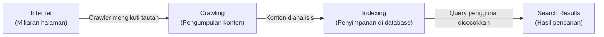
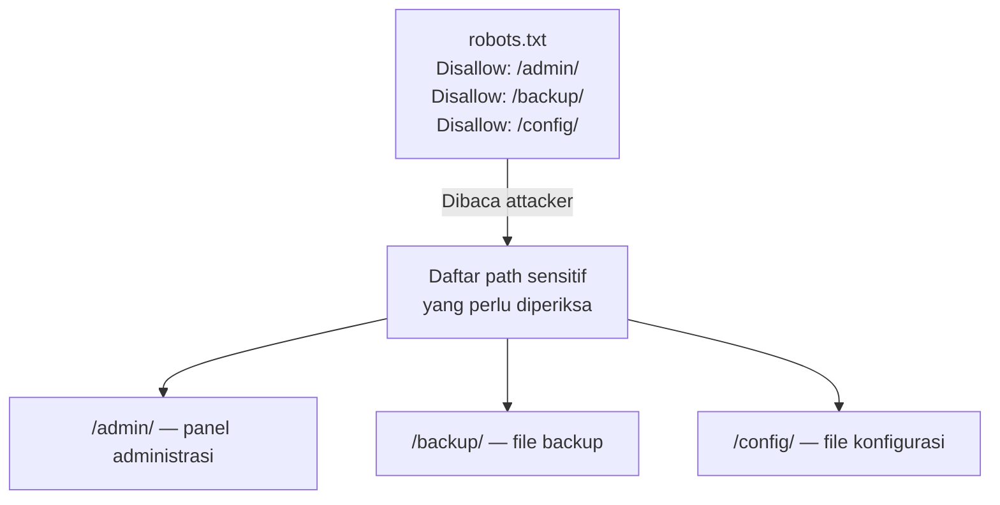

# TryHackMe: Google Dorking
- **Room Link:** [Google Dorking](https://tryhackme.com/room/googledorking)
- **Category:** Exploring room
- **Difficulty:** Easy

---

## Introduction

Google bukan sekadar alat pencari biasa. Di balik kotak pencarian yang sederhana, ada sistem yang secara terus-menerus menjelajahi, mengindeks, dan menyimpan informasi dari miliaran halaman web di seluruh internet.

Bagi seorang praktisi cyber security, memahami cara kerja mesin pencari membuka satu kemampuan yang sangat berguna: **menemukan informasi sensitif yang tidak sengaja terekspos ke publik** — tanpa menyentuh infrastruktur target secara langsung.

Teknik ini disebut **Google Dorking** — penggunaan operator pencarian khusus untuk menemukan hasil yang sangat spesifik. Ini adalah bagian dari **OSINT** (_Open Source Intelligence_), yaitu proses pengumpulan informasi dari sumber yang tersedia secara publik.

> **for your information:** **OSINT** (_Open Source Intelligence_) adalah proses pengumpulan dan analisis informasi dari sumber yang tersedia secara publik — website, media sosial, dokumen publik, dan mesin pencari. OSINT tidak melibatkan akses tidak sah ke sistem manapun.

**Attack Context:**

- **Kapan dipakai?** Tahap **Reconnaissance** — langkah paling awal dalam attack chain, sebelum penyerang menyentuh infrastruktur target secara langsung.
- **Syarat yang dibutuhkan:** Hanya membutuhkan browser dan akses ke Google. Tidak perlu tools khusus atau akses ke sistem target.
- **Tanda keberhasilan:** Menemukan informasi sensitif yang terekspos melalui hasil pencarian — file konfigurasi, halaman login yang tidak terlindungi, directory listing terbuka, atau kredensial yang bocor dalam file log.

Setelah menyelesaikan room ini, kamu akan paham:

- Bagaimana mesin pencari mengumpulkan dan mengindeks informasi dari internet.
- Apa itu `robots.txt` dan bagaimana file ini bisa menjadi sumber informasi bagi penyerang.
- Cara menggunakan Google Dorking operator untuk menemukan informasi spesifik.

---

## How Search Engines Work

### Crawling and Indexing

Mesin pencari seperti Google tidak menyimpan salinan internet secara real-time. Sebaliknya, mereka mengoperasikan program otomatis yang disebut **crawler** (juga dikenal sebagai **spider** atau **bot**) — program yang secara otomatis menjelajahi internet, mengikuti setiap tautan yang ditemukan, dan mengumpulkan konten dari halaman-halaman tersebut.

> **for your information:** **Crawler** (juga disebut **spider** atau **web bot**) adalah program otomatis yang menjelajahi internet secara sistematis dengan mengikuti tautan dari satu halaman ke halaman lain untuk mengumpulkan informasi. **Googlebot** adalah nama crawler milik Google.

Konten yang dikumpulkan crawler kemudian disimpan ke dalam **index** — database raksasa yang diorganisir berdasarkan kata kunci dan relevansi konten.



Penting untuk dipahami: saat kamu mengetik sesuatu di Google, mesin pencari tidak langsung mengunjungi website tersebut saat itu juga. Google mencari di dalam index-nya sendiri — database yang sudah dibangun sebelumnya oleh crawler.

**Apa yang dikumpulkan crawler?**

- **Keywords** — kata kunci dari konten halaman, yang menentukan topik website tersebut.
- **Metadata** — informasi deskriptif tentang halaman seperti judul, deskripsi, dan tag.
- **Tautan** — semua link di halaman yang akan menjadi target crawling berikutnya.
- **File dan dokumen** — PDF, spreadsheet, file konfigurasi, dan tipe file lain yang dapat diakses publik.

---

### Search Engine Optimisation (SEO)

**SEO** (_Search Engine Optimisation_) adalah praktik mengoptimalkan sebuah website agar mendapat peringkat lebih tinggi di hasil pencarian mesin pencari.

> **for your information:** **SEO** (_Search Engine Optimisation_) adalah serangkaian teknik yang digunakan untuk meningkatkan visibilitas sebuah website di hasil pencarian organik mesin pencari.

Beberapa elemen kunci yang dinilai mesin pencari:

| Elemen | Penjelasan |
| :--- | :--- |
| **Keywords** | Kata kunci yang relevan dengan konten halaman |
| **Meta Title** | Judul halaman yang muncul di tab browser dan hasil pencarian |
| **Meta Description** | Deskripsi singkat halaman yang muncul di bawah judul di hasil pencarian |
| **Sitemap** | File XML yang mendaftarkan semua halaman di website untuk memudahkan crawler |
| **Page Speed** | Kecepatan loading halaman — semakin cepat, semakin disukai mesin pencari |

> **for your information:** **Sitemap** adalah file — umumnya berformat XML — yang mendaftarkan semua URL di sebuah website beserta informasi tambahan seperti kapan terakhir diperbarui. Sitemap membantu crawler menemukan semua halaman di website dengan lebih efisien. Biasanya dapat diakses di `/sitemap.xml`.

---

## robots.txt

### What is robots.txt?

**robots.txt** adalah file teks sederhana yang ditempatkan di root domain sebuah website untuk memberikan instruksi kepada crawler tentang halaman atau direktori mana yang boleh dan tidak boleh diindeks.

Lokasi file ini selalu konsisten: `domain.com/robots.txt`. File ini tidak bisa ditempatkan di subdirektori — harus berada tepat di root domain.

> **for your information:** **Root domain** adalah level paling dasar dari sebuah domain — misalnya `ablog.com`. File yang ditempatkan di root domain dapat diakses langsung di `ablog.com/namafile`.

### robots.txt Syntax

Berikut contoh struktur `robots.txt` beserta penjelasan setiap komponennya:

```
User-agent: *
Disallow: /admin/
Disallow: /private/
Disallow: /dont-index-me/

User-agent: Bingbot
Disallow: /

Sitemap: https://ablog.com/sitemap.xml
```

| Direktif | Nilai | Penjelasan |
| :--- | :--- | :--- |
| `User-agent` | `*` | Berlaku untuk semua crawler |
| `User-agent` | `Bingbot` | Hanya berlaku untuk crawler Bing |
| `Disallow` | `/` | Larang seluruh website diindeks |
| `Disallow` | `/admin/` | Larang direktori `/admin/` diindeks |
| `Allow` | `/public/` | Izinkan direktori `/public/` diindeks secara eksplisit |
| `Sitemap` | URL sitemap | Memberitahu crawler lokasi sitemap website |

### robots.txt as an Information Source

Dari perspektif keamanan, `robots.txt` sering kali justru menjadi sumber informasi yang berguna bagi penyerang. Logikanya sederhana: direktori yang sengaja di-`Disallow` oleh webmaster kemungkinan besar berisi sesuatu yang dianggap sensitif — halaman admin, direktori backup, file konfigurasi, atau area yang belum seharusnya publik.



> **Common Mistake:** Banyak webmaster berpikir bahwa mendaftarkan direktori sensitif di `robots.txt` dengan `Disallow` sudah cukup untuk menyembunyikannya. Faktanya sebaliknya — `robots.txt` adalah file publik yang bisa dibaca siapa saja, termasuk penyerang. `Disallow` hanya instruksi untuk crawler yang patuh, bukan mekanisme keamanan. Perlindungan akses yang sebenarnya harus menggunakan autentikasi dan konfigurasi server.

---

## Google Dorking

### What is Google Dorking?

**Google Dorking** adalah teknik menggunakan operator pencarian khusus (_search operators_) yang didukung Google untuk menyaring hasil pencarian secara sangat spesifik. Dalam konteks keamanan, teknik ini digunakan untuk menemukan informasi sensitif yang tidak sengaja terekspos ke publik melalui indexing mesin pencari.

> **for your information:** **GHDB** (_Google Hacking Database_) adalah database publik yang dikurasi oleh **Exploit-DB** berisi ribuan Google Dork yang sudah terbukti menemukan informasi sensitif — mulai dari panel CCTV yang terbuka, printer yang terekspos ke internet, hingga file yang berisi kredensial.

---

### Core Operators

#### `site:` — Membatasi Pencarian ke Domain Tertentu

Membatasi hasil pencarian hanya dari domain atau subdomain yang ditentukan.

```
site:tryhackme.com
site:.go.id
site:bbc.co.uk "flood defences"
```

#### `filetype:` / `ext:` — Mencari Tipe File Tertentu

Membatasi hasil hanya pada tipe file yang ditentukan.

```
filetype:pdf
filetype:xls
ext:log
ext:conf
ext:sql
```

File seperti `.log`, `.conf`, `.sql`, dan `.env` sangat berbahaya jika terindeks karena sering berisi informasi sistem atau kredensial.

#### `inurl:` — Mencari Kata di dalam URL

Mencari halaman yang URL-nya mengandung kata tertentu.

```
inurl:admin
inurl:login
inurl:wp-config
inurl:dashboard
```

#### `intitle:` — Mencari Kata di Judul Halaman

Mencari halaman yang judulnya (HTML `<title>`) mengandung kata tertentu.

```
intitle:"login"
intitle:"index of"
intitle:"admin panel"
```

#### `intext:` — Mencari Kata di dalam Konten Halaman

Mencari halaman yang isi kontennya mengandung kata tertentu.

```
intext:"password"
intext:"confidential"
intext:"not for public distribution"
```

---

### Advanced Combinations

Operator-operator di atas bisa dikombinasikan untuk menghasilkan query yang jauh lebih spesifik dan efektif.

**Mencari halaman login dan panel administrasi:**

```
site:target.com intitle:"login"
inurl:admin intitle:"login"
inurl:wp-admin site:target.com
```

**Mencari file sensitif yang terekspos:**

```
filetype:log intext:"password"
ext:sql intext:"INSERT INTO"
ext:env intext:"DB_PASSWORD"
```

**Mencari directory listing yang terbuka:**

Directory listing terjadi ketika server menampilkan isi direktori karena tidak ada file index di dalamnya — kondisi ini mengekspos seluruh isi folder ke publik.

```
intitle:"index of" "backup"
intitle:"index of" "config"
intitle:"index of" ".git"
```

**Mencari file konfigurasi yang bocor:**

```
ext:conf inurl:server
inurl:wp-config.txt
ext:cnf intext:"password"
```

**Mencari dokumen sensitif di domain tertentu:**

```
site:gov.id filetype:pdf "rahasia"
site:target.com filetype:xls "email"
```

---

### Operator Reference Table

| Operator | Fungsi | Contoh |
| :--- | :--- | :--- |
| `site:` | Batasi ke domain tertentu | `site:bbc.co.uk` |
| `filetype:` / `ext:` | Filter berdasarkan tipe file | `filetype:pdf`, `ext:log` |
| `inurl:` | Cari kata di dalam URL | `inurl:admin` |
| `intitle:` | Cari kata di judul halaman | `intitle:"login"` |
| `intext:` | Cari kata di konten halaman | `intext:"password"` |
| `"kata"` | Pencarian frasa eksak | `"index of"` |
| `-kata` | Kecualikan kata dari hasil | `site:target.com -www` |

---

### Google Hacking Database (GHDB)

**Exploit-DB** menyediakan **GHDB** (_Google Hacking Database_) — koleksi publik berisi ribuan dork yang sudah diverifikasi dan dikategorikan berdasarkan jenis informasi yang ditemukan:

- **Footholds** — titik masuk awal ke sistem
- **Files Containing Passwords** — file yang mengandung kredensial
- **Sensitive Directories** — direktori sensitif yang terekspos
- **Web Server Detection** — identifikasi versi dan tipe web server
- **Vulnerable Files** — file yang mengindikasikan kerentanan spesifik

GHDB dapat diakses di: `https://www.exploit-db.com/google-hacking-database`

> **Common Mistake:** Google Dorking adalah teknik OSINT yang memanfaatkan informasi yang sudah terindeks secara publik. Mengakses informasi yang ditemukan melalui dork pada sistem yang bukan milikmu — bahkan jika informasinya terekspos secara tidak sengaja — bisa masuk ke ranah legal yang bermasalah. Selalu pastikan kamu punya izin eksplisit sebelum melakukan pengujian pada target nyata.

---

## Quick Review

- Apa perbedaan antara `inurl:` dan `intitle:` — kapan kamu memilih salah satunya saat melakukan reconnaissance?
- Kenapa `robots.txt` yang berisi banyak entri `Disallow` justru bisa menguntungkan penyerang?
- Jelaskan kenapa file dengan ekstensi `.env`, `.log`, dan `.conf` menjadi target pencarian yang berbahaya jika terindeks oleh mesin pencari.
