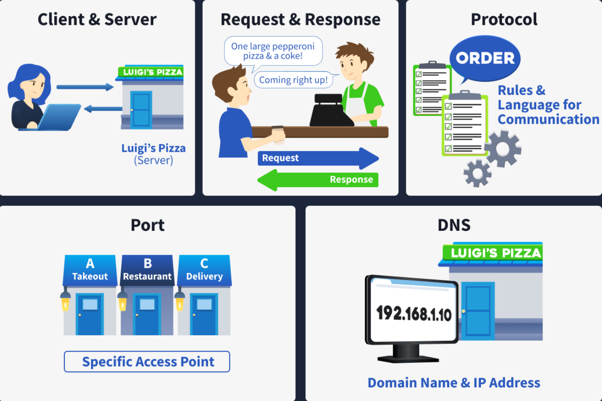
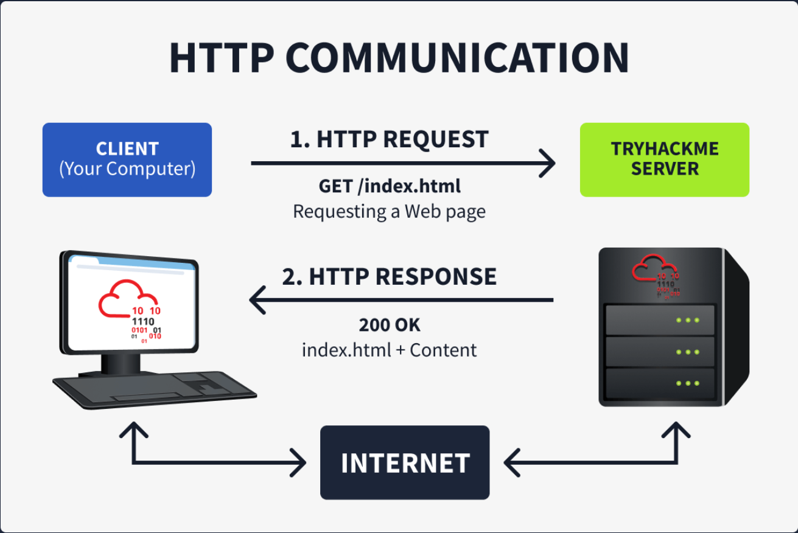
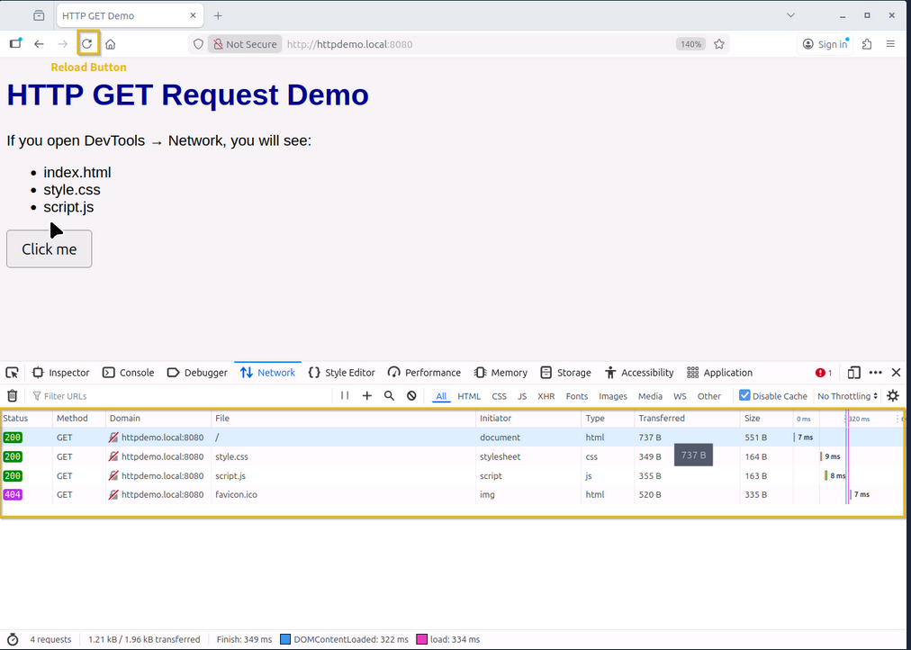
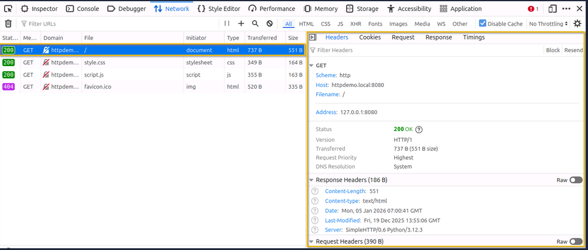
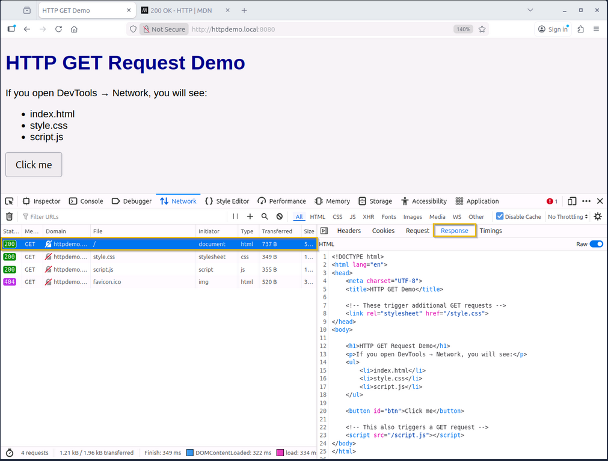

# TryHackMe: Client-Server Basics

- **Room Link:** [Client-Server Basics](https://tryhackme.com/room/client-serverbasics)
- **Category:** Pre-Security
- **Difficulty:** Easy

## Introduction

Bayangkan sebuah dunia di mana setiap orang hidup sendirian di pulau terpencil. Mereka punya makanan sendiri, alat sendiri, dan tidak pernah berbicara dengan siapa pun. Itulah gambaran komputer di masa awal: mereka bekerja sendiri, menyimpan file sendiri, dan tidak bisa berkomunikasi dengan mesin lain.

Namun, dunia berubah saat organisasi-organisasi mulai berpikir: *"Bagaimana kalau kita sambungkan pulau-pulau ini supaya kita bisa tukar makanan dan alat tanpa peduli jarak?"* Dari sinilah cikal bakal **Internet** lahir melalui jaringan legendaris seperti **ARPANET**, **CYCLADES**, dan **NSFNET**.

Sama seperti masyarakat manusia di mana setiap orang punya keahlian khusus dan menawarkan jasa (seperti dokter, koki, atau montir), sistem komputer yang saling terhubung juga mulai **berespesialisasi**. Ada yang jago menyimpan data, ada yang jago melayani permintaan kita. 

Di room ini, kamu akan mempelajari bagaimana client-server bekerja.

### Learning Objectives

Setelah menyelesaikan room ini, kamu akan paham:
*   Bagaimana model **Client-Server** bekerja — ini dasar dari hampir semua interaksi di internet.
*   Konsep-konsep penting seperti **DNS**, **Client**, **Server**, **Port**, **Protocol**, dan **Network**.

> **for your information:**
> **ARPANET** (_Advanced Research Projects Agency Network_) — Jaringan komputer pertama di dunia yang menggunakan protokol paket data, dikembangkan oleh Departemen Pertahanan AS sebagai fondasi internet yang kita kenal sekarang.
> **CYCLADES** — Jaringan riset Prancis tahun 1970-an yang menjadi pelopor dalam membebankan tanggung jawab pengiriman data pada pengirim/penerima (host), bukan pada jaringan itu sendiri.
> **NSFNET** (_National Science Foundation Network_) — Jaringan tulang punggung (*backbone*) di AS yang dibuat pada pertengahan 1980-an untuk menghubungkan pusat-pusat superkomputer dan menjadi pondasi infrastruktur internet modern.

## Pizza Delivery

Cara paling gampang untuk memahami bagaimana sistem komputer saling memberikan layanan (*service*) adalah lewat analogi dunia nyata. Mari kita bayangkan proses memesan **Pizza Luigi**.

Malam Sabtu tiba, Alice dan Bob ingin makan pizza.
1.  **Menu**: Alice melihat menu Pizza Luigi dan memilih pizza yang dia mau.
2.  **GPS**: Bob masuk ke mobil, memasukkan alamat Luigi ke GPS, dan mulai menyetir.
3.  **Order**: Begitu sampai, Bob masuk ke toko dan memesan: *"Satu pepperoni pizza ukuran besar dan satu cola."*
4.  **Acknowledge**: Karyawan toko mencatat pesanan dan mulai membuat pizzanya.
5.  **Enjoy**: Setelah pesanan siap, Bob pulang dan menikmati malam pizza yang indah bersama Alice.

Proses ini terlihat sederhana karena kita sudah terbiasa melakukannya. Tapi kalau dipikir lebih dalam, ada banyak langkah detail di baliknya yang mirip dengan cara komputer berinteraksi. Mari kita bedah satu per satu.

---

### Mapping Pizza to Computers

Dalam dunia *Cyber Security* dan *Networking*, setiap langkah di atas punya penjelasan teknisnya:

| Langkah memesan Pizza | Istilah Komputer | Penjelasan |
| :--- | :--- | :--- |
| **Alamat Luigi** | **IP Address** | Lokasi unik di jaringan agar paket data tahu harus ke mana. |
| **GPS** | **DNS** | Mengubah nama yang manusia mengerti (Pizza Luigi) menjadi alamat yang komputer mengerti (IP). |
| **Menu** | **Service/Content** | Apa yang tersedia untuk diminta oleh user. |
| **Pemesanan** | **Request** | Pesan yang dikirim oleh Client untuk mendapatkan layanan tertentu. |
| **Konfirmasi** | **Response** | Jawaban dari Server yang menyatakan permintaan diterima atau ditolak. |
| **Makan Pizza** | **Data Transfer** | Hasil akhir yang diterima oleh user (halaman web, file, dll). |

---

Sekarang, setelah analoginya jelas, mari kita lihat bagaimana komponen-komponen ini bekerja secara teknis.

#### 1. Client & Server
Ini dua peran utama dalam komunikasi jaringan:
*   **Client**: Perangkat atau software yang **menginisiasi** permintaan (misal: Browser di laptopmu).
*   **Server**: Sistem yang **mendengarkan** (*listening*) dan melayani permintaan tersebut (misal: Web Server THM). Perbedaan detail antara Client dan Server secara hardware dibahas di catatan [Computer Types](Computer-Types.md).

#### 2. Request & Response
Ini cara Client dan Server bertukar data — dan formatnya harus terstruktur:
*   **Request**: Harus diformat dengan benar agar Server paham sumber daya mana yang diminta.
*   **Response**: Jawaban dari Server yang bisa berupa data produk (Sukses) atau pesan kesalahan (Error) jika sumber daya tidak ditemukan atau permintaan salah format.

#### 3. Protocol: Rules of Communication
Protocol adalah kumpulan aturan yang menentukan bagaimana Client dan Server berbicara satu sama lain. Secara spesifik, **Protocol** mengatur:
*   Sintaks dan perintah yang dimengerti (misal: `GET`, `POST`).
*   Bagaimana pesan harus disusun (urutan data).
*   Bagaimana menangani kesalahan jika komunikasi terputus.

#### 4. Port: Identifying Services
Port adalah angka unik (0-65535) yang berfungsi sebagai "nomor pintu" untuk menentukan layanan mana yang ingin kamu akses di sebuah server.
*   Satu Server bisa menjalankan banyak layanan sekaligus (Web di port 80/443, Email di port 25, dll).
*   Client harus menghubungkan ke **Port** yang benar agar sampai ke layanan yang tepat.

#### 5. DNS: Domain Name System
Sistem yang memetakan nama domain yang mudah diingat manusia menjadi **IP Address** yang dimengerti mesin. Tanpa DNS, kamu harus menghafal angka seperti `104.26.11.210` untuk membuka sebuah website.

> **for your information:**
> **IP Address** (_Internet Protocol Address_) — Label numerik unik yang diberikan kepada setiap perangkat di jaringan untuk identifikasi dan lokasi komunikasi.

---

### Role in Cyber Security (Real-World Relevance)

Kenapa kamu perlu paham model ini? Karena setiap komponen di atas adalah titik yang bisa diserang:
*   **DNS Spoofing**: Penyerang memanipulasi DNS agar mengarahkan user ke server palsu (seperti mengarahkan Bob ke toko pizza palsu).
*   **DoS (Denial of Service)**: Membanjiri server dengan jutaan *Request* palsu hingga server tidak sanggup merespons pengguna asli.
*   **Port Scanning**: Hacker mencoba mengetuk semua "pintu" (Port) di server untuk mencari layanan yang punya celah keamanan terbuka.
*   **MitM (Man-in-the-Middle)**: Penyerang mencegat komunikasi antara Client dan Server untuk mencuri data sensitif di tengah jalan.

## Web Communication in Practice

Sekarang konsep dasarnya sudah jelas. Mari kita lihat bagaimana komunikasi ini terjadi di dunia nyata, khususnya saat kamu buka website. Protokol yang paling sering dipakai adalah **HTTP** (_Hypertext Transfer Protocol_) atau versi amannya, **HTTPS**.

### Stateless Protocol

HTTP dikenal sebagai protokol yang bersifat **stateless**.
*   **Artinya**: Setiap permintaan (*Request*) diproses secara mandiri. Server tidak "mengingat" apa yang kamu lakukan sebelumnya.
* Seperti memesan kopi di kasir yang pelupa. Setiap kali kamu datang (walaupun baru 5 detik yang lalu), kasir itu akan bertanya lagi siapa kamu dan mau pesan apa, karena dia tidak punya memori tentang kunjunganmu sebelumnya.

**Bagaimana website modern mengingat kita (Login)?**
Karena HTTP aslinya pelupa, pengembang web menambahkan mekanisme di level aplikasi menggunakan **Cookie** atau **Token**. Begitu kamu login, server memberimu "kartu identitas" kecil yang akan dikirimkan kembali oleh browsermu di setiap permintaan berikutnya. Tanpa ini, kamu harus login ulang setiap kali klik tombol di website.

### HTTP Methods (Commands)

Dalam bahasa teknis HTTP, perintah yang diberikan Client ke Server disebut sebagai **Method**. Berdasarkan dokumen **RFC** (_Request for Comments_), ada 9 metode inti, tapi beberapa yang paling sering kamu temui adalah:

| Method | Fungsi Utama | Konteks Attacker |
| :--- | :--- | :--- |
| **GET** | Mengambil data dari server (seperti membaca artikel). | Digunakan untuk mencari file/direktori tersembunyi. |
| **POST** | Mengirim data ke server (seperti mengisi form login). | Target utama untuk serangan injeksi atau pencurian kredensial. |
| **PUT** | Mengunggah atau mengganti file yang sudah ada. | Berbahaya jika salah konfigurasi (bisa upload file jahat). |
| **DELETE** | Menghapus sumber daya di server. | Bisa merusak data jika tidak dibatasi aksesnya. |
| **HEAD** | Mirip GET, tapi cuma minta *header*-nya saja (tanpa isi). | Untuk mengecek apakah sebuah file ada tanpa harus mendownloadnya. |

> **for your information:**
> **RFC** (_Request for Comments_) — Dokumen teknis resmi yang berisi standar dan protokol internet yang dikembangkan oleh IETF (_Internet Engineering Task Force_).

Di bagian selanjutnya, kita akan fokus membedah **GET** secara praktis melalui apa yang dilakukan browsermu saat membuka website.

### The GET Method: Retrieving Resources

Metode **GET** sebenarnya sangat sederhana. Kita menggunakan metode ini untuk **mengambil** sumber daya dari web server. 
*   **Contoh**: `GET https://tryhackme.com/index.php`. Permintaan ini akan mengambil halaman utama website TryHackMe.

Kamu tidak perlu mengetikkan perintah ini secara manual. Saat kamu membuka browser (ini adalah **Client**) dan mengetikkan `https://tryhackme.com`, browsermu akan bekerja di bagian back-end untuk mengirimkan pesan HTTP berdasarkan informasi yang kamu berikan dan standar spesifikasi HTTP lainnya.

#### Interaction

Saat web server menerima permintaan tersebut, ia akan mengirimkan jawaban (Response) yang berisi dua hal penting:
1.  **Status Code**: Angka yang menunjukkan jenis respons (misal: `200 OK` jika berhasil).
2.  **Information**: Isi dari sumber daya yang diminta (misal: kode HTML halaman web).

### GET Request Demo

Untuk melihat bagaimana aslinya sebuah **GET Request** bekerja, kamu bisa mencobanya langsung di browser menggunakan fitur **Developer Tools** (tekan `F12` atau klik kanan -> `Inspect`).

1.  Buka browser dan akses alamat: `http://httpdemo.local:8080`.
2.  Buka tab **Network**. Tab ini berfungsi untuk membedah, menganalisis, dan memantau semua lalu lintas data yang lewat di browsermu.
3.  Klik tombol **Reload** di browser.

Kamu akan melihat daftar file yang diminta oleh browser ke server (seperti `index.html`, `style.css`, dan `script.js`). Semuanya menggunakan metode **GET**.

> **Common Mistake:** Pemula sering lupa membuka tab **Network** *sebelum* mereload halaman. Jika tab Network kosong, cukup tekan reload agar browser mengirim ulang permintaannya dan datanya muncul di daftar.

Jika kamu mengklik salah satu entri tersebut (misal `index.html`), kamu akan melihat informasi lebih detail di panel sebelah kanan:

#### HTTP Request Information

Meskipun terlihat banyak bagian informasi yang rumit, ada beberapa hal penting yang wajib kamu pahami:
*   **Scheme**: Menunjukkan protokol yang digunakan (**HTTP** atau **HTTPS**).
*   **Host**: Nama server tujuan tempat kita meminta sumber daya.
*   **Filename**: Menunjukkan file spesifik yang diminta. Dalam contoh kita, `/` berarti `index.html`.
*   **Address**: Alamat IP server tujuan. Jika muncul `127.0.0.1`, artinya website tersebut di-host di komputermu sendiri (*localhost*).
*   **Status**: Menunjukkan apakah permintaan berhasil (misal: `200 OK`).

#### Response Structure

Saat server merespons, pesan tersebut dibagi menjadi dua bagian utama:
1.  **Response Header**: Berisi **metadata** tentang respons tersebut (seperti tipe file, tanggal, dan informasi server).
2.  **Response Body**: Berisi **konten asli** yang kamu minta (seperti kode HTML yang kemudian dirender oleh browser menjadi tampilan web). Kamu bisa melihat isi body ini dengan mengklik tab **"Response"** di panel detail.

> **for your information:**
> **Localhost** (`127.0.0.1`) — Alamat IP standar yang digunakan untuk merujuk ke komputer yang sedang kamu gunakan saat ini. Berguna untuk testing aplikasi sebelum di-online-kan.

---

### Pertanyaan Singkat

*   Apa yang dimaksud dengan **stateless** pada protokol HTTP, dan bagaimana website mengatasi keterbatasan ini?
*   Sebutkan dua komponen dalam model Client-Server yang sering menjadi target serangan!
*   Apa perbedaan fungsi **Response Header** dan **Response Body**?
