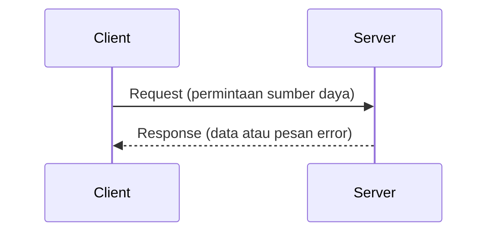
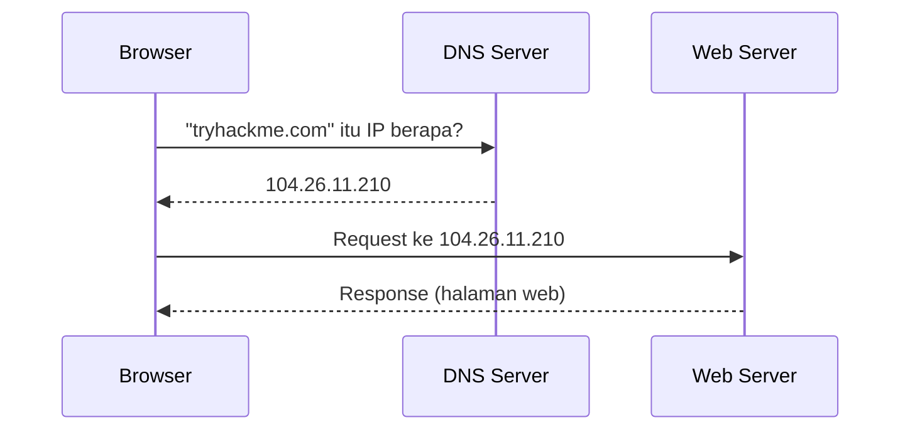
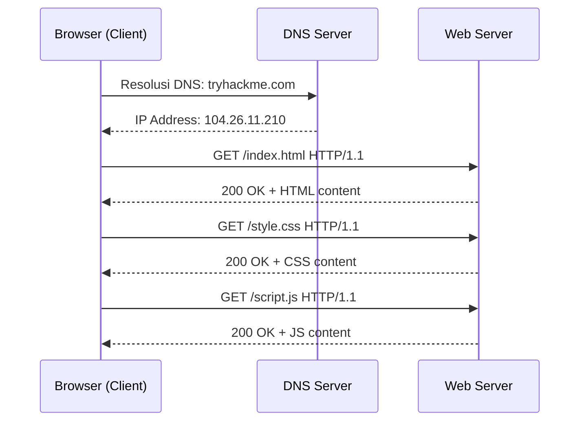

# TryHackMe: Client-Server Basics

- **Room Link:** [Client-Server Basics](https://tryhackme.com/room/client-serverbasics)
- **Category:** Pre-Security
- **Difficulty:** Easy

---

## Introduction

Sebelum internet ada, komputer bekerja secara mandiri — menyimpan dan memproses data sendiri tanpa bisa berkomunikasi dengan mesin lain. Ketika organisasi mulai menghubungkan komputer-komputer tersebut ke dalam jaringan, muncul kebutuhan baru: bagaimana satu komputer bisa meminta layanan dari komputer lain secara terstruktur?

Jawabannya adalah **model Client-Server** — arsitektur yang menjadi fondasi dari hampir semua komunikasi di internet hingga hari ini. Setiap kali kamu membuka website, mengirim email, atau streaming video, model ini yang bekerja di baliknya.

> **for your information:** **ARPANET** (_Advanced Research Projects Agency Network_) adalah jaringan komputer pertama yang menggunakan protokol paket data, dikembangkan oleh Departemen Pertahanan AS sebagai fondasi awal internet. **CYCLADES** adalah jaringan riset Prancis tahun 1970-an yang menjadi pelopor dalam membebankan tanggung jawab pengiriman data pada pengirim dan penerima, bukan pada jaringan itu sendiri. **NSFNET** (_National Science Foundation Network_) adalah jaringan tulang punggung AS yang dibangun pertengahan 1980-an dan menjadi pondasi infrastruktur internet modern.

Setelah menyelesaikan room ini, kamu akan paham:

- Bagaimana model Client-Server bekerja — cara kerja dasarnya menjadi fondasi hampir semua interaksi di internet.
- Apa fungsi DNS, port, dan protocol dalam proses komunikasi jaringan.
- Bagaimana HTTP bekerja secara teknis saat kamu membuka sebuah website.

---

## The Client-Server Model

### How It Works

Model Client-Server membagi peran dalam komunikasi jaringan menjadi dua:

- **Client** — perangkat atau software yang menginisiasi permintaan. Contoh: browser di laptopmu saat kamu membuka website.
- **Server** — sistem yang mendengarkan permintaan masuk (_listening_) dan memberikan respons. Contoh: web server yang menyimpan dan menyajikan halaman website.

Proses dasarnya selalu mengikuti pola yang sama:



Client tidak bisa mendapat respons tanpa mengirim request terlebih dahulu. Server tidak akan mengirim data kecuali ada request yang masuk. Semua komunikasi diinisiasi oleh Client.

---

### Key Components

#### IP Address

Setiap perangkat dalam jaringan membutuhkan identitas unik agar data bisa dikirim ke tujuan yang benar. Identitas ini disebut **IP Address** (_Internet Protocol Address_) — label numerik yang diberikan ke setiap perangkat di jaringan.

Contoh format IPv4: `104.26.11.210`

#### DNS

Manusia lebih mudah mengingat nama dibanding angka. **DNS** (_Domain Name System_) adalah sistem yang menerjemahkan nama domain yang mudah dibaca manusia — seperti `tryhackme.com` — menjadi IP address yang dimengerti oleh mesin.

Tanpa DNS, kamu harus menghafal IP address setiap website yang ingin dikunjungi.



#### Port

Satu server bisa menjalankan banyak layanan secara bersamaan. **Port** adalah angka unik (rentang 0–65535) yang berfungsi sebagai identifier untuk menentukan layanan mana yang ingin diakses di sebuah server.

Beberapa port standar yang wajib diingat:

| Port | Layanan | Keterangan |
| :--- | :--- | :--- |
| **80** | HTTP | Komunikasi web tidak terenkripsi |
| **443** | HTTPS | Komunikasi web terenkripsi |
| **22** | SSH | Remote access terenkripsi |
| **25** | SMTP | Pengiriman email |
| **53** | DNS | Resolusi nama domain |

Client harus menghubungkan ke port yang benar agar permintaannya diterima oleh layanan yang tepat.

#### Protocol

**Protocol** adalah kumpulan aturan yang menentukan bagaimana Client dan Server berkomunikasi — format pesan, urutan pengiriman, cara menangani error, dan perintah yang dikenali kedua pihak.

Tanpa protocol yang disepakati, Client dan Server tidak akan bisa saling memahami meskipun terhubung secara fisik.

---

### Mapping to Real World

Untuk memperjelas hubungan antar komponen, berikut pemetaan ke skenario sehari-hari:

| Skenario Nyata | Komponen Jaringan | Fungsi |
| :--- | :--- | :--- |
| Alamat toko | **IP Address** | Lokasi unik di jaringan sebagai tujuan pengiriman data |
| Aplikasi navigasi | **DNS** | Menerjemahkan nama lokasi menjadi koordinat yang bisa diproses |
| Nomor antrian layanan | **Port** | Menentukan layanan spesifik mana yang ingin diakses |
| Bahasa yang disepakati | **Protocol** | Aturan komunikasi yang dipahami kedua pihak |
| Permintaan ke kasir | **Request** | Pesan terstruktur dari Client ke Server |
| Jawaban dari kasir | **Response** | Balasan Server berisi data atau pesan error |

---

## HTTP — How the Web Communicates

**HTTP** (_Hypertext Transfer Protocol_) adalah protocol yang digunakan browser dan web server untuk berkomunikasi. Versi amannya — **HTTPS** (_HTTP Secure_) — mengenkripsi seluruh komunikasi menggunakan **TLS** (_Transport Layer Security_) sehingga data tidak bisa dibaca pihak ketiga yang mencegat koneksi.

> **for your information:** **TLS** (_Transport Layer Security_) adalah protocol kriptografi yang mengenkripsi data yang dikirim antara Client dan Server. Ketika kamu melihat ikon gembok di browser, itu menandakan koneksi sudah diproteksi oleh TLS. **Enkripsi** adalah proses mengubah data menjadi format yang tidak bisa dibaca tanpa kunci dekripsi yang benar.

### Stateless Protocol

HTTP bersifat **stateless** — setiap request diproses secara independen. Server tidak menyimpan informasi tentang request sebelumnya. Setiap kali browser mengirim request baru, server memperlakukannya seolah ini adalah interaksi pertama.

Konsekuensinya: HTTP murni tidak bisa "mengingat" bahwa kamu sudah login. Setiap klik ke halaman baru akan memaksamu login ulang.

Untuk mengatasi keterbatasan ini, aplikasi web menggunakan mekanisme tambahan di level aplikasi:

- **Cookie** — file kecil yang disimpan browser dan dikirim kembali ke server di setiap request berikutnya sebagai identifikasi sesi.
- **Token** — string terenkripsi yang berfungsi sebagai bukti autentikasi, disisipkan di header setiap request.

> **for your information:** **Cookie** adalah data kecil yang disimpan browser dan dikirim kembali ke server secara otomatis di setiap request, memungkinkan server mengenali pengguna yang sama lintas request. **Token** dalam konteks autentikasi adalah string terenkripsi — umumnya berformat **JWT** (_JSON Web Token_) — yang membuktikan identitas pengguna tanpa server perlu menyimpan state sesi.

---

### HTTP Methods

HTTP mendefinisikan sejumlah **method** — perintah yang dikirim Client untuk memberitahu server tindakan apa yang diminta. Berdasarkan spesifikasi **RFC** (_Request for Comments_), ada sembilan method inti, tapi berikut yang paling sering ditemui:

> **for your information:** **RFC** (_Request for Comments_) adalah dokumen teknis resmi yang mendefinisikan standar dan protocol internet, dikembangkan dan dipublikasikan oleh **IETF** (_Internet Engineering Task Force_).

| Method | Fungsi | Relevansi Keamanan |
| :--- | :--- | :--- |
| **GET** | Mengambil sumber daya dari server | Digunakan untuk memindai file dan direktori tersembunyi |
| **POST** | Mengirim data ke server untuk diproses | Target umum untuk serangan injeksi dan pencurian kredensial |
| **PUT** | Mengunggah atau mengganti sumber daya di server | Berbahaya jika tidak dikonfigurasi dengan benar — bisa digunakan untuk mengunggah file berbahaya |
| **DELETE** | Menghapus sumber daya di server | Berpotensi merusak data jika kontrol akses tidak diterapkan dengan ketat |
| **HEAD** | Sama seperti GET tapi hanya mengembalikan header, tanpa body | Digunakan untuk memverifikasi keberadaan file tanpa mengunduh isinya |

---

### GET Request in Detail

Method **GET** adalah yang paling sering digunakan — setiap kali browser memuat halaman web, ia mengirim GET request untuk setiap sumber daya yang dibutuhkan: HTML, CSS, JavaScript, gambar, dan sebagainya.

Alur lengkap saat browser membuka sebuah halaman:



Setiap file dimuat dengan GET request terpisah. Browser menunggu respons dari setiap request sebelum merender halaman secara penuh.

---

### HTTP Request Structure

Sebuah HTTP request terdiri dari beberapa komponen yang dikirim bersama ke server:

```
GET /index.html HTTP/1.1
Host: tryhackme.com
User-Agent: Mozilla/5.0
Accept: text/html
```

| Komponen | Penjelasan |
| :--- | :--- |
| **Method** | Perintah yang diminta — GET, POST, dll |
| **Path** | Lokasi sumber daya di server — `/index.html` |
| **HTTP Version** | Versi protocol yang digunakan — `HTTP/1.1` |
| **Host** | Nama server tujuan |
| **User-Agent** | Identitas software pengirim request (browser, script, dll) |
| **Accept** | Tipe konten yang bisa diterima Client |

---

### HTTP Response Structure

Server merespons setiap request dengan dua bagian utama:

**1. Response Header** — metadata tentang respons:

```
HTTP/1.1 200 OK
Content-Type: text/html
Content-Length: 1234
Server: nginx
```

**2. Response Body** — konten aktual yang diminta (kode HTML, data JSON, file, dll).

#### HTTP Status Codes

Status code adalah angka tiga digit yang dikirim server untuk memberitahu Client hasil dari request-nya:

| Kode | Kategori | Contoh |
| :--- | :--- | :--- |
| **2xx** | Sukses | `200 OK` — request berhasil diproses |
| **3xx** | Redirect | `301 Moved Permanently` — sumber daya pindah ke URL baru |
| **4xx** | Error dari Client | `404 Not Found` — sumber daya tidak ditemukan; `403 Forbidden` — akses ditolak |
| **5xx** | Error dari Server | `500 Internal Server Error` — server mengalami kegagalan internal |

> **Common Mistake:** Status code `403 Forbidden` dan `404 Not Found` sering tertukar. `404` berarti sumber daya tidak ada. `403` berarti sumber daya ada, tapi kamu tidak punya izin untuk mengaksesnya — informasi ini berguna saat melakukan enumeration karena `403` mengonfirmasi keberadaan path tersebut.

---

### Observing HTTP in Practice

Kamu bisa melihat HTTP request dan response secara langsung menggunakan **Developer Tools** di browser.

1. Buka browser, tekan `F12` untuk membuka Developer Tools.
2. Pindah ke tab **Network** — tab ini merekam semua lalu lintas HTTP yang dilakukan browser.
3. Reload halaman yang ingin diamati.
4. Klik salah satu entry di daftar untuk melihat detail request dan response-nya.

> **Common Mistake:** Tab Network harus sudah terbuka sebelum halaman di-reload. Jika tab Network baru dibuka setelah halaman dimuat, daftar request akan kosong karena Developer Tools tidak merekam request yang terjadi sebelum tab aktif.

Informasi yang bisa dibaca dari setiap entry:

| Field | Penjelasan |
| :--- | :--- |
| **Scheme** | Protocol yang digunakan — HTTP atau HTTPS |
| **Host** | Nama server tujuan |
| **Path** | File atau endpoint yang diminta |
| **Status** | Hasil request — `200 OK`, `404 Not Found`, dll |
| **Address** | IP address aktual server yang merespons |

> **for your information:** **Localhost** (`127.0.0.1`) adalah IP address standar yang merujuk ke komputer yang sedang kamu gunakan. Jika address yang muncul di Developer Tools adalah `127.0.0.1`, berarti website tersebut berjalan di komputermu sendiri — bukan di server eksternal.

---

## Quick Review

- Apa yang dimaksud dengan stateless pada HTTP, dan mekanisme apa yang digunakan aplikasi web untuk mengatasi keterbatasan ini?
- Kenapa status code `403 Forbidden` lebih informatif dibanding `404 Not Found` dari perspektif attacker yang sedang melakukan enumeration?
- Jelaskan peran DNS dalam proses komunikasi Client-Server — apa yang terjadi jika DNS server tidak bisa dihubungi?
