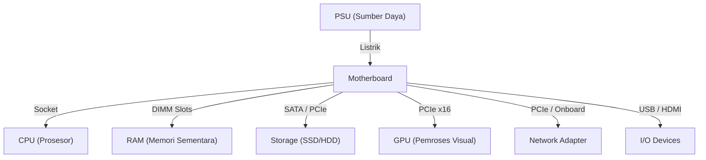

# TryHackMe: Inside a Computer System

- **Room Link:** [Inside a Computer System](https://tryhackme.com/room/insideacomputersystem)
- **Category:** Pre-Security
- **Difficulty:** Easy

---

## Introduction

Sebelum kamu terjun lebih jauh ke dunia cyber security, ada satu pertanyaan fundamental yang harus dijawab dulu: **apa yang sebenarnya sedang kamu lindungi?**

Seorang teknisi keamanan yang tidak memahami sistem yang dijaganya akan kesulitan menentukan di mana titik lemahnya, apa yang perlu diprioritaskan, dan bagaimana sebuah serangan bisa masuk. Pemahaman tentang hardware bukan sekadar pengetahuan dasar — ini adalah fondasi yang akan terus kamu butuhkan saat mempelajari forensik digital, malware analysis, hingga eksploitasi sistem.

Di room ini, kita akan membedah komponen-komponen penyusun komputer: apa fungsinya, bagaimana mereka saling terhubung, dan kenapa masing-masing relevan untuk cyber security.

Setelah menyelesaikan room ini, kamu akan paham:

- Apa saja komponen di dalam komputer dan apa tugas masing-masing.
- Bagaimana komponen-komponen ini bekerja sama untuk menghidupkan sistem.
- Kenapa pemahaman hardware penting untuk siapa saja yang ingin serius di cyber security.

---

## Inside a Computer System

Hampir semua komputer yang kamu temui — laptop, desktop, hingga server — dibangun menggunakan blok penyusun yang sama. Setiap komponen punya tugas spesifik, dan ketika bekerja bersama, mereka membentuk sistem yang fungsional.

Ringkasan komponen sebelum kita bedah satu per satu:

| Komponen | Fungsi Utama |
| :--- | :--- |
| **Motherboard** | Menghubungkan semua komponen dan menjadi jalur komunikasi antar bagian. |
| **CPU** | Memproses semua instruksi yang diberikan oleh sistem dan aplikasi. |
| **RAM** | Menyimpan data yang sedang aktif digunakan agar bisa diakses CPU dengan cepat. |
| **Storage (SSD/HDD)** | Menyimpan data secara permanen — OS, aplikasi, dan file pengguna. |
| **Network Adapter** | Menghubungkan komputer ke jaringan lokal maupun internet. |
| **PSU** | Mengubah listrik AC dari stopkontak menjadi daya DC yang dibutuhkan komponen. |
| **GPU** | Memproses dan merender output visual yang ditampilkan ke monitor. |
| **I/O Devices** | Menerima input dari pengguna dan menyampaikan output kembali ke pengguna. |

---

### Motherboard

**Motherboard** adalah papan sirkuit utama yang menjadi tempat semua komponen terpasang dan saling berkomunikasi. Tanpa motherboard, setiap komponen hanyalah unit terpisah yang tidak bisa berkoordinasi.

> **for your information:** **PCB** (_Printed Circuit Board_) adalah papan berlapis tembaga yang menjadi dasar motherboard. Jalur-jalur tembaga kecil di permukaannya disebut **bus**, yang berfungsi mengantarkan data dan sinyal listrik antar komponen.

Pada motherboard desktop yang umum, kamu akan menemukan berbagai slot dan konektor berikut:

| Slot / Konektor | Nama Teknis | Fungsi |
| :--- | :--- | :--- |
| Tempat prosesor | **CPU Socket** | Tempat CPU dipasang. Dilengkapi mekanisme pengunci agar chip tidak bergeser. |
| Tempat RAM | **DIMM Slots** | Tempat modul RAM dipasang. Biasanya butuh pasangan slot yang sesuai untuk performa optimal. |
| Slot kartu grafis | **PCIe x16** | Slot panjang dengan bandwidth tinggi, khusus untuk GPU. |
| Slot ekspansi lain | **PCIe x1 / x4** | Slot lebih pendek untuk network card, capture card, atau kartu ekspansi lainnya. |
| Konektor storage | **SATA Connectors** | Menghubungkan SSD 2.5" atau HDD via kabel SATA. |
| Konektor daya utama | **24-pin ATX** | Konektor daya utama dari PSU ke motherboard. |
| Port belakang | **Back Panel I/O** | Kumpulan port di panel belakang untuk keyboard, mouse, monitor, dan perangkat USB. |

---

### CPU

**CPU** (_Central Processing Unit_) adalah komponen yang menjalankan semua instruksi dalam sebuah program — menghitung nilai, memindahkan data, membuat keputusan logis, dan seterusnya. Setiap kali kamu menjalankan aplikasi, CPU yang mengeksekusi instruksi-instruksinya satu per satu.

Beberapa karakteristik penting CPU:

- **Multi-core** — CPU modern memiliki beberapa core yang bisa memproses instruksi secara paralel. Semakin banyak core, semakin banyak tugas yang bisa dieksekusi bersamaan.
- **Clock speed** — diukur dalam GHz, menunjukkan berapa banyak siklus instruksi yang bisa diproses per detik.
- **CPU Socket** — CPU terpasang ke motherboard melalui socket khusus yang dirancang sesuai arsitektur prosesornya.

> **Common Mistake:** Saat memasang CPU, perhatikan tanda segitiga kecil di sudut chip dan socket. Tanda ini menunjukkan orientasi yang benar. Jika dipaksakan dengan orientasi yang salah, pin CPU bisa bengkok dan rusak secara permanen.

---

### RAM

**RAM** (_Random Access Memory_) adalah memori kerja komputer — tempat data yang sedang aktif diproses disimpan sementara agar bisa diakses CPU dengan sangat cepat.

Cara kerjanya sederhana: saat kamu membuka aplikasi, data aplikasi tersebut dimuat dari storage ke RAM. CPU kemudian membaca dan memodifikasi data di RAM secara langsung, jauh lebih cepat dibanding harus membaca dari storage setiap saat.

Dua sifat krusial RAM yang wajib kamu ingat:

- **Volatile** — seluruh isi RAM langsung hilang saat komputer dimatikan atau kehilangan daya. Tidak ada yang tersisa.
- **Kecepatan tinggi** — akses data di RAM bisa ratusan kali lebih cepat dibanding SSD.

> **for your information:** **DDR** (_Double Data Rate_) adalah standar teknologi RAM. Versi terbaru saat ini adalah **DDR5** dan **DDR6**, yang menawarkan bandwidth dan efisiensi daya lebih tinggi dibanding generasi sebelumnya.

> **Common Mistake:** RAM dan storage sering tertukar oleh pemula. Perbedaannya jelas: **RAM** menyimpan data yang sedang diproses — sifatnya sementara dan hilang saat komputer mati. **Storage** menyimpan data secara permanen — tetap ada meskipun komputer dimatikan.

---

### Storage — SSD dan HDD

Storage adalah perangkat yang menyimpan data secara permanen: sistem operasi, aplikasi, dan semua file pengguna. Data di storage tetap utuh meskipun komputer dimatikan.

Ada dua teknologi utama yang dipakai saat ini:

| Fitur | HDD (_Hard Disk Drive_) | SSD (_Solid State Drive_) |
| :--- | :--- | :--- |
| **Teknologi** | Piringan magnetik berputar dengan komponen bergerak | Chip memori flash tanpa komponen bergerak |
| **Kecepatan** | Lebih lambat | Jauh lebih cepat |
| **Ketahanan fisik** | Rentan terhadap guncangan | Tahan guncangan |
| **Harga per GB** | Lebih murah | Lebih mahal |
| **Kapasitas populer** | 1TB – 4TB | 256GB – 2TB |
| **Koneksi** | SATA | SATA atau PCIe (NVMe) |

HDD masih relevan untuk menyimpan data dalam jumlah besar yang jarang diakses — arsip, backup, media. SSD menjadi pilihan utama untuk sistem operasi dan aplikasi karena kecepatannya yang signifikan lebih tinggi.

---

### Network Adapter

**Network Adapter** (kartu jaringan) adalah komponen yang memungkinkan komputer berkomunikasi dengan perangkat lain di jaringan lokal maupun internet. Komponen ini menangani proses pengiriman dan penerimaan data melalui protokol jaringan.

Dua varian utama:

- **Wired (Ethernet)** — menggunakan kabel dengan konektor **RJ-45**. Koneksi lebih stabil, latensi lebih rendah, dan tidak rentan terhadap interferensi sinyal.
- **Wireless (Wi-Fi)** — menggunakan sinyal radio. Lebih fleksibel dari sisi mobilitas, tapi performa bisa menurun jika ada interferensi atau jarak terlalu jauh dari access point.

Network adapter sering sudah tertanam langsung di motherboard (_onboard_). Untuk kebutuhan performa lebih tinggi atau fitur khusus, adapter tambahan bisa dipasang melalui slot PCIe.

---

### PSU

**PSU** (_Power Supply Unit_) mengambil listrik **AC** (_Alternating Current_) dari stopkontak dan mengubahnya menjadi listrik **DC** (_Direct Current_) dengan tegangan yang sesuai untuk setiap komponen.

Distribusi daya dari PSU ke komponen dilakukan melalui konektor-konektor berikut:

- **24-pin ATX** — konektor utama ke motherboard.
- **4/8-pin CPU** — daya khusus untuk prosesor.
- **SATA Power** — daya untuk storage.
- **6/8-pin PCIe** — daya tambahan untuk GPU yang membutuhkan daya besar.

> **Common Mistake:** Memilih PSU dengan kapasitas watt yang terlalu kecil adalah kesalahan umum. Jika total konsumsi daya komponen melebihi kapasitas PSU, sistem akan gagal menyala atau mati mendadak saat beban tinggi. Hitung kebutuhan daya total semua komponen sebelum memilih PSU.

---

### GPU

**GPU** (_Graphics Processing Unit_) adalah prosesor yang dirancang khusus untuk komputasi paralel skala besar — terutama untuk merender gambar dan menampilkan output visual ke monitor.

GPU terhubung ke motherboard melalui slot **PCIe x16** dan berkomunikasi dengan monitor melalui port seperti **HDMI** atau **DisplayPort**.

> **for your information:** Di dunia cyber security, GPU dimanfaatkan untuk **password cracking** menggunakan tool seperti **Hashcat** — tool berbasis GPU untuk memecahkan hash password. GPU bisa memproses miliaran kombinasi hash per detik karena arsitekturnya yang dioptimalkan untuk komputasi paralel masif, jauh melampaui kemampuan CPU untuk tugas ini.

---

### Input/Output (I/O) Devices

**I/O Devices** adalah perangkat yang menangani komunikasi antara pengguna dan sistem komputer.

**Input devices** — menerima data dari pengguna dan mengirimnya ke sistem:
- Keyboard, mouse, mikrofon, scanner

**Output devices** — menyampaikan hasil pemrosesan sistem kembali ke pengguna:
- Monitor, printer, speaker

Konektor umum yang menghubungkan perangkat I/O ke komputer:

| Konektor | Fungsi |
| :--- | :--- |
| **USB** | Konektor universal untuk hampir semua perangkat I/O. |
| **HDMI** | Mengirimkan sinyal audio dan video ke monitor atau TV. |
| **DisplayPort** | Alternatif HDMI dengan bandwidth lebih tinggi, umum di monitor gaming. |

---

## What Happens When You Press the Power Button?

Semua komponen sudah terpasang. Saat kamu menekan tombol power, ada serangkaian proses terurut yang terjadi sebelum OS siap digunakan. Proses ini disebut **booting**.

---

### Step 1 — Power Button

Saat tombol power ditekan, sinyal dikirim ke PSU untuk mulai mengalirkan daya ke motherboard dan semua komponen yang terhubung. Komponen-komponen mulai aktif secara bersamaan.

---

### Step 2 — Firmware Starts

Setelah daya tersedia, komponen sudah aktif secara elektrikal — tapi sistem belum tahu harus melakukan apa. Di sinilah **firmware** mengambil kendali.

**UEFI** (_Unified Extensible Firmware Interface_) adalah firmware modern yang berjalan pertama kali saat komputer dinyalakan. Tugasnya adalah menginisialisasi hardware dan menyiapkan lingkungan agar OS bisa dimuat.

> **for your information:** **BIOS** (_Basic Input/Output System_) adalah pendahulu UEFI yang sudah sebagian besar digantikan di komputer modern. Fungsinya sama — menginisialisasi hardware saat booting — tapi UEFI menawarkan lebih banyak fitur, antarmuka grafis, dan dukungan untuk storage berkapasitas besar.

---

### Step 3 — POST

Sebelum melanjutkan proses boot, firmware menjalankan **POST** (_Power-On Self Test_) — serangkaian pengujian otomatis untuk memverifikasi bahwa setiap komponen penting terpasang dengan benar dan berfungsi normal.

Komponen yang diuji meliputi CPU, RAM, storage, dan perangkat I/O dasar. Jika ada komponen yang gagal dideteksi atau tidak merespons, sistem akan menghentikan proses boot dan memberikan sinyal error — biasanya berupa bunyi beep dengan pola tertentu atau kode error di layar.

> **Common Mistake:** Jika komputer berbunyi beep berulang saat dinyalakan dan tidak mau melanjutkan booting, itu adalah sinyal dari POST bahwa ada komponen yang bermasalah. Setiap pola beep memiliki arti berbeda — cek dokumentasi motherboard untuk menerjemahkan kode beep tersebut.

---

### Step 4 — Select Boot Device

Setelah POST selesai dan semua komponen dinyatakan normal, firmware mencari perangkat yang berisi OS untuk dimuat. Di dalam UEFI terdapat daftar prioritas yang disebut **boot order** — daftar perangkat yang dicek secara berurutan.

Contoh urutan boot yang umum:

1. **SSD/HDD** — tempat OS utama tersimpan.
2. **USB Drive** — dipakai untuk instalasi OS baru atau booting ke live environment.
3. **Network (PXE Boot)** — booting lewat jaringan, umum di lingkungan enterprise.

> **for your information:** **PXE** (_Preboot Execution Environment_) adalah protokol yang memungkinkan komputer melakukan booting langsung dari server melalui jaringan, tanpa memerlukan storage lokal. Ini umum dipakai di data center untuk men-deploy OS ke banyak mesin sekaligus.

---

### Step 5 — Bootloader

Setelah perangkat boot ditemukan, **bootloader** dijalankan. Bootloader adalah program kecil yang bertugas memuat OS dari storage ke RAM, lalu menyerahkan kendali eksekusi ke OS tersebut.

Kenapa OS harus dimuat ke RAM terlebih dahulu? Karena CPU membutuhkan akses yang sangat cepat ke instruksi OS selama sistem berjalan, dan kecepatan baca RAM jauh melampaui kecepatan baca storage.

> **for your information:** Contoh bootloader yang umum: **GRUB** (_GRand Unified Bootloader_) dipakai di sebagian besar distribusi Linux, sementara **Windows Boot Manager** dipakai di sistem Windows.

---

## Quick Review

- Apa perbedaan mendasar antara RAM dan storage dalam hal persistensi data saat komputer dimatikan?
- Kenapa proses boot bisa menjadi target serangan — di tahap mana attacker paling mungkin menyisipkan malware?
- Jelaskan fungsi POST dan apa yang terjadi jika salah satu komponen gagal dalam pengujiannya.
