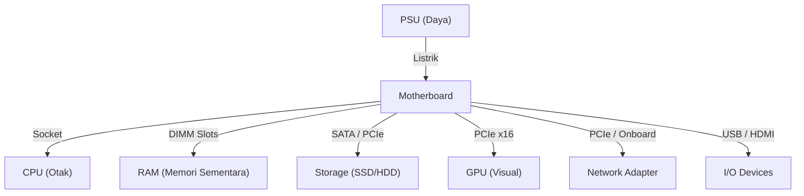

# TryHackMe: Inside a Computer System

- **Room Link:** [Inside a Computer System](https://tryhackme.com/room/insideacomputersystem)
- **Category:** Pre-Security
- **Difficulty:** Easy

---

## Introduction

Sebelum kamu terjun lebih jauh ke dunia cyber security, ada satu hal fundamental yang wajib kamu pahami: **apa yang sebenarnya sedang kamu lindungi?**

Bayangkan kamu adalah seorang kepala keamanan sebuah kerajaan mewah. Sebelum kamu memasang penjaga di pintu depan atau mengunci jendela, kamu harus tahu dulu seluk-beluk kerajaan tersebut. Di mana letak ruang harta karunnya? Di mana gudang makanannya? Siapa saja yang boleh masuk ke kamar sang komandan? Kalau kamu tidak tahu apa yang ada di kerajaanmu, mustahil kamu bisa melindunginya dengan efektif.

Sama halnya dengan keamanan komputer. Mencoba menjaga sistem yang tidak kamu pahami itu ibarat menjaga kerajaan yang belum pernah kamu lihat. Di room ini, kita akan membedah kerajaan digital kita, yaitu komputer.

### Learning Objectives

Setelah menyelesaikan room ini, kamu akan paham:
*   Apa saja komponen yang ada di dalam komputer dan apa tugas masing-masing.
*   Bagaimana komponen-komponen ini bekerja sama untuk menghidupkan sistem.
*   Kenapa semua ini penting untuk kamu yang mau terjun ke cyber security.

Tenang, kita akan bahas pelan-pelan tanpa kebanyakan istilah teknis. Fokusnya adalah membangun fondasi yang kuat dulu.

> **for your information:** 
> **End-to-end security** (Keamanan dari ujung ke ujung) dimulai dengan memahami setiap titik dalam sebuah sistem, termasuk perangkat kerasnya.

---

## Inside a Computer System

Hampir semua komputer yang kamu temui, mulai dari laptop, HP, sampai server canggih (variasi jenis komputer dibahas di catatan [Computer Types](Computer-Types.md)), dibangun menggunakan blok penyusun yang sama. Setiap bagian punya tugas spesifik, dan ketika bekerja sama, mereka membuat komputer itu hidup.



Untuk memudahkan pemahaman, kita akan pakai analogi **Tubuh Manusia**. Ini ringkasan cepatnya sebelum kita bedah satu per satu:

| Komponen | Analogi Tubuh | Fungsi Utama |
| :--- | :--- | :--- |
| **Motherboard** | **Kerangka & Saraf** | Menghubungkan semua komponen. |
| **CPU** | **Otak** | Memproses semua instruksi. |
| **RAM** | **Memori Jangka Pendek** | Menyimpan data sementara agar cepat diakses. |
| **Storage (SSD/HDD)** | **Memori Jangka Panjang** | Menyimpan data secara permanen. |
| **Network Adapter** | **Pita Suara** | Berkomunikasi dengan sistem lain. |
| **PSU** | **Jantung & Paru-paru** | Menyuplai energi ke seluruh komponen. |
| **GPU** | **Korteks Visual** | Memproses dan menampilkan gambar. |
| **I/O Devices** | **Panca Indera & Anggota Tubuh** | Menerima input dan mengeluarkan output. |

---

### Motherboard — Kerangka & Sistem Saraf

Motherboard itu seperti **kerangka tulang dan sistem saraf** tubuh kita. Semua komponen menempel di sini, dan sekaligus menjadi jalur komunikasi antar bagian.

Pada motherboard desktop yang umum, kamu akan menemukan berbagai tempat (socket & slots) tempat komponen lain berkumpul:

| Komponen | Nama Teknis | Fungsi & Detail |
| :--- | :--- | :--- |
| **CPU Socket** | **CPU Socket** | Tempat Otak (prosesor) duduk. Dilengkapi tuas kecil untuk mengunci chip agar tidak goyang. |
| **RAM Slots** | **DIMM Slots** | Tempat Memori Jangka Pendek dipasang. Biasanya butuh **matching pairs** (pasangan yang sama) agar performa maksimal. |
| **Expansion Slots** | **PCI Express x16** | Slot panjang yang diperkuat (reinforced) untuk kartu dengan bandwidth tinggi seperti **GPU**. |
| **Expansion Slots** | **PCI Express x1 / x4** | Slot PCIe yang lebih pendek, biasanya digunakan untuk **Network Card**, capture card, atau kartu ekspansi lainnya. |
| **SATA Ports** | **SATA Connectors** | Konektor data tipis berbentuk huruf L untuk menghubungkan SSD 2.5" atau HDD melalui kabel SATA. |
| **Power Connector** | **24-pin ATX** | Konektor daya utama dari PSU yang menyuplai listrik ke seluruh motherboard dan komponennya. |
| **Rear I/O Ports** | **Back Panel** | Kumpulan pintu di bagian belakang untuk menghubungkan Keyboard, Mouse, Monitor, dan perangkat USB lainnya. |

Setiap komponen lain **menempel atau terhubung melalui** motherboard. Tanpa motherboard, komponen-komponen ini hanyalah suku cadang yang tidak bisa bekerja sama.

> **for your information:**
> **PCB** (_Printed Circuit Board_) — Motherboard pada dasarnya adalah papan sirkuit cetak raksasa. Jalur-jalur tembaga kecil di permukaannya yang disebut **bus** bertugas mengantarkan data dan listrik antar komponen.

---

### CPU — Otak Komputer

**CPU** (_Central Processing Unit_), atau yang sering disebut **prosesor**, adalah otak dari komputer. Sama seperti otak kita yang terus-menerus memproses instruksi (menghitung angka, menggerakkan tangan, dan sebagainya), CPU melakukan hal yang persis sama untuk komputer.

Beberapa hal penting tentang CPU:
*   **Multi-Core:** CPU modern punya beberapa *core* (inti prosesor) yang bisa menangani instruksi secara **paralel** (bersamaan). Semakin banyak core, semakin banyak tugas yang bisa dikerjakan sekaligus.
*   **Koneksi:** CPU terpasang di motherboard melalui **CPU Socket**, sebuah konektor khusus yang dirancang agar CPU bisa terhubung dengan aman.

> **Common Mistake:** Saat memasang CPU, perhatikan tanda segitiga kecil di sudut CPU dan socket-nya. Kalau salah posisi, pin CPU bisa bengkok dan rusak permanen.

---

### RAM — Memori Jangka Pendek

**RAM** (_Random Access Memory_) itu seperti **memori kerja jangka pendek** otak kita. Saat kamu mengerjakan sebuah tugas, otak menyimpan informasi yang relevan untuk sementara waktu. RAM bekerja dengan cara yang sama — dia menyimpan data yang sedang dibutuhkan CPU agar bisa diakses dengan sangat cepat.

Yang perlu kamu tahu tentang RAM:
*   **Volatile (Mudah hilang):** Begitu komputer dimatikan atau kehilangan daya, semua isi RAM **langsung hilang**. Beda dengan SSD yang menyimpan data secara permanen.
*   **Teknologi modern:** RAM saat ini pakai teknologi seperti **DDR5** atau **DDR6** untuk kecepatan dan performa yang lebih tinggi.

> **Common Mistake:** Banyak pemula bingung membedakan RAM dan Storage. Ingat rumus sederhana ini:
> - **RAM** = meja kerja (semakin lebar, semakin banyak yang bisa dikerjakan sekaligus, tapi bersih saat kamu pulang).
> - **Storage** = lemari arsip (tempat menyimpan file secara permanen).

---

### Storage — Memori Jangka Panjang (SSD & HDD)

SSD dan HDD adalah perangkat penyimpanan yang berfungsi seperti **memori jangka panjang** kita. Kalau RAM itu meja kerja yang bersih setiap pulang, Storage ini adalah lemari arsip tempat kamu menyimpan file secara permanen.

| Fitur | HDD (*Hard Disk Drive*) | SSD (*Solid State Drive*) |
| :--- | :--- | :--- |
| **Teknologi** | Piringan magnetik berputar (*moving parts*) | Chip memori flash (*no moving parts*) |
| **Kecepatan** | Lebih lambat | Jauh lebih cepat |
| **Ketahanan** | Rentan guncangan (karena ada bagian bergerak) | Tahan banting |
| **Harga** | Murah per GB | Lebih mahal per GB |
| **Kapasitas Populer** | 1TB - 4TB | 256GB - 2TB |
| **Koneksi** | **SATA cable** | **SATA cable** atau **PCI Express slot** |

HDD masih populer untuk menyimpan data besar yang jarang diakses (arsip, backup), sedangkan SSD jadi pilihan utama untuk OS dan aplikasi karena kecepatannya.

---

### Network Adapter — Pita Suara

Sama seperti kita menggunakan **pita suara** untuk berkomunikasi dengan lingkungan sekitar, **Network Adapter** (kartu jaringan) membuat komputer bisa berkomunikasi dengan sistem lain.

Dua varian utama:
*   **Wired (Kabel):** Menggunakan kabel Ethernet (RJ-45). Lebih stabil dan cepat.
*   **Wireless (Nirkabel):** Menggunakan sinyal Wi-Fi. Lebih fleksibel tapi bisa terganggu interferensi.

Seringkali network adapter sudah **tertanam langsung** di motherboard (*onboard*). Tapi kalau butuh performa lebih atau fitur khusus, kamu bisa menambahkan kartu jaringan terpisah lewat **PCI Express slot**.

---

### PSU — Jantung & Paru-paru

Setiap sistem butuh energi. Seperti **jantung** yang memompa darah ke seluruh organ, **PSU** (_Power Supply Unit_) menyuplai listrik ke semua komponen komputer.

PSU mengambil daya dari stopkontak (listrik AC) dan mengubahnya menjadi daya DC yang dibutuhkan komponen. Distribusinya lewat berbagai konektor:
*   **Main Motherboard Connector** (24-pin) — menyuplai daya ke motherboard.
*   **CPU Power Connector** (4/8-pin) — daya khusus untuk prosesor.
*   **Molex / SATA Power** — daya untuk storage dan perangkat lainnya.
*   **PCIe Power** (6/8-pin) — daya tambahan untuk GPU.

> **Common Mistake:** Memilih PSU yang watt-nya terlalu kecil untuk kebutuhan komponen adalah kesalahan fatal. Kalau komponen butuh daya lebih besar dari kapasitas PSU, sistem akan gagal menyala atau mati mendadak (*crash*). Selalu hitung kebutuhan daya total sebelum memilih PSU.

---

### GPU — Korteks Visual

**GPU** (_Graphics Processing Unit_) ibarat **korteks visual** otak kita. Mata menangkap informasi visual, lalu korteks visual memproses informasi tersebut menjadi gambar yang kita "lihat". GPU bekerja dengan cara serupa — menerima data dari sistem operasi dan program, lalu mengolahnya menjadi output visual yang ditampilkan ke monitor.

GPU terhubung ke motherboard melalui **PCI Express slot**. Untuk kebutuhan gaming, rendering 3D, atau bahkan *password cracking* di dunia cyber security, GPU yang powerful sangat dibutuhkan.

> **for your information:**
> Di dunia cyber security, GPU dipakai untuk **cracking password** menggunakan tool seperti **Hashcat**. GPU bisa memproses miliaran kombinasi hash per detik karena arsitekturnya yang dirancang untuk komputasi paralel masif.

---

### Input/Output (I/O) — Panca Indera & Anggota Tubuh

Sama seperti kita punya **panca indera** untuk menerima informasi dan **anggota tubuh** untuk bertindak, komputer punya perangkat **Input** dan **Output**.

**Input Devices** (menerima data dari pengguna):
*   Keyboard, Mouse, Microphone, Scanner

**Output Devices** (menampilkan hasil ke pengguna):
*   Monitor, Printer, Speaker

**Konektor umum** untuk perangkat I/O:
*   **USB** — konektor paling universal untuk hampir semua perangkat.
*   **HDMI** — untuk menghubungkan monitor atau TV (audio + video).
*   **DisplayPort** — alternatif HDMI, sering dipakai monitor gaming.

---

### Pertanyaan Singkat

*   Apa perbedaan utama antara **RAM** dan **Storage (SSD/HDD)** dalam hal ketahanan data saat listrik mati?
*   Mengapa kita harus berhati-hati saat memilih daya (**watt**) pada **PSU**?
*   Dalam analogi tubuh manusia, komponen mana yang bertindak sebagai **sistem saraf** yang menghubungkan semua bagian?

## What Happens When You Press the Start Button?

Sekarang semua komponen sudah terpasang di dalam komputer. Lalu, apa yang terjadi saat kamu menekan tombol power? Prosesnya mirip dengan bangun tidur di pagi hari. Kamu membuka mata, mengecek apakah semua badan terasa baik-baik saja, baru kemudian mulai beraktivitas. Komputer melakukan hal yang persis sama.

Berikut urutan lengkap proses boot:

```
Press Power ──► Firmware ──► POST ──► Select Boot ──► Start
  Button         Starts                  Device       Bootloader
```

---

### Step 1: Press the Power Button

Saat kamu menekan tombol power, sinyal dikirim ke **PSU** untuk mulai mengalirkan listrik. Bayangkan tubuhmu yang sedang tidur tiba-tiba terbangun — begitu menerima oksigen, darah mulai dipompa ke seluruh organ. Di komputer, PSU mulai mendistribusikan daya ke motherboard dan semua komponen yang terhubung.

---

### Step 2: Firmware Starts

Setelah daya mengalir, semua komponen inti sudah hidup, tapi sistemnya belum sadar (belum punya kesadaran). Seperti tubuh kita yang butuh otak untuk menyala sebelum kita benar-benar sadar, komputer membutuhkan **firmware** untuk memulai semua komponennya.

Sistem pusat yang mengelola proses ini disebut **UEFI** (_Unified Extensible Firmware Interface_). UEFI adalah firmware modern yang bertugas menginisialisasi hardware dan menyiapkan lingkungan agar OS bisa dimuat.

> **for your information:**
> Kamu mungkin sering mendengar istilah **BIOS** (_Basic Input/Output System_). BIOS melakukan fungsi yang sama dengan UEFI, tapi merupakan teknologi lama yang sebagian besar sudah **digantikan oleh UEFI** di komputer modern. Jadi kalau ada yang menyebut masuk BIOS, kemungkinan besar yang dimaksud sekarang adalah UEFI.

---

### Step 3: Power-On Self Test (POST)

Setelah firmware aktif, saatnya melakukan cek kesehatan. Sama seperti kamu bangun tidur lalu mengecek apakah badan terasa baik-baik saja — kalau ada yang sakit, kamu langsung tahu ada masalah.

Komputer menjalankan **POST** (_Power-On Self Test_), sebuah rutinitas yang menguji apakah setiap komponen penting:
*   **Ada** (terpasang).
*   **Terkonfigurasi dengan benar.**
*   **Berfungsi normal.**

Kalau ada yang gagal (misalnya RAM tidak terdeteksi), komputer akan memberikan **sinyal alarm** berupa bunyi beep atau kode error di layar.

> **Common Mistake:** Jika komputer berbunyi beep berulang saat dinyalakan dan tidak mau booting, jangan panik. Bunyi beep itu adalah kode dari POST yang memberitahu komponen mana yang bermasalah. Cek manual motherboard untuk memahami pola beep nya.

---

### Step 4: Select Boot Device

Semua komponen sudah diperiksa dan berfungsi normal. Sekarang sistem mencari lokasi **boot routine**, yaitu tempat di mana OS tersimpan untuk dimuat.

Di dalam UEFI, ada **daftar prioritas** (*boot order*) yang menentukan perangkat mana yang dicek duluan. Contoh urutan umum:

1.  **SSD/HDD** — tempat OS utama tersimpan (paling umum).
2.  **USB Drive** — sering dipakai untuk instalasi OS baru atau booting live environment.
3.  **Network (PXE Boot)** — booting lewat jaringan, biasa dipakai di lingkungan enterprise.

---

### Step 5: Initiate Bootloader

Setelah perangkat boot ditemukan, **bootloader** dijalankan. Bootloader adalah program kecil yang bertugas mentransfer **OS dari storage (SSD/HDD) ke RAM**.

Kenapa harus ke RAM? Karena CPU butuh akses yang sangat cepat ke instruksi OS, dan RAM jauh lebih cepat dibanding SSD/HDD. Begitu OS berhasil dimuat ke RAM, UEFI menyerahkan kendali penuh ke OS — dan komputer siap digunakan.

> **for your information:**
> Contoh bootloader yang umum:
> - **GRUB** (_GRand Unified Bootloader_) — dipakai di kebanyakan sistem Linux.
> - **Windows Boot Manager** — dipakai di sistem Windows.

---

## Conclusion

Sampai di sini, kita sudah membedah komponen inti sebuah komputer dan bagaimana proses booting bekerja dari tombol power sampai OS siap dipakai. Mungkin sekarang terasa seperti materi dasar biasa, tapi percayalah — semakin dalam kamu masuk ke dunia cyber security, kamu akan **terus-menerus** kembali ke pengetahuan ini.

Contoh nyatanya:
*   Memahami **RAM vs Storage** sangat krusial di **Digital Forensics** — salah langkah sedikit, bukti digital bisa hilang.
*   Proses **boot** sering jadi target serangan. Attacker bisa menyisipkan malware di level **bootloader** atau **firmware** (disebut **bootkit/rootkit**) sehingga malware berjalan *sebelum* OS bahkan sempat dimuat — membuat antivirus biasa tidak bisa mendeteksinya.
*   Mengetahui **network adapter** dan jenis koneksinya membantu kamu memahami bagaimana data mengalir masuk dan keluar dari sistem.

### Real-World Relevance

| Konsep | Relevansi di Cyber Security |
| :--- | :--- |
| **RAM (Volatile Memory)** | _Memory forensics_ — menganalisis isi RAM untuk menemukan malware yang hanya berjalan di memori. |
| **Boot Process** | _Bootkits/Rootkits_ — malware yang menginfeksi firmware atau bootloader agar berjalan sebelum OS. |
| **Storage (SSD/HDD)** | _Disk forensics_ — menggali bukti digital dari storage, termasuk file yang sudah dihapus. |
| **Network Adapter** | _Network monitoring_ — memantau lalu lintas data masuk/keluar untuk mendeteksi aktivitas mencurigakan. |

---

### Pertanyaan Singkat

*   Kenapa proses boot bisa menjadi target serangan hacker?
*   Apa yang dimaksud dengan **volatile memory** dan kenapa penting dalam forensik digital?
*   Sebutkan urutan 5 langkah proses boot dari menekan tombol power sampai OS siap digunakan.
