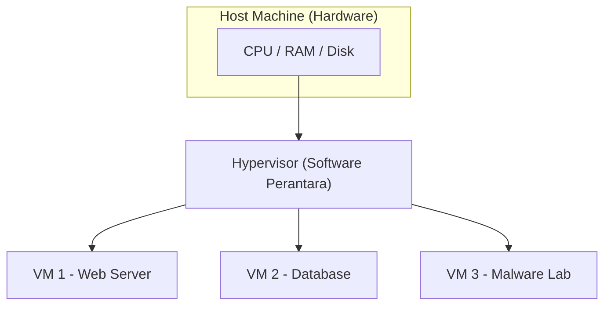

# TryHackMe: Virtualisation Basics

- **Room Link:** [Virtualisation Basics](https://tryhackme.com/room/virtualisationbasics)
- **Category:** Pre-Security
- **Difficulty:** Easy

## Introduction

Di room-room sebelumnya (seperti [Inside a Computer System](Inside-a-Computer-System.md) dan [Computer Types](Computer-Types.md)), kamu sudah belajar apa saja komponen penyusun komputer dan bagaimana mereka saling berkomunikasi. Sekarang, kita naik satu level: bagaimana perusahaan **mengoptimalkan** komponen-komponen itu agar lebih hemat dan fleksibel? Jawabannya ada pada sebuah konsep bernama **Virtualisasi**.

Coba bayangkan skenario ini: manajermu meminta bantuan untuk meningkatkan efisiensi sebuah server yang meng-host website kantor. Servernya kuat, tapi sebagian besar waktunya hanya diam karena traffic-nya tidak selalu ramai. Sayang sekali kan, punya mesin seharga puluhan juta tapi kapasitasnya cuma terpakai 10-20%?

Sekarang kalikan masalah itu. Bayangkan kalau **setiap** aplikasi atau website butuh satu server fisik sendiri — satu untuk email, satu untuk database, satu untuk web. Biayanya meledak, dan sebagian besar hardware cuma diam tanpa kerja berat. **Virtualisasi diciptakan untuk menyelesaikan masalah ini.**

Cara kerjanya mirip seperti pemilik rumah besar yang membagi rumahnya menjadi beberapa **apartemen mandiri**. Setiap apartemen punya kunci, dapur, dan kamar mandi sendiri — penyewa merasa punya rumah sendiri. Padahal di balik itu, mereka semua berbagi **satu atap dan pondasi** (hardware) yang sama.

Kenapa ini penting untuk kamu yang belajar cyber security? Karena virtualisasi bukan cuma soal hemat biaya — ini juga **alat tempur sehari-hari**:

*   **Malware Analysis**: Kamu bisa menjalankan virus di dalam komputer virtual (*Guest*). Kalau virusnya merusak VM, cukup hapus VM-nya. Komputer aslimu (*Host*) tetap aman.
*   **Cloud Infrastructure**: Hampir semua layanan cloud (AWS, Azure, GCP) berjalan di atas virtualisasi. Ribuan server virtual bekerja di atas hardware fisik yang terbatas.
*   **Isolation**: Memisahkan layanan sensitif dari layanan publik. Kalau satu VM diretas, VM yang lain tetap aman karena mereka terisolasi satu sama lain.

### Learning Objectives

Setelah menyelesaikan room ini, kamu akan paham:
*   Kenapa menjalankan satu aplikasi per server fisik itu cara yang boros dan tidak scalable.
*   Bagaimana virtualisasi menjawab tantangan **efisiensi hardware** dan **skalabilitas**.
*   Apa saja komponen utama dari sebuah **Virtual Machine (VM)**.
*   Bagaimana **Containers** membawa optimasi ini ke tingkat yang lebih lanjut.

> **for your information:**
> **Host Machine** — Komputer fisik asli yang menyediakan sumber daya hardware (CPU, RAM, Storage). Ini "tuan rumah"-nya.
> **Guest Machine** — Komputer virtual yang berjalan di atas host. Dia "tamu" yang meminjam sumber daya dari tuan rumah.

---
