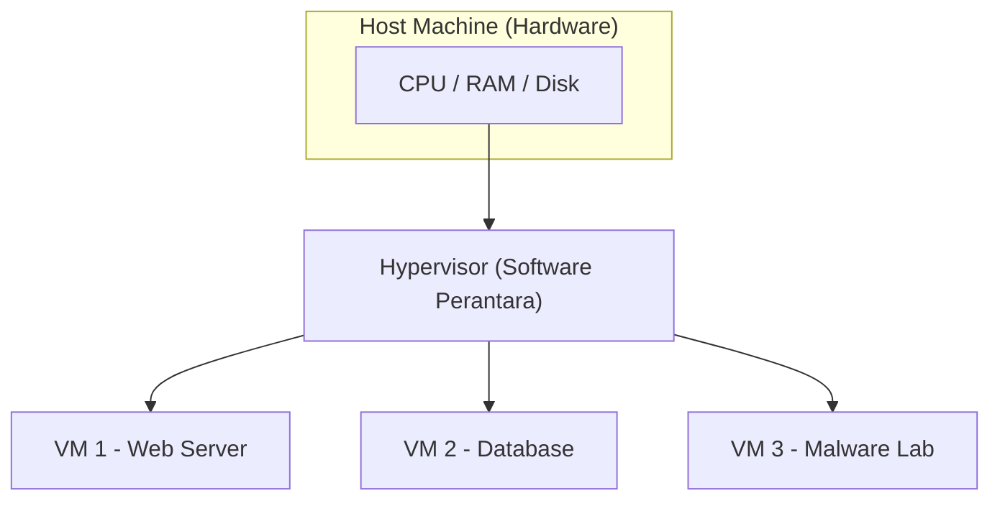

# TryHackMe: Virtualisation Basics

- **Room Link:** [Virtualisation Basics](https://tryhackme.com/room/virtualisationbasics)
- **Category:** Pre-Security
- **Difficulty:** Easy

## Introduction

Di room-room sebelumnya (seperti [Inside a Computer System](Inside-a-Computer-System.md) dan [Computer Types](Computer-Types.md)), kamu sudah belajar apa saja komponen penyusun komputer dan bagaimana mereka saling berkomunikasi. Sekarang, kita naik satu level: bagaimana perusahaan **mengoptimalkan** komponen-komponen itu agar lebih hemat dan fleksibel? Jawabannya ada pada sebuah konsep bernama **Virtualisasi**.

Coba bayangkan skenario ini: manajermu meminta bantuan untuk meningkatkan efisiensi sebuah server yang meng-host website kantor. Servernya kuat, tapi sebagian besar waktunya hanya diam karena traffic-nya tidak selalu ramai. Sayang sekali kan, punya mesin seharga puluhan juta tapi kapasitasnya cuma terpakai 10-20%?

Sekarang kalikan masalah itu. Bayangkan kalau **setiap** aplikasi atau website butuh satu server fisik sendiri — satu untuk email, satu untuk database, satu untuk web. Biayanya meledak, dan sebagian besar hardware cuma diam tanpa kerja berat. **Virtualisasi diciptakan untuk menyelesaikan masalah ini.**

Cara kerjanya mirip seperti pemilik rumah besar yang membagi rumahnya menjadi beberapa **apartemen mandiri**. Setiap apartemen punya kunci, dapur, dan kamar mandi sendiri — penyewa merasa punya rumah sendiri. Padahal di balik itu, mereka semua berbagi **satu atap dan pondasi** (hardware) yang sama.

Kenapa ini penting untuk kamu yang belajar cyber security? Karena virtualisasi bukan cuma soal hemat biaya — ini juga **alat tempur sehari-hari**:

*   **Malware Analysis**: Kamu bisa menjalankan virus di dalam komputer virtual (*Guest*). Kalau virusnya merusak VM, cukup hapus VM-nya. Komputer aslimu (*Host*) tetap aman.
*   **Cloud Infrastructure**: Hampir semua layanan cloud (AWS, Azure, GCP) berjalan di atas virtualisasi. Ribuan server virtual bekerja di atas hardware fisik yang terbatas.
*   **Isolation**: Memisahkan layanan sensitif dari layanan publik. Kalau satu VM diretas, VM yang lain tetap aman karena mereka terisolasi satu sama lain.

### Learning Objectives

Setelah menyelesaikan room ini, kamu akan paham:
*   Kenapa menjalankan satu aplikasi per server fisik itu cara yang boros dan tidak scalable.
*   Bagaimana virtualisasi menjawab tantangan **efisiensi hardware** dan **skalabilitas**.
*   Apa saja komponen utama dari sebuah **Virtual Machine (VM)**.
*   Bagaimana **Containers** membawa optimasi ini ke tingkat yang lebih lanjut.

> **for your information:**
> **Host Machine** — Komputer fisik asli yang menyediakan sumber daya hardware (CPU, RAM, Storage). Ini "tuan rumah"-nya.
> **Guest Machine** — Komputer virtual yang berjalan di atas host. Dia "tamu" yang meminjam sumber daya dari tuan rumah.

---

## Virtualisation Overview

### The Problem: One Server = One Application

Sebelum virtualisasi ada, aturan main di dunia IT itu sederhana:

> **"Satu server = satu aplikasi."**

Di masa awal, setiap layanan digital berjalan di mesin fisik masing-masing. Satu server untuk website, satu lagi untuk database, satu lagi untuk email. Setiap mesin punya satu tugas yang jelas. Saat bisnis bertambah besar dan butuh lebih banyak layanan, solusinya ya jelas: **beli lebih banyak server**. Pendekatan "satu pekerjaan per mesin" ini jadi standar karena dianggap paling *reliable*.

Masalahnya? Pendekatan ini punya empat kelemahan besar:

*   **High Cost**: Membeli banyak server fisik itu mahal — dan bukan cuma hardware-nya. Kamu juga harus bayar listrik, pendingin, perawatan, dan ruang data center.
*   **Low Utilization**: Kebanyakan aplikasi tidak menggunakan seluruh kapasitas servernya. Banyak server yang cuma terpakai **5-20%** dari total CPU, RAM, dan storage-nya. Sisanya terbuang sia-sia.
*   **Slow Deployment**: Menyiapkan server fisik baru bisa makan waktu berhari-hari bahkan berminggu-minggu (pesan hardware, pasang, konfigurasi).
*   **Hard to Scale**: Kalau tiba-tiba sebuah aplikasi butuh lebih banyak resource, kamu harus beli server baru lagi. Tidak bisa langsung ditambah instan.

Singkatnya, perusahaan membayar sangat mahal untuk hardware yang sebagian besar waktunya cuma diam tanpa dimanfaatkan sepenuhnya.

---

### The Need for Sharing Hardware Safely and Efficiently

Virtualisasi hadir dengan ide baru:

> **"Bagaimana kalau beberapa aplikasi bisa berbagi satu server fisik yang sama, tapi tetap aman dan terisolasi?"**

Untuk mewujudkan ini, diperkenalkan sebuah lapisan software bernama **hypervisor**. Hypervisor berperan seperti wasit yang membagi sumber daya server fisik ke beberapa komputer virtual, dan memastikan setiap VM berperilaku seperti komputer mandiri — padahal mereka semua berbagi hardware yang sama.

### The Building Analogy

Bayangkan satu orang tinggal sendirian di gedung 10 lantai:
*   Dia cuma pakai satu lantai, tapi harus menanggung biaya perawatan seluruh gedung: listrik, air, kebersihan, dan keamanan.
*   Sebagian besar gedung kosong dan terbuang.
*   Mahal, tidak efisien, dan berlebihan untuk kebutuhannya.

Sekarang bayangkan gedung itu dibagi menjadi **apartemen-apartemen terpisah**:
*   Setiap apartemen punya pintu sendiri, dapur, kamar mandi, dan privasi.
*   Penghuni yang berbeda bisa tinggal mandiri tanpa saling mengganggu.
*   Mereka semua berbagi infrastruktur utama gedung: listrik, air, dan lift — jadi jauh **lebih hemat dan efisien**.

Ini sama seperti cara kerja virtualisasi:

| Analogi Gedung | Konsep Virtualisasi |
| :--- | :--- |
| **Gedung** | Server fisik (Host Machine) |
| **Apartemen** | Virtual Machines (VMs) |
| **Penghuni** | Aplikasi atau Sistem Operasi |
| **Pengelola gedung** | **Hypervisor** — software yang membagi dan mengatur sumber daya gedung dengan aman |

Setiap komputer virtual, yang disebut **Virtual Machine (VM)**, **berperilaku seperti sistem independen** dengan OS, aplikasi, dan konfigurasi sendiri — meskipun di balik layar mereka semua berbagi hardware fisik yang sama.

> **for your information:**
> **Hypervisor** — Software khusus yang bertugas membuat dan mengelola Virtual Machines. Dia "wasit" yang memastikan setiap VM mendapat jatah sumber daya yang adil dan tetap terisolasi satu sama lain.
