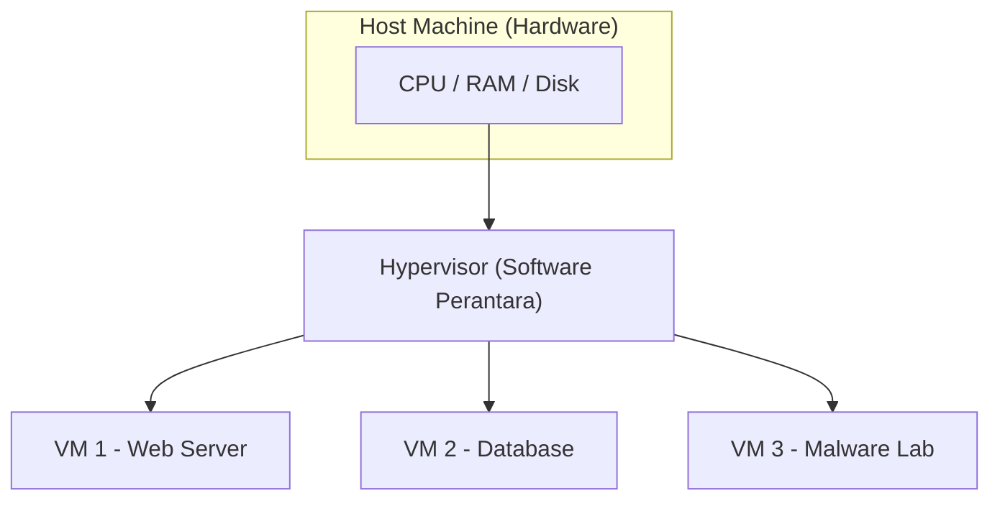
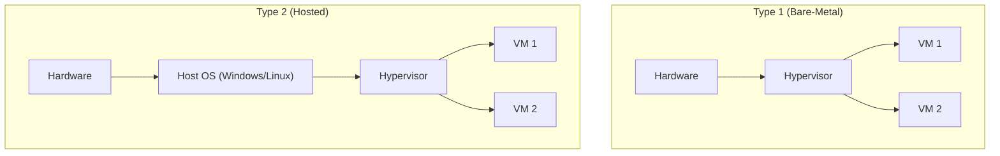
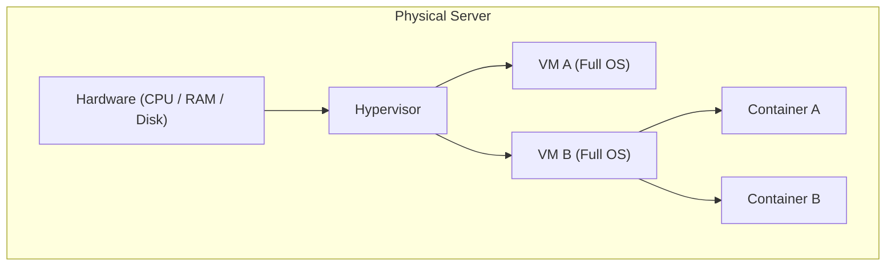

# TryHackMe: Virtualisation Basics

- **Room Link:** [Virtualisation Basics](https://tryhackme.com/room/virtualisationbasics)
- **Category:** Pre-Security
- **Difficulty:** Easy

## Introduction

Di room-room sebelumnya (seperti [Inside a Computer System](Inside-a-Computer-System.md) dan [Computer Types](Computer-Types.md)), kamu sudah belajar apa saja komponen penyusun komputer dan bagaimana mereka saling berkomunikasi. Sekarang, kita naik satu level: bagaimana perusahaan **mengoptimalkan** komponen-komponen itu agar lebih hemat dan fleksibel? Jawabannya ada pada sebuah konsep bernama **Virtualisasi**.

Coba bayangkan skenario ini: manajermu meminta bantuan untuk meningkatkan efisiensi sebuah server yang meng-host website kantor. Servernya kuat, tapi sebagian besar waktunya hanya diam karena traffic-nya tidak selalu ramai. Sayang sekali kan, punya mesin seharga puluhan juta tapi kapasitasnya cuma terpakai 10-20%?

Sekarang kalikan masalah itu. Bayangkan kalau **setiap** aplikasi atau website butuh satu server fisik sendiri — satu untuk email, satu untuk database, satu untuk web. Biayanya meledak, dan sebagian besar hardware cuma diam tanpa kerja berat. **Virtualisasi diciptakan untuk menyelesaikan masalah ini.**

Cara kerjanya mirip seperti pemilik rumah besar yang membagi rumahnya menjadi beberapa **apartemen mandiri**. Setiap apartemen punya kunci, dapur, dan kamar mandi sendiri — penyewa merasa punya rumah sendiri. Padahal di balik itu, mereka semua berbagi **satu atap dan pondasi** (hardware) yang sama.

Kenapa ini penting untuk kamu yang belajar cyber security? Karena virtualisasi bukan cuma soal hemat biaya — ini juga **alat tempur sehari-hari**:

*   **Malware Analysis**: Kamu bisa menjalankan virus di dalam komputer virtual (*Guest*). Kalau virusnya merusak VM, cukup hapus VM-nya. Komputer aslimu (*Host*) tetap aman.
*   **Cloud Infrastructure**: Hampir semua layanan cloud (AWS, Azure, GCP) berjalan di atas virtualisasi. Ribuan server virtual bekerja di atas hardware fisik yang terbatas.
*   **Isolation**: Memisahkan layanan sensitif dari layanan publik. Kalau satu VM diretas, VM yang lain tetap aman karena mereka terisolasi satu sama lain.

### Learning Objectives

Setelah menyelesaikan room ini, kamu akan paham:
*   Kenapa menjalankan satu aplikasi per server fisik itu cara yang boros dan tidak scalable.
*   Bagaimana virtualisasi menjawab tantangan **efisiensi hardware** dan **skalabilitas**.
*   Apa saja komponen utama dari sebuah **Virtual Machine (VM)**.
*   Bagaimana **Containers** membawa optimasi ini ke tingkat yang lebih lanjut.

> **for your information:**
> **Host Machine** — Komputer fisik asli yang menyediakan sumber daya hardware (CPU, RAM, Storage). Ini "tuan rumah"-nya.
> **Guest Machine** — Komputer virtual yang berjalan di atas host. Dia "tamu" yang meminjam sumber daya dari tuan rumah.

---

## Virtualisation Overview

### The Problem: One Server = One Application

Sebelum virtualisasi ada, aturan main di dunia IT itu sederhana:

> **"Satu server = satu aplikasi."**

Di masa awal, setiap layanan digital berjalan di mesin fisik masing-masing. Satu server untuk website, satu lagi untuk database, satu lagi untuk email. Setiap mesin punya satu tugas yang jelas. Saat bisnis bertambah besar dan butuh lebih banyak layanan, solusinya ya jelas: **beli lebih banyak server**. Pendekatan "satu pekerjaan per mesin" ini jadi standar karena dianggap paling *reliable*.

Masalahnya? Pendekatan ini punya empat kelemahan besar:

*   **High Cost**: Membeli banyak server fisik itu mahal — dan bukan cuma hardware-nya. Kamu juga harus bayar listrik, pendingin, perawatan, dan ruang data center.
*   **Low Utilization**: Kebanyakan aplikasi tidak menggunakan seluruh kapasitas servernya. Banyak server yang cuma terpakai **5-20%** dari total CPU, RAM, dan storage-nya. Sisanya terbuang sia-sia.
*   **Slow Deployment**: Menyiapkan server fisik baru bisa makan waktu berhari-hari bahkan berminggu-minggu (pesan hardware, pasang, konfigurasi).
*   **Hard to Scale**: Kalau tiba-tiba sebuah aplikasi butuh lebih banyak resource, kamu harus beli server baru lagi. Tidak bisa langsung ditambah instan.

Singkatnya, perusahaan membayar sangat mahal untuk hardware yang sebagian besar waktunya cuma diam tanpa dimanfaatkan sepenuhnya.

---

### The Need for Sharing Hardware Safely and Efficiently

Virtualisasi hadir dengan ide baru:

> **"Bagaimana kalau beberapa aplikasi bisa berbagi satu server fisik yang sama, tapi tetap aman dan terisolasi?"**

Untuk mewujudkan ini, diperkenalkan sebuah lapisan software bernama **hypervisor**. Hypervisor berperan seperti wasit yang membagi sumber daya server fisik ke beberapa komputer virtual, dan memastikan setiap VM berperilaku seperti komputer mandiri — padahal mereka semua berbagi hardware yang sama.

### The Building Analogy

Bayangkan satu orang tinggal sendirian di gedung 10 lantai:
*   Dia cuma pakai satu lantai, tapi harus menanggung biaya perawatan seluruh gedung: listrik, air, kebersihan, dan keamanan.
*   Sebagian besar gedung kosong dan terbuang.
*   Mahal, tidak efisien, dan berlebihan untuk kebutuhannya.

Sekarang bayangkan gedung itu dibagi menjadi **apartemen-apartemen terpisah**:
*   Setiap apartemen punya pintu sendiri, dapur, kamar mandi, dan privasi.
*   Penghuni yang berbeda bisa tinggal mandiri tanpa saling mengganggu.
*   Mereka semua berbagi infrastruktur utama gedung: listrik, air, dan lift — jadi jauh **lebih hemat dan efisien**.

Ini sama seperti cara kerja virtualisasi:

| Analogi Gedung | Konsep Virtualisasi |
| :--- | :--- |
| **Gedung** | Server fisik (Host Machine) |
| **Apartemen** | Virtual Machines (VMs) |
| **Penghuni** | Aplikasi atau Sistem Operasi |
| **Pengelola gedung** | **Hypervisor** — software yang membagi dan mengatur sumber daya gedung dengan aman |

Setiap komputer virtual, yang disebut **Virtual Machine (VM)**, **berperilaku seperti sistem independen** dengan OS, aplikasi, dan konfigurasi sendiri — meskipun di balik layar mereka semua berbagi hardware fisik yang sama.

> **for your information:**
> **Hypervisor** — Software khusus yang bertugas membuat dan mengelola Virtual Machines. Dia "wasit" yang memastikan setiap VM mendapat jatah sumber daya yang adil dan tetap terisolasi satu sama lain.

## Virtualisation Components

Sekarang kamu sudah paham *kenapa* virtualisasi dibutuhkan. Di bagian ini, kita akan bedah **tiga komponen utamanya**: Hypervisor, Virtual Machine, dan Container.

---

### Hypervisor (The Building Manager)

**Hypervisor** adalah teknologi inti di balik virtualisasi. Dia software yang bertugas **membuat dan mengelola** Virtual Machines. Kalau di analogi gedung tadi, hypervisor itu pengelola gedung yang mengatur pembagian apartment.

Secara spesifik, hypervisor melakukan:
*   Membagi satu komputer fisik menjadi **beberapa komputer virtual**.
*   Memberikan setiap VM jatah **CPU, RAM, dan storage** masing-masing.
*   Menjaga **isolasi** antar VM agar tidak saling mengganggu.
*   Mengelola *lifecycle* VM: **start, stop, pause, clone, delete**.

#### Type 1 vs Type 2

Hypervisor punya dua jenis implementasi, dan masing-masing cocok untuk skenario yang berbeda:

*   **Type 1 (Bare-Metal)**: Berjalan **langsung di atas hardware**, tanpa perlu OS perantara. Hasilnya cepat, efisien, dan stabil — ideal untuk server produksi dan data center. Contoh: **VMware ESXi**, **Microsoft Hyper-V**, **Proxmox**.
*   **Type 2 (Hosted)**: Berjalan **di dalam OS yang sudah ada** (Windows, Linux, macOS). Lebih mudah diinstall, cocok untuk belajar, testing, atau setup kecil. Contoh: **Oracle VirtualBox**, **VMware Workstation**.

#### Use Case per Type

Kedua tipe sebenarnya bisa menjalankan use case yang sama, tapi ada pendekatan yang lebih tepat berdasarkan tujuannya:

| Use Case | Type 1 | Type 2 |
| :--- | :---: | :---: |
| Test Malicious Files | | X |
| Production Server | X | |
| Database Server | X | |
| Software Testing | | X |
| Kali Linux (Lab) | | X |
| Data Center | X | |

> **Common Mistake:** Saat menggunakan virtualisasi untuk menguji file berbahaya (malware), pastikan **host machine tidak terinfeksi** oleh malware yang sedang diuji di guest machine. Salah satu strateginya: gunakan **OS yang berbeda** antara host dan guest (misal: host Windows, guest Linux), atau **isolasi jaringan VM** agar guest tidak bisa berkomunikasi keluar.

---

### Virtual Machines (The Apartments)

**Virtual Machine (VM)** adalah komputer virtual yang dibuat oleh hypervisor. Meskipun sifatnya virtual, VM berperilaku persis seperti mesin fisik sungguhan:

*   Punya **virtual CPU, RAM, storage, dan network adapter** sendiri.
*   Bisa menjalankan **OS apa saja** (Windows, Linux, dll).
*   **Terisolasi penuh** dari VM lain — kalau satu VM rusak, VM yang lain tetap jalan normal.

Kamu bisa mendeploy VM di komputermu sendiri menggunakan tools seperti **Oracle VirtualBox** atau **VMware Workstation**. Software ini berfungsi sebagai Type 2 hypervisor dan memungkinkan kamu menjalankan beberapa OS sekaligus di atas satu mesin.

**Kapan kamu butuh VM?** Contoh skenario nyata:
*   Kamu mau belajar **Kali Linux** tapi tidak mau beli laptop baru — cukup pasang hypervisor dan jalankan Kali sebagai VM.
*   Kamu ingin menguji apakah sebuah file itu **malware** — jalankan di VM yang terisolasi agar komputer utamamu tetap aman.

---

### Containers (The Rooms Inside the Apartment)

Kalau VM itu "apartemen lengkap" dengan OS sendiri, maka **Container** itu "kamar di dalam apartemen" — lebih ringan, lebih cepat, tapi berbagi infrastruktur dasar yang sama.

**Container** adalah lingkungan terisolasi yang ringan, dirancang untuk menjalankan **satu aplikasi beserta semua dependensinya** (library, tools, versi tertentu). Bedanya dengan VM: container tidak membawa OS lengkap sendiri. Dia meminjam **kernel** dari host OS — yaitu bagian inti OS yang berkomunikasi langsung dengan hardware dan mengelola resource seperti memori dan proses.

Karena berbagi kernel, container punya karakteristik unik:
*   **Start hampir instan** — tidak perlu booting OS.
*   **Menggunakan resource jauh lebih sedikit** dibanding VM.
*   **Terisolasi satu sama lain** — container yang bermasalah tidak memengaruhi container lain.
*   **Konsisten di mana saja** — bisa berjalan di laptop, server, atau cloud tanpa perubahan konfigurasi.
*   **Keterbatasan**: Container harus cocok dengan tipe host OS-nya. Kamu **tidak bisa** menjalankan container Windows di mesin Linux, atau sebaliknya.

Cara paling mudah untuk mendeploy container adalah menggunakan **Docker**, platform open-source yang menyederhanakan proses membangun, mendeploy, dan menjalankan aplikasi dalam container.

> **for your information:**
> **Kernel** — Inti dari sebuah sistem operasi. Kernel bertugas menjadi perantara antara software dan hardware: mengelola memori, mengatur proses, dan mengendalikan akses ke perangkat keras.
> **Docker** — Platform open-source untuk mengemas aplikasi beserta seluruh dependensinya ke dalam container yang portabel dan konsisten.

---

### VM vs Container: The Big Picture

Secara ringkas:
*   **VM** memberikan "apartemen lengkap" — isolasi maksimal dan fleksibilitas penuh (bisa jalankan OS berbeda). Cocok untuk workload yang butuh keamanan tinggi atau OS yang berbeda dari host.
*   **Container** menawarkan "kamar ringan" — start instan dan hemat resource. Ideal untuk development, testing, dan deployment aplikasi yang scalable.
