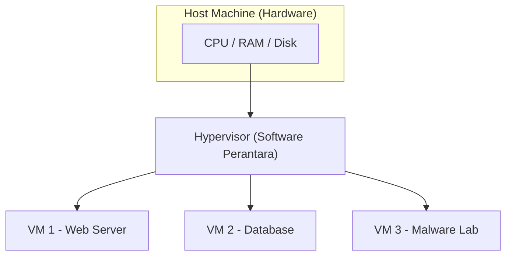
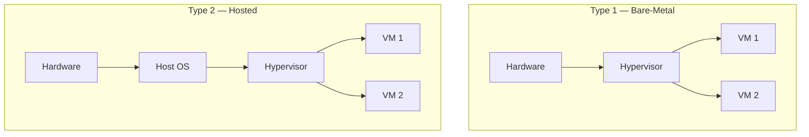
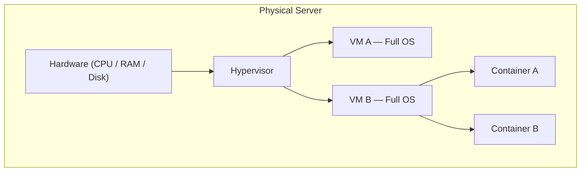

# Virtualisation Basics

_Catatan dari TryHackMe | Pre-Security Path — Easy_
_Room: [Virtualisation Basics](https://tryhackme.com/room/virtualisationbasics)_

---

## Introduction

Di room sebelumnya kamu sudah belajar apa saja komponen penyusun komputer dan bagaimana mereka saling berkomunikasi. Sekarang kita naik satu level: bagaimana perusahaan **mengoptimalkan** komponen-komponen itu agar lebih hemat dan fleksibel?

Coba bayangkan skenario ini. Manajermu meminta bantuan untuk meningkatkan efisiensi sebuah server yang meng-host website kantor. Servernya kuat, tapi sebagian besar waktunya hanya berjalan idle karena traffic tidak selalu ramai. Sekarang kalikan masalah itu — bayangkan setiap aplikasi butuh satu server fisik sendiri: satu untuk email, satu untuk database, satu untuk web. Biayanya meledak, dan sebagian besar hardware hanya diam tanpa beban kerja yang berarti.

**Virtualisasi diciptakan untuk menyelesaikan masalah ini.**

Cara kerjanya mirip seperti pemilik rumah besar yang membagi rumahnya menjadi beberapa apartemen mandiri. Setiap apartemen punya kunci, dapur, dan kamar mandi sendiri — penghuninya merasa tinggal di hunian mandiri. Padahal di balik itu, mereka semua berbagi satu pondasi dan infrastruktur yang sama.

> **for your information:** **Host Machine** adalah komputer fisik asli yang menyediakan sumber daya hardware (CPU, RAM, Storage) — ini "tuan rumah"-nya. **Guest Machine** adalah komputer virtual yang berjalan di atas host — dia meminjam sumber daya dari tuan rumah.

Kenapa ini penting untuk kamu yang belajar cyber security? Karena virtualisasi bukan sekadar soal efisiensi biaya — ini juga alat yang akan sering kamu gunakan secara langsung:

- **Malware Analysis** — kamu bisa menjalankan file berbahaya di dalam komputer virtual. Kalau file tersebut merusak VM, cukup hapus VM-nya. Komputer fisikmu tetap aman.
- **Cloud Infrastructure** — hampir semua layanan cloud (AWS, Azure, GCP) berjalan di atas virtualisasi. Ribuan server virtual beroperasi di atas hardware fisik yang terbatas.
- **Isolation** — memisahkan layanan sensitif dari layanan publik. Jika satu VM berhasil dikompromis, VM lain tetap aman karena masing-masing terisolasi secara penuh.

Setelah menyelesaikan room ini, kamu akan paham:

- Kenapa model "satu aplikasi per server fisik" itu boros dan tidak scalable.
- Bagaimana virtualisasi menjawab tantangan efisiensi hardware dan skalabilitas.
- Apa saja komponen utama dari sebuah **Virtual Machine (VM)**.
- Bagaimana **Containers** membawa optimasi ini ke tingkat yang lebih lanjut.

---

## Virtualisation Overview

### Problem: One Server, One Application

Sebelum virtualisasi ada, aturan main di dunia IT itu sederhana: **satu server, satu aplikasi.** Setiap layanan digital berjalan di mesin fisik masing-masing. Saat bisnis berkembang dan membutuhkan lebih banyak layanan, solusinya selalu sama — beli lebih banyak server.

Pendekatan ini punya empat kelemahan besar:

- **High Cost** — membeli banyak server fisik itu mahal, dan bukan hanya dari sisi hardware. Kamu juga menanggung biaya listrik, pendingin, perawatan, dan ruang data center.
- **Low Utilization** — kebanyakan aplikasi tidak menggunakan seluruh kapasitas servernya. Banyak server yang hanya terpakai 5–20% dari total CPU, RAM, dan storage-nya. Sisanya terbuang.
- **Slow Deployment** — menyiapkan server fisik baru bisa memakan waktu berhari-hari hingga berminggu-minggu: pesan hardware, pasang, konfigurasi.
- **Hard to Scale** — jika sebuah aplikasi tiba-tiba butuh lebih banyak resource, kamu harus membeli server baru lagi. Tidak ada cara untuk menambah kapasitas secara instan.

Singkatnya: perusahaan membayar sangat mahal untuk hardware yang sebagian besar waktunya hanya berjalan idle.

---

### Solution: Sharing Hardware Safely

Virtualisasi hadir dengan satu ide sederhana yang mengubah segalanya:

> _Bagaimana kalau beberapa aplikasi bisa berbagi satu server fisik yang sama, tapi tetap aman dan terisolasi?_

Untuk mewujudkan ini, diperkenalkan sebuah lapisan software bernama **hypervisor**, yaitu software yang membagi sumber daya server fisik ke beberapa komputer virtual, dan memastikan setiap komputer virtual tersebut berperilaku seperti mesin mandiri meskipun semua berbagi hardware yang sama.

Analoginya seperti gedung apartemen. Bayangkan satu orang tinggal sendirian di gedung 10 lantai: dia hanya memakai satu lantai, tapi menanggung biaya perawatan seluruh gedung. Mahal dan tidak efisien. Sekarang bayangkan gedung itu dibagi menjadi apartemen-apartemen terpisah — setiap penghuni punya pintu, dapur, dan privasi sendiri, tapi semuanya berbagi infrastruktur utama gedung: listrik, air, dan lift.

| Analogi Gedung | Konsep Virtualisasi |
| :--- | :--- |
| Gedung | Server fisik (Host Machine) |
| Apartemen | Virtual Machines (VMs) |
| Penghuni | Aplikasi atau sistem operasi |
| Pengelola gedung | Hypervisor — software yang membagi dan mengatur sumber daya |

Setiap **Virtual Machine (VM)** berperilaku seperti sistem independen dengan OS, aplikasi, dan konfigurasi sendiri — meskipun di balik layar mereka semua berbagi hardware fisik yang sama.

> **for your information:** **Hypervisor** adalah software khusus yang bertugas membuat dan mengelola Virtual Machines. Dia memastikan setiap VM mendapat jatah sumber daya yang sesuai dan tetap terisolasi satu sama lain.

---

## Virtualisation Components

### Hypervisor

**Hypervisor** adalah teknologi inti di balik virtualisasi. Secara spesifik, hypervisor melakukan empat hal:

- Membagi satu komputer fisik menjadi beberapa komputer virtual.
- Memberikan setiap VM jatah CPU, RAM, dan storage masing-masing.
- Menjaga isolasi antar VM agar tidak saling mengganggu.
- Mengelola lifecycle VM: start, stop, pause, clone, delete.

Hypervisor ada dalam dua jenis implementasi:

**Type 1 — Bare-Metal**

Berjalan langsung di atas hardware tanpa perlu OS perantara. Karena tidak ada lapisan tambahan, performanya lebih efisien dan stabil. Ini pilihan utama untuk server produksi dan data center.

- Contoh: **VMware ESXi**, **Microsoft Hyper-V**, **Proxmox**

**Type 2 — Hosted**

Berjalan di dalam OS yang sudah ada (Windows, Linux, macOS). Lebih mudah di-install dan dikonfigurasi — cocok untuk keperluan belajar, testing, atau lab pribadi.

- Contoh: **Oracle VirtualBox**, **VMware Workstation**

Perbandingan use case keduanya:

| Use Case | Type 1 | Type 2 |
| :--- | :---: | :---: |
| Test file berbahaya (malware lab) | | X |
| Production server | X | |
| Database server | X | |
| Software testing & development | | X |
| Kali Linux untuk lab | | X |
| Data center enterprise | X | |

> **Common Mistake:** Saat menggunakan VM untuk menguji file berbahaya, pastikan jaringan VM dalam kondisi **terisolasi** (mode _host-only_ atau _no network_). Jika VM terhubung ke internet, malware yang sedang diuji bisa berkomunikasi keluar — atau lebih buruk, menyebar ke jaringan lain.

---

### Virtual Machines

**Virtual Machine (VM)** adalah komputer virtual yang dibuat oleh hypervisor. Meskipun sifatnya virtual, VM berperilaku persis seperti mesin fisik:

- Punya virtual CPU, RAM, storage, dan network adapter sendiri.
- Bisa menjalankan OS apa saja — Windows, Linux, dan lainnya.
- Terisolasi penuh dari VM lain. Jika satu VM rusak atau dikompromis, VM lain tetap berjalan normal.

Untuk keperluan belajar, kamu bisa men-deploy VM di komputermu sendiri menggunakan **Oracle VirtualBox** atau **VMware Workstation** — keduanya berfungsi sebagai Type 2 hypervisor dan memungkinkan kamu menjalankan beberapa OS sekaligus di atas satu mesin.

Dua skenario yang paling sering kamu temui sebagai pemula:

- Ingin belajar Kali Linux tapi tidak ingin menginstall ulang laptop — cukup pasang hypervisor dan jalankan Kali sebagai VM.
- Ingin menguji apakah sebuah file adalah malware — jalankan di VM yang terisolasi agar sistem utamamu tetap aman.

---

### Containers

Jika VM adalah "apartemen lengkap" dengan OS sendiri, maka **Container** adalah "kamar di dalam apartemen" — lebih ringan dan lebih cepat, tapi berbagi infrastruktur dasar yang sama.

Container adalah lingkungan terisolasi yang dirancang untuk menjalankan **satu aplikasi beserta seluruh dependensinya** — library, tools, versi runtime tertentu. Bedanya dengan VM: container tidak membawa OS lengkap. Container meminjam **kernel** dari host OS, yaitu bagian inti OS yang berkomunikasi langsung dengan hardware dan mengelola resource seperti memori dan proses.

Karena berbagi kernel, container punya karakteristik yang berbeda dari VM:

- Start hampir instan — tidak perlu proses booting OS.
- Menggunakan resource jauh lebih sedikit dibanding VM.
- Terisolasi satu sama lain — container yang bermasalah tidak memengaruhi container lain.
- Konsisten di mana saja — bisa berjalan di laptop, server, atau cloud tanpa perubahan konfigurasi.

Satu keterbatasan penting: container harus kompatibel dengan tipe host OS-nya. Kamu tidak bisa menjalankan container Windows di mesin Linux, atau sebaliknya.

Cara paling umum untuk men-deploy container adalah menggunakan **Docker** — platform open-source yang menyederhanakan proses membangun, men-deploy, dan menjalankan aplikasi dalam container.

> **for your information:** **Kernel** adalah inti dari sebuah sistem operasi. Kernel bertugas menjadi perantara antara software dan hardware: mengelola memori, mengatur proses, dan mengendalikan akses ke perangkat keras. **Docker** adalah platform open-source untuk mengemas aplikasi beserta seluruh dependensinya ke dalam container yang portabel dan konsisten.

---

### VM vs Container: The Big Picture

| Aspek | Virtual Machine | Container |
| :--- | :--- | :--- |
| OS | Membawa OS sendiri (full) | Berbagi kernel dari host OS |
| Ukuran | Besar (GB) | Ringan (MB) |
| Startup time | Menit | Detik |
| Isolasi | Sangat kuat | Kuat, tapi lebih tipis |
| Cocok untuk | Workload yang butuh OS berbeda, lab malware | Deployment aplikasi yang cepat dan scalable |

Pilihan antara VM dan container bukan soal mana yang lebih baik — tapi soal mana yang tepat untuk kebutuhan. Keduanya bisa digunakan bersamaan dalam satu infrastruktur.

---

## Quick Review

- Apa perbedaan mendasar antara Type 1 dan Type 2 hypervisor, dan kapan kamu memilih salah satunya?
- Kenapa container bisa start lebih cepat dibanding VM?
- Dalam konteks malware analysis, mengapa isolasi jaringan pada VM itu krusial?
