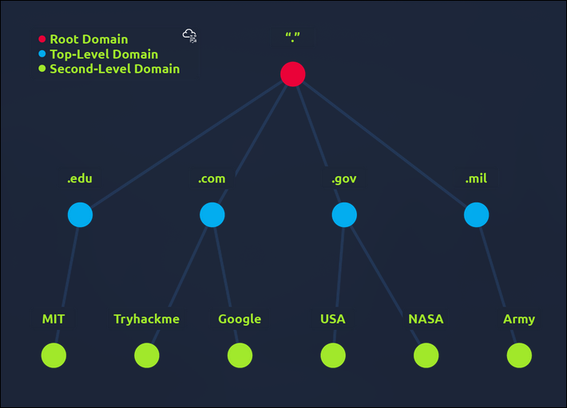
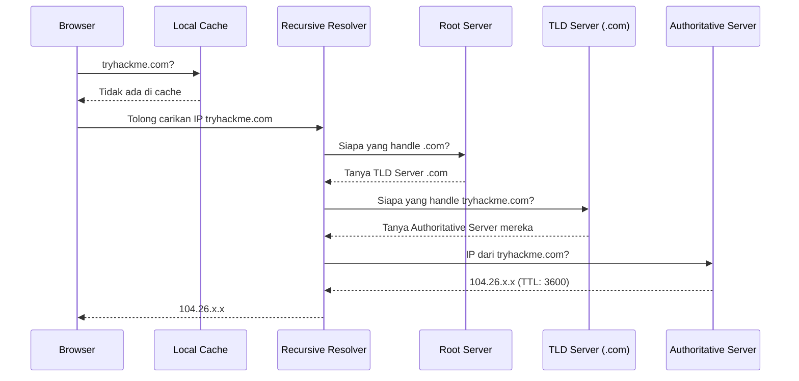

# TryHackMe: DNS In Details

---

* **Room Link:** [DNS In Details](https://tryhackme.com/room/dnsindetail)
* **Category:** How The Web Works
* **Difficulty:** easy

---

### What is DNS?

Pernah mencari kontak teman di HP pakai namanya (Budi) daripada menghafal nomor teleponnya (`0812-xxxx-xxxx`)? 

**DNS (Domain Name System)** bekerja mirip seperti **Buku Telepon raksasa untuk internet**. Bayangkan jika kamu harus mengetik IP address seperti `142.250.190.46` setiap kali mau membuka Google. Ribet, kan? DNS menerjemahkan nama domain yang mudah diingat manusia (seperti `google.com`) menjadi deretan angka (IP Address) yang dipahami komputer.

### Domain Hierarchy

Cara kerja penamaan DNS itu punya sistem yang rapi, disebut **Domain Hierarchy**. Bentuknya menyerupai struktur organisasi atau pohon terbalik. 
Setiap tingkatan dipisahkan pakai tanda titik (`.`) dan **dibaca dari kanan ke kiri**. Semakin ke kanan, semakin tinggi posisinya di hierarki. Sistem ini memastikan setiap alamat di internet itu unik.

#### Root Domain

Ini tingkatan tertingginya. Berada di ujung paling atas sistem hierarki, dilambangkan cukup dengan satu tanda titik (`.`). 
Contoh: Di URL `tryhackme.com.`, nah tanda `.` paling akhir yang tidak terlihat itu adalah *Root Domain*. Root ini krusial buat mengarahkan pencarian alamat ke cabang yang benar.

#### TLD (Top Level Domain)
Ini level nya berada di bawah root. TLD itu bagian paling kanan yang kelihatan jelas di nama domain (contohnya `.com` di `google.com`).

TLD sendiri dibagi jadi dua kelompok utama:
* **gTLD (Generic TLD):** Memberitahu bidang atau tujuan situs tersebut.
* `.com` (Komersial)
* `.org` (Organisasi)
* `.edu` (Edukasi/Pendidikan)
* **ccTLD (Country Code TLD):** Menunjukan asal geografis atau negara dari situs tersebut.
* `.id` (Indonesia)
* `.co.uk` (Inggris Raya)

*(Info tambahan: Di era modern sekarang juga banyak TLD baru yang lebih unik dan spesifik kayak `.online`, `.club`, atau `.biz`).*

---

### DNS Record Types

Server DNS tidak cuma menyimpan nama dan nomor. Mereka menggunakan berbagai formulir(record) untuk menyimpan jenis data yang berbeda. Ibarat *Buku Identitas*, ini tipe-tipe informasi yang disimpan DNS:

| Record Type | Analogi & Fungsi Utama |
| ----------- | ---------------- |
| **A Record** | **(KTP Standar / IPv4)** Memetakan nama domain secara langsung ke alamat IPv4 (contoh: `104.26.10.229`). |
| **AAAA Record** | **(KTP Modern / IPv6)** Memetakan nama domain secara langsung ke alamat IPv6 yang formatnya lebih kompleks (contoh: `2606:4700:20::...`). |
| **CNAME** | **(Nama Samaran / Alias)** tidak mengarah langsung ke IP, melainkan mengarahkan sebuah alias ke domain utama (Canonical). Contoh: `www.tryhackme.com` diarahin pakai CNAME ke domain utama `tryhackme.com`. |
| **MX Record** | **(Kantor Pos)** Menentukan server mana yang ditugaskan khusus buat mengurus penjemputan/pengiriman *email* di domain tersebut. |
| **TXT Record** | **(Papan Pengumuman)** Record fleksibel yang isinya teks bebas. Sangat sering dipakai admin buat membuktikan kepemilikan domain Google/AWS, atau untuk pengaturan keamanan email (SPF/DKIM/DMARC). |

---

### Making A Request (Gimana Cara DNS Mencari Alamat?)

Proses menerjemahkan nama domain ke IP Address itu lumayan panjang, sederhananya seperti kamu lagi **menanyakan alamat rumah teman yang baru pindah**. Ini urutannya:

1. **Local Cache Check (Nanya memori sendiri):** 
   Sebelum repot bertanya keluar, komputermu mengecek dulu di memori lokal (_cache_). Siapa tahu alamatnya baru saja dicari kemarin dan masih diingat. Ini dilakukan untuk menghemat waktu dan _bandwidth_.
2. **Recursive Resolver (Nanya pak RT):** 
   Kalau di _cache_ lokal tidak ada, alamat dicari lewat Recursive DNS (biasanya server milik provider internetmu atau server publik kayak `8.8.8.8`). Resolver inilah pelayan yang keliling internet menanyakan alamat spesifik untuk kamu.  
3. **The Root Server (Nanya kantor pusat):**
   Resolver melempar pertanyaan ke Root Server di puncak rantai DNS. Root merespons: *"Aku tidak tahu spesifik alamatnya, tapi karena belakangnya `.com`, coba kamu tanya server spesialis `.com`."*
4. **TLD Server (Nanya kelurahan setempat):** 
   Resolver kemudian bertanya ke TLD Server yang mengurus `.com`. Server ini merespons: *"Aku tahu sistem siapa yang handle `tryhackme`, coba kamu tanya Authoritative Server mereka."*
5. **Authoritative Server (Ketemu yang punya rumah):** 
   Inilah server ujung dan sumber kebenaran tertinggi. Server ini menyimpan database asli dari _records_ miliknya. Dia akan kasih jawaban ke Resolver: *"Nah, `tryhackme.com` mengarah ke A record dengan IP `104.26.x.x`."*

Begitu jawaban pastinya didapatkan, Resolver menyerahkan IP tersebut ke browser kamu untuk menampilkan websitenya.

---

### TTL (Time To Live)

**TTL** itu sama kayak **tanggal kadaluwarsa** (_expiration date_) pada makanan, tapi khusus buat data _cache_ DNS. TTL menentukan berapa lama (dalam hitungan detik) komputer atau Resolver bisa mengingat IP Address dari sebuah domain.

**Bagaimana mekanisme kerjanya?**
1. **Caching (Mengingat):** Saat Resolver (langkah 2 di atas) dapat jawaban, jawaban itu dapat tanda berupa **TTL** (misal `3600` yang artinya 1 jam). Resolver menyimpan IP-nya dan proses _countdown_ mundur langsung jalan.
2. **Penggunaan Instan:** Selama 1 jam itu, kalau ada orang lain bertanya domain yang sama, Resolver memberitahu dari _cache_ memori tanpa perlu berkeliling bertanya TLD dkk lagi.
3. **Expire & Refresh (Kadaluarsa):** Begitu angkanya mencapai 0, memori dihapus dan dianggap kadaluarsa. Kalau ada yang bertanya lagi, Resolver wajib *Re-query* (mengulangi proses dari awal) mencari informasi _fresh_ (baru). Hal ini menjamin lalu lintas internet tidak diarahkan ke _server_ yang sudah usang andaikata admin website baru ganti IP.
