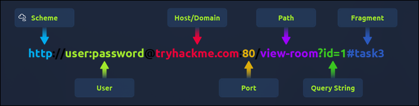

# TryHackMe: HTTP In Details


---

- **Room Link:** [HTTP In Details](https://tryhackme.com/room/httpindetail)
- **Category:** How The Web Works
- **Difficulty:** easy

---

## Overview

Room HTTP in Detail ini fokus ke pemahaman mendalam tentang protokol komunikasi paling mendasar di internet: **Hypertext Transfer Protocol (HTTP)**. Di sini kita belajar bagaimana data ditransmisikan antara browser dan web server, serta mengerti anatomi di balik setiap permintaan yang kita buat di web.

### What is HTTP? (Hypertext Transfer Protocol)

Bayangkan kamu lagi di **restoran**. Kamu (browser) mau pesan makanan, dan dapur (web server) yang menyiapkannya. Nah, **HTTP** itu ibarat **bahasa standar yang dipakai pelayan** untuk menyampaikan pesananmu ke dapur dan membawa hasilnya balik ke mejamu. Tanpa bahasa yang disepakati ini, komunikasi antara kamu dan dapur bakal kacau.

HTTP dikembangkan oleh Tim Berners-Lee dan timnya antara tahun 1989-1991. Protokol ini jadi aturan standar buat mengirim dan menerima data web — entah itu HTML, gambar, video, dan lainnya.

### What is HTTPS? (HyperText Transfer Protocol Secure)

HTTPS itu versi **aman** dari HTTP. Kalau HTTP biasa itu ibarat pesanan yang ditulis di kertas terbuka (siapa saja bisa baca), HTTPS itu pesanan yang **ditulis dalam amplop tersegel dan terenkripsi**. 

Fungsinya:
- **Mencegah penyadapan:** Data yang dikirim dan diterima dienkripsi, jadi orang yang mengintip di tengah jalan (man-in-the-middle) ga bisa baca isinya.
- **Menjamin keaslian server:** Memberikan jaminan bahwa kamu sedang berkomunikasi dengan server yang benar, bukan server palsu yang menyamar.

---

### What is A URL? (Uniform Resource Locator)

Sebelum browser bisa memesan sesuatu ke server, dia butuh **alamat lengkap** untuk menemukan apa yang dicari. URL itu ibarat **alamat surat lengkap** — ada nama jalan, nomor rumah, sampai kode pos.

<p align="center">

</p>

Komponen-komponen URL:

| Komponen | Analogi | Fungsi |
| -------- | ------- | ------ |
| **Scheme** | Jenis transportasi (mobil/motor) | Protokol yang dipakai: `HTTP`, `HTTPS`, atau `FTP` |
| **User** | Identitas pengirim | Username dan password untuk autentikasi (opsional, jarang dipakai) |
| **Host** | Nama gedung tujuan | Nama domain atau alamat IP server yang dituju |
| **Port** | Nomor pintu masuk | Port koneksi — default `80` (HTTP) atau `443` (HTTPS). Range: 1-65535 |
| **Path** | Nomor ruangan di gedung | Lokasi spesifik file atau resource yang diminta |
| **Query String** | Catatan tambahan di surat | Parameter ekstra, misal `/blog?id=1` artinya minta artikel blog dengan id `1` |

---

### HTTP Request & Response

Ini contoh nyata percakapan antara browser (client) dan server. Ibarat **surat pesanan** dan **balasan dari dapur**:

**Contoh Request (Surat Pesanan):**

```http
GET /index.html HTTP/1.1
Host: domain.com
User-Agent: Mozilla/5.0 (Arch Linux)
Accept: text/html
```

| Baris | Isi | Penjelasan |
| ----- | --- | ---------- |
| Line 1 | `GET /index.html HTTP/1.1` | Method `GET`, Path target `/index.html`, versi protokol `HTTP/1.1` |
| Line 2 | `Host: domain.com` | Alamat server tujuan |
| Line 3 | `User-Agent: Mozilla/5.0` | Identitas browser — memberitahu server siapa yang mengakses |
| Line 4 | `Accept: text/html` | Tipe konten yang bisa diterima browser |

**Contoh Response (Balasan dari Dapur):**

```http
HTTP/1.1 200 OK
Date: Wed, 28 Jan 2026 19:40:00 GMT
Server: Dimm-Arch-Server/2.4
Content-Type: text/html
Content-Length: 173
Connection: keep-alive
Cache-Control: public, max-age=3600

<html>
<head>
    <title>Dimm HTTP Response</title>
</head>
<body>
    <h1>Welcome to Dimm Server !</h1>
    <p>Status: Online</p>
</body>
</html>
```

| Baris | Isi | Penjelasan |
| ----- | --- | ---------- |
| Line 1 | `HTTP/1.1 200 OK` | Status: permintaan berhasil diproses |
| Line 2 | `Date: Wed, 28 Jan 2026...` | Timestamp kapan respons dibuat |
| Line 3 | `Server: Dimm-Arch-Server/2.4` | Jenis dan versi web server |
| Line 4 | `Content-Type: text/html` | Format data yang dikirim — browser harus me-render sebagai halaman web |
| Line 5 | `Content-Length: 173` | Ukuran payload (body) dalam byte |
| Line 6 | `Connection: keep-alive` | Koneksi tetap terbuka buat request selanjutnya (efisiensi) |
| Line 7 | `Cache-Control: public, max-age=3600` | Konten boleh di-cache selama 1 jam |
| Line 8 | _(Baris Kosong)_ | Pemisah wajib antara headers dan body |

---

### HTTP Methods

HTTP methods itu ibarat **jenis aksi yang kamu minta ke pelayan restoran**. Mau lihat menu? Mau pesan baru? Mau ganti pesanan? Atau mau batalkan?

| Method | Analogi Restoran | Fungsi |
| ------ | ---------------- | ------ |
| **GET** | Minta lihat menu | Mengambil/membaca data dari server |
| **POST** | Saya mau pesan ini | Mengirim data baru ke server (misal: submit form, registrasi) |
| **PUT** | Ganti pesanan saya | Memperbarui/mengganti data yang sudah ada di server |
| **DELETE** | Batalkan pesanan | Menghapus data/resource dari server secara permanen |

---

### HTTP Status Code

Status code itu ibarat **reaksi pelayan** setelah kamu menyampaikan pesanan. Kode angka 3 digit ini dikelompokkan berdasarkan angka pertamanya:

| Rentang | Kategori | Analogi |
| :------ | :------- | :------ |
| **100-199** | **Information Response** | Oke, pesanan diterima, tunggu sebentar ya... (jarang ditemukan) |
| **200-299** | **Success** | Pesanan berhasil, ini makanannya. |
| **300-399** | **Redirection** | Maaf, menu itu dipindah ke restoran cabang sebelah. |
| **400-499** | **Client Errors** | Maaf, pesanan kamu salah / kamu ga punya akses. |
| **500-599** | **Server Errors** | Maaf, dapur kami lagi bermasalah... |

**Status code yang wajib dihafalkan:**

| Code | Status | Penjelasan Singkat |
| ---- | ------ | ------------------ |
| `200` | OK | Permintaan berhasil diproses |
| `201` | Created | Data baru berhasil dibuat (misal: akun terdaftar) |
| `301` | Moved Permanently | Halaman sudah pindah ke URL baru secara permanen |
| `401` | Unauthorized | Akses ditolak — belum login/autentikasi |
| `403` | Forbidden | Tidak punya izin akses meskipun sudah login |
| `404` | Not Found | Halaman atau file tidak ditemukan |
| `500` | Internal Server Error | Kesalahan teknis di sisi server |
| `503` | Service Unavailable | Server sedang overload atau maintenance |

---

### HTTP Headers

Headers itu **metadata** — informasi tambahan yang dikirim bareng request atau response. Ibarat **catatan tambahan** yang disertakan bersama surat pesanan maupun surat balasan.

#### Request Headers (Catatan dari Client)

| Header | Fungsi |
| ------ | ------ |
| **Host** | Nama domain yang dituju (misal `domain.com`) |
| **User-Agent** | Identitas perangkat, OS, dan browser yang dipakai client |
| **Content-Length** | Ukuran data yang dikirim client (misal saat submit form) |
| **Accept-Encoding** | Jenis kompresi yang didukung browser (misal `gzip`) agar transfer lebih cepat |
| **Cookie** | Data kecil yang dikirim balik ke server untuk bantu server "mengingat" client |

#### Response Headers (Catatan dari Server)

| Header | Fungsi |
| ------ | ------ |
| **Set-Cookie** | Perintah ke browser untuk menyimpan cookie |
| **Cache-Control** | Berapa lama data boleh disimpan di cache browser |
| **Content-Type** | Format data yang dikembalikan (HTML, CSS, JSON, dll) |
| **Content-Encoding** | Metode kompresi yang dipakai server |

---

### Cookies

HTTP itu protokol **stateless** — artinya server **tidak mengingat** permintaan sebelumnya dari client yang sama. Setiap request dianggap baru. Masalah ini diatasi dengan **Cookies**: potongan data kecil yang disimpan di sisi browser.

Analogi: Cookies itu **kartu member/loyalty card** di restoran favoritmu. Tiap kali datang, kamu tunjukkan kartu itu dan pelayan langsung tau Oh, ini pelanggan kita yang suka duduk di pojok dan pesen ice americano.

**Cara Kerja Cookies:**

1. **Set-Cookie (Response):** Saat login, server mengirim header `Set-Cookie` berisi ID unik (session token) — ibarat restoran memberikan kartu member ke kamu.
2. **Storage:** Browser menyimpan token itu di memori lokal — kamu simpan kartu member di dompet.
3. **Cookie (Request):** Setiap kali buka halaman baru di situs yang sama, browser otomatis menyertakan header `Cookie` berisi token tadi — sama kayak menunjukkan kartu member tiap kali masuk restoran.

**Kegunaan Utama Cookies:**

| Kegunaan | Contoh |
| -------- | ------ |
| **Session Management** | Menjaga status login, isi keranjang belanja tetap tersimpan |
| **Personalization** | Mengingat preferensi user (Dark Mode, bahasa pilihan) |
| **Tracking** | Melacak aktivitas user untuk analitik atau iklan |
