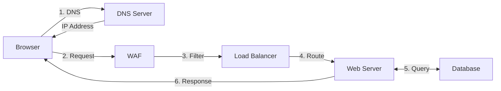

# TryHackMe: How The Web Works

---

- **Room Link:** [Putting It All Together](https://tryhackme.com/room/puttingitalltogether)
- **Category:** How The Web Works
- **Difficulty:** easy

---

## Putting It All Together

Room ini merangkum seluruh proses komunikasi web, dari permintaan pengguna sampai pengiriman konten dari server. Ini ibarat melihat **peta lengkap perjalanan pesananmu** dari awal sampai akhir.

---

### Komponen Infrastruktur Tambahan

Selain Client dan Server, ada pekerja di balik layar yang bikin semuanya berjalan lancar, bayangkan sebuah **gudang distribusi besar** yang mengirimkan paket ke seluruh dunia:

| Komponen | Analogi | Fungsi |
| -------- | ------- | ------ |
| **Load Balancer** | Manajer gudang yang membagi tugas ke pekerja | Mendistribusikan traffic ke beberapa server secara merata + melakukan **Health Check** (cek server mana yang sehat) |
| **CDN** (Content Delivery Network) | Gudang cabang di setiap kota | Mempercepat akses dengan mengirim file statis dari lokasi server terdekat dengan pengguna |
| **WAF** (Web Application Firewall) | Satpam di pintu masuk gudang | Melindungi web server dari serangan cyber (Hacking/DoS) — memfilter traffic berbahaya sebelum masuk |
| **Database** | Arsip/gudang penyimpanan data | Menyimpan data dinamis yang diproses oleh aplikasi backend |

---

### Mekanisme Web Server

Web server pakai **Virtual Hosts** buat menjalankan beberapa situs web di satu server fisik yang sama — ibarat satu gedung perkantoran yang bisa ditempati banyak perusahaan berbeda, dibedakan berdasarkan **nama domain**.

| Tipe Konten | Analogi | Penjelasan |
| ----------- | ------- | ---------- |
| **Static Content** | Brosur yang sudah dicetak — dikirim apa adanya | File yang dikirim langsung tanpa perubahan (HTML, CSS, Gambar) |
| **Dynamic Content** | Pesanan custom yang dibuat saat dipesan | Konten yang berubah-ubah tergantung permintaan user (hasil pencarian, profil user), diproses oleh backend |

---

### Alur Lengkap Permintaan Website

Secara garis besar, ketika kamu mengetik URL di browser, ini yang terjadi secara berurutan:

1. **DNS Resolution** — Mencari alamat IP lewat DNS (Cache → Recursive → Root → Authoritative)
2. **WAF Filtering** — Traffic difilter / diperiksa oleh Web Application Firewall
3. **Load Balancing** — Permintaan diarahkan ke server yang tersedia oleh Load Balancer
4. **Server Connection** — Terhubung ke server lewat **Port 80** (HTTP) atau **443** (HTTPS)
5. **Processing & Database** — Server memproses permintaan dan berinteraksi dengan Database jika diperlukan
6. **Response** — Data dikirim balik ke browser untuk dirender

> **Note:** Memahami infrastruktur ini penting, agar tau titik lemah mana yang bisa dieksploitasi, apakah itu di level DNS, WAF bypass, atau Database injection.
